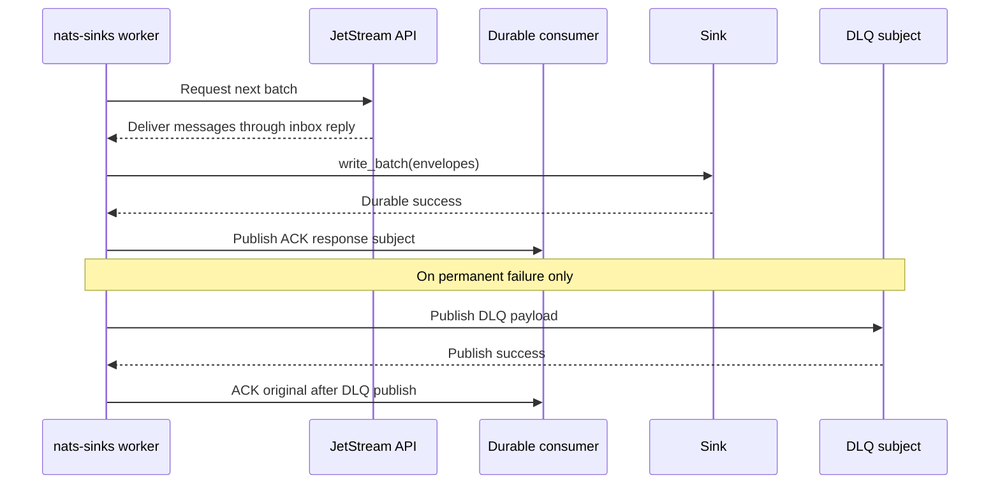
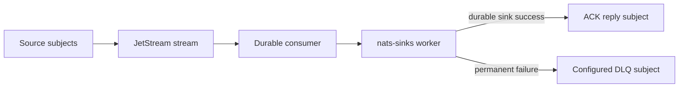
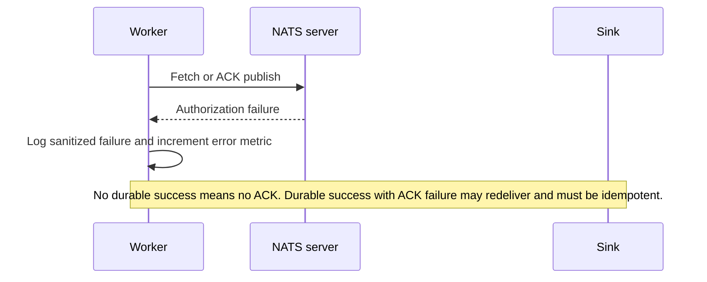

# NATS Least-Privilege Permissions

This page gives NATS administrators and platform security teams practical
least-privilege permission templates for running `nats-sinks` workers. It is
written for production and mission-oriented deployments where a sink worker
should be able to consume the exact JetStream workload it owns, acknowledge
messages only after durable sink success, publish to a configured dead-letter
subject when needed, and do nothing else.

The templates use placeholders such as `<STREAM>`, `<CONSUMER>`,
`<SOURCE_SUBJECT>`, and `<DLQ_SUBJECT>`. Replace those placeholders with values
from your own server configuration. Do not paste real credentials, internal
addresses, or private operational subject names into public issue comments,
examples, or support tickets.

## Why Permissions Matter

`nats-sinks` is deliberately conservative about delivery semantics. The core
runtime fetches messages from a pull-based JetStream consumer, hands normalized
`NatsEnvelope` objects to a sink, waits for the sink to complete durable work,
and only then ACKs JetStream. NATS permissions should support that flow without
granting broad account access.



There are three separate permission groups:

| Permission group | Required by default? | Purpose |
| --- | --- | --- |
| Runtime pull and ACK permissions | Yes | Let the worker request messages from one durable pull consumer and publish ACK/NAK responses for messages it actually received. |
| DLQ publish permissions | Only when `dead_letter.enabled` is true | Let the worker publish a permanent-failure record to the configured DLQ subject before ACKing the original message. |
| Management and advisory permissions | Optional | Let a controlled account create or inspect consumers, or let a separate observer subscribe to JetStream advisories. |

Keep these groups separate. A sink worker that writes to Oracle or the file
system does not normally need NATS stream administration, broad subscription
rights, or permission to publish source events.

## Runtime Worker Responsibilities

A standard `nats-sinks` worker needs to perform these NATS operations:

- connect using the configured authentication mechanism,
- request messages from `$JS.API.CONSUMER.MSG.NEXT.<STREAM>.<CONSUMER>`,
- subscribe to generated inbox subjects so NATS request/reply responses can be
  delivered,
- publish ACK, NAK, or delayed NAK responses to JetStream message reply
  subjects under `$JS.ACK.<STREAM>.<CONSUMER>.>`, and
- optionally publish DLQ records to exactly the configured DLQ subject.

The worker does not need to publish to `<SOURCE_SUBJECT>`. Producers publish
source events; the sink worker consumes persisted messages through JetStream.

## Template A: Pre-Created Durable Consumer

This is the recommended production model. A platform or release process creates
the stream and durable consumer ahead of time. The sink runtime account can
fetch from the consumer and ACK received messages, but it cannot create,
delete, purge, or modify streams.

```text
# NATS server authorization template.
# Replace every angle-bracket placeholder before use.
authorization {
  users = [
    {
      user: "<SINK_RUNTIME_USER>"
      password: "<SERVER_SIDE_PASSWORD_OR_HASH_PLACEHOLDER>"
      permissions: {
        publish: {
          allow: [
            "$JS.API.CONSUMER.MSG.NEXT.<STREAM>.<CONSUMER>",
            "$JS.API.CONSUMER.INFO.<STREAM>.<CONSUMER>",
            "$JS.ACK.<STREAM>.<CONSUMER>.>"
          ]
        }
        subscribe: {
          allow: [
            "_INBOX.>"
          ]
        }
      }
    }
  ]
}
```

The `publish.allow` entry for `$JS.API.CONSUMER.INFO...` is included because
many deployments want startup or health tooling to verify that the durable
consumer exists. If your deployment has a separate validation account and the
runtime worker never performs that check, you may remove it after testing.

The `subscribe.allow` entry for `_INBOX.>` is necessary for NATS request/reply
patterns used by JetStream API requests and pull delivery. In more sensitive
installations, consider account isolation or a custom inbox prefix strategy if
your NATS client and server policy support it.

The templates intentionally rely on allow lists rather than a broad `deny: ">"`
next to allowed subjects. NATS deny rules have priority when allow and deny
overlap, so a broad deny can accidentally block the very subjects the worker
needs. Keep the allow list narrow, then test that unauthorized subjects are
rejected.

## Template B: Runtime Worker With DLQ Enabled

When `dead_letter.enabled` is true, add publish permission for the exact DLQ
subject. Keep this grant separate from source-subject access so operators can
review what failure records may leave the main stream.

```text
permissions: {
  publish: {
    allow: [
      "$JS.API.CONSUMER.MSG.NEXT.<STREAM>.<CONSUMER>",
      "$JS.API.CONSUMER.INFO.<STREAM>.<CONSUMER>",
      "$JS.ACK.<STREAM>.<CONSUMER>.>",
      "<DLQ_SUBJECT>"
    ]
  }
  subscribe: {
    allow: [
      "_INBOX.>"
    ]
  }
}
```

If the DLQ subject is part of a different stream, account, export, import, or
operational compartment, configure that routing intentionally on the NATS side.
The `nats-sinks` worker only needs permission to publish the DLQ message. It
does not need to subscribe to the DLQ subject.



## Template C: Controlled Consumer Creation

Some early deployments allow the runtime worker to create or bind the durable
consumer automatically. This is more convenient, but it grants more authority
than the pre-created-consumer model. Use it only when
`consumer_management.mode` is `create_if_missing` or `reconcile` and the
operational process accepts that tradeoff. For `bind_only`, prefer Template A.

When `consumer_management.filter_subjects` contains multiple filters, NATS uses
the general durable consumer create subject rather than the single-filter API
subject that embeds `{filter}`. That means the permission boundary is less
granular. If subject-level authorization is critical, prefer pre-creating the
consumer with an administrative identity and running the worker in `bind_only`
mode.

```text
permissions: {
  publish: {
    allow: [
      "$JS.API.CONSUMER.MSG.NEXT.<STREAM>.<CONSUMER>",
      "$JS.API.CONSUMER.INFO.<STREAM>.<CONSUMER>",
      "$JS.API.CONSUMER.DURABLE.CREATE.<STREAM>.<CONSUMER>",
      "$JS.API.CONSUMER.CREATE.<STREAM>.<CONSUMER>.<SOURCE_SUBJECT>",
      "$JS.ACK.<STREAM>.<CONSUMER>.>"
    ]
  }
  subscribe: {
    allow: [
      "_INBOX.>"
    ]
  }
}
```

NATS supports a granular consumer-create API subject for a single filter
subject. If a future deployment uses multiple filter subjects, the NATS API may
not be able to encode each filter in the permission subject. In that case,
prefer pre-creating the consumer with an administrative account and granting the
runtime worker only fetch and ACK permissions.

When `reconcile` is enabled, the worker may submit updated consumer settings
for an already compatible durable pull consumer. Keep that permission scoped to
the configured `<STREAM>`, `<CONSUMER>`, and `<SOURCE_SUBJECT>`. Never use a
wildcard consumer-management grant for the sink worker unless the account is a
separate deployment automation identity rather than the long-running runtime
identity.

## Template D: Separate Advisory Reader

JetStream advisories are useful for operations teams, but they are not required
for the sink worker to preserve commit-then-acknowledge semantics. `nats-sinks`
can observe selected advisories when `advisories.enabled` is true, but a
separate read-only observer account is still preferred where operational policy
allows it. If the delivery worker observes advisories itself, grant only the
exact advisory subjects listed in `advisories.subjects`.

```text
authorization {
  users = [
    {
      user: "<ADVISORY_READER_USER>"
      password: "<SERVER_SIDE_PASSWORD_OR_HASH_PLACEHOLDER>"
      permissions: {
        publish: {
          deny: [
            ">"
          ]
        }
        subscribe: {
          allow: [
            "$JS.EVENT.ADVISORY.CONSUMER.MAX_DELIVERIES.<STREAM>.<CONSUMER>",
            "$JS.EVENT.ADVISORY.CONSUMER.MSG_TERMINATED.<STREAM>.<CONSUMER>"
          ]
        }
      }
    }
  ]
}
```

Advisories and metrics can reveal operational tempo. Treat them as sensitive
metadata in mission, defence, or national-security environments. Only export or
forward them when the observability policy explicitly allows it.

## Mapping Config To Permissions

Use this table when translating `nats-sinks` JSON configuration into NATS
server permission templates.

| `nats-sinks` field | Permission impact |
| --- | --- |
| `nats.stream` | Replaces `<STREAM>` in JetStream API and ACK subjects. |
| `nats.consumer` | Replaces `<CONSUMER>` in JetStream API and ACK subjects. |
| `nats.subject` | Replaces `<SOURCE_SUBJECT>` only when runtime consumer creation is allowed. Pre-created consumer mode should enforce this on the consumer configuration instead. |
| `dead_letter.enabled` | Controls whether a DLQ publish grant is needed. |
| `dead_letter.subject` | Replaces `<DLQ_SUBJECT>` when DLQ is enabled. |
| `nats.urls` or `nats.url` | Does not change subject permissions, but should use TLS for production. |
| `nats.token_env`, `nats.password_env`, or credentials files | Controls authentication material, not subject authorization. |

## What Not To Grant By Default

Avoid these grants for the ordinary sink runtime account:

- `publish: ">"`,
- `subscribe: ">"`,
- stream create, update, delete, purge, restore, or snapshot APIs,
- consumer delete APIs,
- `$SYS.>` system events,
- broad access to all JetStream advisories,
- permission to publish source subjects,
- permission to subscribe to destination DLQ subjects unless this worker also
  has a separate, reviewed DLQ replay role.

If an operator needs one of these capabilities, create a separate account or
user for that operational function and record why it is required.

## Failure Behavior With Insufficient Permissions

Permission failures should fail visibly. They must not become early ACKs. If
the worker cannot fetch, publish a DLQ record, or publish the ACK response
after sink success, the error is surfaced through logging and metrics, and the
message remains governed by JetStream redelivery behavior.



## Validation Checklist

Before running a production worker, validate the permission set in a controlled
environment:

- Confirm the stream and durable consumer are created by the intended
  administrative process.
- Confirm the sink runtime user can connect, fetch a small batch, write to the
  destination, and ACK after durable success.
- Confirm the runtime user cannot publish to source subjects.
- Confirm the runtime user cannot create, delete, purge, or modify streams.
- If DLQ is enabled, confirm a permanent-failure test can publish to the exact
  DLQ subject and then ACK the original message.
- If DLQ is disabled, confirm the runtime user has no DLQ publish grant.
- Confirm advisory subscriptions are assigned to a separate observer account
  unless a deliberate exception is approved.
- Confirm all tests use placeholders or local-only values in documentation and
  public evidence.

## References

- [NATS Authorization](https://docs.nats.io/running-a-nats-service/configuration/securing_nats/authorization)
- [NATS JetStream Wire API Reference](https://docs.nats.io/reference/reference-protocols/nats_api_reference)
- [NATS JetStream Consumers](https://docs.nats.io/nats-concepts/jetstream/consumers)
