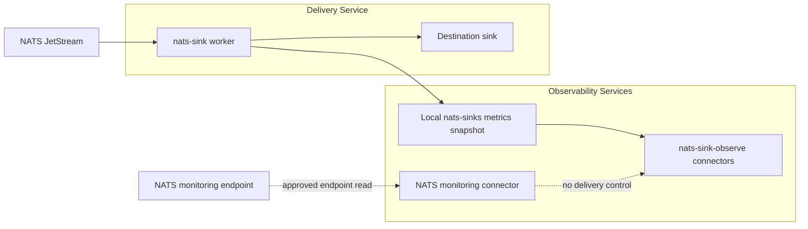
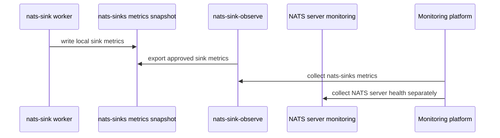
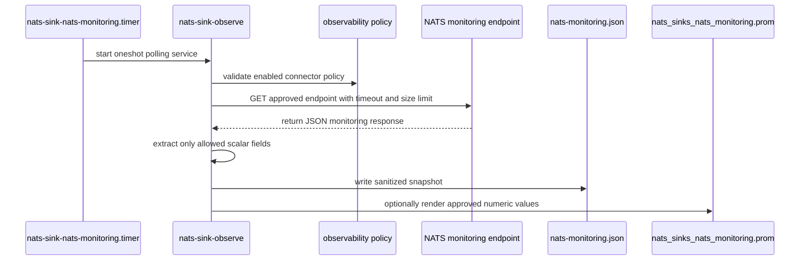

# NATS Server Monitoring Integration

This page records the design decision for NATS server monitoring endpoints in
`nats-sinks`.

NATS Server exposes HTTP monitoring endpoints such as `/varz`, `/connz`,
`/routez`, `/subsz`, `/accountz`, `/accstatz`, `/jsz`, and `/healthz`.
These endpoints are valuable for NATS operators because they show server,
connection, route, account, JetStream, and health information. They are also
outside the delivery-critical contract of a sink worker.

## Decision

`nats-sinks` will not make the main `nats-sink` delivery worker poll NATS
server monitoring endpoints.

The worker's responsibility stays narrow:

```text
JetStream message
  -> NatsEnvelope
  -> sink.write_batch(...)
  -> durable destination success
  -> JetStream ACK
```

Server monitoring data is useful context, but it is observational. A failed
monitoring request must never affect fetch, write, commit, DLQ, NAK, or ACK
behavior. `nats-sinks` implements this as a separate `nats-sink-observe`
connector. The connector can collect a sanitized local snapshot from explicitly
approved monitoring endpoints, but it is not part of the runner loop.



## Why This Boundary Exists

NATS monitoring endpoints can expose topology and operational context that may
be sensitive in production or mission-oriented environments. For example,
monitoring data may reveal connection counts, stream names, consumer names,
cluster roles, server identifiers, account statistics, queue pressure, slow
consumer signals, or JetStream state.

That kind of information is useful to authorized operators, but it is not
needed for commit-then-acknowledge processing. Keeping the boundary separate
has several benefits:

- the sink worker stays focused on delivery semantics,
- monitoring failures cannot delay or change ACK decisions,
- monitoring credentials and network access can be granted to a different
  process or account,
- NATS operators can use their existing monitoring stack without coupling it
  to destination writes,
- NATS monitoring integration uses an explicit allow-list policy instead of
  accidental full endpoint export.

## Recommended Current Approach

Use NATS-native and platform-native monitoring for the NATS server itself, and
use `nats-sinks` metrics for the sink process.



For the sink worker, monitor:

- `messages_fetched_total`,
- `messages_written_total`,
- `messages_acked_total`,
- `messages_failed_total`,
- `messages_dlq_total`,
- `sink_write_errors_total`,
- `ack_errors_total`,
- `nats_connection_disconnected_total`,
- `nats_connection_reconnected_total`,
- `last_sink_success_epoch_seconds`,
- `current_batch_messages`.

For NATS Server, monitor server health, JetStream account state, stream and
consumer health, slow consumer counters, reconnect behavior, and server-level
resource use through your existing NATS monitoring stack. If you need selected
NATS monitoring values to travel through the `nats-sinks` observability policy,
use the connector described below.

## Endpoint Security Notes

The official NATS documentation describes the monitoring server as a lightweight
HTTP server with JSON endpoints. It also warns that `nats-server` does not
provide authentication or authorization on the monitoring endpoint and that the
monitoring port should not be exposed publicly. The conventional monitoring
port is `8222`, and deployments should bind monitoring to localhost or protect
it with firewall and network controls.

For `nats-sinks`, this means the monitoring connector follows these rules:

- disabled by default,
- separate process or connector, not the delivery worker,
- explicit endpoint allow list,
- loopback-only default endpoint configuration,
- strict URL scheme, host, port, path, query, timeout, and response-size
  validation,
- no redirects by default,
- no credentials in command-line arguments,
- no forwarding of internal NATS credentials to monitoring endpoints,
- no export of full raw monitoring JSON by default,
- safe extraction of a small documented subset of fields,
- no subject, account, stream, consumer, route, or server labels unless an
  operator explicitly allows them and accepts cardinality and sensitivity risk,
- bounded polling interval and failure handling,
- failures reported as observability errors only, never delivery decisions.

## Connector Workflow

The connector runs from `nats-sink-observe`, not from `nats-sink`:

```bash
nats-sink-observe nats-monitoring-poll \
  /etc/nats-sinks/observability.prometheus.json \
  --output /var/lib/nats-sink/nats-monitoring.json
```

That command does not ACK messages, fetch JetStream messages, write to Oracle,
write file sink records, or publish DLQ messages. It only collects and filters
monitoring data according to policy.

If Prometheus export for selected numeric monitoring values is explicitly
enabled, render a textfile:

```bash
nats-sink-observe nats-monitoring-prometheus \
  /var/lib/nats-sink/nats-monitoring.json \
  /etc/nats-sinks/observability.prometheus.json \
  --output /var/lib/node_exporter/textfile_collector/nats_sinks_nats_monitoring.prom
```

The installer includes an optional systemd service and timer named
`nats-sink-nats-monitoring.service` and `nats-sink-nats-monitoring.timer`.
They remain disabled until both the policy and timer are explicitly enabled.



## Policy Configuration

NATS server monitoring is part of the same observability policy file used by
Prometheus export. Generated policy files contain a disabled section:

```json
{
  "schema": "nats_sinks.observability.policy.v1",
  "enabled": false,
  "nats_server_monitoring": {
    "enabled": false,
    "base_url": null,
    "allowed_endpoints": [],
    "allowed_fields": [],
    "timeout_seconds": 2,
    "max_response_bytes": 262144,
    "verify_tls": true,
    "ca_file": null,
    "prometheus_enabled": false,
    "include_help": true,
    "include_type": true
  }
}
```

Fields:

| Field | Meaning |
| --- | --- |
| `enabled` | Top-level switch. Must be `true` before any observability connector shares data. |
| `nats_server_monitoring.enabled` | Enables NATS monitoring polling for `nats-sink-observe`. |
| `nats_server_monitoring.base_url` | Base monitoring URL. It must not contain credentials, endpoint paths, query strings, or fragments. Plain `http` is allowed only for loopback hosts. |
| `nats_server_monitoring.allowed_endpoints` | Endpoint allow list. Supported values are `/varz`, `/connz`, `/routez`, `/subsz`, `/accountz`, `/accstatz`, `/jsz`, and `/healthz`. |
| `nats_server_monitoring.allowed_fields` | Dotted JSON field paths to extract from each endpoint response. Missing and non-scalar values become `null`. |
| `nats_server_monitoring.timeout_seconds` | Per-request timeout. |
| `nats_server_monitoring.max_response_bytes` | Maximum response size per endpoint. |
| `nats_server_monitoring.verify_tls` | Enables TLS certificate verification for HTTPS monitoring URLs. |
| `nats_server_monitoring.ca_file` | Optional local CA certificate path for private monitoring certificates. |
| `nats_server_monitoring.prometheus_enabled` | Enables Prometheus rendering for selected numeric values. |

Example local-lab policy:

```json
{
  "schema": "nats_sinks.observability.policy.v1",
  "enabled": true,
  "nats_server_monitoring": {
    "enabled": true,
    "base_url": "http://127.0.0.1:8222",
    "allowed_endpoints": ["/healthz", "/jsz"],
    "allowed_fields": [
      "status",
      "server_id",
      "jetstream.stats.messages",
      "jetstream.stats.consumer_count"
    ],
    "timeout_seconds": 2,
    "max_response_bytes": 262144,
    "verify_tls": true,
    "prometheus_enabled": true
  }
}
```

## Snapshot Shape

The poll command writes a local JSON snapshot. It intentionally stores endpoint
paths and allowed fields only; it does not store the monitoring base URL.

```json
{
  "schema": "nats_sinks.observability.nats_monitoring.snapshot.v1",
  "generated_at_epoch_seconds": 1797820000.0,
  "endpoints": [
    {
      "endpoint": "/jsz",
      "status_code": 200,
      "fields": {
        "status": null,
        "server_id": "server-a",
        "jetstream.stats.messages": 42,
        "jetstream.stats.consumer_count": 3
      }
    }
  ]
}
```

If a field is absent, non-scalar, or not safely representable, it is written as
`null`. This avoids guessing and prevents accidental export of nested topology.
Endpoint responses and stored snapshots must be standards-compliant JSON.
Python-only constants such as `NaN`, `Infinity`, and `-Infinity` are rejected
instead of being preserved, because public-safe monitoring evidence should be
portable across strict JSON tooling.

## Prometheus Output

Only numeric values from `allowed_fields` are rendered to Prometheus text.
String fields such as `server_id` remain in the local snapshot but are not
rendered as metrics.

Example output:

```text
# HELP nats_sinks_nats_monitoring_jsz_jetstream_stats_messages NATS server monitoring value for /jsz field jetstream.stats.messages
# TYPE nats_sinks_nats_monitoring_jsz_jetstream_stats_messages gauge
nats_sinks_nats_monitoring_jsz_jetstream_stats_messages 42
# HELP nats_sinks_nats_monitoring_jsz_jetstream_stats_consumer_count NATS server monitoring value for /jsz field jetstream.stats.consumer_count
# TYPE nats_sinks_nats_monitoring_jsz_jetstream_stats_consumer_count gauge
nats_sinks_nats_monitoring_jsz_jetstream_stats_consumer_count 3
```

## Non-Goals

The following are not planned for the delivery worker:

- polling `/jsz` from inside `JetStreamSinkRunner`,
- changing ACK behavior based on server monitoring data,
- using monitoring endpoint failures to stop ACK after durable sink success,
- exporting raw NATS server monitoring JSON,
- scraping arbitrary URLs supplied by untrusted configuration,
- replacing NATS operator tools or platform monitoring.

## Operational Guidance

For production deployments:

- keep the NATS monitoring listener on loopback or a protected management
  network,
- restrict access to authorized operators and monitoring systems,
- prefer existing NATS exporters and platform observability for server-level
  metrics,
- correlate NATS server health with `nats-sinks` metrics in dashboards,
- alert on symptoms such as stale `last_sink_success_epoch_seconds`, rising
  `messages_failed_total`, and NATS server health degradation,
- avoid placing server names, account names, private subject structures, or
  topology details in public issue comments or shared reports.

## Decision Summary

| Question | Decision |
| --- | --- |
| Should the sink worker poll NATS monitoring endpoints? | No. |
| Should monitoring failures affect ACK behavior? | No. |
| Is NATS server monitoring useful to operators? | Yes, but it belongs outside delivery. |
| Is code added in this release? | Yes. A separate disabled-by-default `nats-sink-observe` connector is added. |
| Where does support live? | A separate observability connector with explicit policy controls. |

## References

- [NATS Monitoring](https://docs.nats.io/running-a-nats-service/nats_admin/monitoring)
- [Monitoring JetStream](https://docs.nats.io/running-a-nats-service/nats_admin/monitoring/monitoring_jetstream)
- [NATS System Events](https://docs.nats.io/running-a-nats-service/configuration/sys_accounts)
