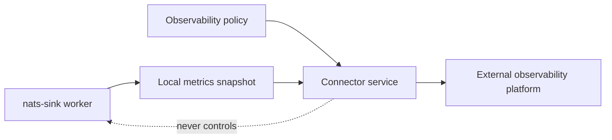

# Observability Connector Roadmap

This page records the evaluation behind observability connector work. It turns
the broad connector roadmap into separate feature requests while keeping every
connector aligned to the same security, configuration, testing, and
documentation contract.

`nats-sinks` already has:

- a local JSON metrics snapshot,
- `nats-sink-metrics` for local inspection,
- `nats-sink-observe` for disabled-by-default observability policy work,
- a Prometheus textfile connector,
- an optional native Prometheus HTTP endpoint,
- an OpenTelemetry OTLP/HTTP JSON metrics connector,
- a NATS server monitoring snapshot connector.

Future connectors must build on that model. Existing connectors must continue
to follow it. No connector may become an independent way to leak metrics,
subjects, classifications, labels, file paths, table names, payloads,
credentials, or operational tempo without an explicit policy review.

## Shared Connector Contract

All future connectors must follow the same functional contract:

| Requirement | Standard For Every Connector |
| --- | --- |
| Runtime isolation | The connector runs outside the message delivery path. It must not participate in ACK, NAK, DLQ, retry, sink success, or idempotency decisions. |
| Default state | Disabled by default. A connector exports nothing until the global observability policy and the connector-specific section are explicitly enabled. |
| Input source | Read from the existing local metrics snapshot or a shared read-only metrics provider abstraction. Do not connect to NATS, Oracle, file-sink output directories, or future sinks directly. |
| Metric selection | Use the existing observability allow-list and deny-list model. No connector may bypass `allowed_metrics`, `denied_metrics`, stale-snapshot checks, or observation controls. |
| Naming | Use stable metric suffixes from `MetricNames`. Platform-specific names may add a safe namespace or prefix, but must map predictably back to the canonical nats-sinks metric names. |
| Labels and dimensions | Export no high-cardinality labels by default. Subjects, labels, classification values, usernames, table names, file paths, message IDs, stream sequences, hostnames, and mission metadata values are excluded unless a future reviewed policy explicitly allows bounded fields. |
| Configuration | Use the same common options where practical: `enabled`, `snapshot_file`, `policy_file`, `namespace`, `allowed_metrics`, `denied_metrics`, `include_observations`, `stale_after_seconds`, `timeout_seconds`, `retry_attempts`, `retry_backoff_seconds`, `max_payload_bytes`, `dry_run`, and connector-specific authentication references. |
| Authentication | Secrets must come from environment variables, service identity, workload identity, instance principals, managed identity, or protected configuration files. Do not use command-line secrets or print resolved credentials. |
| Transport | TLS verification stays enabled by default for network connectors. Local CA support should be documented when the target platform supports it. |
| Failure behavior | Connector failures are logged safely and counted where practical. They must not stop the core sink worker or change delivery outcomes. |
| Bounds | Every network call needs timeouts, bounded retries, bounded payload size, and safe behavior for stale snapshots. |
| Tests | Unit tests cover disabled-by-default behavior, policy filtering, metric name mapping, authentication configuration redaction, timeout handling, retry limits, malformed snapshot handling, and sanitized logging. Optional integration tests stay behind markers. |
| Documentation | Each connector gets its own sub-page under the Observability documentation section with configuration, security notes, examples, sample output, test guidance, and limitations. |

## Evaluation Matrix

| Connector | Priority | Recommended Shape | Why It Is Valuable | Main Security Concern | Feature Request |
| --- | --- | --- | --- | --- | --- |
| OpenTelemetry OTLP | Implemented | Native connector that exports approved metrics to an OpenTelemetry Collector through OTLP/HTTP JSON. | OTLP is a stable OpenTelemetry exporter path and is a common neutral bridge to many platforms. | Collector endpoints and resource attributes must not leak sensitive deployment details. | See [OpenTelemetry OTLP Integration](otlp.md). |
| StatsD | Medium | Lightweight UDP or Unix-socket style connector for counters, gauges, and timings. | Useful in older or constrained environments with existing StatsD aggregation. | UDP can drop data and has limited metadata structure; avoid pretending it is reliable. | New separate feature request. |
| Datadog | Medium | Prefer DogStatsD through the local Datadog Agent; evaluate HTTP API only when an Agent path is unavailable. | Datadog is widely used for hosted operational dashboards and alerting. | Tags and custom metrics can create cost, cardinality, and confidentiality risk. | New separate feature request. |
| Splunk HEC | Medium | HTTPS event or metric payloads sent through Splunk HTTP Event Collector. | Valuable for security operations, incident response, and SIEM-adjacent environments. | HEC tokens are sensitive and payload shaping must avoid event-style leakage of operational metadata. | New separate feature request. |
| Elastic Observability | Implemented | Elastic profile over the shared OTLP connector, intended for a local or gateway OpenTelemetry Collector that forwards to Elastic. | Useful for organizations that standardize on Elasticsearch-backed observability while keeping nats-sinks on the shared policy model. | Index fields and labels can expose sensitive operational detail or create high cardinality. | See [Elastic Observability Profile](elastic-observability.md). |
| Grafana Alloy | Medium | Treat as an Alloy profile using OTLP or Prometheus-compatible handoff rather than a bespoke vendor API. | Alloy is a collector distribution that can bridge to the Grafana LGTM ecosystem. | Avoid duplicating the OTLP connector while still documenting Alloy-specific deployment examples. | New separate feature request. |
| OCI Monitoring | High | OCI-native connector using Monitoring custom metrics with instance principals, resource principals, or configured OCI identity. | Natural fit for Oracle Cloud deployments and Oracle-heavy nats-sinks users. | Compartments, dimensions, tenancy metadata, and signer configuration require least-privilege review. | New separate feature request. |
| Amazon CloudWatch | Medium | AWS SDK based connector using custom metrics. | Useful for AWS deployments that use CloudWatch as the operational source of truth. | IAM permissions, namespace design, dimensions, and API cost controls need careful bounds. | New separate feature request. |
| Azure Monitor | Medium | Azure Monitor custom metrics connector using Microsoft Entra authentication or managed identity. | Useful for Microsoft cloud deployments and existing Azure operational teams. | Resource identifiers, dimensions, and bearer-token handling need strict redaction. | New separate feature request. |
| Syslog | Low | RFC 5424 structured-data or structured-log bridge for restricted networks. | Useful where pull-based scraping and cloud APIs are not available. | Syslog has transport and format pitfalls; messages must be bounded and sanitized. | New separate feature request. |

## Source Notes

The evaluation used public vendor and standards documentation:

- OpenTelemetry documents the OTLP exporter as stable and defines OTLP exporter
  configuration and retry behavior:
  [OpenTelemetry Protocol Exporter](https://opentelemetry.io/docs/specs/otel/protocol/exporter/).
- Datadog documents multiple custom metric paths, including DogStatsD and HTTP
  API options:
  [Datadog Custom Metrics](https://docs.datadoghq.com/metrics/custom_metrics/).
- Splunk documents HEC metric events:
  [Splunk HTTP Event Collector Examples](https://help.splunk.com/en/splunk-enterprise/get-data-in/collect-http-event-data/http-event-collector-examples).
- Elastic Observability documents a unified observability platform that
  embraces OpenTelemetry:
  [Elastic Observability](https://www.elastic.co/docs/solutions/observability).
- Grafana documents Alloy as an OpenTelemetry Collector distribution for
  collecting and forwarding telemetry:
  [Grafana Alloy](https://grafana.com/docs/alloy/latest/).
- OCI Monitoring documents custom metrics through the Monitoring API:
  [OCI Monitoring Overview](https://docs.oracle.com/en-us/iaas/Content/Monitoring/Concepts/monitoringoverview.htm).
- Amazon CloudWatch documents `PutMetricData` for custom metrics:
  [CloudWatch PutMetricData](https://docs.aws.amazon.com/AmazonCloudWatch/latest/APIReference/API_PutMetricData.html).
- Azure Monitor documents custom metrics ingestion through a REST API and
  Microsoft Entra bearer tokens:
  [Azure Monitor Custom Metrics REST API](https://learn.microsoft.com/en-us/azure/azure-monitor/metrics/metrics-store-custom-rest-api).
- RFC 5424 defines the syslog message model, structured data, timestamps, and
  security considerations:
  [RFC 5424](https://www.rfc-editor.org/rfc/rfc5424).

## Certification Checklist

Before any connector ships, the implementation issue must prove:

1. The connector is optional and disabled by default.
2. No runtime dependency is added to the base package unless it is already
   required by the core.
3. The connector reads approved metrics from the shared snapshot/provider path.
4. The connector applies the same observability policy model as existing
   Prometheus connectors.
5. The connector exports no sensitive labels or dimensions by default.
6. Network calls have explicit timeouts, bounded retries, and bounded payloads.
7. Authentication is least-privilege and never passed through command-line
   arguments.
8. Dry-run and validation modes exist for operator review.
9. Tests cover disabled policy, malformed policy, stale snapshot, allowed and
   denied metrics, timeout behavior, retry exhaustion, redaction, and safe
   logging.
10. The connector documentation is a sub-page under Observability and includes
    configuration examples, sample output, limitations, security guidance, and
    operational tests.

## Implementation Order Guidance

The recommended order after the implemented Prometheus, OTLP, Elastic, and NATS
monitoring connectors is:

1. OCI Monitoring, because it fits the Oracle-oriented user base.
2. Datadog and Splunk HEC, because they cover common hosted observability and
   security-operations workflows.
3. CloudWatch and Azure Monitor, because they matter for cloud-specific
   deployments but should follow the same connector core.
4. Grafana Alloy, likely as a profile that reuses OTLP behavior.
5. StatsD and syslog, because they are useful for constrained or legacy
   environments but have weaker reliability and structure than modern
   collector APIs.
