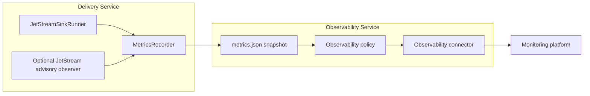
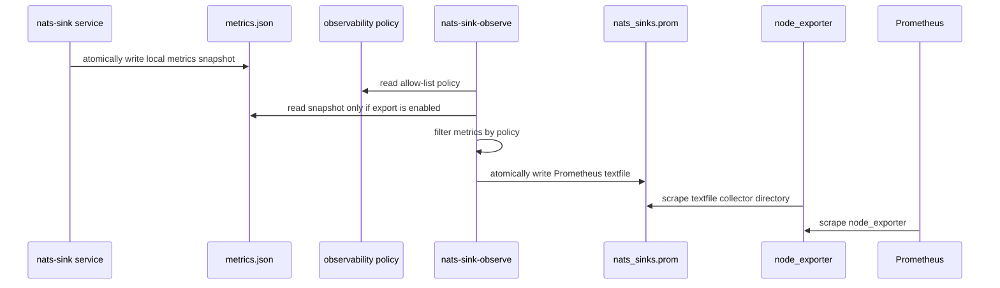
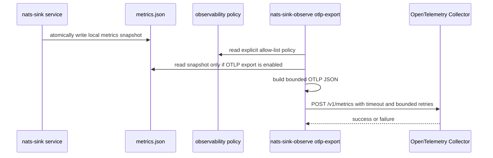
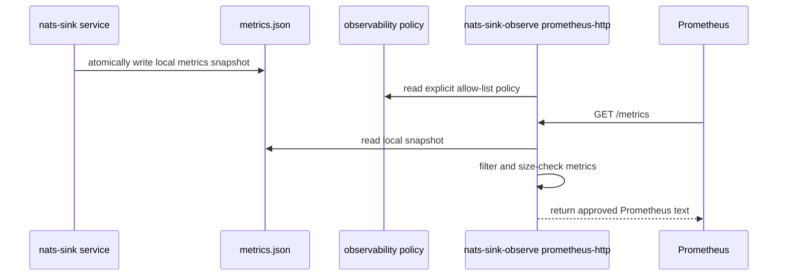
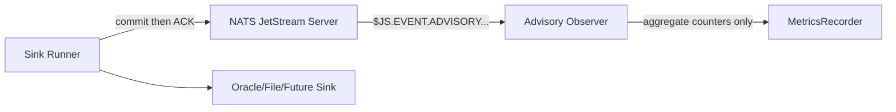

# Observability

`nats-sinks` separates observability from delivery. The sink runner moves
messages from JetStream to a durable destination. The observability layer reads
safe local metrics snapshots and decides what, if anything, may be shared with
external monitoring platforms.

That separation matters in production and mission-oriented environments.
Metrics can reveal tempo, incident conditions, queue pressure, and backend
health even when they never include payloads. For that reason, `nats-sinks`
uses a share-nothing default for external observability connectors. Operators
must explicitly choose which metric names may leave the host.

## Documentation Map

Observability is documented as a small set of focused pages:

- [Observability Overview](observability.md): explains the safety model,
  sharing policy, and connector-neutral architecture.
- [Metrics Snapshot And CLI](metrics.md): explains the local metrics recorder,
  `nats-sink-metrics`, metric names, snapshot files, and shell-friendly output.
- [InProgress Metrics Runbook](inprogress-metrics-runbook.md): explains the
  stable progress-heartbeat metric family, safe alerting, and why progress
  signals are not durable success or ACK events.
- [Subject-Aware Observability Evaluation](subject-aware-observability-evaluation.md):
  explains the controlled subject-family policy model and why subject labels
  remain disabled by default.
- [Subject-Aware Observability Runbook](subject-aware-observability-runbook.md):
  gives operators and connector authors the certification checklist, synthetic
  examples, and "do not enable" guidance for subject-family metrics.
- [Prometheus Integration](prometheus.md): explains the policy-controlled
  Prometheus textfile connector and optional native HTTP scrape endpoint.
- [OpenTelemetry OTLP Integration](otlp.md): explains policy-controlled export
  to an OpenTelemetry Collector using OTLP/HTTP JSON.
- [Elastic Observability Profile](elastic-observability.md): explains the
  Elastic-specific profile that reuses the OTLP connector and avoids direct
  Elasticsearch writes.
- [Grafana Alloy Profile](grafana-alloy.md): explains the Alloy-specific
  profile that exports approved OTLP metrics to a separate Alloy collector.
- [Splunk HEC Integration](splunk-hec.md): explains the Splunk HTTP Event
  Collector connector for approved aggregate metrics in SIEM and
  incident-response environments.
- [StatsD Integration](statsd.md): explains best-effort UDP and Unix datagram
  export to StatsD-compatible aggregators.
- [Syslog Bridge](syslog.md): explains best-effort RFC 5424-style UDP and Unix
  datagram export for restricted or legacy syslog pipelines.
- [NATS Server Monitoring Integration](nats-server-monitoring.md): explains the
  disabled-by-default connector for selected NATS monitoring endpoint fields.
- Optional JetStream advisory observation is configured in
  [Configuration](configuration.md#advisories) and reported through the same
  [Metrics Snapshot And CLI](metrics.md#jetstream-advisory-metrics) page.

Prometheus is therefore a sub-page of observability rather than a separate
delivery feature. The delivery worker can run without Prometheus, and
Prometheus export can be reviewed, enabled, disabled, and operated separately
from message processing.
OTLP export follows the same separation: it is a connector under
observability, not a delivery feature.
The Elastic profile follows the same rule and is implemented as an
Elastic-oriented OTLP profile under observability.
The Grafana Alloy profile follows the same rule and is implemented as an OTLP
handoff to a separate Alloy collector.
The Splunk HEC connector follows the same rule and emits one bounded
policy-approved metric event to Splunk's HTTP Event Collector.
The StatsD connector follows the same rule and emits bounded best-effort
datagrams to a StatsD-compatible local or network listener.
The syslog bridge follows the same rule and emits bounded RFC 5424-style
messages to an approved syslog listener without exporting payloads, subjects,
classification values, labels, mission metadata, or destination details.

## Design Goals

The observability design follows the same conservative posture as the delivery
runtime:

- metrics must never change ACK ordering,
- observability failure must never cause early ACK,
- payload bodies, decrypted data, secrets, tokens, private keys, full
  connection strings, NATS credentials, Oracle DSNs, table names, file paths,
  classification values, labels, and subjects must not be exported by default,
- exported metrics must be low-cardinality, and subject-family labels require
  the documented `subject_metrics` policy plus prepared `labeled_metrics` rows,
- event freshness metrics must remain aggregate-only because event age, stale
  counts, and source clock skew can reveal operational tempo,
- external sharing is disabled until an explicit policy enables it,
- observability connectors are isolated from core and sink logic so new
  platforms can be added without breaking sink APIs.
- InProgress metrics remain aggregate timing and count signals. They must not
  be used as success signals, and they must not export subjects, payloads,
  destination names, labels, classification values, or private deployment
  details.

Subject-aware observability now has a policy model and a bounded prepared
series format. Subject-family export is still disabled by default and is not
derived directly from raw NATS subjects. The policy can describe reviewed
subject-family allow rules, stable labels, display modes, cardinality caps, and
overflow behavior. Exporters render subject-family labels only from prepared
`labeled_metrics` rows. That separation is intentional: subjects can reveal
operational structure and can create expensive high-cardinality metric series.
See [Subject-Aware Observability Evaluation](subject-aware-observability-evaluation.md)
and [Subject-Aware Observability Runbook](subject-aware-observability-runbook.md).

## Architecture

The core runner records metrics through a small `MetricsRecorder` protocol.
The built-in `JsonFileMetrics` recorder writes a local snapshot. Observability
connectors then read that snapshot and apply an operator-approved policy.



The recommended Prometheus integration uses the textfile collector model:



The OpenTelemetry connector uses the same local snapshot and policy, but posts
approved metrics to a collector:



An optional native Prometheus HTTP endpoint is also available for deployments
where operators already manage service scrape targets directly. It is still an
observability connector rather than part of the delivery-critical runner:



The native endpoint reads only the local snapshot and policy file. It does not
connect to JetStream, Oracle, the file sink directory, DLQ subjects, or future
destination backends. If the endpoint cannot render metrics safely, it returns a
small error response and leaves sink delivery untouched.

NATS server monitoring endpoints such as `/jsz` are intentionally handled by a
separate observability connector. The sink worker does not poll those
endpoints, because server monitoring is operational context rather than a
delivery prerequisite. The connector is documented in
[NATS Server Monitoring Integration](nats-server-monitoring.md).

JetStream advisories are different from NATS HTTP monitoring endpoints: they
are normal NATS messages published below `$JS.EVENT.ADVISORY.>`. When
`advisories.enabled` is true, the delivery worker can create separate Core NATS
subscriptions for a small allow-list of advisory subjects and increment
aggregate counters. This still remains observational. Advisory messages do not
drive ACK, NAK, DLQ, retry, or sink-write decisions.



For Kubernetes deployments, the example manifests keep observability in a
separate sidecar container that reads the worker's local metrics snapshot
through a shared pod volume. The policy remains disabled by default until an
operator explicitly enables the top-level observability policy and the native
Prometheus HTTP endpoint. See [Kubernetes Deployment](kubernetes.md).

## Observability Policy

An observability policy is a JSON document with this schema identifier:

```json
{
  "schema": "nats_sinks.observability.policy.v1"
}
```

Generated policies are disabled by default:

```json
{
  "schema": "nats_sinks.observability.policy.v1",
  "enabled": false,
  "namespace": "nats_sinks",
  "allowed_metrics": [],
  "allowed_metric_patterns": [],
  "denied_metrics": [],
  "denied_metric_patterns": [],
  "include_observations": false,
  "include_legacy": false,
  "subjects": [],
  "subject_metrics": {
    "enabled": false,
    "default_action": "deny",
    "max_subject_families": 20,
    "overflow_action": "drop",
    "overflow_label": "other",
    "allow_raw_subjects": false,
    "rules": []
  },
  "prometheus": {
    "enabled": false,
    "output_file": "/var/lib/node_exporter/textfile_collector/nats_sinks.prom",
    "include_help": true,
    "include_type": true,
    "stale_after_seconds": 60,
    "http_endpoint": {
      "enabled": false,
      "host": "127.0.0.1",
      "port": 9108,
      "path": "/metrics",
      "request_timeout_seconds": 5,
      "response_max_bytes": 1048576
    }
  },
  "otlp": {
    "enabled": false,
    "endpoint": null,
    "protocol": "http_json",
    "timeout_seconds": 5,
    "max_retries": 0,
    "retry_backoff_seconds": 0.25,
    "stale_after_seconds": null,
    "max_request_bytes": 1048576,
    "headers_env": {}
  },
  "elastic": {
    "enabled": false,
    "ingestion_path": "otlp_collector",
    "endpoint": null,
    "timeout_seconds": 5,
    "max_retries": 0,
    "retry_backoff_seconds": 0.25,
    "stale_after_seconds": null,
    "max_request_bytes": 1048576,
    "headers_env": {},
    "data_stream_dataset": "nats_sinks.metrics",
    "data_stream_namespace": "default"
  },
  "grafana_alloy": {
    "enabled": false,
    "handoff_mode": "otlp_http",
    "endpoint": null,
    "timeout_seconds": 5,
    "max_retries": 0,
    "retry_backoff_seconds": 0.25,
    "stale_after_seconds": null,
    "max_request_bytes": 1048576,
    "headers_env": {},
    "receiver_label": "nats_sinks",
    "batch_label": "nats_sinks_batch",
    "exporter_label": "grafana_cloud",
    "auth_label": "grafana_cloud_auth",
    "upstream_endpoint_env": "GRAFANA_CLOUD_OTLP_ENDPOINT",
    "upstream_auth_mode": "none",
    "upstream_auth_username_env": null,
    "upstream_auth_password_env": null
  },
  "splunk_hec": {
    "enabled": false,
    "endpoint": null,
    "token_env": null,
    "timeout_seconds": 5,
    "max_retries": 0,
    "retry_backoff_seconds": 0.25,
    "stale_after_seconds": null,
    "max_request_bytes": 1048576,
    "verify_tls": true,
    "headers_env": {},
    "source": "nats-sinks",
    "sourcetype": "nats_sinks:metrics",
    "host": "nats-sinks",
    "index": null
  },
  "statsd": {
    "enabled": false,
    "transport": "udp",
    "host": "127.0.0.1",
    "port": 8125,
    "socket_path": null,
    "metric_prefix": null,
    "timeout_seconds": 1,
    "max_retries": 0,
    "retry_backoff_seconds": 0.25,
    "stale_after_seconds": null,
    "max_datagram_bytes": 1432
  },
  "syslog": {
    "enabled": false,
    "transport": "udp",
    "host": "127.0.0.1",
    "port": 514,
    "socket_path": null,
    "facility": "local0",
    "severity": "info",
    "hostname": "-",
    "app_name": "nats-sinks",
    "procid": "-",
    "msgid": "metrics",
    "structured_data_id": "nats_sinks",
    "timeout_seconds": 1,
    "max_retries": 0,
    "retry_backoff_seconds": 0.25,
    "stale_after_seconds": null,
    "max_message_bytes": 1024
  },
  "nats_server_monitoring": {
    "enabled": false,
    "base_url": null,
    "allowed_endpoints": [],
    "allowed_fields": [],
    "timeout_seconds": 2,
    "max_response_bytes": 262144,
    "verify_tls": true,
    "ca_file": null,
    "prometheus_enabled": false,
    "include_help": true,
    "include_type": true
  }
}
```

The top-level `enabled` field controls whether any observability connector may
share metrics. The connector-specific `prometheus.enabled` field controls only
the Prometheus textfile connector. Both must be `true` before Prometheus output
contains real metric values. The nested
`prometheus.http_endpoint.enabled` field controls the optional native HTTP
endpoint. The HTTP endpoint requires `enabled=true` and
`prometheus.http_endpoint.enabled=true`; it does not require
`prometheus.enabled=true`, because textfile writing and HTTP scraping are
separate connectors.

The `otlp` object controls OpenTelemetry OTLP metrics export. It is disabled by
default and requires both `enabled=true` and `otlp.enabled=true`. Non-loopback
collector endpoints must use HTTPS, credentials in endpoint URLs are rejected,
and optional HTTP header values are sourced from environment variables.

The `elastic` object controls the Elastic Observability profile. It is disabled
by default and requires both `enabled=true` and `elastic.enabled=true`. The
profile renders the same policy-approved metrics through the OTLP connector and
adds only static, low-cardinality Elastic data stream hints. It does not write
directly to Elasticsearch and does not use the Bulk API.

The `grafana_alloy` object controls the Grafana Alloy profile. It is disabled
by default and requires both `enabled=true` and `grafana_alloy.enabled=true`.
The profile sends policy-approved OTLP/HTTP JSON metrics to an Alloy receiver,
usually on loopback, and can generate a minimal Alloy River configuration
snippet for the collector side. It does not manage Alloy and does not require
the delivery worker to hold Grafana credentials.

The `splunk_hec` object controls the Splunk HTTP Event Collector connector. It
is disabled by default and requires both `enabled=true` and
`splunk_hec.enabled=true`. The connector sends one bounded HEC metric event
containing only approved aggregate metric fields. HEC tokens are referenced by
environment variable name and resolved only at export time.

The `statsd` object controls the StatsD connector. It is disabled by default
and requires both `enabled=true` and `statsd.enabled=true`. The connector sends
one bounded datagram per approved aggregate metric over UDP or a Unix datagram
socket. StatsD is best-effort observability and must not be treated as durable
delivery evidence.

The `syslog` object controls the syslog bridge. It is disabled by default and
requires both `enabled=true` and `syslog.enabled=true`. The connector sends one
bounded RFC 5424-style message per approved aggregate metric over UDP or a Unix
datagram socket. Syslog is best-effort observability and must not be treated as
durable delivery evidence.

The `nats_server_monitoring` object controls the optional NATS monitoring
connector. It is also disabled by default. When enabled, it polls only the
approved NATS server monitoring endpoint paths and extracts only the approved
scalar JSON fields. It never exports the configured base URL, credentials, raw
endpoint body, account names, subject names, stream names, consumer names, or
topology fields unless an operator has selected those exact fields.

The `subject_metrics` object is the policy model for subject-family
observability. It is disabled by default and uses default-deny rules. Exporters
do not add subject labels from raw NATS subjects; they render subject-family
labels only from prepared `labeled_metrics` rows that have already passed this
policy. Aggregate metrics continue to export only the metric names allowed by
the top-level policy.

## Policy Fields

| Field | Default | Meaning |
| --- | --- | --- |
| `schema` | required | Policy schema identifier. Current value is `nats_sinks.observability.policy.v1`. |
| `enabled` | `false` | Global switch for sharing metrics outside the local snapshot. |
| `namespace` | `nats_sinks` | Prefix used for exported metric names. Must be Prometheus-safe. |
| `allowed_metrics` | `[]` | Exact metric suffixes that may be exported. |
| `allowed_metric_patterns` | `[]` | Glob patterns for metric suffixes, such as `messages_*` or `oracle_*`. |
| `denied_metrics` | `[]` | Exact metric suffixes to suppress even if an allow rule matches. |
| `denied_metric_patterns` | `[]` | Glob patterns to suppress even if an allow rule matches. |
| `include_observations` | `false` | Whether timing observations such as `sink_batch_write_seconds` may be exported. |
| `include_legacy` | `false` | Whether legacy metric aliases may be exported. |
| `subjects` | `[]` | Subject patterns discovered from the core config for operator review. These hints are not exported as labels. |
| `subject_metrics` | object | Disabled-by-default subject-family policy model. Prepared labeled rows are exported only when this policy explicitly allows them. |
| `prometheus` | object | Prometheus connector settings. |
| `otlp` | object | OpenTelemetry OTLP connector settings. |
| `elastic` | object | Elastic Observability profile settings over the OTLP connector. |
| `grafana_alloy` | object | Grafana Alloy profile settings over the OTLP connector, including generated River snippet settings. |
| `splunk_hec` | object | Splunk HTTP Event Collector settings for approved aggregate metric events. |
| `statsd` | object | StatsD connector settings for approved best-effort metric datagrams. |
| `syslog` | object | Syslog bridge settings for approved RFC 5424-style best-effort metric messages. |
| `nats_server_monitoring` | object | Optional connector settings for selected NATS server monitoring endpoint values. |

The deny list wins over the allow list. This lets a broad allow rule such as
`messages_*` be narrowed with a specific deny rule if a metric is not suitable
for a particular environment.

## Subject-Aware Policy Fields

Subject-aware observability is controlled through the `subject_metrics` object.
It is intentionally separate from `subjects`, which is only a list of disabled
review hints discovered from the runtime configuration.

| Field | Default | Meaning |
| --- | --- | --- |
| `subject_metrics.enabled` | `false` | Enables evaluation of subject-family rules for prepared labeled metric rows. It does not derive labels directly from raw subjects. |
| `subject_metrics.default_action` | `deny` | Default action when no rule matches. This is fixed to `deny` so the model fails closed. |
| `subject_metrics.max_subject_families` | `20` | Maximum number of subject-family labels kept in one aggregation pass, validated from `1` through `100`. |
| `subject_metrics.overflow_action` | `drop` | Deterministic overflow behavior. Valid values are `drop`, `aggregate_other`, and `fail_closed`. |
| `subject_metrics.overflow_label` | `other` | Stable label for `aggregate_other` overflow buckets. |
| `subject_metrics.allow_raw_subjects` | `false` | Required before any allow rule may use `display_mode: "raw"`. Raw subject sharing should be treated as a reviewed exception. |
| `subject_metrics.rules` | `[]` | Ordered subject-family rules. Deny rules take precedence over allow rules during evaluation. |

Each rule accepts:

| Field | Default | Meaning |
| --- | --- | --- |
| `subject` | required | NATS subject pattern using the same wildcard grammar as runtime routing. |
| `action` | `allow` | Either `allow` or `deny`. Allow rules require a stable operator label. |
| `label` | `null` | Operator-chosen low-cardinality family label. It must be bounded, identifier-like, and must not look like a credential. |
| `display_mode` | `label` | Future display mode. Valid values are `label`, `redacted`, `hash`, and `raw`. Hashing is deterministic but is not a confidentiality boundary. |
| `allowed_metrics` | `[]` | Optional exact metric allow list for this subject family. Empty means the rule can apply to any otherwise-approved metric. |
| `allowed_metric_patterns` | `[]` | Optional metric glob patterns for this subject family. |

Example reviewed policy block:

```json
{
  "subject_metrics": {
    "enabled": true,
    "default_action": "deny",
    "max_subject_families": 20,
    "overflow_action": "aggregate_other",
    "overflow_label": "other",
    "allow_raw_subjects": false,
    "rules": [
      {
        "subject": "orders.*",
        "action": "allow",
        "label": "orders",
        "display_mode": "label",
        "allowed_metrics": [
          "messages_fetched_total",
          "messages_written_total",
          "messages_failed_total"
        ]
      },
      {
        "subject": "orders.secret",
        "action": "deny"
      }
    ]
  }
}
```

This example describes a subject-family view for approved `orders.*` metrics
while explicitly denying `orders.secret`. Exporters render only prepared
`labeled_metrics` rows that have already been mapped to the approved family
label. They must not inspect raw NATS subjects themselves.

Prepared subject-family rows use the optional metrics snapshot
`labeled_metrics` section:

```json
{
  "labeled_metrics": [
    {
      "kind": "counter",
      "name": "messages_written_total",
      "value": 128,
      "labels": {
        "subject_family": "orders"
      }
    }
  ]
}
```

The row says only that the reviewed `orders` family contributed `128` events
to `messages_written_total`. It does not include the raw subject
`orders.created`, message IDs, payloads, classifications, file paths, table
names, endpoint URLs, or credentials. Prometheus renders this as a
`subject_family` label, OTLP renders it as a data-point attribute, StatsD folds
it into a bounded metric name component, Splunk HEC folds it into the metric
field name, and syslog renders it as a structured-data parameter.

## Prometheus Connector Fields

| Field | Default | Applies To | Meaning |
| --- | --- | --- | --- |
| `prometheus.enabled` | `false` | Textfile | Enables rendering Prometheus textfile output. This is separate from the native HTTP endpoint. |
| `prometheus.output_file` | `null` | Textfile | Destination file for node_exporter's textfile collector. The CLI can override it with `--output`. |
| `prometheus.include_help` | `true` | Textfile and HTTP | Includes Prometheus `# HELP` lines in generated output. |
| `prometheus.include_type` | `true` | Textfile and HTTP | Includes Prometheus `# TYPE` lines in generated output. |
| `prometheus.stale_after_seconds` | `null` | Textfile and HTTP | Fails closed when the local snapshot is older than this value unless the CLI explicitly allows stale output. |
| `prometheus.http_endpoint.enabled` | `false` | HTTP | Enables the native scrape endpoint after the top-level policy is also enabled. |
| `prometheus.http_endpoint.host` | `127.0.0.1` | HTTP | Listener host. Loopback is the safe default; expose wider only behind approved network controls. |
| `prometheus.http_endpoint.port` | `9108` | HTTP | Listener port, validated from `1` through `65535`. |
| `prometheus.http_endpoint.path` | `/metrics` | HTTP | Scrape path. Query strings, fragments, whitespace, and control characters are rejected. |
| `prometheus.http_endpoint.request_timeout_seconds` | `5` | HTTP | HTTP server request timeout. |
| `prometheus.http_endpoint.response_max_bytes` | `1048576` | HTTP | Maximum rendered response size. Oversized responses return a small service-unavailable response instead of streaming unbounded data. |

## OpenTelemetry OTLP Connector Fields

| Field | Default | Meaning |
| --- | --- | --- |
| `otlp.enabled` | `false` | Enables OTLP export when the top-level policy is also enabled. |
| `otlp.endpoint` | `null` | OTLP/HTTP metrics endpoint. Local collectors may use loopback `http`; non-loopback endpoints must use `https`. |
| `otlp.protocol` | `http_json` | Current OTLP transport. The connector emits OTLP/HTTP JSON using the Python standard library. |
| `otlp.timeout_seconds` | `5` | Per-request timeout, validated from greater than `0` through `60` seconds. |
| `otlp.max_retries` | `0` | Bounded retries after the initial attempt. |
| `otlp.retry_backoff_seconds` | `0.25` | Delay between retry attempts. |
| `otlp.stale_after_seconds` | `null` | Optional maximum snapshot age before export fails closed unless `--allow-stale` is used. |
| `otlp.max_request_bytes` | `1048576` | Maximum rendered OTLP JSON request body size. |
| `otlp.headers_env` | `{}` | Mapping of HTTP header names to environment variable names. Resolved header values are not stored in policy JSON and are not printed. |

See [OpenTelemetry OTLP Integration](otlp.md) for full examples, dry-run output,
failure behavior, and service guidance.

## Elastic Observability Profile Fields

| Field | Default | Meaning |
| --- | --- | --- |
| `elastic.enabled` | `false` | Enables Elastic Observability export when the top-level policy is also enabled. |
| `elastic.ingestion_path` | `otlp_collector` | Current profile mode. The connector emits OTLP metrics to a Collector-style endpoint and does not write directly to Elasticsearch. |
| `elastic.endpoint` | `null` | OTLP/HTTP metrics endpoint. Local collectors may use loopback `http`; non-loopback endpoints must use `https`. |
| `elastic.timeout_seconds` | `5` | Per-request timeout, validated from greater than `0` through `60` seconds. |
| `elastic.max_retries` | `0` | Bounded retries after the initial attempt. |
| `elastic.retry_backoff_seconds` | `0.25` | Delay between retry attempts. |
| `elastic.stale_after_seconds` | `null` | Optional maximum snapshot age before export fails closed unless `--allow-stale` is used. |
| `elastic.max_request_bytes` | `1048576` | Maximum rendered OTLP JSON request body size. |
| `elastic.headers_env` | `{}` | Mapping of HTTP header names to environment variable names. Resolved header values are not stored in policy JSON and are not printed. |
| `elastic.data_stream_dataset` | `nats_sinks.metrics` | Static Elastic data stream dataset hint. Keep it low-cardinality and non-sensitive. |
| `elastic.data_stream_namespace` | `default` | Static Elastic data stream namespace hint. Keep it low-cardinality and non-sensitive. |

See [Elastic Observability Profile](elastic-observability.md) for full
examples, Collector guidance, non-goals, and test coverage.

## Grafana Alloy Profile Fields

| Field | Default | Meaning |
| --- | --- | --- |
| `grafana_alloy.enabled` | `false` | Enables Grafana Alloy export when the top-level policy is also enabled. |
| `grafana_alloy.handoff_mode` | `otlp_http` | Current profile mode. The connector emits OTLP/HTTP JSON metrics to Alloy. |
| `grafana_alloy.endpoint` | `null` | Local Alloy OTLP metrics endpoint. Enabled profiles require `/v1/metrics`. Plain `http` is allowed only for loopback hosts. |
| `grafana_alloy.timeout_seconds` | `5` | Per-request timeout, validated from greater than `0` through `60` seconds. |
| `grafana_alloy.max_retries` | `0` | Bounded retries after the initial attempt. |
| `grafana_alloy.retry_backoff_seconds` | `0.25` | Delay between retry attempts. |
| `grafana_alloy.stale_after_seconds` | `null` | Optional maximum snapshot age before export fails closed unless `--allow-stale` is used. |
| `grafana_alloy.max_request_bytes` | `1048576` | Maximum rendered OTLP JSON request body size. |
| `grafana_alloy.headers_env` | `{}` | Optional local Alloy receiver HTTP headers sourced from environment variables. Resolved values are not printed. |
| `grafana_alloy.receiver_label` | `nats_sinks` | Alloy `otelcol.receiver.otlp` component label used in generated River snippets. |
| `grafana_alloy.batch_label` | `nats_sinks_batch` | Alloy batch processor label used in generated River snippets. |
| `grafana_alloy.exporter_label` | `grafana_cloud` | Alloy `otelcol.exporter.otlphttp` label used in generated River snippets. |
| `grafana_alloy.auth_label` | `grafana_cloud_auth` | Alloy basic-auth component label used when generated snippets use basic auth. |
| `grafana_alloy.upstream_endpoint_env` | `GRAFANA_CLOUD_OTLP_ENDPOINT` | Environment variable name read by Alloy for its upstream OTLP endpoint. |
| `grafana_alloy.upstream_auth_mode` | `none` | Upstream auth mode for generated River snippets. Supported values are `none` and `basic`. |
| `grafana_alloy.upstream_auth_username_env` | `null` | Environment variable name for Alloy basic-auth username. Required when `upstream_auth_mode` is `basic`. |
| `grafana_alloy.upstream_auth_password_env` | `null` | Environment variable name for Alloy basic-auth password or API key. Required when `upstream_auth_mode` is `basic`. |

See [Grafana Alloy Profile](grafana-alloy.md) for full examples, River config
generation, service guidance, security notes, and test coverage.

## Splunk HEC Connector Fields

| Field | Default | Meaning |
| --- | --- | --- |
| `splunk_hec.enabled` | `false` | Enables Splunk HEC export when the top-level policy is also enabled. |
| `splunk_hec.endpoint` | `null` | Splunk HEC JSON event endpoint. Enabled connectors require `/services/collector/event`. Plain `http` is allowed only for loopback hosts. |
| `splunk_hec.token_env` | `null` | Environment variable name containing the HEC token. Required when HEC export is enabled. |
| `splunk_hec.timeout_seconds` | `5` | Per-request timeout, validated from greater than `0` through `60` seconds. |
| `splunk_hec.max_retries` | `0` | Bounded retries after the initial attempt. |
| `splunk_hec.retry_backoff_seconds` | `0.25` | Delay between retry attempts. |
| `splunk_hec.stale_after_seconds` | `null` | Optional maximum snapshot age before export fails closed unless `--allow-stale` is used. |
| `splunk_hec.max_request_bytes` | `1048576` | Maximum rendered HEC JSON request body size. |
| `splunk_hec.verify_tls` | `true` | TLS verification is required; the policy rejects `false`. |
| `splunk_hec.headers_env` | `{}` | Optional additional HEC headers sourced from environment variables. `Authorization` and `Content-Type` cannot be overridden here. |
| `splunk_hec.source` | `nats-sinks` | Low-cardinality HEC source value. |
| `splunk_hec.sourcetype` | `nats_sinks:metrics` | Low-cardinality HEC sourcetype value. |
| `splunk_hec.host` | `nats-sinks` | Low-cardinality HEC host value. |
| `splunk_hec.index` | `null` | Optional Splunk index name. Leave unset when the HEC token controls index routing. |

See [Splunk HEC Integration](splunk-hec.md) for full examples, HEC event
format, service guidance, security notes, and test coverage.

## StatsD Connector Fields

| Field | Default | Meaning |
| --- | --- | --- |
| `statsd.enabled` | `false` | Enables StatsD export when the top-level policy is also enabled. |
| `statsd.transport` | `udp` | Transport mode. Supported values are `udp` and `unixgram`. |
| `statsd.host` | `127.0.0.1` | UDP target host. Keep loopback unless an approved network path exists. |
| `statsd.port` | `8125` | UDP target port, validated from `1` through `65535`. |
| `statsd.socket_path` | `null` | Unix datagram socket path. Required when `transport` is `unixgram`. |
| `statsd.metric_prefix` | `null` | Optional StatsD metric prefix. When unset, the policy namespace is used. |
| `statsd.timeout_seconds` | `1` | Socket timeout, validated from greater than `0` through `60` seconds. |
| `statsd.max_retries` | `0` | Bounded retries after the initial send attempt. |
| `statsd.retry_backoff_seconds` | `0.25` | Delay between retry attempts when a local send operation fails. |
| `statsd.stale_after_seconds` | `null` | Optional maximum snapshot age before export fails closed unless `--allow-stale` is used. |
| `statsd.max_datagram_bytes` | `1432` | Maximum size for each rendered datagram. |

See [StatsD Integration](statsd.md) for full examples, datagram format,
transport limitations, service guidance, security notes, and test coverage.

## Syslog Bridge Fields

| Field | Default | Meaning |
| --- | --- | --- |
| `syslog.enabled` | `false` | Enables syslog export when the top-level observability policy is also enabled. |
| `syslog.transport` | `udp` | Transport mode. Supported values are `udp` and `unixgram`. |
| `syslog.host` | `127.0.0.1` | UDP target host. Keep loopback unless an approved network path exists. |
| `syslog.port` | `514` | UDP target port, validated from `1` through `65535`. |
| `syslog.socket_path` | `null` | Unix datagram socket path. Required when `transport` is `unixgram`. |
| `syslog.facility` | `local0` | Syslog facility used to calculate the RFC 5424 priority value. |
| `syslog.severity` | `info` | Syslog severity used to calculate the RFC 5424 priority value. |
| `syslog.hostname` | `-` | RFC 5424 hostname field. The safe default avoids exposing host identity. |
| `syslog.app_name` | `nats-sinks` | RFC 5424 application name field. |
| `syslog.procid` | `-` | RFC 5424 process identifier field. |
| `syslog.msgid` | `metrics` | RFC 5424 message identifier field. |
| `syslog.structured_data_id` | `nats_sinks` | Structured-data identifier used for metric parameters. |
| `syslog.timeout_seconds` | `1` | Socket timeout, validated from greater than `0` through `60` seconds. |
| `syslog.max_retries` | `0` | Bounded retries after the initial send attempt. |
| `syslog.retry_backoff_seconds` | `0.25` | Delay between retry attempts when a local send operation fails. |
| `syslog.stale_after_seconds` | `null` | Optional maximum snapshot age before export fails closed unless `--allow-stale` is used. |
| `syslog.max_message_bytes` | `1024` | Maximum size for each rendered syslog message. |

See [Syslog Bridge](syslog.md) for RFC 5424 mapping, dry-run output, transport
limitations, service guidance, security notes, and test coverage.

## NATS Server Monitoring Fields

| Field | Default | Meaning |
| --- | --- | --- |
| `nats_server_monitoring.enabled` | `false` | Enables polling of NATS server monitoring endpoints by `nats-sink-observe`. The main delivery worker never polls these endpoints. |
| `nats_server_monitoring.base_url` | `null` | Base URL for the NATS monitoring listener. It must contain only scheme and host, must not contain credentials, and may use plain `http` only for loopback hosts. |
| `nats_server_monitoring.allowed_endpoints` | `[]` | Explicit endpoint allow list. Supported values are `/varz`, `/connz`, `/routez`, `/subsz`, `/accountz`, `/accstatz`, `/jsz`, and `/healthz`. |
| `nats_server_monitoring.allowed_fields` | `[]` | Explicit dotted JSON field paths to extract from each endpoint response, such as `status` or `jetstream.stats.messages`. Missing or non-scalar values are stored as `null`. |
| `nats_server_monitoring.timeout_seconds` | `2` | Per-request timeout, validated from greater than `0` through `30` seconds. |
| `nats_server_monitoring.max_response_bytes` | `262144` | Maximum response size per endpoint. Larger responses fail the poll rather than being loaded unbounded. |
| `nats_server_monitoring.verify_tls` | `true` | Verifies TLS certificates for HTTPS monitoring URLs. Keep this enabled outside isolated local labs. |
| `nats_server_monitoring.ca_file` | `null` | Optional local CA certificate file used when the monitoring endpoint uses a private or self-signed CA. |
| `nats_server_monitoring.prometheus_enabled` | `false` | Enables rendering selected numeric monitoring fields as Prometheus text. This is separate from ordinary sink metrics. |
| `nats_server_monitoring.include_help` | `true` | Includes Prometheus `# HELP` lines for NATS monitoring values. |
| `nats_server_monitoring.include_type` | `true` | Includes Prometheus `# TYPE` lines for NATS monitoring values. |

Example policy fragment for a local lab:

```json
{
  "enabled": true,
  "nats_server_monitoring": {
    "enabled": true,
    "base_url": "http://127.0.0.1:8222",
    "allowed_endpoints": ["/healthz", "/jsz"],
    "allowed_fields": [
      "status",
      "server_id",
      "jetstream.stats.messages",
      "jetstream.stats.consumer_count"
    ],
    "timeout_seconds": 2,
    "max_response_bytes": 262144,
    "verify_tls": true,
    "prometheus_enabled": false
  }
}
```

Example policy fragment for a protected HTTPS monitoring endpoint with a local
CA file:

```json
{
  "enabled": true,
  "nats_server_monitoring": {
    "enabled": true,
    "base_url": "https://nats-monitoring.internal.example",
    "allowed_endpoints": ["/healthz"],
    "allowed_fields": ["status"],
    "timeout_seconds": 2,
    "max_response_bytes": 65536,
    "verify_tls": true,
    "ca_file": "/etc/nats-sinks/nats-monitoring-ca.crt",
    "prometheus_enabled": true
  }
}
```

The second example uses a documentation-only hostname. In a real deployment,
keep the monitoring endpoint on a protected management network and do not put
credentials in the URL.

## Subject Hints

The policy generator copies subject patterns from the core configuration:

- `nats.subject`,
- payload-encryption subject rules,
- message-metadata subject rules,
- Oracle subject-to-table routing rules.

Core metrics remain aggregate by default. Subject names can be sensitive, and
unbounded labels can damage monitoring platforms. The `subjects` array is
therefore an operator review aid, not a label source. Subject-family labels are
rendered only from prepared `labeled_metrics` rows that passed the
`subject_metrics` policy.

Fan-out metrics follow the same rule. Metrics such as
`fanout_messages_routed_total`, `fanout_child_sinks_selected_total`,
`fanout_required_child_failure_total`, and
`fanout_optional_child_timeout_total` are aggregate counters. They do not share
child sink names, route names, subjects, classification values, labels, file
paths, database names, or connection details unless a reviewed connector
explicitly consumes prepared rows from the bounded `subject_metrics` policy
model.

Example subject entry:

```json
{
  "subject": "orders.urgent",
  "enabled": false,
  "allowed_metrics": [],
  "allowed_metric_patterns": [],
  "share_subject_label": false
}
```

Example subject-aware policy block:

```json
{
  "subject_metrics": {
    "enabled": false,
    "default_action": "deny",
    "max_subject_families": 20,
    "overflow_action": "drop",
    "overflow_label": "other",
    "allow_raw_subjects": false,
    "rules": []
  }
}
```

Subject-aware connectors must use this policy model and document exactly which
family labels are exported, how cardinality is bounded, and how sensitive
subject names are kept out of rendered output. The certification runbook
describes the release evidence expected for this boundary.

## Generating A Policy

Use `nats-sink-observe init-prometheus-policy` to create a disabled policy from
the runtime configuration:

```bash
nats-sink-observe init-prometheus-policy \
  /etc/nats-sinks/config.json \
  /etc/nats-sinks/observability.prometheus.json \
  --output-file /var/lib/node_exporter/textfile_collector/nats_sinks.prom
```

Example output:

```text
Generated disabled observability policy: /etc/nats-sinks/observability.prometheus.json
Prometheus export remains disabled until the policy explicitly enables sharing.
```

Validate the policy:

```bash
nats-sink-observe validate-policy /etc/nats-sinks/observability.prometheus.json
```

Example output:

```text
Observability policy is valid.
schema=nats_sinks.observability.policy.v1
enabled=false
namespace=nats_sinks
prometheus_enabled=false
otlp_enabled=false
elastic_enabled=false
grafana_alloy_enabled=false
splunk_hec_enabled=false
statsd_enabled=false
nats_server_monitoring_enabled=false
nats_server_monitoring_prometheus_enabled=false
allowed_metrics=0
allowed_metric_patterns=0
denied_metrics=0
denied_metric_patterns=0
subjects=1
```

Show the effective policy as JSON:

```bash
nats-sink-observe show-effective-policy /etc/nats-sinks/observability.prometheus.json
```

List metrics that can be allowed:

```bash
nats-sink-observe list-metrics --format names
```

Example output:

```text
messages_fetched_total
messages_prepared_total
messages_written_total
messages_acked_total
messages_terminated_total
messages_nacked_total
messages_failed_total
messages_dlq_total
event_age_at_receive_seconds
event_age_at_store_seconds
events_stale_at_receive_total
```

List discovered subject hints in a shell-friendly format:

```bash
nats-sink-observe list-subjects \
  /etc/nats-sinks/observability.prometheus.json \
  --format shell
```

Example output:

```text
NATS_SINKS_SUBJECT_1_ORDERS=orders.*
```

## Native Prometheus HTTP Endpoint

Enable the native endpoint only when a direct scrape target is preferred over
node_exporter's textfile collector. A minimal policy looks like this:

```json
{
  "schema": "nats_sinks.observability.policy.v1",
  "enabled": true,
  "namespace": "nats_sinks",
  "allowed_metrics": [
    "messages_fetched_total",
    "messages_written_total",
    "messages_acked_total",
    "messages_failed_total"
  ],
  "allowed_metric_patterns": [],
  "denied_metrics": [],
  "denied_metric_patterns": [],
  "include_observations": false,
  "include_legacy": false,
  "subjects": [],
  "prometheus": {
    "enabled": false,
    "include_help": true,
    "include_type": true,
    "stale_after_seconds": 60,
    "http_endpoint": {
      "enabled": true,
      "host": "127.0.0.1",
      "port": 9108,
      "path": "/metrics",
      "request_timeout_seconds": 5,
      "response_max_bytes": 1048576
    }
  }
}
```

Preview one scrape response without opening a listener:

```bash
nats-sink-observe prometheus-http \
  /var/lib/nats-sink/metrics.json \
  /etc/nats-sinks/observability.prometheus.json \
  --dry-run
```

Example output:

```text
# HELP nats_sinks_messages_fetched_total Raw JetStream messages fetched by the pull consumer.
# TYPE nats_sinks_messages_fetched_total counter
nats_sinks_messages_fetched_total 256
```

Run the listener as a foreground process:

```bash
nats-sink-observe prometheus-http \
  /var/lib/nats-sink/metrics.json \
  /etc/nats-sinks/observability.prometheus.json
```

Example startup output:

```text
Serving Prometheus metrics on 127.0.0.1:9108/metrics
```

Prometheus can then scrape the endpoint:

```yaml
scrape_configs:
  - job_name: "nats-sinks"
    static_configs:
      - targets:
          - "127.0.0.1:9108"
```

Use a local reverse proxy, host firewall, service mesh, or Prometheus network
policy when exposing this endpoint beyond loopback. The endpoint has no
application authentication layer in this release; it relies on local binding
and deployment-level access control.

## Python API

Embedding applications can use the policy and connector modules directly:

```python
from nats_sinks.core.metrics import load_metrics_snapshot
from nats_sinks.observability import (
    load_observability_policy,
    render_prometheus_http_response,
    render_prometheus_textfile,
)

policy = load_observability_policy("/etc/nats-sinks/observability.prometheus.json")
snapshot = load_metrics_snapshot("/var/lib/nats-sink/metrics.json")

text = render_prometheus_textfile(snapshot, policy)
print(text)

response = render_prometheus_http_response(
    "/var/lib/nats-sink/metrics.json",
    policy,
    request_path="/metrics",
)
print(response.status_code)
```

Generate a disabled policy from a validated app config:

```python
from nats_sinks.core.config import load_config
from nats_sinks.observability import write_observability_policy, observability_policy_template

config = load_config("/etc/nats-sinks/config.json")
policy = observability_policy_template(
    config,
    output_file="/var/lib/node_exporter/textfile_collector/nats_sinks.prom",
)

write_observability_policy(policy, "/etc/nats-sinks/observability.prometheus.json")
```

## Security Guidance

Treat observability configuration as production policy:

- keep policies reviewed and under change control,
- export the smallest useful metric set,
- allow freshness metrics only when event-age and clock-skew timing are approved
  for the deployment,
- avoid subject-family labels unless the reviewed `subject_metrics` policy,
  prepared `labeled_metrics` rows, and certification runbook checks are in
  place,
- keep metrics snapshots and textfiles out of git,
- make `/etc/nats-sinks/observability.prometheus.json` writable only by root or
  a controlled configuration-management process,
- grant the Prometheus textfile service read access to the metrics snapshot and
  write access only to the node_exporter textfile directory,
- grant the OTLP export service read access to the metrics snapshot, read
  access to the policy, and only the network path required to reach the
  approved OpenTelemetry Collector,
- keep the main sink service and observability publishing service separate when
  practical.

Observability is meant to improve operational confidence. It must not become a
side channel for sensitive payloads, credentials, subject names, operational
labels, or classified mission details.

## Future Connectors

The observability core is intentionally connector-neutral. Prometheus textfile,
Prometheus HTTP, OTLP, Elastic Observability, Grafana Alloy, Splunk HEC, StatsD,
and NATS monitoring connectors are implemented today.
Future connectors may include:

- Datadog for hosted operational dashboards,
- Grafana Agent legacy migration notes where needed for existing estates,
- Oracle Cloud Infrastructure Monitoring for OCI-native deployments,
- Amazon CloudWatch for AWS deployments,
- Azure Monitor for Microsoft cloud deployments,
- syslog or structured log bridges for restricted networks where pull-based
  scraping is not available.

Each connector should remain policy-driven, disabled by default, and isolated
from message delivery semantics.

The connector evaluation matrix and shared certification checklist are now
tracked in [Future Observability Connectors](observability-connectors.md). Each
future connector must use that shared contract and must add its detailed
configuration and operator guidance as a sub-page under this Observability
section.
