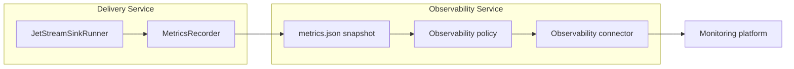
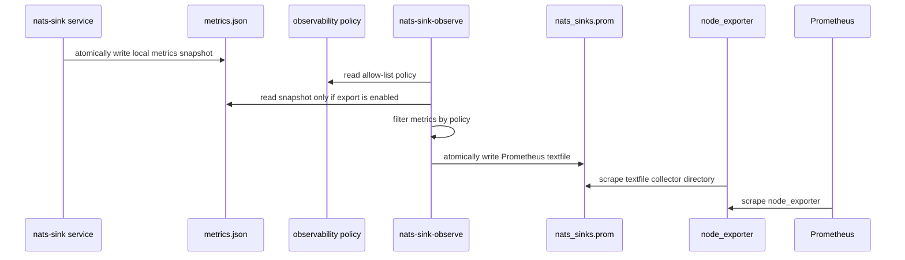
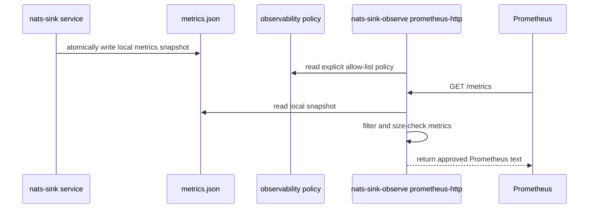

# Observability

`nats-sinks` separates observability from delivery. The sink runner moves
messages from JetStream to a durable destination. The observability layer reads
safe local metrics snapshots and decides what, if anything, may be shared with
external monitoring platforms.

That separation matters in production and mission-oriented environments.
Metrics can reveal tempo, incident conditions, queue pressure, and backend
health even when they never include payloads. For that reason, `nats-sinks`
uses a share-nothing default for external observability connectors. Operators
must explicitly choose which metric names may leave the host.

## Documentation Map

Observability is documented as a small set of focused pages:

- [Observability Overview](observability.md): explains the safety model,
  sharing policy, and connector-neutral architecture.
- [Metrics Snapshot And CLI](metrics.md): explains the local metrics recorder,
  `nats-sink-metrics`, metric names, snapshot files, and shell-friendly output.
- [Prometheus Integration](prometheus.md): explains the policy-controlled
  Prometheus textfile connector and optional native HTTP scrape endpoint.
- [NATS Server Monitoring Integration](nats-server-monitoring.md): explains the
  disabled-by-default connector for selected NATS monitoring endpoint fields.

Prometheus is therefore a sub-page of observability rather than a separate
delivery feature. The delivery worker can run without Prometheus, and
Prometheus export can be reviewed, enabled, disabled, and operated separately
from message processing.

## Design Goals

The observability design follows the same conservative posture as the delivery
runtime:

- metrics must never change ACK ordering,
- observability failure must never cause early ACK,
- payload bodies, decrypted data, secrets, tokens, private keys, full
  connection strings, NATS credentials, Oracle DSNs, table names, file paths,
  classification values, labels, and subjects must not be exported by default,
- exported metrics must be low-cardinality unless a future connector clearly
  documents a bounded label strategy,
- external sharing is disabled until an explicit policy enables it,
- observability connectors are isolated from core and sink logic so new
  platforms can be added without breaking sink APIs.

## Architecture

The core runner records metrics through a small `MetricsRecorder` protocol.
The built-in `JsonFileMetrics` recorder writes a local snapshot. Observability
connectors then read that snapshot and apply an operator-approved policy.



The recommended Prometheus integration uses the textfile collector model:



An optional native Prometheus HTTP endpoint is also available for deployments
where operators already manage service scrape targets directly. It is still an
observability connector rather than part of the delivery-critical runner:



The native endpoint reads only the local snapshot and policy file. It does not
connect to JetStream, Oracle, the file sink directory, DLQ subjects, or future
destination backends. If the endpoint cannot render metrics safely, it returns a
small error response and leaves sink delivery untouched.

NATS server monitoring endpoints such as `/jsz` are intentionally handled by a
separate observability connector. The sink worker does not poll those
endpoints, because server monitoring is operational context rather than a
delivery prerequisite. The connector is documented in
[NATS Server Monitoring Integration](nats-server-monitoring.md).

For Kubernetes deployments, the example manifests keep observability in a
separate sidecar container that reads the worker's local metrics snapshot
through a shared pod volume. The policy remains disabled by default until an
operator explicitly enables the top-level observability policy and the native
Prometheus HTTP endpoint. See [Kubernetes Deployment](kubernetes.md).

## Observability Policy

An observability policy is a JSON document with this schema identifier:

```json
{
  "schema": "nats_sinks.observability.policy.v1"
}
```

Generated policies are disabled by default:

```json
{
  "schema": "nats_sinks.observability.policy.v1",
  "enabled": false,
  "namespace": "nats_sinks",
  "allowed_metrics": [],
  "allowed_metric_patterns": [],
  "denied_metrics": [],
  "denied_metric_patterns": [],
  "include_observations": false,
  "include_legacy": false,
  "subjects": [],
  "prometheus": {
    "enabled": false,
    "output_file": "/var/lib/node_exporter/textfile_collector/nats_sinks.prom",
    "include_help": true,
    "include_type": true,
    "stale_after_seconds": 60,
    "http_endpoint": {
      "enabled": false,
      "host": "127.0.0.1",
      "port": 9108,
      "path": "/metrics",
      "request_timeout_seconds": 5,
      "response_max_bytes": 1048576
    }
  },
  "nats_server_monitoring": {
    "enabled": false,
    "base_url": null,
    "allowed_endpoints": [],
    "allowed_fields": [],
    "timeout_seconds": 2,
    "max_response_bytes": 262144,
    "verify_tls": true,
    "ca_file": null,
    "prometheus_enabled": false,
    "include_help": true,
    "include_type": true
  }
}
```

The top-level `enabled` field controls whether any observability connector may
share metrics. The connector-specific `prometheus.enabled` field controls only
the Prometheus textfile connector. Both must be `true` before Prometheus output
contains real metric values. The nested
`prometheus.http_endpoint.enabled` field controls the optional native HTTP
endpoint. The HTTP endpoint requires `enabled=true` and
`prometheus.http_endpoint.enabled=true`; it does not require
`prometheus.enabled=true`, because textfile writing and HTTP scraping are
separate connectors.

The `nats_server_monitoring` object controls the optional NATS monitoring
connector. It is also disabled by default. When enabled, it polls only the
approved NATS server monitoring endpoint paths and extracts only the approved
scalar JSON fields. It never exports the configured base URL, credentials, raw
endpoint body, account names, subject names, stream names, consumer names, or
topology fields unless an operator has selected those exact fields.

## Policy Fields

| Field | Default | Meaning |
| --- | --- | --- |
| `schema` | required | Policy schema identifier. Current value is `nats_sinks.observability.policy.v1`. |
| `enabled` | `false` | Global switch for sharing metrics outside the local snapshot. |
| `namespace` | `nats_sinks` | Prefix used for exported metric names. Must be Prometheus-safe. |
| `allowed_metrics` | `[]` | Exact metric suffixes that may be exported. |
| `allowed_metric_patterns` | `[]` | Glob patterns for metric suffixes, such as `messages_*` or `oracle_*`. |
| `denied_metrics` | `[]` | Exact metric suffixes to suppress even if an allow rule matches. |
| `denied_metric_patterns` | `[]` | Glob patterns to suppress even if an allow rule matches. |
| `include_observations` | `false` | Whether timing observations such as `sink_batch_write_seconds` may be exported. |
| `include_legacy` | `false` | Whether legacy metric aliases may be exported. |
| `subjects` | `[]` | Subject patterns discovered from the core config for operator review and future subject-aware metrics. |
| `prometheus` | object | Prometheus connector settings. |
| `nats_server_monitoring` | object | Optional connector settings for selected NATS server monitoring endpoint values. |

The deny list wins over the allow list. This lets a broad allow rule such as
`messages_*` be narrowed with a specific deny rule if a metric is not suitable
for a particular environment.

## Prometheus Connector Fields

| Field | Default | Applies To | Meaning |
| --- | --- | --- | --- |
| `prometheus.enabled` | `false` | Textfile | Enables rendering Prometheus textfile output. This is separate from the native HTTP endpoint. |
| `prometheus.output_file` | `null` | Textfile | Destination file for node_exporter's textfile collector. The CLI can override it with `--output`. |
| `prometheus.include_help` | `true` | Textfile and HTTP | Includes Prometheus `# HELP` lines in generated output. |
| `prometheus.include_type` | `true` | Textfile and HTTP | Includes Prometheus `# TYPE` lines in generated output. |
| `prometheus.stale_after_seconds` | `null` | Textfile and HTTP | Fails closed when the local snapshot is older than this value unless the CLI explicitly allows stale output. |
| `prometheus.http_endpoint.enabled` | `false` | HTTP | Enables the native scrape endpoint after the top-level policy is also enabled. |
| `prometheus.http_endpoint.host` | `127.0.0.1` | HTTP | Listener host. Loopback is the safe default; expose wider only behind approved network controls. |
| `prometheus.http_endpoint.port` | `9108` | HTTP | Listener port, validated from `1` through `65535`. |
| `prometheus.http_endpoint.path` | `/metrics` | HTTP | Scrape path. Query strings, fragments, whitespace, and control characters are rejected. |
| `prometheus.http_endpoint.request_timeout_seconds` | `5` | HTTP | HTTP server request timeout. |
| `prometheus.http_endpoint.response_max_bytes` | `1048576` | HTTP | Maximum rendered response size. Oversized responses return a small service-unavailable response instead of streaming unbounded data. |

## NATS Server Monitoring Fields

| Field | Default | Meaning |
| --- | --- | --- |
| `nats_server_monitoring.enabled` | `false` | Enables polling of NATS server monitoring endpoints by `nats-sink-observe`. The main delivery worker never polls these endpoints. |
| `nats_server_monitoring.base_url` | `null` | Base URL for the NATS monitoring listener. It must contain only scheme and host, must not contain credentials, and may use plain `http` only for loopback hosts. |
| `nats_server_monitoring.allowed_endpoints` | `[]` | Explicit endpoint allow list. Supported values are `/varz`, `/connz`, `/routez`, `/subsz`, `/accountz`, `/accstatz`, `/jsz`, and `/healthz`. |
| `nats_server_monitoring.allowed_fields` | `[]` | Explicit dotted JSON field paths to extract from each endpoint response, such as `status` or `jetstream.stats.messages`. Missing or non-scalar values are stored as `null`. |
| `nats_server_monitoring.timeout_seconds` | `2` | Per-request timeout, validated from greater than `0` through `30` seconds. |
| `nats_server_monitoring.max_response_bytes` | `262144` | Maximum response size per endpoint. Larger responses fail the poll rather than being loaded unbounded. |
| `nats_server_monitoring.verify_tls` | `true` | Verifies TLS certificates for HTTPS monitoring URLs. Keep this enabled outside isolated local labs. |
| `nats_server_monitoring.ca_file` | `null` | Optional local CA certificate file used when the monitoring endpoint uses a private or self-signed CA. |
| `nats_server_monitoring.prometheus_enabled` | `false` | Enables rendering selected numeric monitoring fields as Prometheus text. This is separate from ordinary sink metrics. |
| `nats_server_monitoring.include_help` | `true` | Includes Prometheus `# HELP` lines for NATS monitoring values. |
| `nats_server_monitoring.include_type` | `true` | Includes Prometheus `# TYPE` lines for NATS monitoring values. |

Example policy fragment for a local lab:

```json
{
  "enabled": true,
  "nats_server_monitoring": {
    "enabled": true,
    "base_url": "http://127.0.0.1:8222",
    "allowed_endpoints": ["/healthz", "/jsz"],
    "allowed_fields": [
      "status",
      "server_id",
      "jetstream.stats.messages",
      "jetstream.stats.consumer_count"
    ],
    "timeout_seconds": 2,
    "max_response_bytes": 262144,
    "verify_tls": true,
    "prometheus_enabled": false
  }
}
```

Example policy fragment for a protected HTTPS monitoring endpoint with a local
CA file:

```json
{
  "enabled": true,
  "nats_server_monitoring": {
    "enabled": true,
    "base_url": "https://nats-monitoring.internal.example",
    "allowed_endpoints": ["/healthz"],
    "allowed_fields": ["status"],
    "timeout_seconds": 2,
    "max_response_bytes": 65536,
    "verify_tls": true,
    "ca_file": "/etc/nats-sinks/nats-monitoring-ca.crt",
    "prometheus_enabled": true
  }
}
```

The second example uses a documentation-only hostname. In a real deployment,
keep the monitoring endpoint on a protected management network and do not put
credentials in the URL.

## Subject Hints

The policy generator copies subject patterns from the core configuration:

- `nats.subject`,
- payload-encryption subject rules,
- message-metadata subject rules,
- Oracle subject-to-table routing rules.

Current core metrics are intentionally not subject-labeled. Subject names can
be sensitive, and unbounded labels can damage Prometheus performance. The
`subjects` array is therefore an operator review aid and a future extension
point, not a promise that subject labels will be exported today.

Example subject entry:

```json
{
  "subject": "orders.urgent",
  "enabled": false,
  "allowed_metrics": [],
  "allowed_metric_patterns": [],
  "share_subject_label": false
}
```

Future subject-aware connectors must document exactly which subject values are
exported, how cardinality is bounded, and how sensitive subject names are
approved.

## Generating A Policy

Use `nats-sink-observe init-prometheus-policy` to create a disabled policy from
the runtime configuration:

```bash
nats-sink-observe init-prometheus-policy \
  /etc/nats-sinks/config.json \
  /etc/nats-sinks/observability.prometheus.json \
  --output-file /var/lib/node_exporter/textfile_collector/nats_sinks.prom
```

Example output:

```text
Generated disabled observability policy: /etc/nats-sinks/observability.prometheus.json
Prometheus export remains disabled until the policy explicitly enables sharing.
```

Validate the policy:

```bash
nats-sink-observe validate-policy /etc/nats-sinks/observability.prometheus.json
```

Example output:

```text
Observability policy is valid.
schema=nats_sinks.observability.policy.v1
enabled=false
namespace=nats_sinks
prometheus_enabled=false
nats_server_monitoring_enabled=false
nats_server_monitoring_prometheus_enabled=false
allowed_metrics=0
allowed_metric_patterns=0
denied_metrics=0
denied_metric_patterns=0
subjects=1
```

Show the effective policy as JSON:

```bash
nats-sink-observe show-effective-policy /etc/nats-sinks/observability.prometheus.json
```

List metrics that can be allowed:

```bash
nats-sink-observe list-metrics --format names
```

Example output:

```text
messages_fetched_total
messages_prepared_total
messages_written_total
messages_acked_total
messages_terminated_total
messages_nacked_total
messages_failed_total
messages_dlq_total
```

List discovered subject hints in a shell-friendly format:

```bash
nats-sink-observe list-subjects \
  /etc/nats-sinks/observability.prometheus.json \
  --format shell
```

Example output:

```text
NATS_SINKS_SUBJECT_1_ORDERS=orders.*
```

## Native Prometheus HTTP Endpoint

Enable the native endpoint only when a direct scrape target is preferred over
node_exporter's textfile collector. A minimal policy looks like this:

```json
{
  "schema": "nats_sinks.observability.policy.v1",
  "enabled": true,
  "namespace": "nats_sinks",
  "allowed_metrics": [
    "messages_fetched_total",
    "messages_written_total",
    "messages_acked_total",
    "messages_failed_total"
  ],
  "allowed_metric_patterns": [],
  "denied_metrics": [],
  "denied_metric_patterns": [],
  "include_observations": false,
  "include_legacy": false,
  "subjects": [],
  "prometheus": {
    "enabled": false,
    "include_help": true,
    "include_type": true,
    "stale_after_seconds": 60,
    "http_endpoint": {
      "enabled": true,
      "host": "127.0.0.1",
      "port": 9108,
      "path": "/metrics",
      "request_timeout_seconds": 5,
      "response_max_bytes": 1048576
    }
  }
}
```

Preview one scrape response without opening a listener:

```bash
nats-sink-observe prometheus-http \
  /var/lib/nats-sink/metrics.json \
  /etc/nats-sinks/observability.prometheus.json \
  --dry-run
```

Example output:

```text
# HELP nats_sinks_messages_fetched_total Raw JetStream messages fetched by the pull consumer.
# TYPE nats_sinks_messages_fetched_total counter
nats_sinks_messages_fetched_total 256
```

Run the listener as a foreground process:

```bash
nats-sink-observe prometheus-http \
  /var/lib/nats-sink/metrics.json \
  /etc/nats-sinks/observability.prometheus.json
```

Example startup output:

```text
Serving Prometheus metrics on 127.0.0.1:9108/metrics
```

Prometheus can then scrape the endpoint:

```yaml
scrape_configs:
  - job_name: "nats-sinks"
    static_configs:
      - targets:
          - "127.0.0.1:9108"
```

Use a local reverse proxy, host firewall, service mesh, or Prometheus network
policy when exposing this endpoint beyond loopback. The endpoint has no
application authentication layer in this release; it relies on local binding
and deployment-level access control.

## Python API

Embedding applications can use the policy and connector modules directly:

```python
from nats_sinks.core.metrics import load_metrics_snapshot
from nats_sinks.observability import (
    load_observability_policy,
    render_prometheus_http_response,
    render_prometheus_textfile,
)

policy = load_observability_policy("/etc/nats-sinks/observability.prometheus.json")
snapshot = load_metrics_snapshot("/var/lib/nats-sink/metrics.json")

text = render_prometheus_textfile(snapshot, policy)
print(text)

response = render_prometheus_http_response(
    "/var/lib/nats-sink/metrics.json",
    policy,
    request_path="/metrics",
)
print(response.status_code)
```

Generate a disabled policy from a validated app config:

```python
from nats_sinks.core.config import load_config
from nats_sinks.observability import write_observability_policy, observability_policy_template

config = load_config("/etc/nats-sinks/config.json")
policy = observability_policy_template(
    config,
    output_file="/var/lib/node_exporter/textfile_collector/nats_sinks.prom",
)

write_observability_policy(policy, "/etc/nats-sinks/observability.prometheus.json")
```

## Security Guidance

Treat observability configuration as production policy:

- keep policies reviewed and under change control,
- export the smallest useful metric set,
- avoid subject labels unless a future connector explicitly supports bounded,
  approved subject-aware metrics,
- keep metrics snapshots and textfiles out of git,
- make `/etc/nats-sinks/observability.prometheus.json` writable only by root or
  a controlled configuration-management process,
- grant the Prometheus textfile service read access to the metrics snapshot and
  write access only to the node_exporter textfile directory,
- keep the main sink service and observability publishing service separate when
  practical.

Observability is meant to improve operational confidence. It must not become a
side channel for sensitive payloads, credentials, subject names, operational
labels, or classified mission details.

## Future Connectors

The observability core is intentionally connector-neutral. Future connectors
may include:

- OpenTelemetry OTLP metrics for environments that already centralize traces,
  logs, and metrics through collectors,
- StatsD for lightweight counter/timer forwarding,
- Datadog for hosted operational dashboards,
- Splunk HEC for security operations and incident-response workflows,
- Elastic Observability for Elasticsearch-backed operations platforms,
- Grafana Alloy or Grafana Agent for unified collection pipelines,
- Oracle Cloud Infrastructure Monitoring for OCI-native deployments,
- Amazon CloudWatch for AWS deployments,
- Azure Monitor for Microsoft cloud deployments,
- syslog or structured log bridges for restricted networks where pull-based
  scraping is not available.

Each connector should remain policy-driven, disabled by default, and isolated
from message delivery semantics.
