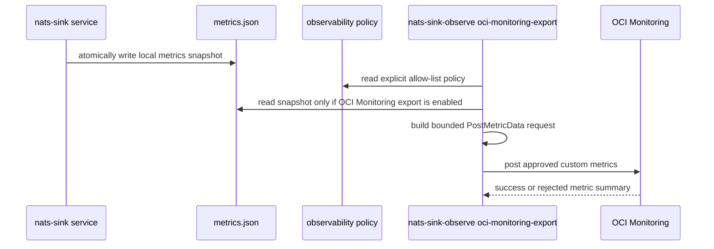

# OCI Monitoring Integration

The OCI Monitoring connector exports policy-approved aggregate `nats-sinks`
metrics to Oracle Cloud Infrastructure Monitoring as custom metrics. It is
designed for Oracle Cloud deployments that want telemetry to stay inside the
OCI operational plane while preserving the `nats-sinks` observability safety
model.

The connector is disabled by default. It reads only the local metrics snapshot,
applies the shared observability allow and deny policy, builds bounded
`PostMetricData` requests, and optionally sends them through the OCI Python
SDK. It never connects to NATS, reads sink payloads, queries Oracle Database,
opens file sink outputs, or participates in ACK, NAK, DLQ, retry, fan-out,
idempotency, or sink-write decisions.

Oracle documents custom metrics in OCI Monitoring and the Python SDK
`MonitoringClient.post_metric_data` API here:

- [OCI Monitoring Overview](https://docs.oracle.com/en-us/iaas/Content/Monitoring/Concepts/monitoringoverview.htm)
- [OCI Python SDK MonitoringClient](https://docs.oracle.com/en-us/iaas/tools/python/latest/api/monitoring/client/oci.monitoring.MonitoringClient.html)
- [OCI Python SDK PostMetricDataDetails](https://docs.oracle.com/en-us/iaas/tools/python/latest/api/monitoring/models/oci.monitoring.models.PostMetricDataDetails.html)

## Architecture



The export command can be run by a separate service or timer. The delivery
worker only writes the snapshot. OCI Monitoring export can fail, be throttled,
or be misconfigured without changing message delivery behavior.

## Install

The base package does not install the OCI SDK. Install the optional extra only
on hosts or containers that need live OCI Monitoring export:

```bash
python -m pip install "nats-sinks[oci]"
```

Dry-run rendering and unit tests do not require the OCI SDK.

## Policy Example

Enable the connector only after reviewing the metric allow list and the static
dimensions. Keep dimensions low-cardinality and non-sensitive.

```json
{
  "schema": "nats_sinks.observability.policy.v1",
  "enabled": true,
  "namespace": "mission_ops",
  "allowed_metrics": [
    "messages_fetched_total",
    "messages_acked_total",
    "sink_batches_written_total"
  ],
  "allowed_metric_patterns": [],
  "denied_metrics": [],
  "denied_metric_patterns": [],
  "include_observations": false,
  "include_legacy": false,
  "subjects": [],
  "oci_monitoring": {
    "enabled": true,
    "metric_namespace": "nats_sinks_metrics",
    "region": "eu-frankfurt-1",
    "compartment_id": "ocid1.compartment.oc1..examplecompartment",
    "resource_group": "nats_sinks",
    "auth_mode": "instance_principal",
    "batch_atomicity": "ATOMIC",
    "dimensions": {
      "deployment": "edge"
    },
    "metadata": {
      "service": "nats_sinks"
    },
    "include_metric_labels_as_dimensions": false,
    "timeout_seconds": 5,
    "max_retries": 0,
    "retry_backoff_seconds": 0.25,
    "stale_after_seconds": 60,
    "max_metrics_per_request": 20,
    "max_request_bytes": 1048576
  }
}
```

The example uses a fake compartment OCID. Store real compartment OCIDs only in
protected configuration and never in public issue comments, screenshots, or
test reports.

## Configuration Fields

| Field | Default | Meaning |
| --- | --- | --- |
| `oci_monitoring.enabled` | `false` | Enables OCI Monitoring export when the top-level observability policy is also enabled. |
| `oci_monitoring.metric_namespace` | `nats_sinks_metrics` | OCI custom metric namespace. It must start with a letter, use only letters, digits, and underscores, and must not start with reserved `oci_` or `oracle_` prefixes. |
| `oci_monitoring.region` | `null` | OCI region name used by the SDK client. Required when enabled. This is a plain region identifier, not a URL. |
| `oci_monitoring.compartment_id` | `null` | Target compartment OCID for custom metrics. Required when enabled. Treat it as deployment-sensitive metadata. |
| `oci_monitoring.resource_group` | `null` | Optional static OCI Monitoring resource group. Keep it bland, low-cardinality, and non-sensitive. |
| `oci_monitoring.auth_mode` | `instance_principal` | Authentication mode. Supported values are `instance_principal`, `resource_principal`, and `config_file`. |
| `oci_monitoring.config_file` | `null` | OCI SDK config file path. Required only when `auth_mode` is `config_file`. The file path is not printed in summaries. |
| `oci_monitoring.profile` | `DEFAULT` | OCI SDK config profile used with `auth_mode: "config_file"`. |
| `oci_monitoring.batch_atomicity` | `ATOMIC` | OCI request batch behavior. Supported values are `ATOMIC` and `NON_ATOMIC`. |
| `oci_monitoring.dimensions` | `{"source": "nats_sinks"}` | Static dimensions applied to every custom metric. At least one safe dimension is required. |
| `oci_monitoring.metadata` | `{}` | Optional static metadata for OCI metric data. Keep this non-sensitive. |
| `oci_monitoring.include_metric_labels_as_dimensions` | `false` | Adds prepared, policy-reviewed metric labels such as `subject_family` as OCI dimensions. Leave disabled unless the subject-aware observability runbook has been completed. |
| `oci_monitoring.timeout_seconds` | `5` | Per-request SDK timeout, validated from greater than `0` through `60` seconds. |
| `oci_monitoring.max_retries` | `0` | Bounded retries after the initial attempt. SDK retries are disabled so this policy controls retry behavior. |
| `oci_monitoring.retry_backoff_seconds` | `0.25` | Delay between retry attempts. |
| `oci_monitoring.stale_after_seconds` | `null` | Optional maximum snapshot age before export fails closed unless `--allow-stale` is used. |
| `oci_monitoring.max_metrics_per_request` | `20` | Maximum metric data objects in one OCI request, capped at `50`. |
| `oci_monitoring.max_request_bytes` | `1048576` | Maximum JSON request body size before model conversion. Oversized requests fail closed. |

Rejected dimension and metadata names include words that commonly indicate
sensitive or high-cardinality data: `subject`, `classification`, `label`,
`mission`, `table`, `path`, `file`, `host`, `user`, `message`, `ocid`,
`tenancy`, `compartment`, `token`, `secret`, `password`, `key`, and related
credential terms.

## Authentication

Prefer platform identity over static credentials:

1. `instance_principal` for OCI Compute instances with a dynamic group and a
   narrow policy.
2. `resource_principal` for OCI services that expose resource-principal
   signing.
3. `config_file` for controlled local labs or developer workstations only.

An example least-privilege OCI policy shape is:

```text
Allow dynamic-group nats_sinks_observability to use metrics in compartment <compartment-name>
```

Use the exact dynamic group and compartment names from your tenancy. Do not put
private keys, user OCIDs, tenancy OCIDs, fingerprints, passphrases, or session
tokens in observability policy JSON.

## Dry Run

Dry-run mode renders the bounded request body without importing the OCI SDK or
opening a network connection:

```bash
nats-sink-observe oci-monitoring-export \
  /var/lib/nats-sink/metrics.json \
  /etc/nats-sinks/observability.prometheus.json \
  --dry-run
```

Example output:

```json
[{"batch_atomicity":"ATOMIC","metric_data":[{"compartment_id":"<redacted>","datapoints":[{"count":1,"timestamp":"2026-05-27T12:00:00.000Z","value":256.0}],"dimensions":{"deployment":"edge"},"metadata":{"service":"nats_sinks"},"name":"mission_ops_messages_fetched_total","namespace":"nats_sinks_metrics","resource_group":"nats_sinks"}]}]
```

The dry-run preview redacts the compartment OCID and does not print the OCI
region, signer details, config file path, private keys, credentials, subjects,
payloads, classifications, labels, destination names, table names, or file
paths.

## Live Export

```bash
nats-sink-observe oci-monitoring-export \
  /var/lib/nats-sink/metrics.json \
  /etc/nats-sinks/observability.prometheus.json
```

Example success output:

```text
OCI Monitoring export: attempted=true delivered=true attempts=1 requests=1 metrics=3 message=OCI Monitoring export delivered
```

Example bounded failure output:

```text
OCI Monitoring export: attempted=true delivered=false attempts=2 requests=1 metrics=3 message=OCI Monitoring export failed with TimeoutError
```

Failure summaries include only exception categories, not cloud identifiers,
regions, endpoint details, signer material, or payloads.

## Service Deployment

Run OCI Monitoring export separately from the sink worker. A timer-based unit
keeps the connector outside the delivery-critical process:

```ini
[Unit]
Description=nats-sinks OCI Monitoring export
After=network-online.target

[Service]
Type=oneshot
User=nats-sink
Group=nats-sink
ExecStart=/opt/nats-sinks/bin/nats-sink-observe oci-monitoring-export /var/lib/nats-sink/metrics.json /etc/nats-sinks/observability.prometheus.json
NoNewPrivileges=true
PrivateTmp=true
ProtectSystem=strict
ProtectHome=true
ReadWritePaths=/var/lib/nats-sink
ReadOnlyPaths=/etc/nats-sinks
```

```ini
[Unit]
Description=Run nats-sinks OCI Monitoring export periodically

[Timer]
OnBootSec=30s
OnUnitActiveSec=30s
AccuracySec=5s

[Install]
WantedBy=timers.target
```

Grant the service read access to the local metrics snapshot and policy file.
Grant OCI permissions only to post custom metrics in the approved compartment.

## Security Notes

- Leave the connector disabled until the metric allow list, dimensions,
  metadata, target compartment, and identity mode have been reviewed.
- Do not use raw subjects, classification values, labels, mission metadata,
  hostnames, usernames, file paths, table names, stream sequences, or message
  IDs as OCI dimensions.
- Keep `include_metric_labels_as_dimensions` disabled unless the
  subject-aware observability policy and certification runbook approve the
  exact prepared labels.
- Use instance principals or resource principals where possible.
- Keep SDK config files readable only by the observability service user.
- Treat OCI custom metrics as redistributed operational data. They may reveal
  tempo, pressure, outage windows, retry behavior, and backend health.
- OCI Monitoring export success is not delivery evidence. Delivery evidence
  remains the sink commit followed by JetStream ACK.

## Tests

The unit suite covers:

- disabled-by-default behavior,
- allow and deny filtering,
- observation inclusion and suppression,
- bounded request splitting,
- request-size fail-closed behavior,
- dry-run redaction,
- SDK client fakes for success, retry, timeout, and rejected metric responses,
- policy validation for unsafe regions, namespaces, compartments, dimensions,
  and metadata.

Optional live validation should run only in a non-production OCI tenancy with a
least-privilege identity and a test compartment. Live validation must not print
or publish tenancy details, real compartment OCIDs, API keys, private keys, or
operator identifiers.

## Non-Goals

The OCI Monitoring connector does not:

- create alarms, dashboards, notification topics, or service connectors;
- read OCI Monitoring data back into the sink runner;
- export message payloads or destination records;
- manage OCI IAM policies, dynamic groups, or compartments;
- guarantee telemetry delivery to OCI Monitoring;
- influence ACK, NAK, DLQ, retry, fan-out, idempotency, or sink writes.
