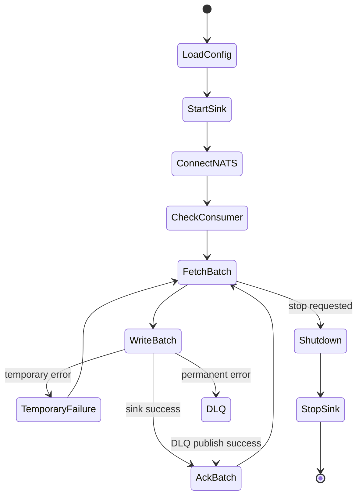
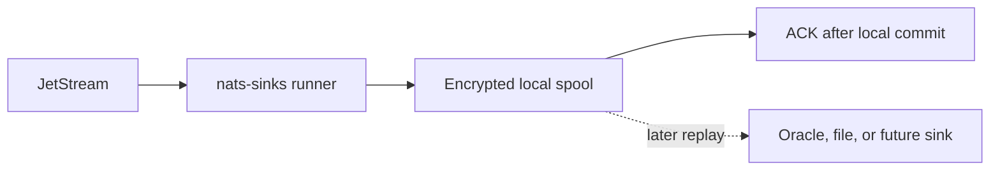

# Operations

This page describes deployment and runtime behavior for operators. It assumes
you want to run `nats-sinks` as a long-lived process that continuously moves
messages from JetStream into a destination system.

Operationally, the most important idea is that the process is allowed to see
duplicate messages. That is part of at-least-once delivery. The unsafe outcome
is not duplication; the unsafe outcome is ACKing a message before the
destination write has committed.

For mission-oriented and defence workloads, think of `nats-sinks` as a small
ingestion component in a larger operational picture. It may sit near
sensor-fusion, command-and-control, sensor-to-shooter, kill-chain, kill-mesh,
or weapon-system status reporting workflows, but its job is not to select
targets, authorize effects, control weapons, or decide mission policy. Its job
is to preserve the event trail, make failures visible, and avoid converting a
temporary downstream problem into silent data loss.

The [Defence And Mission Support](use-cases/defence/index.md) blueprint pages
show how current generic features can be combined for sensor event custody,
classification and labels, chain-of-custody evidence, cross-domain handoff
preparation, edge operation, and audit-oriented persistence without changing
the product into a defence-only platform.

## Deployment Shape

`nats-sinks` can run as:

- a systemd service,
- a container,
- a Kubernetes Deployment,
- a process managed by another Python application.

Typical command:

```bash
nats-sink run /etc/nats-sinks/config.json
```

Kubernetes deployment examples are provided in
[Kubernetes Deployment](kubernetes.md). They show JSON runtime configuration in
ConfigMaps, Secret references for credentials, restrictive security contexts,
resource requests and limits, readiness and liveness checks, graceful
termination settings, and optional Prometheus observability sidecars. The
examples are public-safe starting points; operators must replace all
placeholders with environment-specific values before applying them.

Before starting a production worker, confirm that its NATS account has only the
runtime permissions it needs. In the preferred model, stream and durable
consumer creation are handled by a separate administrative process. The worker
account can fetch from one consumer, receive inbox responses, ACK received
messages after durable sink success, and publish to the configured DLQ subject
only when DLQ is enabled. Templates are provided in
[NATS Least-Privilege Permissions](nats-permissions.md).

Set `consumer_management.mode` deliberately for each environment:

- use `bind_only` when consumers are created by Terraform, Ansible, a platform
  pipeline, or another controlled administrative process,
- use `create_if_missing` for developer, test, or carefully controlled worker
  accounts that may create the durable consumer when it is absent,
- use `reconcile` only when the worker is intentionally allowed to update
  compatible durable pull-consumer settings.

If the existing consumer has a different single or plural filter-subject set, a
non-explicit ACK policy, push delivery settings, or configured delivery drift,
the worker fails at startup before fetching any messages. Treat that as a
deployment mismatch to fix in the NATS control plane, not as a reason to widen
runtime permissions.

When richer policy fields are configured, review them as part of operational
change control:

- `backoff_seconds` is a JetStream server-side timeout redelivery sequence; it
  requires `max_deliver` and cannot be combined with `ack_wait_seconds`.
- `filter_subjects` lets one durable consumer receive several subject families,
  but every filter must remain inside `nats.subject`.
- `num_replicas` and `memory_storage` affect consumer-state durability and I/O
  behavior; production changes should be coordinated with the NATS operations
  team.
- `metadata` is for low-sensitivity operational labels only. It must not carry
  secrets, payloads, connection details, or classified mission content.

The primary production connection path is still direct NATS TCP with
`nats://` for controlled local use or `tls://` for encrypted production
connectivity. Operational authentication may use token, username/password,
credentials-file, NKEY seed-file, local CA TLS, or TLS client certificate
settings, but identity material must be mounted from a secret location and must
not appear in logs, issue comments, service files, or public examples. WebSocket
transport is also supported for environments where HTTP-aware network
boundaries or approved gateways require `ws://` or `wss://`. Use `wss://` with
certificate verification for operational deployments, keep WebSocket header
values redacted, and review proxy logs as part of the deployment threat model.
See
[WebSocket Connection Evaluation](websocket-connection-evaluation.md) before
approving WebSocket transport in an operational deployment.

The optional `nats.no_echo` setting is supported for deployments that need the
NATS server to suppress same-connection message echo. Most production
`nats-sinks` workers should keep it at the default `false` value because the
runner receives through JetStream pull consumers and publishes only operational
messages such as DLQ records when configured. Enabling no-echo does not change
commit-then-ACK behavior, durable consumer binding, or destination write
semantics.

If the selected stream is built from mirrors, sources, subject transforms,
republish rules, compression, placement policies, or stream metadata, review
the topology before treating the sink's idempotency key as final. Those
features are managed outside `nats-sinks`, but they can change the subject,
stream sequence, replay path, and operator context that the worker observes.
See [Advanced JetStream Topology](jetstream-topology.md).

## Stream Management Planning

`nats-sinks` includes an offline stream-planning helper for operators who need
to prepare JetStream streams before a worker starts:

```bash
nats-sink stream-plan /etc/nats-sinks/config.json \
  --retention limits \
  --discard old \
  --storage file \
  --replicas 3 \
  --duplicate-window-seconds 600
```

The command reads the same JSON configuration as the runtime, but it does not
connect to NATS and does not mutate stream or consumer state. It prints the
configured stream, subject set, durable consumer, recommended stream settings,
runtime permission subjects, administration permission subjects, warnings, and
a NATS CLI example for review.

Use this helper during deployment preparation, not inside the long-running sink
service. Stream creation and updates should be handled by a separate
administrative identity or platform automation. The runtime identity should
keep only the permissions needed to fetch from its durable pull consumer, ACK
messages after durable success, receive inbox responses, and publish to the
configured DLQ subject when enabled.

See [JetStream Stream Management Planning](stream-management.md) for detailed
guidance on retention policies, discard behavior, storage, replicas,
duplicate-window sizing, and permission separation.

## Runtime Lifecycle



## Disconnected Edge Spooling

The [Edge Spool Sink](spool-sink.md) can be used when a node must keep local
custody of messages during disconnected or degraded operation. In that mode,
the durable success boundary is the encrypted local spool record, not the final
remote database or object store. The runner ACKs JetStream only after the spool
record is atomically committed.



Use this deliberately. Local spool directories need capacity monitoring,
restricted permissions, backup and retention decisions, and an operator replay
procedure. If the spool reaches its configured record or byte limit, writes
fail closed and the runner does not ACK affected JetStream messages.

Replay is an explicit operator action:

```bash
nats-sink replay-spool /etc/nats-sinks/spool.json /etc/nats-sinks/oracle.json --max-records 100
```

That command reconstructs the original `NatsEnvelope` from encrypted local
custody and calls the target sink. Spool files are deleted only after the
target sink returns success and `delete_after_replay` is enabled.

## Logging

The package uses standard Python logging. Payload logging is disabled by
default because message bodies may contain business data, customer data, or
encrypted payloads. Avoid DEBUG logs in production unless you have reviewed
payload and credential exposure risks.

Use `INFO` for ordinary service operation, `WARNING` when you want only
recoverable problems and risky conditions, and `ERROR` or `CRITICAL` when the
runtime should report only serious failures. Use `DEBUG` for short-lived
diagnostic sessions in controlled environments.

In watch-floor, operations-center, or mission-support deployments, keep logs
boring and actionable. Prefer stable event counts, DLQ alerts, and last-success
timestamps over verbose payload logs. Payloads and headers may carry sensitive
operational context even when they look harmless during a test.

The full logging level reference is documented in
[Configuration](configuration.md#logging).

## Metrics

`nats-sinks` exposes a small metrics abstraction that can be connected to an
embedding application's Prometheus, OpenTelemetry, StatsD, or platform-native
telemetry stack. The command-line process uses a no-op recorder by default, but
it can write a local JSON metrics snapshot when `metrics.enabled` is true and
`metrics.snapshot_file` is configured. The separate `nats-sink-metrics` CLI can
then inspect that snapshot without connecting to NATS or a destination backend.

```json
{
  "metrics": {
    "enabled": true,
    "namespace": "nats_sinks",
    "snapshot_file": ".local/nats-sinks/metrics.json",
    "event_freshness_enabled": true,
    "event_stale_after_seconds": 300,
    "event_future_skew_tolerance_seconds": 5
  }
}
```

```bash
nats-sink-metrics show .local/nats-sinks/metrics.json --format table
nats-sink-metrics show .local/nats-sinks/metrics.json --metric "event_*" --metric "events_*"
nats-sink-metrics get .local/nats-sinks/metrics.json messages_failed_total --default 0
```

The full CLI reference, Python hooks, shell examples, exit codes, and snapshot
schema are documented in [Metrics](metrics.md).

Confirmed JetStream acknowledgement support has been evaluated for a future
release, but it is not enabled today. If that option is implemented later, it
will provide stronger evidence that the server accepted the post-commit ACK,
while still allowing redelivery if confirmation fails after durable sink
success. See
[Acknowledgement Confirmation Evaluation](acknowledgement-confirmation.md).

JetStream `InProgress` support has also been evaluated for future long-running
sink writes. It is not enabled today. If implemented, it should be treated as a
bounded heartbeat around active work, not as a success signal. See
[InProgress Evaluation](in-progress-evaluation.md).

Optional JetStream advisory observation is available for deployments that need
server-side delivery signals such as maximum-delivery, NAK, terminal
acknowledgement, stream action, consumer action, leader-election, or
quorum-loss events. It is disabled by default and must be configured with
explicit advisory subjects. Advisory observation produces aggregate counters
only; it does not retrieve source messages, publish to DLQ, write to a sink, or
change ACK behavior.

```json
{
  "advisories": {
    "enabled": true,
    "subjects": [
      "$JS.EVENT.ADVISORY.CONSUMER.MAX_DELIVERIES.*.*",
      "$JS.EVENT.ADVISORY.CONSUMER.MSG_TERMINATED.*.*"
    ],
    "max_payload_bytes": 65536,
    "log_events": false
  }
}
```

Use advisory counters beside sink-side counters. For example, a rise in
`jetstream_advisory_max_deliver_total` without a corresponding rise in
`messages_dlq_total` means the server has observed maximum delivery attempts,
but the sink runner did not necessarily classify those messages as permanent
sink failures. That distinction matters: advisories are server-side operational
signals, while DLQ publication remains a deliberate sink-runner action.

Ordered-consumer support has been evaluated for future inspection and analysis
tooling. It is not enabled today and should not be used as a replacement for
durable pull-consumer sink workers. Replay into sinks should use durable
pull-consumer semantics with commit-then-acknowledge. See
[Ordered Consumer Evaluation](ordered-consumer-evaluation.md).

Push-consumer support has also been evaluated, but it is not enabled today.
Future push mode must be explicit, manual-ACK only, bounded by queue and
pending-byte limits, and tested for graceful shutdown before it can be treated
as production-ready. Pull consumers remain the operational default because the
worker controls when and how many messages are fetched. See
[Push Consumer Evaluation](push-consumer-evaluation.md).

External metrics sharing should use the policy-controlled observability layer
rather than ad hoc shell redirection or one-off scripts. The separate
`nats-sink-observe` CLI can generate a disabled policy from runtime config,
write a filtered Prometheus textfile for node_exporter, run an optional native
Prometheus HTTP endpoint, or export approved metrics to an OpenTelemetry
Collector through OTLP/HTTP JSON:

```bash
nats-sink-observe init-prometheus-policy \
  /etc/nats-sinks/config.json \
  /etc/nats-sinks/observability.prometheus.json

nats-sink-observe prometheus-textfile \
  /var/lib/nats-sink/metrics.json \
  /etc/nats-sinks/observability.prometheus.json \
  --output /var/lib/node_exporter/textfile_collector/nats_sinks.prom

nats-sink-observe prometheus-http \
  /var/lib/nats-sink/metrics.json \
  /etc/nats-sinks/observability.prometheus.json \
  --dry-run

nats-sink-observe otlp-export \
  /var/lib/nats-sink/metrics.json \
  /etc/nats-sinks/observability.prometheus.json \
  --dry-run
```

The observability service should run separately from the sink worker where
possible. See [Observability](observability.md) for the sharing model, the
[Prometheus Integration](prometheus.md) observability sub-page for connector
details, [OpenTelemetry OTLP Integration](otlp.md) for collector export, and
[Running nats-sink As A Service](service-deployment.md) for the service model.

NATS server monitoring endpoints such as `/jsz` and `/healthz` should be
monitored through your NATS or platform monitoring stack, or through the
separate disabled-by-default `nats-sink-observe nats-monitoring-poll`
connector when selected fields must pass through the `nats-sinks`
observability policy. The delivery-critical sink worker never polls these
endpoints. `nats-sinks` documents this boundary in
[NATS Server Monitoring Integration](nats-server-monitoring.md): server
monitoring is useful operational context, but it must not change ACK, retry,
DLQ, or sink write behavior.

Metric names are emitted to recorders as suffixes. Exporters should prefix them
with the configured namespace, which defaults to `nats_sinks`. For example,
the emitted suffix `messages_fetched_total` is conventionally exported as
`nats_sinks_messages_fetched_total`.

The preferred basic metric set is:

| Metric suffix | Type | Meaning |
| --- | --- | --- |
| `messages_fetched_total` | counter | Raw JetStream messages accepted by the runner for processing. |
| `messages_prepared_total` | counter | Messages converted into `NatsEnvelope` objects and transformed by core policies such as payload encryption and metadata resolution. |
| `messages_written_total` | counter | Messages for which `sink.write_batch(...)` returned durable success. |
| `messages_acked_total` | counter | Messages ACKed to JetStream after durable sink success or successful DLQ publication. |
| `messages_terminated_total` | counter | Messages terminally acknowledged to JetStream after successful DLQ publication when the opt-in DLQ policy is enabled. |
| `messages_nacked_total` | counter | Messages negatively acknowledged after retryable failure paths when `temporary_failure_action` is `nak`. |
| `messages_failed_total` | counter | Messages that entered a failure path before ACK. |
| `messages_dlq_total` | counter | Messages successfully published to a configured dead-letter subject. |
| `batches_fetched_total` | counter | Non-empty batches processed by the runner. |
| `nats_fetch_seconds` | histogram/observation | Elapsed time spent waiting for JetStream pull fetch calls. |
| `message_mapping_seconds` | histogram/observation | Elapsed time spent converting raw NATS messages into internal envelopes. |
| `sink_batches_written_total` | counter | Batches for which the sink returned durable success. |
| `sink_batch_write_seconds` | histogram/observation | Elapsed time spent inside `sink.write_batch(...)` for successful batches. |
| `oracle_execute_seconds` | histogram/observation | Elapsed time spent executing Oracle batch write statements before commit. |
| `oracle_commit_seconds` | histogram/observation | Elapsed time spent committing Oracle transactions. |
| `message_ack_seconds` | histogram/observation | Elapsed time spent ACKing JetStream messages after durable success. |
| `message_term_seconds` | histogram/observation | Elapsed time spent sending terminal acknowledgements after successful DLQ publication. |
| `retry_backoff_delay_seconds` | histogram/observation | Retry delay seconds selected before delayed NAK on retryable failures. |
| `sink_write_errors_total` | counter | Sink write failures raised before durable success. |
| `message_normalization_errors_total` | counter | Raw NATS messages that could not be normalized into envelopes. |
| `payload_encryption_errors_total` | counter | Messages that failed core payload encryption before sink delivery. |
| `dlq_publish_errors_total` | counter | Messages whose DLQ publication failed, leaving the original message unacked. |
| `ack_errors_total` | counter | Messages whose JetStream ACK failed after durable success. |
| `term_errors_total` | counter | Messages whose JetStream terminal acknowledgement failed after successful DLQ publication. |
| `event_age_at_receive_seconds` | histogram/observation | Aggregate event age when messages are received by the runner. |
| `event_age_at_store_seconds` | histogram/observation | Aggregate event age after the sink reports durable success. |
| `events_stale_at_receive_total` | counter | Events older than the configured stale threshold at receive time. |
| `events_stale_at_store_total` | counter | Events older than the configured stale threshold after durable sink success. |
| `event_creation_timestamp_missing_total` | counter | Messages without a usable publisher or JetStream creation timestamp. |
| `event_creation_timestamp_malformed_total` | counter | Messages with malformed publisher creation timestamp headers. |
| `event_creation_timestamp_future_total` | counter | Messages beyond the configured future-skew tolerance. |
| `event_source_clock_skew_seconds` | histogram/observation | Positive source clock skew observed for future-dated messages. |
| `nats_connection_disconnected_total` | counter | NATS client disconnect events observed by the runner. |
| `nats_connection_reconnected_total` | counter | NATS client reconnect events observed by the runner. |
| `nats_connection_closed_total` | counter | NATS client closed events observed by the runner. |
| `nats_discovered_servers_total` | counter | NATS discovered-server events observed by the runner. |
| `nats_async_errors_total` | counter | NATS asynchronous error callback events observed by the runner. |
| `last_sink_success_epoch_seconds` | gauge | Unix epoch seconds for the latest durable sink success followed by ACK. |
| `current_batch_messages` | gauge | Number of messages in the current active batch. |

For compatibility with earlier local dashboards and test tooling, the runner
also emits legacy aliases for a few original names:

| Legacy suffix | Preferred suffix |
| --- | --- |
| `messages_received_total` | `messages_prepared_total` |
| `batches_written_total` | `sink_batches_written_total` |
| `batch_write_seconds` | `sink_batch_write_seconds` |
| `last_success_timestamp` | `last_sink_success_epoch_seconds` |
| `current_batch_size` | `current_batch_messages` |

Avoid high-cardinality labels in exporters. Good labels are stable operational
dimensions such as sink type, stream, consumer, result, or deployment
environment. Avoid labels such as message ID, stream sequence, raw subject,
classification, route name, or application labels unless you have a deliberate
cardinality and sensitivity policy.

Useful alerting signals include:

- `messages_failed_total` increasing faster than `messages_written_total`,
- `sink_write_errors_total` rising after a deployment or database change,
- `dlq_publish_errors_total` being greater than zero,
- `ack_errors_total` being greater than zero,
- `nats_connection_disconnected_total` rising without a corresponding
  `nats_connection_reconnected_total`,
- `nats_async_errors_total` increasing during normal traffic,
- `last_sink_success_epoch_seconds` becoming stale for an active stream,
- `current_batch_messages` staying high while write throughput drops.

Metrics must never affect delivery semantics. A recorder failure should be
handled by the embedding exporter; the core runtime still follows
commit-then-acknowledge and must not ACK early just because telemetry failed.

Backend write timing is emitted through `sink_batch_write_seconds`. This is a
functional measurement around `sink.write_batch(...)`, including the sink's
durable commit or durable completion work. It is useful for spotting regressions
and comparing local test runs, but a single e2e timing line is not a production
benchmark. Treat throughput numbers from local or lab tests as environment
observations until you have a documented benchmark plan, realistic payloads,
repeatable infrastructure, and clear p95/p99 latency goals.

For Oracle deployments using high-throughput staging mode, monitor the staging
table as an operational object, not as an implementation detail. The default
`delete_on_success` cleanup removes staged rows before commit; retained rows may
indicate a failed transaction, an intentionally configured `cleanup="keep"`
review mode, or an external cleanup gap. Alert on unexpected staging-table
growth and document who may inspect or purge staged operational data.

## Load And Failure Rehearsals

Operators and maintainers can run synthetic load profiles before a live
benchmark or deployment change. The profiles do not connect to NATS, Oracle, a
file sink, Prometheus, or any private service. They generate local fake
messages and exercise the framework's normal, retry, DLQ, and shutdown
reporting paths with sanitized output.

```bash
python scripts/run-load-profile.py --profile normal --message-count 256 --batch-size 64
python scripts/run-load-profile.py --profile retry --message-count 256 --batch-size 64
python scripts/run-load-profile.py --profile dlq --message-count 256 --batch-size 64
python scripts/run-load-profile.py --profile shutdown --message-count 250 --batch-size 64
```

Use these profiles as operational rehearsals and regression indicators, not as
formal capacity claims. A production-like performance run still needs realistic
payload sizes, real destination service classes, representative NATS topology,
and a documented security review. The profile reference is in
[Performance](performance.md#synthetic-load-profiles); the test workflow is in
[Testing](testing.md#synthetic-load-profile-tests).

## Retry Backoff

Retryable failures should slow down under pressure instead of creating a tight
redelivery loop. The core runner therefore supports fixed, linear, and
exponential delayed NAK backoff with optional jitter. The retry delay is based
on JetStream delivery-attempt metadata when available and is capped by
`delivery.retry_backoff_max_ms`.

The default mode is exponential backoff with full jitter. This is a conservative
operational default for shared outages: if several sink instances lose access
to the same database, filesystem, or network segment, jitter reduces the chance
that all instances retry at exactly the same moment.

Exhausting `delivery.max_retries` does not ACK the message. The runner simply
stops issuing active delayed NAKs for that failure and leaves the message
redeliverable for JetStream consumer policy, including externally configured
`AckWait`, `MaxDeliver`, advisories, and operational intervention. This keeps
the system aligned with the project rule: commit first, ACK last, design for
redelivery.

## Priority Lanes

Priority-aware processing lanes can be enabled when mixed-urgency events are
fetched into the same bounded batch. The runner assigns each message to a lane
from normalized `priority` metadata, then uses weighted round-robin to order the
current batch before sink delivery.

Use this as a local backlog-drain control, not as a global ordering guarantee.
JetStream still controls delivery to the pull consumer, and nats-sinks still
ACKs only after durable sink success. Missing or unknown priority values should
normally fall back to a default lane; deployments with a strict metadata
contract may configure unknown values to fail closed and rely on DLQ handling.

Read [Priority-Aware Processing Lanes](priority-lanes.md) for configuration,
metrics, starvation controls, and security guidance.

## Payload Encryption Key Rotation

Payload encryption key rotation is an operational runbook, not a background
task hidden inside the runner. The runner encrypts new messages with the active
configured key. Existing destination records keep the `key_id` that was written
into their encrypted payload envelope at the time of storage.

A safe rotation window normally looks like this:

1. Generate new AES-256 key material through the approved key-management
   process.
2. Store it in the platform secret manager or protected service environment.
3. Deploy nats-sinks configuration with a new non-secret `key_id`.
4. Keep the previous key available to authorized replay, migration, audit, or
   incident-response tooling.
5. Retire the previous key only after all records encrypted with it are outside
   the required retention and replay window.

Use `PayloadKeyRegistry` in authorized tooling when records may have been
written by more than one key generation. The registry reads the stored `key_id`
and selects the matching decryptor. Unknown key identifiers fail closed rather
than falling back to another key.

## Graceful Shutdown

The runner should stop fetching new messages before shutdown and let the active
batch reach a durable boundary. If the process exits before ACK, JetStream may
redeliver. Idempotency is required, and production sinks should treat
redelivery as a normal operational event rather than an exceptional condition.

## Size Policy Operations

Use `size_policy` when producer contracts or operational security policy need
hard limits before data reaches any sink. The policy is disabled by default for
compatibility. When enabled, it bounds the sink-bound payload, normalized
headers, labels, mission metadata, standard metadata, approximate record size,
and accepted batch size.

Start with observed production-like traffic rather than guesses:

1. Measure normal and peak payload sizes.
2. Review NATS server `max_payload`, `delivery.batch_size`, Oracle column
   choices, file-system capacity, and downstream replay tooling.
3. Set size limits slightly above the largest legitimate message shape.
4. Enable DLQ for rejected messages so operators can triage malformed or
   oversized inputs without losing custody of the event.
5. Monitor `size_policy_messages_rejected_total`,
   `messages_failed_total`, and `messages_dlq_total`.

For tactical or mission-support deployments, include these limits in the
interface control document for each subject family. A sensor event, platform
status update, logistics report, or encrypted operational note should have a
known maximum shape before it enters the durable event custody path.

## Reprocessing

Do not claim exactly-once processing. Replays and duplicates are normal. Use idempotent sink modes and stable keys before replaying streams.

Before replaying operational streams, confirm the destination idempotency mode,
retention expectations, and any audit implications. A replay should be a
controlled recovery action, not an accidental duplicate-production event.

For complete operational patterns that combine retry, DLQ, file handoff, and
restricted storage guidance, see
[Mission-Support Operational Examples](use-cases/mission-support/index.md).

## Local File Sink Operations

The file sink is operationally simple, but it still needs capacity planning.
Monitor disk space, inode usage, write latency, and backup or rotation jobs for
the configured output directory. The recommended production configuration uses
`filename_strategy: "stream_sequence"` and `duplicate_policy:
"skip_existing"` so redelivery maps to the same final file and is treated as
safe prior durable success.

Use an absolute directory path in service deployments. Keep generated files out
of git and out of world-writable directories. If host-crash durability matters,
leave `fsync` enabled and size throughput expectations accordingly.

Optional gzip compression can reduce disk usage for JSON and text-heavy
streams, but it is not a retention or privacy control. Compressed files still
need the same access controls, backup policy, and rotation policy as
uncompressed files.

## Docker Compose Examples

The examples directory includes JSON-formatted Compose files. For the current
local Docker image and NATS JetStream smoke-test stack, see
[Local Docker Stack](docker.md).

```bash
python scripts/run-docker-local-smoke.py
docker compose -f examples/docker-compose.nats.json up
docker compose -f examples/docker-compose.oracle.json up
```

## systemd Services

For Oracle Linux and Debian systemd examples, see
[Service Deployment](service-deployment.md).
