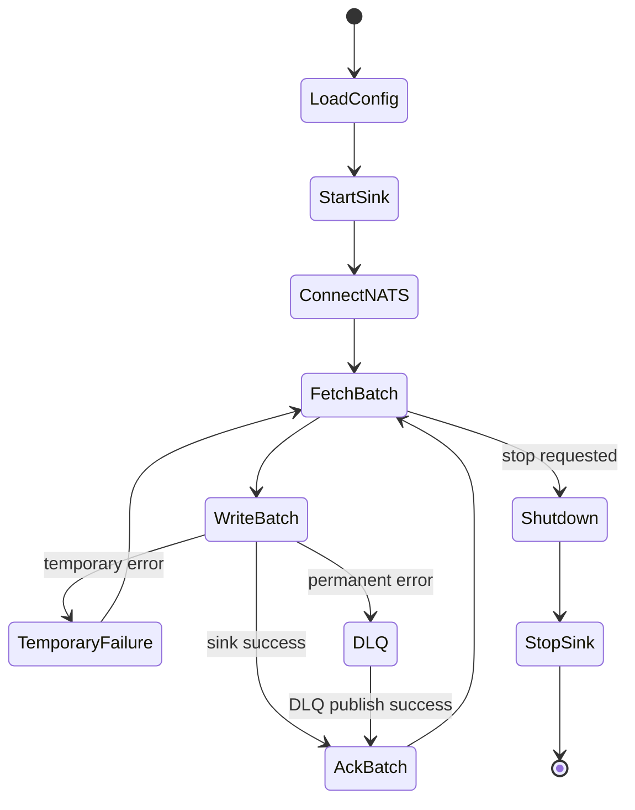

# Operations

This page describes deployment and runtime behavior for operators. It assumes
you want to run `nats-sinks` as a long-lived process that continuously moves
messages from JetStream into a destination system.

Operationally, the most important idea is that the process is allowed to see
duplicate messages. That is part of at-least-once delivery. The unsafe outcome
is not duplication; the unsafe outcome is ACKing a message before the
destination write has committed.

## Deployment Shape

`nats-sinks` can run as:

- a systemd service,
- a container,
- a Kubernetes Deployment,
- a process managed by another Python application.

Typical command:

```bash
nats-sink run /etc/nats-sinks/config.json
```

## Runtime Lifecycle



## Logging

The package uses standard Python logging. Payload logging is disabled by
default because message bodies may contain business data, customer data, or
encrypted payloads. Avoid DEBUG logs in production unless you have reviewed
payload and credential exposure risks.

Use `INFO` for ordinary service operation, `WARNING` when you want only
recoverable problems and risky conditions, and `ERROR` or `CRITICAL` when the
runtime should report only serious failures. Use `DEBUG` for short-lived
diagnostic sessions in controlled environments.

The full logging level reference is documented in
[Configuration](configuration.md#logging).

## Metrics

The first release includes a metrics abstraction. Intended counters include:

- `messages_received_total`
- `messages_written_total`
- `messages_acked_total`
- `messages_nacked_total`
- `messages_failed_total`
- `messages_dlq_total`
- `batches_written_total`
- `batch_write_seconds`
- `sink_write_errors_total`
- `nats_reconnects_total`
- `last_success_timestamp`
- `current_batch_size`

## Graceful Shutdown

The runner should stop fetching new messages before shutdown and let the active
batch reach a durable boundary. If the process exits before ACK, JetStream may
redeliver. Idempotency is required, and production sinks should treat
redelivery as a normal operational event rather than an exceptional condition.

## Reprocessing

Do not claim exactly-once processing. Replays and duplicates are normal. Use idempotent sink modes and stable keys before replaying streams.

## Local File Sink Operations

The file sink is operationally simple, but it still needs capacity planning.
Monitor disk space, inode usage, write latency, and backup or rotation jobs for
the configured output directory. The recommended production configuration uses
`filename_strategy: "stream_sequence"` and `duplicate_policy:
"skip_existing"` so redelivery maps to the same final file and is treated as
safe prior durable success.

Use an absolute directory path in service deployments. Keep generated files out
of git and out of world-writable directories. If host-crash durability matters,
leave `fsync` enabled and size throughput expectations accordingly.

## Docker Compose Examples

The examples directory includes JSON-formatted Compose files:

```bash
docker compose -f examples/docker-compose.nats.json up
docker compose -f examples/docker-compose.oracle.json up
```

## systemd Services

For Oracle Linux and Debian systemd examples, see
[Service Deployment](service-deployment.md).
