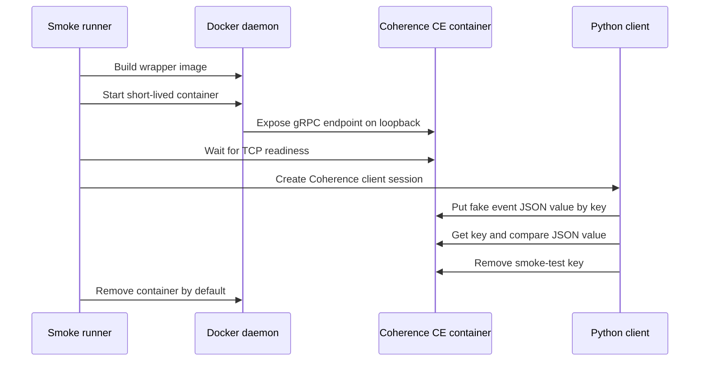

# Oracle Coherence Community Edition Test Backend

The Oracle Coherence Community Edition test backend is a local development and
validation asset for the future first-party Oracle Coherence Community Edition
sink. It gives maintainers a repeatable, short-lived key/value backend for
connector certification and multi-sink routing tests. It is not a production
Coherence deployment and it does not implement the sink itself.

Oracle Coherence Community Edition exposes map-like data structures through
polyglot clients. The official Python client uses gRPC and supports storing
Python objects as JSON. Oracle Coherence Query Language also supports JSON
objects as keys or values when the Coherence JSON module is available. The
local test flow uses that direction of travel: one complete fake nats-sinks
event is stored as the JSON value of one key/value entry, then read back and
compared by the smoke runner.

## What This Provides

The feature adds:

- `examples/oracle-coherence-ce-test/Dockerfile`, a small wrapper around an
  explicit Oracle Coherence Community Edition image;
- `scripts/run-oracle-coherence-container-smoke.py`, a local smoke runner that
  builds the wrapper image, starts a fresh backend, waits for the gRPC endpoint,
  writes and reads one JSON key/value entry, and removes the container by
  default;
- deterministic unit tests that inspect the Dockerfile and smoke runner without
  requiring Docker;
- documentation for how future sink and routing tests should consume the local
  backend.

The selected reference image is:

```text
ghcr.io/oracle/coherence-ce:25.03.1
```

The wrapper exists so the project owns a stable local test artifact and can add
labels, checks, or test-only hardening without changing the upstream image.

## Security Model

The smoke runner is designed for local test safety:

- all data is fake and deterministic;
- container names and host ports are random per run;
- the container publishes the client endpoint only on loopback;
- Docker privileged mode, host networking, and Docker socket mounts are not
  used;
- the container runs with a read-only root filesystem where the upstream image
  allows it;
- writable runtime paths are tmpfs mounts;
- all Linux capabilities are dropped;
- `no-new-privileges` is enabled;
- the container is removed by default.

No production credentials, private endpoints, certificate material, operational
payloads, or live Coherence configuration should be used with this test backend.

## Runtime Sequence



## Python Client Requirement

The Docker backend can start without Python client dependencies, but the smoke
test needs Oracle's Coherence Python client to write and read the JSON value.
Install it in an isolated local virtual environment so its transitive
dependencies do not disturb your workstation's shared Python environment:

```bash
python -m venv .local/coherence-smoke-venv
. .local/coherence-smoke-venv/bin/activate
python -m pip install coherence-client
```

This dependency is intentionally not required by the base `nats-sinks` package.
It is a local test dependency for the Oracle Coherence Community Edition backend
and future sink certification.

## Running Unit Tests

Unit tests inspect the assets and do not require Docker:

```bash
python -m pytest tests/unit/test_oracle_coherence_test_container.py -q
```

Expected output:

```text
12 passed
```

These tests cover:

- explicit Oracle Coherence Community Edition image selection;
- the client-facing gRPC port contract;
- repository-local Dockerfile validation;
- bounded readiness timeouts;
- allow-listed cache names;
- safe subprocess usage with `shell=False`;
- read-only, tmpfs, capability-drop, and no-new-privileges Docker options;
- redacted command failures;
- cleanup-by-default and explicit preserve behavior;
- complete fake event JSON value shape.

## Running The Docker Smoke Test

Run the local smoke test from the repository root:

```bash
python scripts/run-oracle-coherence-container-smoke.py
```

Expected sanitized output:

```text
Oracle Coherence CE container smoke test passed with one verified JSON key/value entry.
```

The script performs these steps:

1. Builds `nats-sinks-oracle-coherence-ce-test:local`.
2. Starts a fresh Oracle Coherence Community Edition container with a random
   name and loopback port.
3. Waits for the local gRPC endpoint.
4. Connects with the Coherence Python client.
5. Stores one complete fake event JSON object as a cache value.
6. Reads the key back and compares the JSON value.
7. Removes the smoke-test key.
8. Removes the container by default.

Use a longer readiness timeout on slow developer workstations:

```bash
python scripts/run-oracle-coherence-container-smoke.py --timeout-seconds 300
```

Keep the container for diagnosis:

```bash
python scripts/run-oracle-coherence-container-smoke.py --preserve-artifacts
```

When `--preserve-artifacts` is used, remove the preserved container after
inspection. The smoke runner prints only sanitized success or failure summaries,
but preserved local runtime artifacts should still be treated as disposable
test material.

## What Remains Out Of Scope

This backend does not:

- implement the Oracle Coherence Community Edition sink;
- change NATS, JetStream, ACK, retry, or DLQ behavior;
- prove production durability for a Coherence cluster;
- configure live Coherence security or persistence;
- certify routing or fan-out by itself.

Those behaviors belong to the future sink implementation and the multi-sink
routing end-to-end test flow. This backend is the local target those features
can use once they are implemented.
