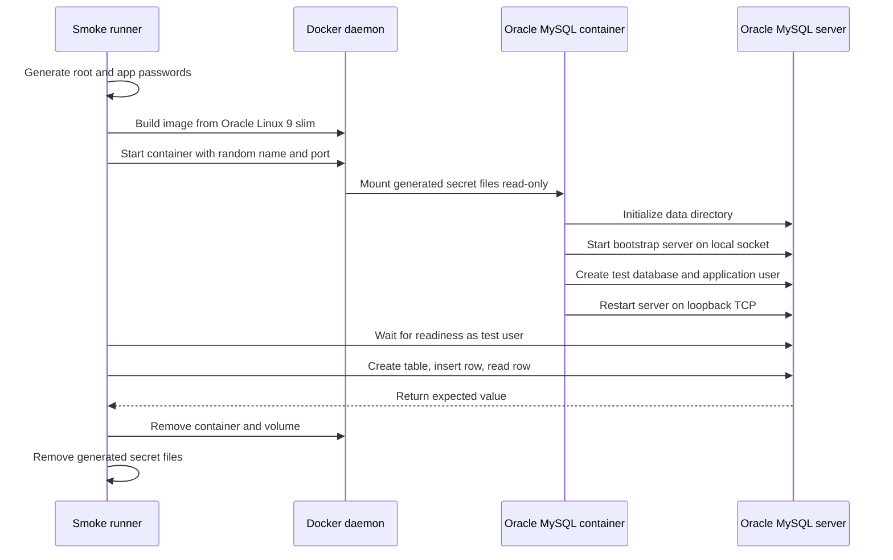

# Oracle MySQL Test Database Container

The Oracle MySQL test database container is a local development and validation
asset for the future Oracle MySQL sink. It gives maintainers a repeatable,
short-lived Oracle MySQL database backend before the sink itself is implemented.
It is not a production database image, and it is not the Oracle MySQL sink.

The image is built from Oracle Linux 9 slim and installs Oracle MySQL Community
Server from Oracle package repositories. As of 2026-05-25, the selected
reference version is Oracle MySQL 9.7.0 LTS, following Oracle's published
availability announcement for Oracle MySQL 9.7.0 LTS:
[Oracle MySQL 9.7.0 LTS is now available](https://blogs.oracle.com/mysql/mysql-9-7-0-lts-is-now-available-expanded-community-capabilities-and-dynamic-data-masking-for-enterprise).

This page explains the local test flow, security posture, generated
credentials, cleanup behavior, and test commands. It is intentionally written
for developers who need a safe Oracle MySQL target for upcoming sink work
without introducing long-lived local credentials or private infrastructure
assumptions.

## What This Provides

The feature adds:

- `examples/oracle-mysql-test/Dockerfile`, a test-only Oracle MySQL database
  image based on `container-registry.oracle.com/os/oraclelinux:9-slim`;
- `examples/oracle-mysql-test/entrypoint.sh`, a bootstrap entrypoint that
  initializes a fresh database directory and creates a local test account from
  generated secret files;
- `scripts/run-oracle-mysql-container-smoke.py`, a local smoke runner that
  builds the image, starts a fresh container, waits for readiness, writes and
  reads one test record, and removes temporary artifacts by default;
- deterministic unit tests that inspect the Dockerfile, entrypoint, and smoke
  runner without requiring Docker.

It does not add `nats_sinks.oracle_mysql`, does not write NATS messages into
Oracle MySQL, and does not change commit-then-acknowledge delivery behavior.


## Why It Exists

The project intends to support an Oracle MySQL sink later. That sink will need
real database behavior for transaction timing, idempotent upserts, schema
validation, TLS configuration, least-privilege accounts, duplicate handling,
and high-rate writes.

Building this test database container first prevents Oracle MySQL sink
development from depending on ad hoc local installations, stale manual setup
steps, hardcoded passwords, or private database endpoints. It also lets the
future sink certification suite start a clean database target for every run.

## Files

| Path | Purpose |
| --- | --- |
| `examples/oracle-mysql-test/Dockerfile` | Builds the Oracle MySQL test database image from Oracle Linux 9 slim. |
| `examples/oracle-mysql-test/entrypoint.sh` | Initializes the data directory, creates the test database and user, and starts Oracle MySQL. |
| `scripts/run-oracle-mysql-container-smoke.py` | Builds, runs, verifies, and cleans up the local Oracle MySQL test container. |
| `tests/unit/test_oracle_mysql_test_container.py` | Validates the container assets without requiring a Docker daemon. |

## Security Model

The smoke runner is designed for local test safety:

- fresh random root and application passwords are generated for every run with
  Python's `secrets` module;
- generated secret files are written under `.local/oracle-mysql-test/`, which
  is ignored by git;
- passwords are passed to the client through `MYSQL_PWD` in the subprocess
  environment rather than as command-line password flags;
- command failure text redacts generated passwords before printing errors;
- container names, Docker volumes, and host ports are random per run;
- the container publishes Oracle MySQL only on a random loopback port;
- the container runs with a read-only root filesystem;
- Docker privileged mode, host networking, and Docker socket mounts are not
  used;
- generated containers, volumes, and secret files are removed by default.

The database container needs a small capability exception during bootstrap.
The smoke runner starts the container with `--cap-drop ALL`, then adds only the
capabilities needed to initialize a fresh data volume and switch Oracle MySQL
from root-managed startup into the `mysql` runtime identity:

| Capability | Reason |
| --- | --- |
| `CHOWN` | Take ownership of the fresh data directory and runtime directory. |
| `DAC_OVERRIDE` | Read and adjust the freshly mounted data volume during bootstrap. |
| `FOWNER` | Apply restrictive permissions to owned runtime paths. |
| `SETGID` | Allow Oracle MySQL to switch to the `mysql` group. |
| `SETUID` | Allow Oracle MySQL to switch to the `mysql` user. |

These capabilities are scoped to the short-lived local test container. They
are not a blanket recommendation for production database containers.

## Runtime Sequence



## Running The Unit Tests

Unit tests inspect the assets and do not require Docker:

```bash
python -m pytest tests/unit/test_oracle_mysql_test_container.py -q
```

Expected output:

```text
10 passed
```

These tests cover:

- Oracle Linux 9 slim as the only base image;
- explicit Oracle MySQL 9.7.0 version declaration;
- Oracle package repository configuration;
- generated password length and character set;
- command-output redaction;
- repository-local path validation;
- bounded readiness timeout validation;
- safe subprocess usage with `shell=False`;
- cleanup-by-default behavior.

## Running The Docker Smoke Test

Run the local smoke test from the repository root:

```bash
python scripts/run-oracle-mysql-container-smoke.py
```

Expected sanitized output:

```text
Oracle MySQL container smoke test passed with one verified test record.
```

The script performs these steps:

1. Builds `nats-sinks-oracle-mysql-test:local`.
2. Generates fresh root and application passwords.
3. Writes local-only secret files under `.local/oracle-mysql-test/`.
4. Starts a fresh Oracle MySQL container with a random name, volume, and
   loopback port.
5. Waits for the test user to connect.
6. Creates `smoke_test`, writes one row, and reads it back.
7. Removes the container, volume, and generated secret files.

Use a longer readiness timeout on slow developer workstations:

```bash
python scripts/run-oracle-mysql-container-smoke.py --timeout-seconds 300
```

Keep local artifacts for diagnosis:

```bash
python scripts/run-oracle-mysql-container-smoke.py --preserve-artifacts
```

When `--preserve-artifacts` is used, remove the preserved container, volume,
and `.local/oracle-mysql-test/` directory after inspection. Preserved secret
files are local-only but still sensitive.

## Collision Avoidance

The smoke runner avoids common local conflicts:

- container names include a random suffix;
- Docker volume names include the same random suffix;
- host ports are allocated from the operating system instead of assuming
  `3306`;
- the database is published only on `127.0.0.1`;
- artifacts are cleaned up by default.

This makes repeated local runs safe even when another Oracle MySQL-compatible
database is already running on the developer machine.

## What The Smoke Test Verifies

The smoke test verifies the container as a database target. It does not verify
future sink behavior.

| Area | Verified Today |
| --- | --- |
| Image build | The image builds from Oracle Linux 9 slim and installs Oracle MySQL packages. |
| Startup | A new Oracle MySQL data directory can be initialized in a fresh container. |
| Credentials | Generated test credentials can authenticate as the test user. |
| DDL | The test account can create a dedicated table in the test database. |
| DML | The test account can insert and read a record. |
| Cleanup | Containers, volumes, and generated secret files are removed by default. |

Future Oracle MySQL sink work must add separate tests for commit-then-ACK,
idempotent writes, transaction rollback, duplicate redelivery, TLS verification,
schema management, throughput, and failure handling.

## Troubleshooting

If Docker is unavailable, the smoke runner fails before building the image.
Run the deterministic unit tests instead, or start Docker and retry.

If the image build cannot reach Oracle package repositories, verify local
network access and any required proxy settings. Do not add private proxy URLs,
tokens, or mirror credentials to the repository or public issue comments.

If the container exits before readiness, rerun with `--preserve-artifacts` and
inspect Docker logs locally:

```bash
docker logs <preserved-container-name>
```

Do not paste raw logs into public issues if they contain host-specific paths,
container IDs, internal registry URLs, or generated credentials. Summarize the
failure category instead.

## Relationship To The Future Oracle MySQL Sink

The future Oracle MySQL sink should use this container as a local integration
target, but it should remain separate code. That sink will need its own module,
configuration schema, sink certification tests, documentation page, examples,
and release evidence.

This container is the database proving ground. The sink will be the JetStream
delivery component.
