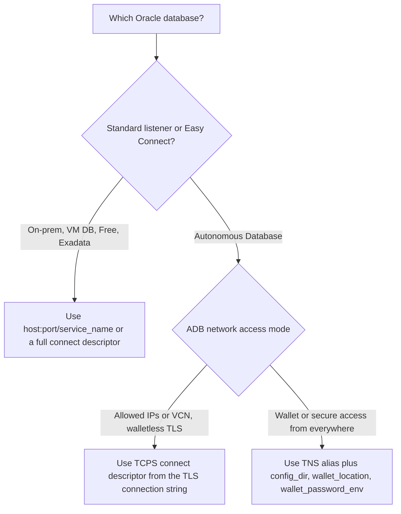
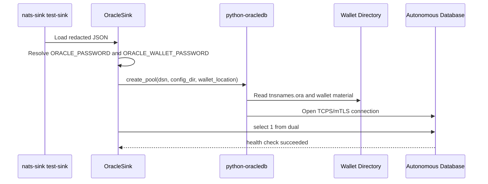
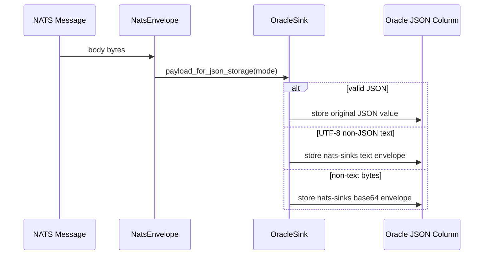
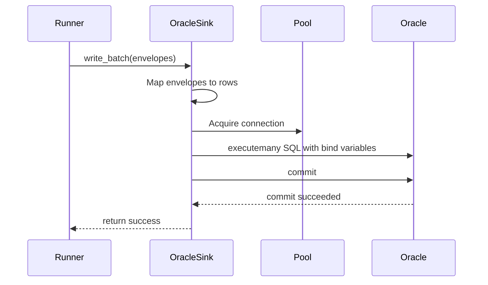
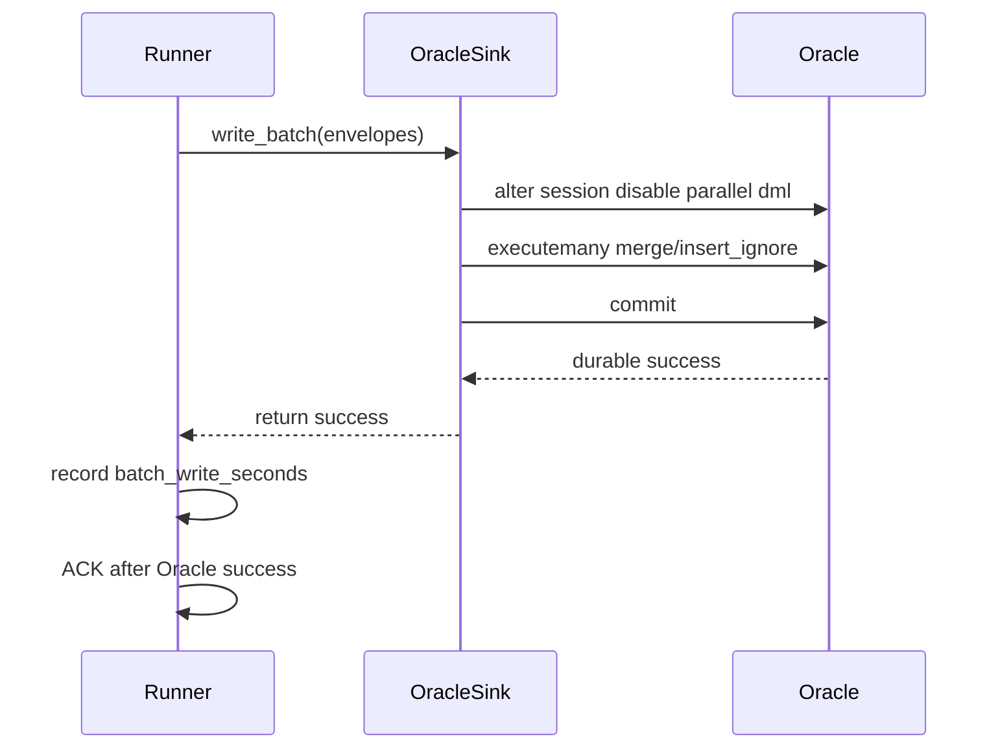
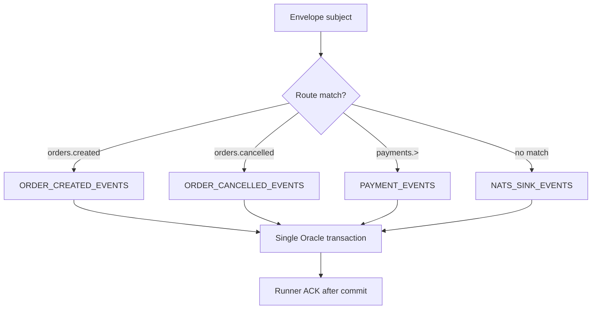
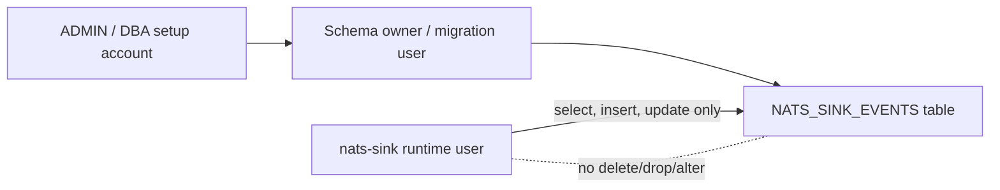

# Oracle Sink

`OracleSink` is the first production sink implementation. It writes batches of `NatsEnvelope` objects to Oracle Database and returns success only after the Oracle transaction has committed.

## Installation

```bash
pip install "nats-sinks[oracle]"
```

The Oracle extra installs `python-oracledb`.

## Python Usage

```python
from nats_sinks.oracle import OracleSink

sink = OracleSink(
    dsn="localhost:1521/FREEPDB1",
    user="app_user",
    password_env="ORACLE_PASSWORD",
    table="NATS_SINK_EVENTS",
    mode="merge",
)
```

## JSON Configuration

```json
{
  "sink": {
    "type": "oracle",
    "dsn": "localhost:1521/FREEPDB1",
    "user": "app_user",
    "password_env": "ORACLE_PASSWORD",
    "table": "NATS_SINK_EVENTS",
    "mode": "merge",
    "auto_create": false,
    "payload_mode": "json_or_envelope",
    "payload_column": "PAYLOAD_JSON",
    "headers_column": "HEADERS_JSON",
    "idempotency": {
      "strategy": "stream_sequence",
      "columns": ["STREAM_NAME", "STREAM_SEQUENCE"]
    }
  }
}
```

## Choosing An Oracle Connection Type

`OracleSink` uses `python-oracledb` connection pooling. The same sink supports
local Oracle Database, on-premises Oracle Database, Oracle Database Free,
Oracle Base Database Service, Exadata, and Oracle Autonomous Database. The main
difference is the shape of the `dsn` and whether Autonomous Database wallet
parameters are required.



### Standard Oracle Database

Use this form for local development, Oracle Database Free, on-premises
databases, or cloud databases that expose a normal Oracle Net listener.

```json
{
  "sink": {
    "type": "oracle",
    "dsn": "localhost:1521/FREEPDB1",
    "user": "app_user",
    "password_env": "ORACLE_PASSWORD",
    "table": "NATS_SINK_EVENTS",
    "mode": "merge"
  }
}
```

The `dsn` can be an Easy Connect string, a TNS alias that your environment can
resolve, or a full Oracle Net connect descriptor. No wallet fields are needed
for this mode.

For test and local development environments, set `auto_create` to `true` when
you want `OracleSink.start()` to create the recommended table if it is missing.
If the table already exists, the sink ignores Oracle `ORA-00955`. Production
deployments should normally keep `auto_create` disabled and manage schema
changes through database migration tooling.

### Autonomous Database With Walletless TLS

Oracle Autonomous Database can accept walletless TLS connections when the
database access control list allows the client host, CIDR range, or VCN. In
that mode, use the TLS connection descriptor from the Autonomous Database
connection dialog and keep the database password in `ORACLE_PASSWORD`.

```json
{
  "sink": {
    "type": "oracle",
    "dsn": "(description=(retry_count=20)(retry_delay=3)(address=(protocol=tcps)(port=1521)(host=adb.example.oraclecloud.com))(connect_data=(service_name=example_low.adb.oraclecloud.com))(security=(ssl_server_dn_match=yes)))",
    "user": "NATS_SINK_TEST",
    "password_env": "ORACLE_PASSWORD",
    "table": "NATS_SINK_EVENTS",
    "mode": "merge",
    "ssl_server_dn_match": true,
    "retry_count": 20,
    "retry_delay": 3
  }
}
```

Walletless TLS is operationally simple because there is no wallet directory to
deploy. It does, however, depend on the Autonomous Database network ACL being
correct. If the client host is not allowed, the Oracle listener will reject the
connection before the sink can run a health check.

### Autonomous Database With Wallet/mTLS

Autonomous Database wallet/mTLS is common for private tests and deployments
where the wallet is the trusted client credential material. Download the wallet
from the Autonomous Database console, unzip it into an ignored local directory,
and pass the wallet directory to the sink.

```bash
mkdir -p .local/oracle-adb/wallet
unzip Wallet_MYDB.zip -d .local/oracle-adb/wallet
export ORACLE_PASSWORD='replace-with-database-user-password'
export ORACLE_WALLET_PASSWORD='replace-with-wallet-password'
```

```json
{
  "sink": {
    "type": "oracle",
    "dsn": "mydb_low",
    "user": "NATS_SINK_TEST",
    "password_env": "ORACLE_PASSWORD",
    "config_dir": ".local/oracle-adb/wallet",
    "wallet_location": ".local/oracle-adb/wallet",
    "wallet_password_env": "ORACLE_WALLET_PASSWORD",
    "table": "NATS_SINK_EVENTS",
    "mode": "merge",
    "ssl_server_dn_match": true,
    "retry_count": 20,
    "retry_delay": 3
  }
}
```

For `python-oracledb` Thin mode, `config_dir` points to the directory
containing `tnsnames.ora`, while `wallet_location` points to the directory
containing the wallet PEM material. For Autonomous Database wallet downloads,
these are usually the same extracted wallet directory. `wallet_password_env`
names the environment variable containing the wallet password created when the
wallet was downloaded; it is separate from the database user password.



Do not commit wallet files. Store them under `.local/`, `/etc/nats-sinks/`, a
Kubernetes secret volume, or another protected runtime-only location.

### Oracle Connection Field Reference

| Field | Applies to | Meaning |
| --- | --- | --- |
| `dsn` | All Oracle databases | Easy Connect string, TNS alias, or full connect descriptor. |
| `user` | All Oracle databases | Database user used by the sink. Prefer a least-privilege user. |
| `password_env` | All Oracle databases | Environment variable containing the database password. |
| `config_dir` | ADB wallet/mTLS, TNS alias deployments | Directory containing `tnsnames.ora`. |
| `wallet_location` | ADB wallet/mTLS | Directory containing wallet PEM material. |
| `wallet_password_env` | ADB wallet/mTLS Thin mode | Environment variable containing the wallet password. |
| `ssl_server_dn_match` | TCPS/TLS/mTLS | Enables server distinguished-name matching. |
| `ssl_server_cert_dn` | TCPS/TLS/mTLS | Optional expected server certificate distinguished name. |
| `disable_parallel_dml` | Oracle and ADB | Defaults to `true`. Runs `alter session disable parallel dml` before sink writes so transactional batch processing works reliably on services such as ADB `high`. |
| `retry_count` / `retry_delay` | TCPS/TLS/mTLS | Oracle Net connection retry tuning. |
| `tcp_connect_timeout` | All remote databases | Connection timeout in seconds. |
| `https_proxy` / `https_proxy_port` | Proxy environments | HTTPS proxy used by Oracle Net TCPS connections. |

See the tracked examples in `examples/oracle-adb/` for walletless TLS and
wallet/mTLS templates.

### ADB Service Names And Parallel DML

Autonomous Database service names such as `*_high`, `*_medium`, `*_low`, `*_tp`,
and `*_tpurgent` have different workload characteristics. The `high` service
can favor parallel execution. That is useful for analytics, but transactional
sink writes need predictable one-transaction behavior across many rows. For
that reason, `OracleSink` disables parallel DML on acquired sessions by default
before executing table writes. This avoids Oracle errors such as `ORA-12838`
when a batch modifies the same table more than once in one transaction.

Keep `disable_parallel_dml` enabled for normal sink workloads. Only disable it
after testing the exact Oracle service, SQL mode, and batch size you plan to
run in production.

## Recommended Table

```sql
create table nats_sink_events (
    stream_name       varchar2(255) not null,
    stream_sequence   number not null,
    subject           clob not null,
    message_id        varchar2(512),
    received_at       timestamp default systimestamp not null,
    message_created_at_epoch_ns number(19),
    jetstream_timestamp_epoch_ns number(19),
    received_at_epoch_ns number(19) not null,
    stored_at_epoch_ns number(19) not null,
    payload_json      json,
    headers_json      json,
    metadata_json     json,
    constraint nats_sink_events_pk
        primary key (stream_name, stream_sequence)
);
```

If native JSON type support is unavailable, use a CLOB with an `IS JSON` check constraint.

The subject column is a CLOB so Oracle storage does not impose a 1024-character
application limit. If your organization enforces shorter subjects, a
`varchar2(256)`, `varchar2(1024)`, or `varchar2(4000)` column is also valid, but
oversized subjects will fail the Oracle write and therefore will not be ACKed.

The epoch columns use Unix epoch nanoseconds:

- `message_created_at_epoch_ns` is derived from `Nats-Time-Stamp` when that
  header is present, otherwise from the JetStream metadata timestamp when
  available.
- `jetstream_timestamp_epoch_ns` stores the timestamp exposed by the NATS client
  JetStream metadata.
- `received_at_epoch_ns` is when nats-sinks normalized the message into a
  `NatsEnvelope`.
- `stored_at_epoch_ns` is when Oracle row mapping prepared the batch for
  destination storage.

`metadata_json` stores the generic nats-sinks metadata snapshot. It includes
all message headers, known `Nats-` reserved headers that are present, JetStream
stream/consumer/sequence values, optional reply subject, and the timing fields.
Missing optional headers such as `Nats-Msg-Id` or `Nats-Expected-Stream` remain
absent/null and do not cause processing failures.

Examples of NATS-reserved headers captured when present include
`Nats-Msg-Id`, `Nats-Expected-Stream`, `Nats-Expected-Last-Msg-Id`,
`Nats-Expected-Last-Sequence`, `Nats-Expected-Last-Subject-Sequence`,
`Nats-Rollup`, `Nats-TTL`, republish/direct-get headers such as `Nats-Stream`,
`Nats-Subject`, `Nats-Sequence`, `Nats-Time-Stamp`, source headers such as
`Nats-Stream-Source`, trace headers, and schedule headers. Newer unknown
`Nats-` headers are preserved under the same metadata document even before
nats-sinks has a named field for them.

Example metadata document:

```json
{
  "metadata_version": 1,
  "subject": "orders.created",
  "reply": null,
  "message_id": "m-1",
  "headers": {
    "Nats-Msg-Id": "m-1",
    "Nats-Expected-Stream": "ORDERS"
  },
  "nats": {
    "reserved_headers": {
      "Nats-Msg-Id": "m-1",
      "Nats-Expected-Stream": "ORDERS"
    },
    "reserved_headers_present": [
      "Nats-Expected-Stream",
      "Nats-Msg-Id"
    ]
  },
  "jetstream": {
    "stream": "ORDERS",
    "consumer": "oracle-orders-sink",
    "domain": null,
    "stream_sequence": 42,
    "consumer_sequence": 7,
    "redelivered": false,
    "pending": 0,
    "timestamp": "2026-05-16T10:16:00+00:00",
    "timestamp_epoch_ns": 1778926560000000000
  },
  "timestamps": {
    "message_created_at_epoch_ns": 1778926560000000000,
    "nats_time_stamp": null,
    "jetstream_timestamp_epoch_ns": 1778926560000000000,
    "received_at": "2026-05-16T10:17:00+00:00",
    "received_at_epoch_ns": 1778926620000000000,
    "stored_at": "2026-05-16T10:18:00+00:00",
    "stored_at_epoch_ns": 1778926680000000000
  }
}
```

## Payload Body Handling

`OracleSink` stores the NATS message body in the configured payload column. The
default column is `PAYLOAD_JSON`, and the recommended table uses Oracle's native
`json` type. The sink does not require every NATS message body to already be
JSON. Instead, it uses the shared nats-sinks payload normalization contract.

Default behavior:

- valid JSON bodies are stored as the original JSON value,
- non-JSON UTF-8 text bodies are wrapped in a JSON envelope,
- non-text byte bodies are wrapped as base64 in a JSON envelope.

This matters for encrypted text. A producer may publish ciphertext such as:

```text
encrypted-text:v1:zqM7lEGsZ6Tc...
```

OracleSink will store it as JSON like this:

```json
{
  "_nats_sinks": {
    "payload_envelope_version": 1,
    "payload_format": "text",
    "payload_encoding": "utf-8",
    "sha256": "hex-encoded-sha256",
    "size_bytes": 31
  },
  "payload": "encrypted-text:v1:zqM7lEGsZ6Tc..."
}
```

When the payload is binary or not valid UTF-8, the envelope uses:

```json
{
  "_nats_sinks": {
    "payload_envelope_version": 1,
    "payload_format": "bytes",
    "payload_encoding": "base64",
    "sha256": "hex-encoded-sha256",
    "size_bytes": 3
  },
  "payload": "/wD+"
}
```



### Payload Modes

Use `payload_mode` to choose the storage behavior:

| Mode | Behavior | Typical use |
| --- | --- | --- |
| `json_or_envelope` | Keep valid JSON as-is, wrap text and bytes when needed. | Mixed streams and general default. |
| `json_only` | Require valid JSON and treat non-JSON as `SerializationError`. | Strict data contracts. |
| `text_envelope` | Wrap every payload as UTF-8 text without attempting JSON parsing. | High-volume encrypted text streams. |
| `bytes_envelope` | Wrap every payload as base64 bytes. | Opaque binary or compressed payloads. |

For high-throughput encrypted text streams, prefer `text_envelope`. It avoids a
failed JSON parse attempt for every ciphertext message and still stores the data
in a consistent JSON shape.

```json
{
  "sink": {
    "type": "oracle",
    "dsn": "example_low",
    "user": "NATS_SINK_RUNTIME",
    "password_env": "ORACLE_PASSWORD",
    "table": "NATS_SINK_EVENTS",
    "mode": "merge",
    "payload_mode": "text_envelope"
  }
}
```

Payload contents may contain sensitive business data or ciphertext. The sink
stores the payload because that is its job, but it does not log the payload by
default. Keep `logging.payload_logging` disabled in production.

## Transaction Sequence



The runner ACKs JetStream messages only after this sequence returns success.

## Oracle Performance

`OracleSink` writes batches with `cursor.executemany(...)` and commits once per
batch. This keeps values bound, uses the Oracle driver efficiently, and
preserves one clear transaction boundary for commit-then-acknowledge.

The sink disables parallel DML by default before writes. This matters on
Autonomous Database services such as `high`, where parallel DML behavior can
raise `ORA-12838` when a transaction modifies the same table repeatedly. Keep
`disable_parallel_dml=true` unless you have tested your exact Oracle service,
SQL mode, and batch size.



For larger Oracle volumes, a future staging-table path may be useful:

1. insert the batch into a temporary or staging table with array DML,
2. run one set-based `merge` from staging into the target table,
3. commit once,
4. ACK after the commit.

That can reduce per-row `merge` overhead while keeping idempotency and
commit-then-acknowledge intact. It should be added as an explicit Oracle write
mode only after benchmarks and integration tests prove the behavior.

## Modes

- `merge`: idempotent upsert using configured key columns.
- `insert_ignore`: idempotent insert that treats existing rows as success.
- `insert`: plain insert. Duplicate key errors are failures.
- `append`: insert with Oracle append hint. This is not idempotent by default.

## Idempotency

Recommended strategy:

- `stream_sequence`: stores `stream_name` and `stream_sequence` as the primary key.

Other supported strategies:

- `message_id`: requires a stable NATS message ID header.
- `payload_field`: extracts a stable key from the normalized JSON payload value.
  For encrypted text or bytes wrapped in the nats-sinks payload envelope,
  prefer `stream_sequence` or `message_id` unless the envelope itself contains
  the exact field you want to use as the key.

## Subject-To-Table Routing

OracleSink can route different subjects to different Oracle tables in the same
batch. The runner still processes one batch and OracleSink commits all routed
table writes in one Oracle transaction before returning success.

```json
{
  "sink": {
    "type": "oracle",
    "dsn": "localhost:1521/FREEPDB1",
    "user": "app_user",
    "password_env": "ORACLE_PASSWORD",
    "table": "NATS_SINK_EVENTS",
    "table_routes": [
      {"subject": "orders.created", "table": "ORDER_CREATED_EVENTS"},
      {"subject": "orders.cancelled", "table": "ORDER_CANCELLED_EVENTS"},
      {"subject": "payments.>", "table": "PAYMENT_EVENTS"}
    ],
    "mode": "merge",
    "idempotency": {
      "strategy": "stream_sequence",
      "columns": ["STREAM_NAME", "STREAM_SEQUENCE"]
    }
  }
}
```

Routing rules:

- routes are evaluated in order,
- the first matching route wins,
- unmatched subjects use the default `table`,
- `*` matches one subject token,
- `>` matches one or more remaining tokens and must be the final token,
- all route table names are validated as Oracle identifiers.



Every routed table must have compatible columns and compatible idempotency
constraints. If one routed table write fails before commit, the whole batch is
not ACKed.

When `auto_create` is enabled for local development, OracleSink attempts to
create the default table and each configured route table. Production
deployments should still manage schema changes explicitly through normal
database migration tooling.

## Security

Oracle identifiers are allow-list validated before SQL construction. Values are passed through bind variables. The sink does not log bind values or payloads by default.

The Oracle user should have least-privilege access to the configured table. DBA privileges are not required. Automatic table creation is disabled by default.

## Least-Privilege Oracle Accounts

Do not run `nats-sink` as `ADMIN`, `SYS`, `SYSTEM`, or another privileged
database account in production. Those accounts are useful for provisioning a
test environment, but the runtime sink user should have only the privileges
needed to write to the configured sink table.

The recommended production pattern is to separate schema ownership from runtime
message writing:



### Option A: Separate Owner And Runtime User

Use this pattern when your organization has migration tooling or a database
change process. The owner can create and alter schema objects. The runtime user
can only connect and write rows. This is the safest production model.

Run the setup as an administrative account or through your normal DBA process:

```sql
-- Create a schema owner for migration-managed objects.
create user nats_sink_owner identified by "replace-with-strong-owner-password";
grant create session to nats_sink_owner;
grant create table to nats_sink_owner;

-- Autonomous Database commonly uses the DATA tablespace. For non-ADB
-- databases, replace DATA with the tablespace assigned by your DBA.
alter user nats_sink_owner quota 500M on data;

-- Create the runtime account used by the nats-sink service.
create user nats_sink_runtime identified by "replace-with-strong-runtime-password";
grant create session to nats_sink_runtime;
```

Connect as `nats_sink_owner` and create the table:

```sql
create table nats_sink_events (
    stream_name       varchar2(255) not null,
    stream_sequence   number not null,
    subject           clob not null,
    message_id        varchar2(512),
    received_at       timestamp default systimestamp not null,
    message_created_at_epoch_ns number(19),
    jetstream_timestamp_epoch_ns number(19),
    received_at_epoch_ns number(19) not null,
    stored_at_epoch_ns number(19) not null,
    payload_json      json,
    headers_json      json,
    metadata_json     json,
    constraint nats_sink_events_pk
        primary key (stream_name, stream_sequence)
);
```

Grant only the privileges required by the chosen write mode:

```sql
-- Required for merge mode and insert_ignore mode.
grant select, insert, update
    on nats_sink_owner.nats_sink_events
    to nats_sink_runtime;

-- If you use insert-only mode and do not run health/read checks against the
-- target table, your DBA may choose insert-only privileges instead.
-- grant insert on nats_sink_owner.nats_sink_events to nats_sink_runtime;
```

Configure the sink to use the fully qualified table name:

```json
{
  "sink": {
    "type": "oracle",
    "dsn": "example_low",
    "user": "NATS_SINK_RUNTIME",
    "password_env": "ORACLE_PASSWORD",
    "table": "NATS_SINK_OWNER.NATS_SINK_EVENTS",
    "mode": "merge",
    "auto_create": false
  }
}
```

The runtime user does not need `drop table`, `delete`, `alter any table`,
`create any table`, DBA roles, or ownership of the table. Do not grant those
permissions to the service account.

### Option B: Single Application User For Controlled Test Environments

For integration tests, isolated development databases, or short-lived test
schemas, a single application user may own the table and run the sink. This is
less strict than the owner/runtime split, but it is still safer than using
`ADMIN`.

Provision the account:

```sql
create user nats_sink_test identified by "replace-with-strong-test-password";
grant create session to nats_sink_test;
grant create table to nats_sink_test;
alter user nats_sink_test quota 100M on data;
```

If you set `"auto_create": true`, `OracleSink.start()` can create the
configured table when it is missing. After the table exists, revoke table
creation from the test runtime user if the service no longer needs to create
objects:

```sql
revoke create table from nats_sink_test;
```

Do not grant delete or drop privileges for normal sink operation. `OracleSink`
does not need to delete rows or remove tables, and production deployments
should keep `"auto_create": false` so schema changes are explicit, reviewed,
and auditable.

### Privilege Matrix

| Privilege | Owner / migration user | Runtime user |
| --- | --- | --- |
| `create session` | yes | yes |
| `create table` | yes, during migrations | no, except isolated test auto-create |
| table `insert` | optional | yes |
| table `update` | optional | yes for `merge` |
| table `select` | optional | recommended for `merge`, checks, and diagnostics |
| table `delete` | no for sink runtime | no |
| `drop table` / `alter any table` / DBA roles | no for sink runtime | no |
