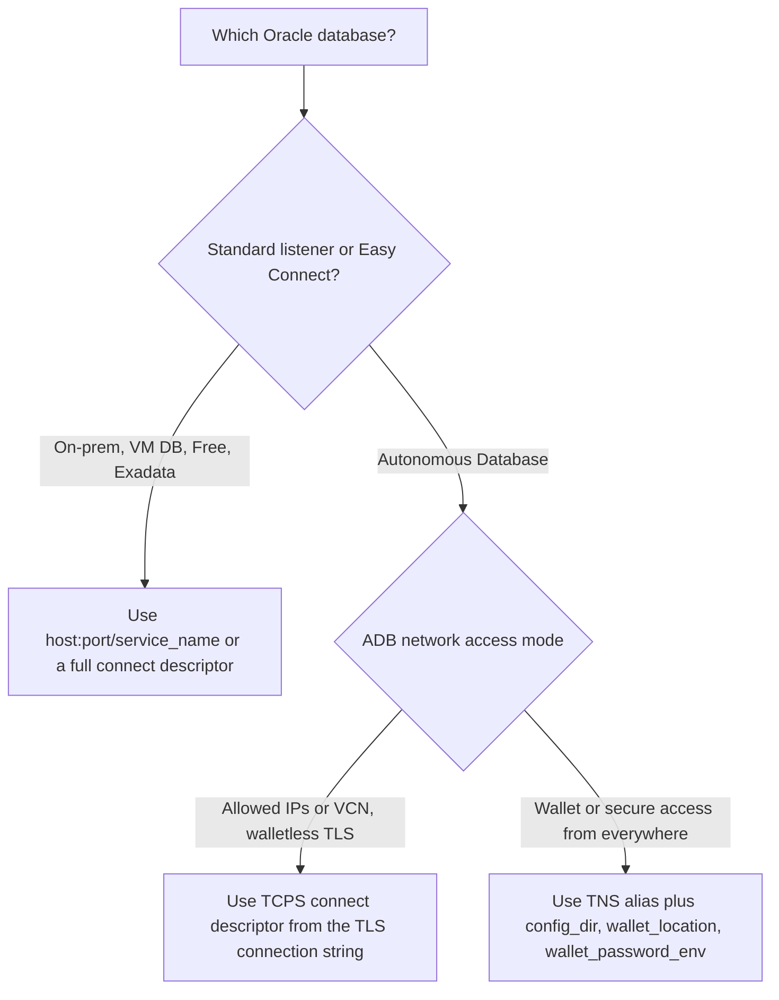
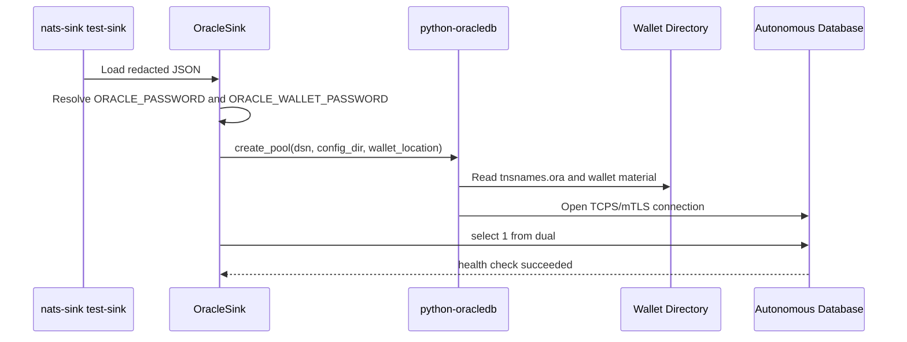
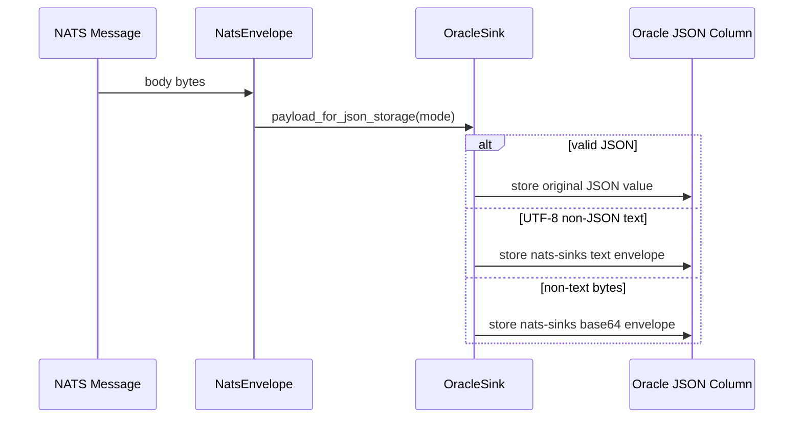
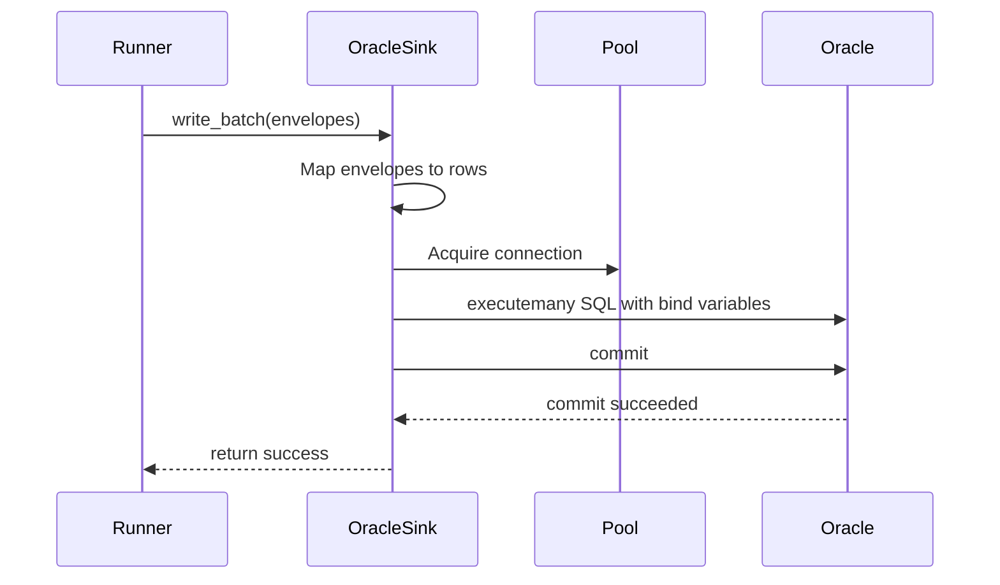
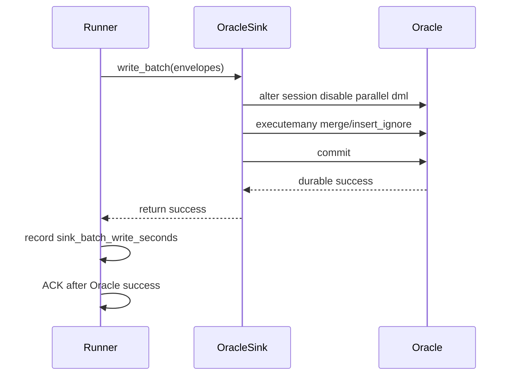
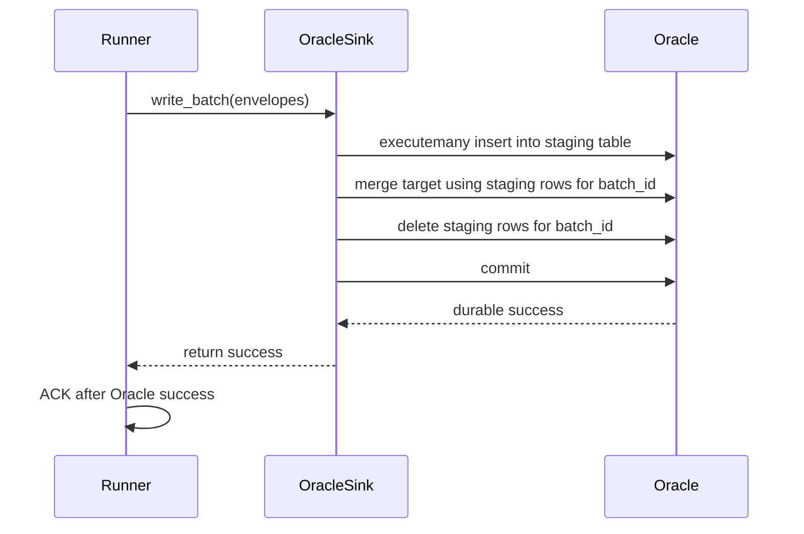
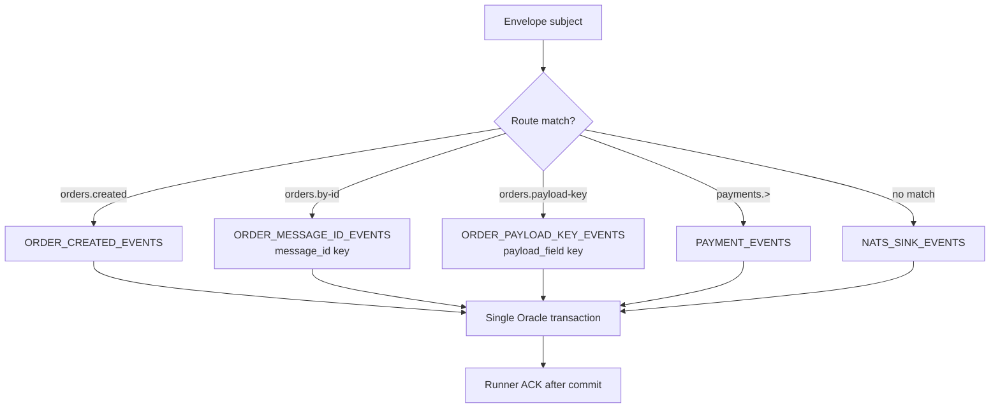
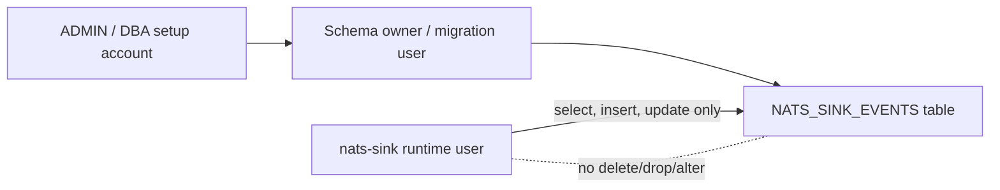

# Oracle Sink

`OracleSink` is the first production sink implementation. It writes batches of `NatsEnvelope` objects to Oracle Database and returns success only after the Oracle transaction has committed.

Oracle is a common system of record in enterprise, public-sector, and defence
environments. This sink is therefore written around explicit transactions,
least-privilege runtime accounts, idempotent writes, and metadata columns that
help operators retain operational context such as priority, classification,
labels, timestamps, subjects, and JetStream sequence numbers.

## Certification Status

`OracleSink` is part of the first-party production sink surface and is covered
by the shared [Sink Certification](sink-certification.md) process. Its
certification evidence includes:

- reusable helper coverage with a fake Oracle connection pool proving
  `write_batch(...)` returns only after `commit()`,
- rollback and commit-failure tests,
- duplicate-safe `merge` and `insert_ignore` behavior tests,
- SQL identifier allow-list validation and bind-variable SQL generation tests,
- JSON, non-JSON text, bytes, empty payload, and encrypted payload envelope
  mapping tests,
- priority, classification, labels, mission metadata, and custody metadata
  mapping tests,
- live Oracle integration and NATS-to-Oracle e2e scripts behind explicit
  environment flags and ignored local configuration files.

The certification evidence does not claim exactly-once delivery. Oracle
certification means the sink follows the nats-sinks at-least-once,
commit-then-acknowledge contract and provides documented idempotent production
write modes.

## Installation

```bash
pip install "nats-sinks[oracle]"
```

The Oracle extra installs `python-oracledb`.

## Python Usage

```python
from nats_sinks.oracle import OracleSink

sink = OracleSink(
    dsn="localhost:1521/FREEPDB1",
    user="app_user",
    password_env="ORACLE_PASSWORD",
    table="NATS_SINK_EVENTS",
    mode="merge",
)
```

## JSON Configuration

```json
{
  "sink": {
    "type": "oracle",
    "dsn": "localhost:1521/FREEPDB1",
    "user": "app_user",
    "password_env": "ORACLE_PASSWORD",
    "table": "NATS_SINK_EVENTS",
    "mode": "merge",
    "auto_create": false,
    "payload_mode": "json_or_envelope",
    "payload_column": "PAYLOAD_JSON",
    "headers_column": "HEADERS_JSON",
    "idempotency": {
      "strategy": "stream_sequence",
      "columns": ["STREAM_NAME", "STREAM_SEQUENCE"]
    }
  }
}
```

## Complete Oracle Sink Configuration Reference

This section lists every Oracle sink field accepted under the top-level
`sink` object. Generic runtime sections such as `nats`, `delivery`,
`dead_letter`, `logging`, and `metrics` are documented in
[Configuration](configuration.md).

| Field | Required | Default | Valid values | Description |
| --- | --- | --- | --- | --- |
| `type` | yes | none | `oracle` | Selects the Oracle Database sink. |
| `dsn` | yes | none | Easy Connect string, TNS alias, or full Oracle Net connect descriptor. | Database connect string passed to `python-oracledb`. Autonomous Database may use a wallet TNS alias or a TCPS descriptor. |
| `user` | yes | none | Oracle username. | Database user used by the sink. Production deployments should use a least-privilege runtime account. |
| `password` | required unless `password_env` is set | `null` | Password string. | Direct database password. Use only for disposable local tests; prefer `password_env` in real deployments. |
| `password_env` | required unless `password` is set | `null` | Environment variable name. | Environment variable containing the database password. Recommended for production and CI. |
| `config_dir` | no | `null` | Directory path. | Directory containing Oracle Net files such as `tnsnames.ora`, commonly used with Autonomous Database wallets. |
| `wallet_location` | no | `null` | Directory path. | Directory containing Autonomous Database wallet material. Required when `wallet_password` or `wallet_password_env` is set. |
| `wallet_password` | no | `null` | Wallet password string. | Direct wallet password. Prefer `wallet_password_env` outside disposable tests. |
| `wallet_password_env` | no | `null` | Environment variable name. | Environment variable containing the wallet password. Requires `wallet_location`. |
| `ssl_server_dn_match` | no | `null` | `true`, `false`, or omitted. | Controls Oracle TCPS server distinguished-name matching. Keep enabled when required by your database connection profile. |
| `ssl_server_cert_dn` | no | `null` | Distinguished-name string. | Optional expected Oracle server certificate distinguished name. |
| `disable_parallel_dml` | no | `true` | `true` or `false`. | Runs `alter session disable parallel dml` before writes. Keep true for normal sink workloads, especially Autonomous Database `high` service tests. |
| `tcp_connect_timeout` | no | `null` | Number greater than `0`. | Oracle Net TCP connect timeout in seconds. |
| `retry_count` | no | `null` | Integer greater than or equal to `0`. | Oracle Net connection retry count for transient connection establishment failures. |
| `retry_delay` | no | `null` | Integer greater than or equal to `0`. | Oracle Net delay between connection retry attempts, in seconds. |
| `https_proxy` | no | `null` | Proxy hostname or URL understood by Oracle Net. | HTTPS proxy used by TCPS connections in proxy-controlled networks. |
| `https_proxy_port` | no | `null` | Integer `1` to `65535`. | Proxy port. Requires `https_proxy`. |
| `table` | no | `NATS_SINK_EVENTS` | Valid Oracle identifier, optionally schema-qualified. | Default target table for messages that do not match a table route. |
| `table_routes` | no | empty list | List of route objects. | Optional subject-to-table routing rules. Each object contains `subject`, `table`, and optional route policy overrides. See [Table Route Objects](#table-route-objects). |
| `mode` | no | `merge` | `merge`, `insert_ignore`, `insert`, `append` | Oracle write mode. See [Write Mode Values](#write-mode-values). |
| `merge_update_columns` | no | `null` | `null`, an empty list, or a list of mapped Oracle column names. | Controls which non-key columns are updated when `mode` is `merge`. `null` preserves the default of updating every non-key column. An empty list leaves matched rows unchanged. |
| `auto_create` | no | `false` | `true` or `false`. | Creates the recommended table shape at sink startup when missing. Use for local tests; production should normally use migrations and keep this false. |
| `payload_mode` | no | `json_or_envelope` | `json_or_envelope`, `json_only`, `text_envelope`, `bytes_envelope` | Controls how message bytes become JSON storage content. See [Payload Modes](#payload-modes). |
| `payload_column` | no | `null` | Valid Oracle column identifier. | Legacy convenience alias for `columns.payload`. If set, it updates the payload column mapping. |
| `headers_column` | no | `null` | Valid Oracle column identifier. | Legacy convenience alias for `columns.headers`. If set, it updates the headers column mapping. |
| `columns` | no | default column mapping object | Object documented in [Column Mapping](#column-mapping). | Maps framework fields to Oracle column names. |
| `idempotency` | no | stream sequence defaults | Object documented in [Idempotency Configuration](#idempotency-configuration). | Defines the key columns used by idempotent write modes. |
| `staging` | no | disabled | Object documented in [High-Throughput Staging Mode](#high-throughput-staging-mode). | Optional advanced write path that array-loads rows into a staging table and then performs one set-based merge into the target table. |
| `pool_min` | no | `1` | Integer greater than or equal to `1`. | Minimum number of connections in the Oracle connection pool. |
| `pool_max` | no | `4` | Integer greater than or equal to `1`. | Maximum number of connections in the Oracle connection pool. Must be sized for the deployment and database service limits. |
| `pool_increment` | no | `1` | Integer greater than or equal to `1`. | Number of connections added when the pool grows. |

Validation rules:

- configure either `password` or `password_env`,
- configure either `wallet_password` or `wallet_password_env`, not both,
- wallet password fields require `wallet_location`,
- `https_proxy_port` requires `https_proxy`,
- `merge_update_columns` applies only when `mode` is `merge`,
- `merge_update_columns` must reference configured non-key Oracle columns,
- `staging.enabled=true` requires `mode` to be `merge` or `insert_ignore`,
- `staging.enabled=true` requires `staging.table`,
- Oracle table and column identifiers are allow-list validated before SQL is
  generated,
- values are always bound with Oracle bind variables, not concatenated into SQL.

### Write Mode Values

| Value | Idempotent by default | Behavior | Production guidance |
| --- | --- | --- | --- |
| `merge` | yes, when key columns are stable | Uses Oracle `merge` semantics to insert or update the target row by the configured idempotency columns. | Recommended for most production use. |
| `insert_ignore` | yes, when a matching unique or primary key exists | Inserts rows and treats duplicate-key conflicts as prior success. | Recommended when rows are immutable after first write. |
| `insert` | no | Performs a plain insert. Duplicate-key conflicts are failures. | Useful for strict diagnostics or controlled streams where duplicates should fail. |
| `append` | no | Performs insert with Oracle append behavior. | Not idempotent by default. Use only when duplicate delivery is acceptable or external controls prevent duplicates. |

`merge` and `insert_ignore` are the recommended production modes because
nats-sinks provides at-least-once delivery. They let the sink prefer safe
duplication over silent loss.

For mission or audit workloads, `merge` is usually the clearest default because
it lets redelivery land on the same operational event row instead of producing
an extra record. Use `append` only when duplicate rows are acceptable under the
destination's audit and reconciliation rules.

### Merge Update Controls

By default, `merge` preserves the original `nats-sinks` behavior: when the
configured idempotency key already exists, Oracle updates every non-key column
with the newest normalized message content. This is useful when operators want
redelivery to refresh metadata, custody details, headers, or payload envelopes
on the existing durable row.

Some mission, audit, and evidentiary workloads prefer stricter record
immutability. For those cases, set `merge_update_columns` explicitly:

```json
{
  "sink": {
    "type": "oracle",
    "dsn": "localhost:1521/FREEPDB1",
    "user": "app_user",
    "password_env": "ORACLE_PASSWORD",
    "table": "NATS_SINK_EVENTS",
    "mode": "merge",
    "merge_update_columns": ["PAYLOAD_JSON", "METADATA_JSON"]
  }
}
```

This example updates only the payload and metadata JSON columns when a row
already exists. Every listed value must be a configured Oracle column name and
must not be part of the idempotency key. nats-sinks validates these identifiers
before SQL is generated.

To make `merge` insert missing rows and leave existing rows unchanged, use an
empty list:

```json
{
  "sink": {
    "type": "oracle",
    "dsn": "localhost:1521/FREEPDB1",
    "user": "app_user",
    "password_env": "ORACLE_PASSWORD",
    "table": "NATS_SINK_EVENTS",
    "mode": "merge",
    "merge_update_columns": []
  }
}
```

With an empty update list, a redelivered message that matches the idempotency
key is treated as safe prior processing. The Oracle transaction must still
commit before the sink returns success, and the core still ACKs only after
that success. This setting is useful when the first stored event row is the
authoritative record and later redeliveries should not alter it.

### Duplicate And Conflict Metrics

Oracle idempotency should be visible to operators. A redelivery that is safely
absorbed by Oracle is a healthy at-least-once behavior; a duplicate-key conflict
in a strict write mode may indicate a publisher, configuration, or schema issue
that needs investigation.

`OracleSink` therefore emits low-cardinality Oracle counters through the same
metrics recorder used by the core runner:

| Metric suffix | Meaning |
| --- | --- |
| `oracle_conflicts_total` | Oracle write conflicts observed by the sink, such as `ORA-00001` duplicate-key conflicts. |
| `oracle_duplicates_total` | Rows identified as duplicate prior processing through idempotent Oracle handling. |
| `oracle_duplicate_ignored_total` | Duplicate rows safely ignored by `insert_ignore` mode. |
| `oracle_duplicate_noop_total` | Duplicate rows safely left unchanged by `merge` with `merge_update_columns: []`. |
| `oracle_merge_rows_total` | Rows committed through Oracle `merge` mode. |
| `oracle_merge_outcome_unknown_total` | `merge` rows where Oracle did not reliably expose whether the row was inserted or matched. |

When the sink is created by `nats-sink run` and `metrics.snapshot_file` is
enabled, these counters are written to the same local JSON snapshot as the core
delivery counters:

```json
{
  "metrics": {
    "enabled": true,
    "namespace": "nats_sinks",
    "snapshot_file": ".local/nats-sinks/metrics.json",
    "event_freshness_enabled": true,
    "event_stale_after_seconds": 300,
    "event_future_skew_tolerance_seconds": 5
  },
  "sink": {
    "type": "oracle",
    "dsn": "localhost:1521/FREEPDB1",
    "user": "app_user",
    "password_env": "ORACLE_PASSWORD",
    "table": "NATS_SINK_EVENTS",
    "mode": "insert_ignore"
  }
}
```

Inspect Oracle duplicate/conflict counters:

```bash
nats-sink-metrics show .local/nats-sinks/metrics.json --metric "oracle_*"
```

Example output:

```text
KIND     METRIC                           VALUE  DESCRIPTION
counter  oracle_conflicts_total               1  Oracle write conflicts observed by OracleSink, such as duplicate-key conflicts.
counter  oracle_duplicate_ignored_total       7  Oracle duplicate rows safely ignored by insert_ignore mode.
counter  oracle_duplicate_noop_total          3  Oracle duplicate rows safely left unchanged by merge mode with no update columns.
counter  oracle_duplicates_total             10  Oracle rows identified as duplicate prior processing through idempotent handling.
counter  oracle_merge_outcome_unknown_total  64  Oracle merge rows where insert-versus-match outcome is not reliably exposed.
counter  oracle_merge_rows_total             64  Oracle rows committed through merge mode.
```

For `insert_ignore`, nats-sinks counts ignored duplicates when Oracle reports
that fewer rows were affected than attempted, or when `ORA-00001` is observed
and treated as safe prior processing. For `merge` with
`merge_update_columns: []`, nats-sinks can count matched rows as no-op
duplicates when Oracle reports fewer affected rows than attempted. For
update-enabled `merge`, Oracle does not reliably expose per-row "inserted
versus matched" counts through the current batch execution path, so the sink
increments `oracle_merge_outcome_unknown_total` instead of guessing. For
`insert`, `ORA-00001` increments `oracle_conflicts_total` and remains a
failure.

These metrics do not include table names, subjects, message IDs,
classification values, labels, payloads, or Oracle constraint names. They must
not be used as part of idempotency decisions and they never change ACK
ordering.

### Idempotency Configuration

```json
{
  "idempotency": {
    "strategy": "stream_sequence",
    "columns": ["STREAM_NAME", "STREAM_SEQUENCE"]
  }
}
```

| Field | Required | Default | Valid values | Description |
| --- | --- | --- | --- | --- |
| `strategy` | no | `stream_sequence` | `stream_sequence`, `message_id`, `payload_field` | Selects where the idempotency key comes from. |
| `columns` | no | `["STREAM_NAME", "STREAM_SEQUENCE"]` | List of valid Oracle column identifiers. | Columns used in generated idempotency predicates and constraints. |
| `payload_field` | required when strategy is `payload_field` | `null` | Dotted JSON field path with no empty segments or control characters. | Scalar field extracted from the normalized JSON payload when using `payload_field`. |

Strategy details:

| Strategy | Required message data | Default columns | Guidance |
| --- | --- | --- | --- |
| `stream_sequence` | JetStream stream name and stream sequence. | `STREAM_NAME`, `STREAM_SEQUENCE` | Recommended for JetStream-backed sinks because the key is stable and unique inside a stream. |
| `message_id` | `Nats-Msg-Id` or equivalent message ID metadata. | `MESSAGE_ID` when columns are not explicitly set. | Use only when publishers reliably set unique message IDs. Missing message IDs become permanent failures. |
| `payload_field` | A stable scalar field in the normalized JSON payload. | `MESSAGE_ID` when columns are not explicitly set. | Use for application-defined keys only when the payload contract is strict and documented. Objects and arrays are rejected as ambiguous keys. |

For encrypted text or opaque bytes, prefer `stream_sequence` or `message_id`.
The payload may not contain a meaningful JSON field until after decryption.

The `payload_field` strategy is intentionally strict. A path such as
`order.id` is valid, but empty path segments, control characters, missing
fields, null values, objects, and arrays are rejected before Oracle commit.
That keeps the idempotency key stable and prevents language-specific string
representations from becoming durable database keys.

Routes inherit this sink-level idempotency configuration by default. A route
may override it when a specific subject family or table has its own durable
key, for example when one table uses JetStream stream sequence and another
uses producer-supplied message IDs. If multiple routes point to the same table,
their effective idempotency and merge-update policies must match.

### Column Mapping

The `columns` object lets operators map nats-sinks fields to an existing Oracle
table shape. Every value must be a valid Oracle column identifier.

In environments with formal data models or classification handling rules, use
column mapping to align nats-sinks metadata with approved table standards
rather than dropping operational context. The recommended default keeps the
payload, headers, metadata, timing, priority, classification, and labels
separate so downstream controls can reason about each class of data.

| Field | Default column | Stored value |
| --- | --- | --- |
| `stream_name` | `STREAM_NAME` | JetStream stream name. |
| `stream_sequence` | `STREAM_SEQUENCE` | JetStream stream sequence. |
| `subject` | `SUBJECT` | Full NATS subject. The recommended schema uses `CLOB` so long subjects do not hit a 1024-character application limit. |
| `message_id` | `MESSAGE_ID` | NATS message ID when present. Missing message IDs are stored as `null`. |
| `priority` | `PRIORITY` | Core-normalized message priority. Header/default resolution is configured by the top-level `message_metadata.priority` section. Missing values are stored as SQL `NULL`. |
| `classification` | `CLASSIFICATION` | Core-normalized message classification. Header/default resolution is configured by the top-level `message_metadata.classification` section. Missing values are stored as SQL `NULL`. |
| `labels` | `LABELS` | Core-normalized labels rendered as semicolon-separated text, for example `billing;urgent`. Header/default resolution is configured by the top-level `message_metadata.labels` section. Missing labels are stored as SQL `NULL`. |
| `message_created_at_epoch_ns` | `MESSAGE_CREATED_AT_EPOCH_NS` | Producer-created time from `Nats-Time-Stamp` when present, otherwise JetStream timestamp when available. |
| `jetstream_timestamp_epoch_ns` | `JETSTREAM_TIMESTAMP_EPOCH_NS` | JetStream server timestamp from message metadata. |
| `received_at_epoch_ns` | `RECEIVED_AT_EPOCH_NS` | Time when nats-sinks normalized the raw NATS message. |
| `stored_at_epoch_ns` | `STORED_AT_EPOCH_NS` | Time when Oracle row mapping prepared the row for storage. |
| `payload` | `PAYLOAD_JSON` | Normalized payload JSON value. |
| `headers` | `HEADERS_JSON` | Message headers as JSON. |
| `metadata` | `METADATA_JSON` | Full generic metadata snapshot, including payload-presence state for headers-only delivery. |
| `mission_metadata` | `MISSION_METADATA_JSON` | Optional validated mission metadata JSON object resolved by the core runtime. Missing mission metadata is stored as JSON `null`. |
| `security_labels` | `SECURITY_LABELS_JSON` | Optional validated data-centric security label profile resolved by the core runtime. Missing security labels are stored as JSON `null`. |

Example:

```json
{
  "sink": {
    "type": "oracle",
    "dsn": "example_low",
    "user": "NATS_SINK_RUNTIME",
    "password_env": "ORACLE_PASSWORD",
    "table": "EVENT_INBOX",
    "columns": {
      "stream_name": "SOURCE_STREAM",
      "stream_sequence": "SOURCE_SEQUENCE",
      "subject": "NATS_SUBJECT",
      "payload": "EVENT_PAYLOAD",
      "metadata": "EVENT_METADATA"
    }
  }
}
```

### Table Route Objects

Each `table_routes` item has this shape:

| Field | Required | Valid values | Description |
| --- | --- | --- | --- |
| `subject` | yes | NATS subject pattern using literal tokens, `*`, or final `>`. | Route pattern tested against the message subject. |
| `table` | yes | Valid Oracle table identifier. | Destination table for matching messages. |
| `idempotency` | no | Same object shape as [Idempotency Configuration](#idempotency-configuration). | Route-specific idempotency strategy and columns. Omit this field to inherit the sink default. |
| `merge_update_columns` | no | `null`, an empty list, or a list of mapped Oracle column names. | Route-specific matched-row update policy for `merge` mode. Omit this field to inherit the sink default. |

Routes are evaluated in order, and the first matching route wins.

Oracle `table_routes` are sink-local subject-to-table routing. They are
separate from the generic top-level `routing` policy. The generic policy can
select logical targets such as `oracle_secret` or `oracle_unclass` from
subject, priority, classification, labels, and approved header hints. When the
active sink is `fanout`, those targets bind to named Oracle sink instances in
the top-level `sinks` registry or compact inline `sink.sinks` form. Each child
Oracle sink still owns its own connection, table, idempotency, staging, and
column settings.

Per-route overrides are intentionally conservative:

- omitted route fields inherit the sink-level default,
- route-specific `idempotency.columns` are used for that table's generated
  `merge` or `insert_ignore` predicate,
- route-specific `payload_field` extraction is applied before Oracle row
  mapping for matching messages,
- `merge_update_columns` applies only when the sink-level `mode` is `merge`,
- if several routes target the same table, nats-sinks rejects conflicting
  effective policies at startup.

## Read-Only Lineage Queries

The Oracle sink stores enough metadata for read-only lineage inspection after
events have been persisted. The `nats-sink query-lineage` command can query a
configured Oracle event table by exact values in a small allow list:

- `correlation_id`
- `causation_id`
- `mission_id`
- `tasking_id`
- `track_id`
- `message_id`
- `subject`

Mission-oriented fields are read from `MISSION_METADATA_JSON` with Oracle
`json_value`. Message ID and subject are read from the configured Oracle
columns. Values are passed as bind variables, result limits are bounded, and
payload output is omitted by default.

```bash
nats-sink query-lineage /etc/nats-sinks/oracle.json \
  --field mission_id \
  --value MISSION-ALPHA \
  --limit 25
```

When `table_routes` are configured, `--table` may name only the default
`sink.table` or one of the configured route tables. This keeps the helper from
becoming an arbitrary database query tool:

```bash
nats-sink query-lineage /etc/nats-sinks/oracle.json \
  --table NATS_EVENTS_SECRET \
  --field track_id \
  --value TRACK-9001 \
  --limit 20
```

See [Lineage Query Helpers](lineage-query-helpers.md) for the full design,
security controls, dry-run examples, and script-friendly JSON output shape.

## Choosing An Oracle Connection Type

`OracleSink` uses `python-oracledb` connection pooling. The same sink supports
local Oracle Database, on-premises Oracle Database, Oracle Database Free,
Oracle Base Database Service, Exadata, and Oracle Autonomous Database. The main
difference is the shape of the `dsn` and whether Autonomous Database wallet
parameters are required.



### Standard Oracle Database

Use this form for local development, Oracle Database Free, on-premises
databases, or cloud databases that expose a normal Oracle Net listener.

```json
{
  "sink": {
    "type": "oracle",
    "dsn": "localhost:1521/FREEPDB1",
    "user": "app_user",
    "password_env": "ORACLE_PASSWORD",
    "table": "NATS_SINK_EVENTS",
    "mode": "merge"
  }
}
```

The `dsn` can be an Easy Connect string, a TNS alias that your environment can
resolve, or a full Oracle Net connect descriptor. No wallet fields are needed
for this mode.

For test and local development environments, set `auto_create` to `true` when
you want `OracleSink.start()` to create the recommended table if it is missing.
If the table already exists, the sink ignores Oracle `ORA-00955`. Production
deployments should normally keep `auto_create` disabled and manage schema
changes through database migration tooling.

The repeatable live e2e tests are stricter than normal sink startup. They check
that the retained test table has every column required by the current test
contract before publishing messages. If an old retained table is missing
columns such as `PRIORITY`, `CLASSIFICATION`, `LABELS`, timestamp fields, or
`METADATA_JSON` and `MISSION_METADATA_JSON`, the test fails fast and leaves the
table untouched. Use a fresh test table, an explicit test-only drop-before flag,
or a normal migration
instead of silently writing current test data into an older shape.

The failure message is intentionally written for operators. A stale or
incorrectly constructed retained e2e table produces a message like:

```text
Oracle e2e table 'NATS_SINKS_E2E_EVENTS_V2' is missing required columns
['CLASSIFICATION', 'LABELS', 'MISSION_METADATA_JSON', 'PRIORITY'].
The retained table is likely stale or incorrectly constructed for the current
nats-sinks Oracle schema contract.
Use NATS_SINKS_E2E_DROP_TABLE_BEFORE=true or choose a fresh
NATS_SINKS_E2E_ORACLE_TABLE.
```

Normal runtime writes also translate common Oracle schema and privilege errors
into framework errors that appear in the runner logs. For example,
`ORA-00904` is reported as an invalid Oracle identifier with a hint that the
configured table may be missing columns expected by nats-sinks or that the
configured column mapping may not match the table shape. `ORA-00942` is
reported as a missing or inaccessible table/view with guidance to check the
schema owner, grants, migrations, and `auto_create` setting. The logs do not
print SQL bind values, payloads, passwords, wallet passwords, or connection
secrets.

### Autonomous Database With Walletless TLS

Oracle Autonomous Database can accept walletless TLS connections when the
database access control list allows the client host, CIDR range, or VCN. In
that mode, use the TLS connection descriptor from the Autonomous Database
connection dialog and keep the database password in `ORACLE_PASSWORD`.

```json
{
  "sink": {
    "type": "oracle",
    "dsn": "(description=(retry_count=20)(retry_delay=3)(address=(protocol=tcps)(port=1521)(host=adb.example.oraclecloud.com))(connect_data=(service_name=example_low.adb.oraclecloud.com))(security=(ssl_server_dn_match=yes)))",
    "user": "NATS_SINK_TEST",
    "password_env": "ORACLE_PASSWORD",
    "table": "NATS_SINK_EVENTS",
    "mode": "merge",
    "ssl_server_dn_match": true,
    "retry_count": 20,
    "retry_delay": 3
  }
}
```

Walletless TLS is operationally simple because there is no wallet directory to
deploy. It does, however, depend on the Autonomous Database network ACL being
correct. If the client host is not allowed, the Oracle listener will reject the
connection before the sink can run a health check.

### Autonomous Database With Wallet/mTLS

Autonomous Database wallet/mTLS is common for private tests and deployments
where the wallet is the trusted client credential material. Download the wallet
from the Autonomous Database console, unzip it into an ignored local directory,
and pass the wallet directory to the sink.

```bash
mkdir -p .local/oracle-adb/wallet
unzip Wallet_MYDB.zip -d .local/oracle-adb/wallet
export ORACLE_PASSWORD='replace-with-database-user-password'
export ORACLE_WALLET_PASSWORD='replace-with-wallet-password'
```

```json
{
  "sink": {
    "type": "oracle",
    "dsn": "mydb_low",
    "user": "NATS_SINK_TEST",
    "password_env": "ORACLE_PASSWORD",
    "config_dir": ".local/oracle-adb/wallet",
    "wallet_location": ".local/oracle-adb/wallet",
    "wallet_password_env": "ORACLE_WALLET_PASSWORD",
    "table": "NATS_SINK_EVENTS",
    "mode": "merge",
    "ssl_server_dn_match": true,
    "retry_count": 20,
    "retry_delay": 3
  }
}
```

For `python-oracledb` Thin mode, `config_dir` points to the directory
containing `tnsnames.ora`, while `wallet_location` points to the directory
containing the wallet PEM material. For Autonomous Database wallet downloads,
these are usually the same extracted wallet directory. `wallet_password_env`
names the environment variable containing the wallet password created when the
wallet was downloaded; it is separate from the database user password.



Do not commit wallet files. Store them under `.local/`, `/etc/nats-sinks/`, a
Kubernetes secret volume, or another protected runtime-only location.

### Oracle Connection Field Reference

| Field | Applies to | Meaning |
| --- | --- | --- |
| `dsn` | All Oracle databases | Easy Connect string, TNS alias, or full connect descriptor. |
| `user` | All Oracle databases | Database user used by the sink. Prefer a least-privilege user. |
| `password_env` | All Oracle databases | Environment variable containing the database password. |
| `config_dir` | ADB wallet/mTLS, TNS alias deployments | Directory containing `tnsnames.ora`. |
| `wallet_location` | ADB wallet/mTLS | Directory containing wallet PEM material. |
| `wallet_password_env` | ADB wallet/mTLS Thin mode | Environment variable containing the wallet password. |
| `ssl_server_dn_match` | TCPS/TLS/mTLS | Enables server distinguished-name matching. |
| `ssl_server_cert_dn` | TCPS/TLS/mTLS | Optional expected server certificate distinguished name. |
| `disable_parallel_dml` | Oracle and ADB | Defaults to `true`. Runs `alter session disable parallel dml` before sink writes so transactional batch processing works reliably on services such as ADB `high`. |
| `retry_count` / `retry_delay` | TCPS/TLS/mTLS | Oracle Net connection retry tuning. |
| `tcp_connect_timeout` | All remote databases | Connection timeout in seconds. |
| `https_proxy` / `https_proxy_port` | Proxy environments | HTTPS proxy used by Oracle Net TCPS connections. |

See the tracked examples in `examples/oracle-adb/` for walletless TLS and
wallet/mTLS templates.

### ADB Service Names And Parallel DML

Autonomous Database service names such as `*_high`, `*_medium`, `*_low`, `*_tp`,
and `*_tpurgent` have different workload characteristics. The `high` service
can favor parallel execution. That is useful for analytics, but transactional
sink writes need predictable one-transaction behavior across many rows. For
that reason, `OracleSink` disables parallel DML on acquired sessions by default
before executing table writes. This avoids Oracle errors such as `ORA-12838`
when a batch modifies the same table more than once in one transaction.

Keep `disable_parallel_dml` enabled for normal sink workloads. Only disable it
after testing the exact Oracle service, SQL mode, and batch size you plan to
run in production.

## Recommended Table

```sql
create table nats_sink_events (
    stream_name       varchar2(255) not null,
    stream_sequence   number not null,
    subject           clob not null,
    message_id        varchar2(512),
    priority          clob,
    classification    clob,
    labels            clob,
    received_at       timestamp default systimestamp not null,
    message_created_at_epoch_ns number(19),
    jetstream_timestamp_epoch_ns number(19),
    received_at_epoch_ns number(19) not null,
    stored_at_epoch_ns number(19) not null,
    payload_json      json,
    headers_json      json,
    metadata_json     json,
    mission_metadata_json json,
    security_labels_json json,
    constraint nats_sink_events_pk
        primary key (stream_name, stream_sequence)
);
```

If native JSON type support is unavailable, use a CLOB with an `IS JSON` check constraint.

The subject column is a CLOB so Oracle storage does not impose a 1024-character
application limit. If your organization enforces shorter subjects, a
`varchar2(256)`, `varchar2(1024)`, or `varchar2(4000)` column is also valid, but
oversized subjects will fail the Oracle write and therefore will not be ACKed.

The recommended `priority`, `classification`, and `labels` columns are CLOBs so
the default table does not reject unusually long metadata values. Many
production systems prefer bounded `varchar2` columns, indexed virtual columns,
or lookup tables for these values. That is also valid as long as the configured
`columns.priority`, `columns.classification`, and `columns.labels` mappings
point to the chosen columns and the deployment understands what happens when a
publisher sends a value outside the database constraint.

The epoch columns use Unix epoch nanoseconds:

- `message_created_at_epoch_ns` is derived from `Nats-Time-Stamp` when that
  header is present, otherwise from the JetStream metadata timestamp when
  available.
- `jetstream_timestamp_epoch_ns` stores the timestamp exposed by the NATS client
  JetStream metadata.
- `received_at_epoch_ns` is when nats-sinks normalized the message into a
  `NatsEnvelope`.
- `stored_at_epoch_ns` is when Oracle row mapping prepared the batch for
  destination storage.

`metadata_json` stores the generic nats-sinks metadata snapshot. It includes
all message headers, known `Nats-` reserved headers that are present, JetStream
stream/consumer/sequence values, optional reply subject, the normalized
`priority`, `classification`, and `labels` fields, optional
`mission_metadata`, optional tamper-evident `custody` metadata, and the timing
fields. Missing optional headers such as `Nats-Msg-Id` or
`Nats-Expected-Stream` remain absent/null and do not cause processing failures.

When top-level `custody.enabled` is true, Oracle stores the custody object in
`METADATA_JSON.custody`. The recommended table does not require a dedicated
custody column, which keeps the table shape compatible while still making the
evidence queryable through Oracle JSON features. The custody object contains
payload, metadata, and record hashes computed by the core before
`OracleSink.write_batch(...)` is called. It is not encryption and not a digital
signature. Read [Tamper-Evident Custody Metadata](tamper-evident-custody.md)
for configuration, hash chaining, and privacy guidance.

`mission_metadata_json` stores the optional validated mission metadata object
resolved by the core runtime from the configured header or defaults. This keeps
richer operational context in one JSON column instead of adding fixed Oracle
columns for every possible mission, platform, sensor, track, or lifecycle
field. See [Mission Metadata](mission-metadata.md) and
[F2T2EA Event Phase Tagging](use-cases/defence/f2t2ea-event-phase-tagging.md).

`security_labels_json` stores the optional data-centric security label profile
resolved by the core runtime. This profile is useful when Oracle rows need to
carry policy context such as releasability, handling caveats, owner,
originator, policy identifier, and retention category. The profile is metadata
only; Oracle grants, views, VPD policies, application authorization, and other
downstream controls still enforce access. See
[Data-Centric Security Label Profile](security-label-profile.md).

For broader examples that combine Oracle columns, mission metadata, custody,
classification, labels, and audit-oriented query patterns, see
[Defence And Mission Support](use-cases/defence/index.md).

Examples of NATS-reserved headers captured when present include
`Nats-Msg-Id`, `Nats-Expected-Stream`, `Nats-Expected-Last-Msg-Id`,
`Nats-Expected-Last-Sequence`, `Nats-Expected-Last-Subject-Sequence`,
`Nats-Rollup`, `Nats-TTL`, republish/direct-get headers such as `Nats-Stream`,
`Nats-Subject`, `Nats-Sequence`, `Nats-Time-Stamp`, source headers such as
`Nats-Stream-Source`, trace headers, and schedule headers. Newer unknown
`Nats-` headers are preserved under the same metadata document even before
nats-sinks has a named field for them.

Example metadata document:

```json
{
  "metadata_version": 1,
  "subject": "mission.reports.created",
  "reply": null,
  "message_id": "R-1001",
  "message_metadata": {
    "priority": "immediate",
    "classification": "NATO SECRET",
    "labels": ["mission-report", "coalition", "watch-floor"]
  },
  "headers": {
    "Nats-Msg-Id": "R-1001",
    "Nats-Expected-Stream": "MISSION"
  },
  "nats": {
    "reserved_headers": {
      "Nats-Msg-Id": "R-1001",
      "Nats-Expected-Stream": "MISSION"
    },
    "reserved_headers_present": [
      "Nats-Expected-Stream",
      "Nats-Msg-Id"
    ]
  },
  "jetstream": {
    "stream": "MISSION",
    "consumer": "oracle-mission-sink",
    "domain": null,
    "stream_sequence": 42,
    "consumer_sequence": 7,
    "redelivered": false,
    "pending": 0,
    "timestamp": "2026-05-16T10:16:00+00:00",
    "timestamp_epoch_ns": 1778926560000000000
  },
  "timestamps": {
    "message_created_at_epoch_ns": 1778926560000000000,
    "nats_time_stamp": null,
    "jetstream_timestamp_epoch_ns": 1778926560000000000,
    "received_at": "2026-05-16T10:17:00+00:00",
    "received_at_epoch_ns": 1778926620000000000,
    "stored_at": "2026-05-16T10:18:00+00:00",
    "stored_at_epoch_ns": 1778926680000000000
  },
  "custody": {
    "schema": "nats_sinks.custody.v1",
    "algorithm": "sha256",
    "payload_hash": "hex-encoded-payload-hash",
    "metadata_hash": "hex-encoded-metadata-hash",
    "record_hash": "hex-encoded-record-hash",
    "previous_record_hash": null,
    "privacy": "hashes_are_not_encryption"
  }
}
```

### Example Oracle Row With Encryption And Metadata

The table below shows how the same message appears in the recommended Oracle
table when payload encryption and NATO-style metadata values are enabled. The
classification strings are examples; use the exact labels approved by your
organization.

| Column | Stored value |
| --- | --- |
| `STREAM_NAME` | `MISSION` |
| `STREAM_SEQUENCE` | `42` |
| `SUBJECT` | `mission.reports.created` |
| `MESSAGE_ID` | `R-1001` |
| `PRIORITY` | `immediate` |
| `CLASSIFICATION` | `NATO SECRET` |
| `LABELS` | `mission-report;coalition;watch-floor` |
| `MESSAGE_CREATED_AT_EPOCH_NS` | `1778926560000000000` |
| `JETSTREAM_TIMESTAMP_EPOCH_NS` | `1778926560000000000` |
| `RECEIVED_AT_EPOCH_NS` | `1778926620000000000` |
| `STORED_AT_EPOCH_NS` | `1778926680000000000` |
| `PAYLOAD_JSON` | JSON object containing `_nats_sinks_encryption` with `algorithm`, `key_id`, `nonce`, `ciphertext`, `tag_length`, `plaintext_sha256`, and `plaintext_size_bytes`. |
| `HEADERS_JSON` | Headers such as `Nats-Msg-Id`, `Nats-Sinks-Priority`, `Nats-Sinks-Classification`, and `Nats-Sinks-Labels` when present. |
| `METADATA_JSON` | Full metadata document including `message_metadata.priority`, `message_metadata.classification`, `message_metadata.labels`, and optional `custody` evidence. |
| `MISSION_METADATA_JSON` | Optional validated JSON object such as `{"profile":"mission-event-v1","mission_id":"SYN-MISSION-001","f2t2ea_phase":"track"}` when mission metadata is enabled. |
| `SECURITY_LABELS_JSON` | Optional validated data-centric security label profile such as `{"profile":"nats-sinks.security-label.v1","classification":"NATO SECRET","releasability":["NATO","FVEY"]}` when security labels are enabled. |

For F2T2EA-style phase tagging, keep phase values metadata-only and do not use
them to change ACK behavior, idempotency keys, or sink write ordering. The
Oracle sink stores the generic mission metadata object; it does not interpret
the semantics of any domain-specific field inside that object.

The encrypted payload column would contain a JSON value shaped like this:

```json
{
  "_nats_sinks_encryption": {
    "schema": "nats_sinks.encrypted_payload.v1",
    "version": 1,
    "algorithm": "aes-256-gcm",
    "key_id": "mission-prod-2026-05",
    "nonce": "base64-nonce",
    "nonce_size_bytes": 12,
    "ciphertext": "base64-ciphertext-and-tag",
    "ciphertext_encoding": "base64",
    "tag_length": 16,
    "plaintext_sha256": "hex-encoded-sha256",
    "plaintext_size_bytes": 43
  }
}
```

The operational metadata columns remain clear so routing, idempotency, audit,
and replay can work without decrypting the body. If those metadata values are
sensitive in your environment, protect the table, logs, backups, and query
access accordingly.

## Payload Body Handling

`OracleSink` stores the NATS message body in the configured payload column. The
default column is `PAYLOAD_JSON`, and the recommended table uses Oracle's native
`json` type. The sink does not require every NATS message body to already be
JSON. Instead, it uses the shared nats-sinks payload normalization contract.

Default behavior:

- valid JSON bodies are stored as the original JSON value,
- non-JSON UTF-8 text bodies are wrapped in a JSON envelope,
- non-text byte bodies are wrapped as base64 in a JSON envelope.

This matters for payloads that arrive from NATS already encrypted by another
system. A producer may publish ciphertext such as:

```text
encrypted-text:v1:zqM7lEGsZ6Tc...
```

OracleSink will store it as JSON like this:

```json
{
  "_nats_sinks": {
    "payload_envelope_version": 1,
    "payload_format": "text",
    "payload_encoding": "utf-8",
    "sha256": "hex-encoded-sha256",
    "size_bytes": 31
  },
  "payload": "encrypted-text:v1:zqM7lEGsZ6Tc..."
}
```

When the payload is binary or not valid UTF-8, the envelope uses:

```json
{
  "_nats_sinks": {
    "payload_envelope_version": 1,
    "payload_format": "bytes",
    "payload_encoding": "base64",
    "sha256": "hex-encoded-sha256",
    "size_bytes": 3
  },
  "payload": "/wD+"
}
```



### Payload Modes

Use `payload_mode` to choose the storage behavior:

| Mode | Behavior | Typical use |
| --- | --- | --- |
| `json_or_envelope` | Keep standards-compliant JSON as-is, wrap text and bytes when needed. Python-only constants such as `NaN`, `Infinity`, and `-Infinity` are wrapped as text rather than stored as JSON. | Mixed streams and general default. |
| `json_only` | Require standards-compliant JSON and treat non-JSON or Python-only constants as `SerializationError`. | Strict data contracts. |
| `text_envelope` | Wrap every payload as UTF-8 text without attempting JSON parsing. | High-volume encrypted text streams. |
| `bytes_envelope` | Wrap every payload as base64 bytes. | Opaque binary or compressed payloads. |

For high-throughput streams where producers already send encrypted text, prefer
`text_envelope`. It avoids a failed JSON parse attempt for every ciphertext
message and still stores the data in a consistent JSON shape.

```json
{
  "sink": {
    "type": "oracle",
    "dsn": "example_low",
    "user": "NATS_SINK_RUNTIME",
    "password_env": "ORACLE_PASSWORD",
    "table": "NATS_SINK_EVENTS",
    "mode": "merge",
    "payload_mode": "text_envelope"
  }
}
```

Payload contents may contain sensitive business data or ciphertext. The sink
stores the payload because that is its job, but it does not log the payload by
default. Keep `logging.payload_logging` disabled in production.

### Core Payload Encryption

When the top-level `encryption` section is enabled, the core runner encrypts
`NatsEnvelope.data` before `OracleSink.write_batch(...)` is called. OracleSink
does not need destination-specific crypto code; it stores the encrypted JSON
payload envelope in the configured payload column and keeps metadata columns
clear for routing, idempotency, and operations.

```json
{
  "encryption": {
    "enabled": true,
    "algorithm": "aes-256-gcm",
    "key_id": "oracle-prod-2026-05",
    "key_b64_env": "NATS_SINKS_PAYLOAD_KEY_B64"
  },
  "sink": {
    "type": "oracle",
    "dsn": "example_low",
    "user": "NATS_SINK_RUNTIME",
    "password_env": "ORACLE_PASSWORD",
    "table": "NATS_SINK_EVENTS",
    "mode": "merge",
    "payload_mode": "json_or_envelope",
    "idempotency": {
      "strategy": "stream_sequence"
    }
  }
}
```

Stored payload example:

```json
{
  "_nats_sinks_encryption": {
    "schema": "nats_sinks.encrypted_payload.v1",
    "version": 1,
    "algorithm": "aes-256-gcm",
    "key_id": "oracle-prod-2026-05",
    "nonce": "base64-nonce",
    "ciphertext": "base64-ciphertext-and-tag",
    "plaintext_size_bytes": 128
  }
}
```

Use `stream_sequence` or `message_id` idempotency when framework encryption is
enabled. The `payload_field` strategy cannot read the original business JSON
fields after the core has encrypted the body, and ciphertext changes across
redelivery because every encryption uses a fresh nonce.

See [Payload Encryption](payload-encryption.md) for the full configuration,
envelope shape, key handling, and decryption helper.

## Transaction Sequence



The runner ACKs JetStream messages only after this sequence returns success.

## Oracle Performance

`OracleSink` writes batches with `cursor.executemany(...)` and commits once per
batch. This keeps values bound, uses the Oracle driver efficiently, and
preserves one clear transaction boundary for commit-then-acknowledge.

The sink disables parallel DML by default before writes. This matters on
Autonomous Database services such as `high`, where parallel DML behavior can
raise `ORA-12838` when a transaction modifies the same table repeatedly. Keep
`disable_parallel_dml=true` unless you have tested your exact Oracle service,
SQL mode, and batch size.



## High-Throughput Staging Mode

For larger Oracle volumes, `OracleSink` can use an optional staging-table path:

1. array-load the batch into a configured staging table,
2. run one set-based `merge` from staging into the target table,
3. optionally delete the staged rows for the batch,
4. commit once,
5. let the core runner ACK only after the commit has succeeded.

This mode is disabled by default because it requires an additional database
object, operational ownership for the staging table, and performance testing in
the target Oracle service class. It is intended for production systems where
per-row `merge` overhead is a measured bottleneck and the team is ready to
manage the staging object through normal change-control processes.



Example configuration:

```json
{
  "sink": {
    "type": "oracle",
    "dsn": "localhost:1521/FREEPDB1",
    "user": "app_user",
    "password_env": "ORACLE_PASSWORD",
    "table": "NATS_SINK_EVENTS",
    "mode": "merge",
    "staging": {
      "enabled": true,
      "table": "NATS_SINK_EVENTS_STAGE",
      "batch_id_column": "NATS_SINKS_BATCH_ID",
      "cleanup": "delete_on_success"
    },
    "idempotency": {
      "strategy": "stream_sequence",
      "columns": ["STREAM_NAME", "STREAM_SEQUENCE"]
    }
  }
}
```

Staging options:

| Field | Required | Default | Valid values | Description |
| --- | --- | --- | --- | --- |
| `enabled` | no | `false` | `true` or `false` | Enables the staging-table write path. |
| `table` | required when enabled | `null` | Valid Oracle identifier, optionally schema-qualified. | Staging table used for array-loaded batch rows. |
| `batch_id_column` | no | `NATS_SINKS_BATCH_ID` | Valid Oracle column identifier. | Column that scopes staged rows to the active sink batch. |
| `cleanup` | no | `delete_on_success` | `delete_on_success`, `keep` | Deletes staged rows before commit or keeps them for controlled operator review. |

Only `merge` and `insert_ignore` are accepted with staging enabled. `insert` and
`append` are rejected during configuration validation because the staging path
exists to preserve idempotent set-based writes, not to create a second
non-idempotent append mode.

The recommended staging table shape mirrors the target table columns and adds a
batch identifier. It intentionally has no primary key because idempotency is
enforced when the staged rows are merged into the target table.

```sql
create table NATS_SINK_EVENTS_STAGE (
    NATS_SINKS_BATCH_ID varchar2(64) not null,
    stream_name       varchar2(255) not null,
    stream_sequence   number not null,
    subject           clob not null,
    message_id        varchar2(512),
    priority          clob,
    classification    clob,
    labels            clob,
    received_at       timestamp default systimestamp not null,
    message_created_at_epoch_ns number(19),
    jetstream_timestamp_epoch_ns number(19),
    received_at_epoch_ns number(19) not null,
    stored_at_epoch_ns number(19) not null,
    payload_json      json,
    headers_json      json,
    metadata_json     json,
    mission_metadata_json json,
    security_labels_json json
);

create index NATS_SINK_EVENTS_STAGE_BID_I
    on NATS_SINK_EVENTS_STAGE (NATS_SINKS_BATCH_ID);
```

The index is recommended for production staging tables so cleanup and merge
source selection stay bounded to the active batch. Create the target and
staging tables with your normal migration tooling. `auto_create=true` can
create both objects for local tests, but production deployments should normally
keep `auto_create=false` and manage schema changes explicitly.

Transaction behavior:

- if the staging insert fails, Oracle rolls back and the core does not ACK,
- if the merge fails, Oracle rolls back and the core does not ACK,
- if cleanup fails, Oracle rolls back and the core does not ACK,
- if commit fails, the sink raises a temporary error and the core does not ACK,
- if commit succeeds but the process stops before ACK, JetStream may redeliver
  and the idempotent target merge handles the duplicate.

`cleanup="keep"` is useful only for controlled troubleshooting because staged
rows remain in the staging table after commit. It can increase storage use and
must be paired with an operator-owned cleanup process. The default
`delete_on_success` is safer for long-running services.

Use the Oracle benchmark script to compare normal mode and staging mode in your
own non-production environment before enabling this path for operational
traffic.

## Oracle Benchmark Script

Use `scripts/run-oracle-benchmark.sh` when you need phase-level timing for a
non-production Oracle sink deployment. The benchmark reports publish, fetch,
map, Oracle write execution, Oracle commit, JetStream ACK, retry-delay
observation, and shutdown phases separately.

```bash
scripts/run-oracle-benchmark.sh \
  --message-count 256 \
  --batch-size 64 \
  --stream auto \
  --payload-shape mixed \
  --sink-mode merge \
  --format markdown
```

The wrapper sources ignored local environment files:

- `.local/nats-live/nats-sink.env`
- `.local/oracle-adb/integration.env`
- `.local/nats-oracle-e2e/integration.env`
- `.local/oracle-benchmark/integration.env`

Keep NATS URLs, Oracle DSNs, usernames, passwords, wallet paths, CA
certificates, and key material in those ignored files or in a secret manager.
The rendered benchmark report deliberately excludes those values.

`--stream auto` asks JetStream to resolve the stream that owns the configured
subject. This is useful in shared non-production environments where creating a
second stream with the same subject would be rejected. If you pass an explicit
stream name, the benchmark validates that the stream includes the subject
before publishing.

Example output shape:

```text
| Phase | Count | Total seconds | Average seconds | Max seconds | Messages/sec |
| --- | ---: | ---: | ---: | ---: | ---: |
| publish | 1 | 0.400000 | 0.400000 | 0.400000 | 640.00 |
| fetch | 4 | 0.200000 | 0.050000 | 0.070000 | 1280.00 |
| map | 4 | 0.050000 | 0.012500 | 0.020000 | 5120.00 |
| write | 4 | 0.700000 | 0.175000 | 0.210000 | 365.71 |
| commit | 4 | 0.100000 | 0.025000 | 0.040000 | 2560.00 |
| ack | 4 | 0.030000 | 0.007500 | 0.010000 | 8533.33 |
| retry | 0 | 0.000000 | 0.000000 | 0.000000 | n/a |
| shutdown | 1 | 0.020000 | 0.020000 | 0.020000 | 12800.00 |
```

Timing observations are environment-specific. They depend on payload shape,
encryption mode, Oracle service class, table indexes, network latency, batch
size, sink mode, and database load. Do not compare benchmark output across
environments unless those inputs are controlled.

## Modes

- `merge`: idempotent upsert using configured key columns.
- `insert_ignore`: idempotent insert that treats existing rows as success.
- `insert`: plain insert. Duplicate key errors are failures.
- `append`: insert with Oracle append hint. This is not idempotent by default.

`merge_update_columns` refines `merge` behavior without changing the
commit-then-ACK contract. Leave it unset to update every non-key column, set it
to selected mapped column names to restrict updates, or set it to `[]` to leave
matched rows unchanged.

## Idempotency

Recommended strategy:

- `stream_sequence`: stores `stream_name` and `stream_sequence` as the primary key.

Other supported strategies:

- `message_id`: requires a stable NATS message ID header.
- `payload_field`: extracts a stable key from the normalized JSON payload value.
  For producer-encrypted text or bytes wrapped in the nats-sinks payload
  envelope, prefer `stream_sequence` or `message_id` unless the envelope itself
  contains the exact field you want to use as the key. For framework-level
  payload encryption, use `stream_sequence` or `message_id` because the
  original payload fields are intentionally hidden from the sink.

## Subject-To-Table Routing

OracleSink can route different subjects to different Oracle tables in the same
batch. The runner still processes one batch and OracleSink commits all routed
table writes in one Oracle transaction before returning success.

```json
{
  "sink": {
    "type": "oracle",
    "dsn": "localhost:1521/FREEPDB1",
    "user": "app_user",
    "password_env": "ORACLE_PASSWORD",
    "table": "NATS_SINK_EVENTS",
    "table_routes": [
      {
        "subject": "orders.created",
        "table": "ORDER_CREATED_EVENTS"
      },
      {
        "subject": "orders.by-id",
        "table": "ORDER_MESSAGE_ID_EVENTS",
        "idempotency": {
          "strategy": "message_id",
          "columns": ["MESSAGE_ID"]
        },
        "merge_update_columns": ["PAYLOAD_JSON", "METADATA_JSON"]
      },
      {
        "subject": "orders.payload-key",
        "table": "ORDER_PAYLOAD_KEY_EVENTS",
        "idempotency": {
          "strategy": "payload_field",
          "payload_field": "order_id",
          "columns": ["MESSAGE_ID"]
        },
        "merge_update_columns": []
      },
      {
        "subject": "payments.>",
        "table": "PAYMENT_EVENTS"
      }
    ],
    "mode": "merge",
    "idempotency": {
      "strategy": "stream_sequence",
      "columns": ["STREAM_NAME", "STREAM_SEQUENCE"]
    }
  }
}
```

Routing rules:

- routes are evaluated in order,
- the first matching route wins,
- unmatched subjects use the default `table`,
- route `idempotency` overrides are optional and inherit the sink default when
  omitted,
- route `merge_update_columns` can restrict or disable matched-row updates for
  that route's table,
- `*` matches one subject token,
- `>` matches one or more remaining tokens and must be the final token,
- all route table and column names are validated as Oracle identifiers.



Every routed table must have compatible columns and compatible idempotency
constraints for its effective policy. If one routed table write fails before
commit, the whole batch is not ACKed.

When `auto_create` is enabled for local development, OracleSink attempts to
create the default table and each configured route table. Production
deployments should still manage schema changes explicitly through normal
database migration tooling.

## Security

Oracle identifiers are allow-list validated before SQL construction. Values are passed through bind variables. The sink does not log bind values or payloads by default.

The Oracle user should have least-privilege access to the configured table. DBA privileges are not required. Automatic table creation is disabled by default.

## Least-Privilege Oracle Accounts

Do not run `nats-sink` as `ADMIN`, `SYS`, `SYSTEM`, or another privileged
database account in production. Those accounts are useful for provisioning a
test environment, but the runtime sink user should have only the privileges
needed to write to the configured sink table.

The recommended production pattern is to separate schema ownership from runtime
message writing:



### Option A: Separate Owner And Runtime User

Use this pattern when your organization has migration tooling or a database
change process. The owner can create and alter schema objects. The runtime user
can only connect and write rows. This is the safest production model.

Run the setup as an administrative account or through your normal DBA process:

```sql
-- Create a schema owner for migration-managed objects.
create user nats_sink_owner identified by "replace-with-strong-owner-password";
grant create session to nats_sink_owner;
grant create table to nats_sink_owner;

-- Autonomous Database commonly uses the DATA tablespace. For non-ADB
-- databases, replace DATA with the tablespace assigned by your DBA.
alter user nats_sink_owner quota 500M on data;

-- Create the runtime account used by the nats-sink service.
create user nats_sink_runtime identified by "replace-with-strong-runtime-password";
grant create session to nats_sink_runtime;
```

Connect as `nats_sink_owner` and create the table:

```sql
create table nats_sink_events (
    stream_name       varchar2(255) not null,
    stream_sequence   number not null,
    subject           clob not null,
    message_id        varchar2(512),
    priority          clob,
    classification    clob,
    labels            clob,
    received_at       timestamp default systimestamp not null,
    message_created_at_epoch_ns number(19),
    jetstream_timestamp_epoch_ns number(19),
    received_at_epoch_ns number(19) not null,
    stored_at_epoch_ns number(19) not null,
    payload_json      json,
    headers_json      json,
    metadata_json     json,
    mission_metadata_json json,
    security_labels_json json,
    constraint nats_sink_events_pk
        primary key (stream_name, stream_sequence)
);
```

Grant only the privileges required by the chosen write mode:

```sql
-- Required for merge mode and insert_ignore mode.
grant select, insert, update
    on nats_sink_owner.nats_sink_events
    to nats_sink_runtime;

-- If you use insert-only mode and do not run health/read checks against the
-- target table, your DBA may choose insert-only privileges instead.
-- grant insert on nats_sink_owner.nats_sink_events to nats_sink_runtime;
```

Configure the sink to use the fully qualified table name:

```json
{
  "sink": {
    "type": "oracle",
    "dsn": "example_low",
    "user": "NATS_SINK_RUNTIME",
    "password_env": "ORACLE_PASSWORD",
    "table": "NATS_SINK_OWNER.NATS_SINK_EVENTS",
    "mode": "merge",
    "auto_create": false
  }
}
```

The runtime user does not need `drop table`, `delete`, `alter any table`,
`create any table`, DBA roles, or ownership of the table. Do not grant those
permissions to the service account.

For a complete operational example that combines Oracle storage, encrypted
payloads, priority/classification/labels, mission metadata, and
commit-before-ACK behavior, see
[Restricted Event Storage](use-cases/mission-support/restricted-event-storage.md).

### Option B: Single Application User For Controlled Test Environments

For integration tests, isolated development databases, or short-lived test
schemas, a single application user may own the table and run the sink. This is
less strict than the owner/runtime split, but it is still safer than using
`ADMIN`.

Provision the account:

```sql
create user nats_sink_test identified by "replace-with-strong-test-password";
grant create session to nats_sink_test;
grant create table to nats_sink_test;
alter user nats_sink_test quota 100M on data;
```

If you set `"auto_create": true`, `OracleSink.start()` can create the
configured table when it is missing. After the table exists, revoke table
creation from the test runtime user if the service no longer needs to create
objects:

```sql
revoke create table from nats_sink_test;
```

Do not grant delete or drop privileges for normal sink operation. `OracleSink`
does not need to delete rows or remove tables, and production deployments
should keep `"auto_create": false` so schema changes are explicit, reviewed,
and auditable.

### Privilege Matrix

| Privilege | Owner / migration user | Runtime user |
| --- | --- | --- |
| `create session` | yes | yes |
| `create table` | yes, during migrations | no, except isolated test auto-create |
| table `insert` | optional | yes |
| table `update` | optional | yes for `merge` |
| table `select` | optional | recommended for `merge`, checks, and diagnostics |
| table `delete` | no for sink runtime | no |
| `drop table` / `alter any table` / DBA roles | no for sink runtime | no |
