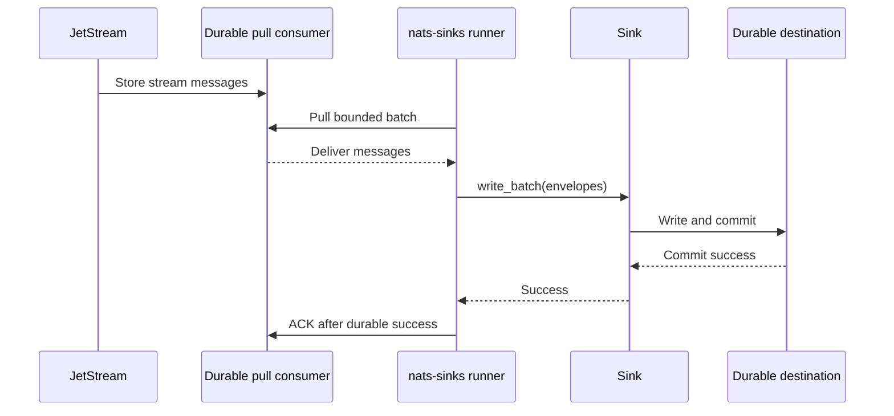
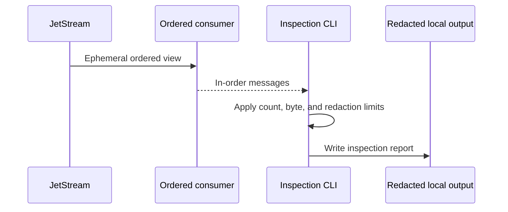
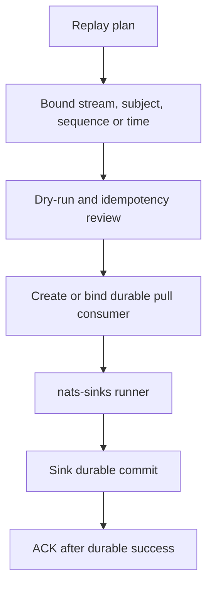

# Ordered Consumer Evaluation

This page records the evaluation for possible ordered-consumer support in
`nats-sinks`. It is written for operators and maintainers who need to inspect
or replay stream content without weakening the production sink worker contract.

The conclusion is intentionally strict:

- ordered consumers are useful for inspection and analysis,
- ordered consumers must not replace durable pull consumers for production sink
  workers,
- any future feature should be read-only by default and clearly named as
  inspection tooling,
- replaying into sinks should use durable pull consumers with
  commit-then-acknowledge, not ordered inspection consumers.

The current release documents the evaluation and creates follow-up backlog
items. It does not yet add ordered-consumer runtime behavior.

## Background

The NATS consumer documentation describes ordered consumers as a convenient
form of consumer for efficient stream inspection or analysis. It also describes
important boundaries: ordered consumers are ephemeral, single-threaded, not
load-balanced, and are designed to prevent gaps by client-side sequence
tracking and recreation. See
[JetStream Consumers](https://docs.nats.io/nats-concepts/jetstream/consumers)
and
[Consumer Details](https://docs.nats.io/using-nats/developer/develop_jetstream/consumers).

The same NATS documentation recommends pull consumers for new projects when
scalability, detailed flow control, or error handling matters. That is why the
production `nats-sinks` runner uses a durable pull-consumer model for sink
writes.

## Current Production Path

The production runner uses a durable pull consumer. The durable consumer keeps
server-side progress, the runner owns ACK decisions, and every sink write must
complete durably before the runner ACKs.

This path remains the production default because it supports at-least-once
delivery, controlled batching, redelivery, DLQ behavior, idempotent sinks, and
graceful shutdown.

## Ordered Consumer Inspection Path

An ordered inspection tool would have a different purpose. It would let an
operator read stream content in order without advancing the production durable
consumer and without writing to sinks.

This is operationally useful, but it is not production sink processing. It
should be read-only by default, bounded, redacted, and explicitly named so
users do not confuse it with durable replay or sink delivery.

## Why Ordered Consumers Should Not Replace The Sink Runner

Ordered consumers are not a substitute for the production runner because:

- they are ephemeral rather than durable production checkpoints,
- they are intended for inspection or analysis rather than horizontally scaled
  sink workers,
- they do not provide the same operational model for durable write success,
  retry, DLQ, and final ACK,
- they may recreate underlying consumers to recover sequence continuity,
  which is useful for inspection but not the same as sink idempotency,
- they can expose sensitive payloads and metadata if used casually.

The sink runner should continue to use durable pull consumers for production
destination writes.

## Replay To Sinks

If an operator needs to replay historical events into Oracle, local files, or a
future sink, the safer design is a durable replay workflow, not an ordered
inspection consumer.

Durable replay-to-sinks should require:

- explicit stream and subject scope,
- explicit start sequence or start time,
- maximum message count or stopping condition,
- sink-specific idempotency review,
- dry-run validation,
- redacted reporting,
- least-privilege NATS permissions,
- commit-then-acknowledge tests.

## Python Client Consideration

Ordered-consumer support depends on the NATS Python client exposing a stable
public API for the feature. The current local `nats.py` API used by this
repository exposes ordinary subscribe and pull-subscribe helpers, but a
high-level ordered-consumer helper was not visible through the imported
`JetStreamContext` API during this evaluation.

For that reason, a future implementation should start with a compatibility
layer. If ordered-consumer support is unavailable or ambiguous, the tool should
fail closed instead of silently falling back to another delivery mode.

## Security Guidance

Inspection and replay are sensitive operations. Even without payload output,
subjects, headers, stream names, sequence numbers, timestamps, priority,
classification, labels, and mission metadata can reveal operational context.

Future ordered-inspection tooling should:

- redact payloads by default,
- hide sensitive headers by default,
- require explicit opt-in for payload output,
- bound message count and byte count,
- write only under approved local output paths,
- avoid printing credentials, connection strings, server locations, and private
  subject families,
- make output clearly non-production and non-release evidence unless sanitized.

## Recommended Implementation Split

The evaluation recommends three separate follow-up items:

1. Add ordered-consumer client compatibility and fail-closed capability checks.
2. Add a read-only ordered-consumer inspection CLI.
3. Add durable replay-to-sinks guidance and tooling design.

This split prevents a useful inspection feature from accidentally weakening
the durable sink runtime.

## Current Status

This release documents the evaluation and creates follow-up feature requests.
No ordered-consumer runtime behavior is enabled yet.
