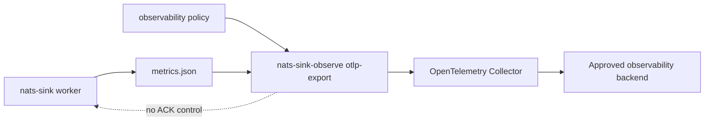
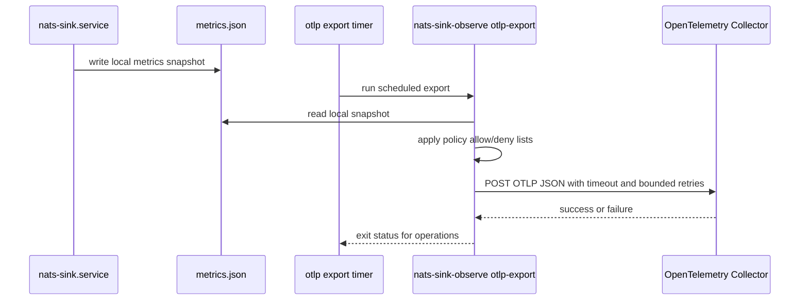

# OpenTelemetry OTLP Integration

`nats-sinks` can export approved local metrics to an OpenTelemetry Collector
through OTLP over HTTP JSON. The connector is part of the observability plane,
not the delivery plane. It reads a local metrics snapshot, applies the same
observability policy used by the Prometheus connectors, and posts only allowed
metric names to an explicitly configured collector endpoint.

The connector is disabled by default. Enabling it never changes JetStream ACK,
NAK, retry, DLQ, sink-write, or idempotency behavior.

## When To Use It

Use the OTLP connector when your platform team already operates an
OpenTelemetry Collector and wants `nats-sinks` worker telemetry to flow through
that collector into downstream systems such as Grafana, Elastic, Splunk,
Datadog, Oracle Cloud Infrastructure Monitoring, or other supported backends.
For Elastic-specific routing hints and operator guidance, use the
[Elastic Observability Profile](elastic-observability.md), which reuses this
same OTLP connector core.
For Grafana Alloy receiver configuration and River snippet generation, use the
[Grafana Alloy Profile](grafana-alloy.md), which also reuses this same OTLP
connector core.

Use Prometheus instead when your environment already scrapes node_exporter
textfiles or a local Prometheus-compatible endpoint. Both approaches use the
same policy model.



## Safety Model

The OTLP connector follows the shared observability connector contract:

- disabled by default,
- reads only the local metrics snapshot,
- exports only allow-listed metrics,
- excludes subjects, payloads, headers, table names, file paths,
  classifications, labels, usernames, connection strings, and message IDs by
  default,
- uses explicit timeouts, bounded retries, and request-size limits,
- loads optional header values from environment variables,
- never logs resolved header values,
- never affects message delivery or ACK ordering.

In mission, defence, regulated, or high-assurance environments, treat the
OpenTelemetry Collector as an information-sharing boundary. Review what leaves
the host, where it is routed, and which downstream teams or systems can query
it.

## Policy Fields

OTLP configuration lives in the same observability policy JSON as Prometheus:

```json
{
  "schema": "nats_sinks.observability.policy.v1",
  "enabled": true,
  "namespace": "nats_sinks",
  "allowed_metrics": [
    "messages_fetched_total",
    "messages_acked_total"
  ],
  "allowed_metric_patterns": [],
  "denied_metrics": [],
  "denied_metric_patterns": [],
  "include_observations": false,
  "include_legacy": false,
  "subjects": [],
  "otlp": {
    "enabled": true,
    "endpoint": "http://127.0.0.1:4318/v1/metrics",
    "protocol": "http_json",
    "timeout_seconds": 5,
    "max_retries": 2,
    "retry_backoff_seconds": 0.25,
    "stale_after_seconds": 60,
    "max_request_bytes": 1048576,
    "headers_env": {
      "Authorization": "NATS_SINKS_OTLP_AUTH_HEADER"
    }
  }
}
```

| Field | Default | Description |
| --- | --- | --- |
| `otlp.enabled` | `false` | Enables OTLP export when the top-level `enabled` field is also `true`. |
| `otlp.endpoint` | `null` | OTLP/HTTP metrics endpoint. Local collectors may use `http://127.0.0.1:4318/v1/metrics`; non-loopback endpoints must use `https://`. Credentials in the URL are rejected. |
| `otlp.protocol` | `http_json` | Current protocol implementation. The connector sends OTLP/HTTP JSON using the Python standard library. |
| `otlp.timeout_seconds` | `5` | Per-request timeout. |
| `otlp.max_retries` | `0` | Bounded retries after the initial attempt. |
| `otlp.retry_backoff_seconds` | `0.25` | Delay between retry attempts. |
| `otlp.stale_after_seconds` | `null` | Optional maximum allowed metrics snapshot age. Stale snapshots fail unless `--allow-stale` is used. |
| `otlp.max_request_bytes` | `1048576` | Maximum rendered OTLP JSON request size. |
| `otlp.headers_env` | `{}` | Mapping of HTTP header names to environment variable names. Header values are read at runtime and are never stored in the policy file. |

## Generate A Disabled Policy

Generate a policy from the main runtime config:

```bash
nats-sink-observe init-prometheus-policy \
  /etc/nats-sinks/config.json \
  /etc/nats-sinks/observability.prometheus.json
```

The command name includes `prometheus` for backward compatibility with earlier
releases, but the generated policy is the shared observability policy. It
includes disabled sections for Prometheus, OTLP, Elastic Observability,
Grafana Alloy, and NATS server monitoring.

Validate the policy:

```bash
nats-sink-observe validate-policy /etc/nats-sinks/observability.prometheus.json
```

Example output:

```text
Observability policy is valid.
schema=nats_sinks.observability.policy.v1
enabled=false
namespace=nats_sinks
prometheus_enabled=false
otlp_enabled=false
elastic_enabled=false
grafana_alloy_enabled=false
nats_server_monitoring_enabled=false
nats_server_monitoring_prometheus_enabled=false
allowed_metrics=0
allowed_metric_patterns=0
denied_metrics=0
denied_metric_patterns=0
subjects=1
```

## Dry-Run Before Export

Dry-run mode renders the OTLP JSON body without contacting a collector:

```bash
nats-sink-observe otlp-export \
  /var/lib/nats-sink/metrics.json \
  /etc/nats-sinks/observability.prometheus.json \
  --dry-run
```

Example output:

```json
{
  "resourceMetrics": [
    {
      "resource": {
        "attributes": [
          {
            "key": "service.name",
            "value": {
              "stringValue": "nats-sinks"
            }
          },
          {
            "key": "nats_sinks.namespace",
            "value": {
              "stringValue": "nats_sinks"
            }
          }
        ]
      },
      "scopeMetrics": [
        {
          "scope": {
            "name": "nats-sinks.observability.otlp"
          },
          "metrics": [
            {
              "description": "Messages fetched from JetStream by the runner.",
              "name": "nats_sinks_messages_fetched_total",
              "sum": {
                "aggregationTemporality": 2,
                "dataPoints": [
                  {
                    "asDouble": 12.0,
                    "timeUnixNano": "1790000000000000000"
                  }
                ],
                "isMonotonic": true
              },
              "unit": "1"
            }
          ]
        }
      ]
    }
  ]
}
```

Dry-run output should be reviewed before enabling scheduled export. It should
contain metric names and numeric values only, not operational subjects or
payload data.

## Export To A Collector

After the policy is explicitly enabled and reviewed:

```bash
export NATS_SINKS_OTLP_AUTH_HEADER="Bearer example-redacted"

nats-sink-observe otlp-export \
  /var/lib/nats-sink/metrics.json \
  /etc/nats-sinks/observability.prometheus.json
```

Successful output is intentionally short:

```text
OTLP export: attempted=true delivered=true attempts=1 status=200 message=OTLP export delivered
```

When the policy is disabled, no snapshot or network connection is required:

```text
OTLP export disabled by observability policy
```

When the collector is unavailable, the command exits non-zero after the bounded
retry policy and prints only a sanitized failure category. It does not print the
collector URL or any header value:

```text
OTLP export: attempted=true delivered=false attempts=3 status=none message=OTLP export failed with URLError
```

## Recommended Service Shape

Run OTLP export as a separate service or timer from `nats-sink.service`.



This keeps observability failure visible to operators while preventing it from
becoming part of the message delivery contract.

## Dependency Impact

The current OTLP connector uses the Python standard library and does not add a
new runtime dependency. It emits OTLP/HTTP JSON directly. A future protobuf or
OpenTelemetry SDK path would require a separate feature request, dependency
review, and compatibility tests before it could become part of the package.

## Limitations

- The connector currently exports aggregate nats-sinks metrics only.
- It does not export traces or logs.
- It does not attach NATS subjects, classification values, labels, table names,
  hostnames, stream sequences, or message IDs as dimensions.
- It supports OTLP/HTTP JSON, not OTLP/gRPC.
- It expects an OpenTelemetry Collector or compatible endpoint to receive the
  request.

These limits are deliberate. They keep the connector small, reviewable, and
safe for environments where observability output is treated as controlled
operational information.
