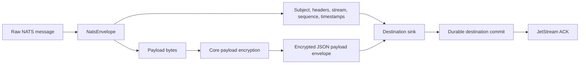
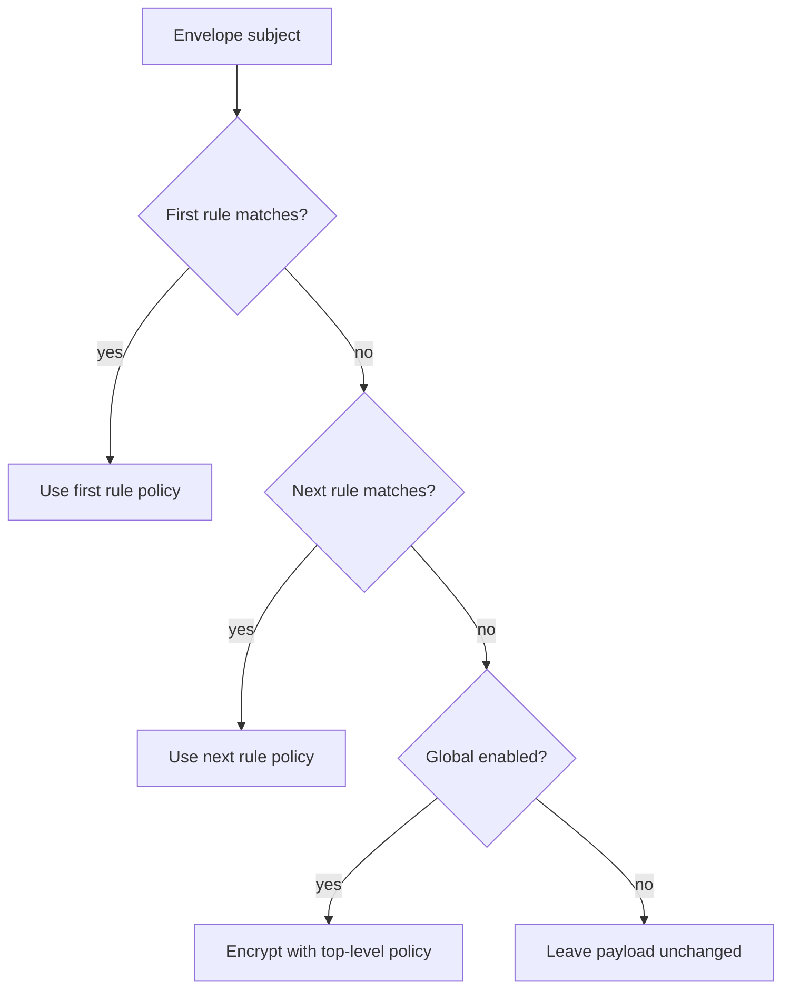
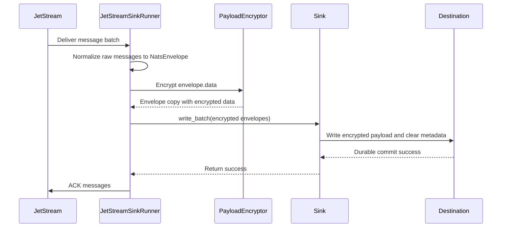
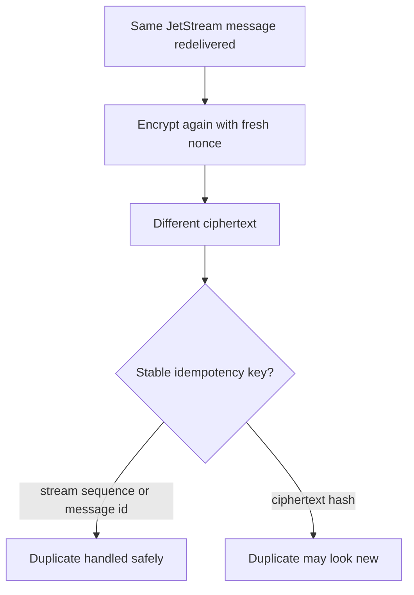

# Payload Encryption

`nats-sinks` can encrypt message bodies before they are delivered to a sink.
This is a generic core runtime capability, not an Oracle-only or file-only
feature. When enabled, the runner encrypts the original `NatsEnvelope.data`
bytes and passes a new immutable envelope to the sink. The destination stores
the encrypted body, while normal metadata remains readable for operations,
routing, idempotency, and audit.

This feature is useful when downstream storage must retain the event data but
should not be able to read the original message body. Examples include local
file handoff directories, database staging tables, archived event payloads, or
streams that carry encrypted business text whose decrypted shape is not known
at ingest time.

In defence and mission-system contexts, this pattern is useful when a shared
ingestion service needs to preserve operational reports, logistics updates,
sensor-derived records, or other sensitive payloads for later processing while
limiting what the storage tier and routine operators can read. It protects the
body, not the existence or routing metadata of the event.

The core rule still applies:

> Commit first. ACK last. Design for redelivery.

Encryption happens before `sink.write_batch(...)`. The core runtime still ACKs
only after the sink reports durable success.

## Supported Algorithms

The current release supports authenticated encryption with:

| Algorithm | Config value | Key size | Nonce size | Notes |
| --- | --- | --- | --- | --- |
| AES-256-GCM | `aes-256-gcm` | 32 bytes | Default `12` bytes. | Recommended default for most deployments. |
| AES-256-CCM | `aes-256-ccm` | 32 bytes | `7` to `13` bytes; default `12`. | Useful where CCM is required by a platform or policy. |

Both algorithms are AEAD modes. They encrypt the payload and authenticate the
ciphertext so accidental corruption or use of the wrong key is detected during
decryption. The implementation uses the Python `cryptography` package and does
not call OpenSSL command-line tools or operating-system crypto utilities.

Install the optional crypto extra before enabling encryption:

```bash
pip install "nats-sinks[crypto]"
```

For all optional dependencies in one environment:

```bash
pip install "nats-sinks[all]"
```

## What Is Encrypted

Only the NATS message body is encrypted.

The following values remain unencrypted:

- NATS subject,
- all headers,
- `Nats-Msg-Id`,
- JetStream stream and consumer names,
- stream and consumer sequence numbers,
- redelivery and pending metadata,
- message-created, received, and stored timestamps,
- sink-specific routing metadata.

This distinction is deliberate. Sinks need clear metadata to preserve
idempotency, route subjects to tables or directories, generate deterministic
file names, write operational metadata, and support replay.

That clarity is also important for mission operations: teams often need to
route by subject, priority, classification, or label without exposing the
payload body. If the metadata itself is classified or sensitive, protect it
with NATS account design, destination access controls, network segmentation,
and retention rules in addition to payload encryption.



If metadata itself is sensitive in your environment, use NATS subject design,
header minimization, destination access controls, and retention rules to reduce
exposure. Payload encryption does not hide metadata.

## Configuration

Payload encryption is controlled by the top-level `encryption` section. You can
encrypt all subjects with one global policy, or you can use ordered subject
rules to encrypt only selected subjects, exempt selected subjects, or use
different key material for different subject families.

To encrypt every subject consumed by the runner, enable the global policy:

```json
{
  "encryption": {
    "enabled": true,
    "algorithm": "aes-256-gcm",
    "key_id": "orders-prod-2026-05",
    "key_b64_env": "NATS_SINKS_PAYLOAD_KEY_B64",
    "nonce_size_bytes": 12,
    "tag_length": 16
  }
}
```

The top-level placement matters. Encryption belongs to the core runner so every
sink receives the same protected payload shape. Do not put encryption settings
inside `sink`; destination sinks should not implement their own independent
message-body encryption for the same runtime path.

### Configuration Reference

| Field | Required | Default | Valid values | Description |
| --- | --- | --- | --- | --- |
| `enabled` | no | `false` | `true` or `false`. | Turns payload encryption on or off. |
| `algorithm` | no | `aes-256-gcm` | `aes-256-gcm` or `aes-256-ccm`. | AEAD algorithm used for the message body. Uppercase spellings such as `AES-256-GCM` are accepted. |
| `key_id` | no | `default` | Non-empty string up to 128 characters. | Non-secret identifier written into the encrypted payload envelope. Use it to identify key generation or rotation periods. |
| `key_b64` | no | `null` | Base64-encoded 32-byte key. | Direct key material. Use only for local tests or controlled throwaway environments. It is redacted by CLI output. |
| `key_b64_env` | no | `null` | Environment variable name. | Preferred production setting. The named variable must contain base64-encoded 32-byte key material. |
| `nonce_size_bytes` | no | `12` | Integer `7` to `13`. | Fresh random nonce size generated for each message. |
| `tag_length` | no | `16` | `4`, `6`, `8`, `10`, `12`, `14`, or `16`. | AES-CCM authentication tag length. AES-GCM always records a 16-byte tag. |
| `rules` | no | `[]` | List of subject-rule objects. | Ordered per-subject encryption policy. First matching rule wins; unmatched subjects use the top-level `enabled` setting. |

Exactly one of `key_b64` or `key_b64_env` may be configured when encryption is
enabled. The direct `key_b64` field is validated and redacted, but production
deployments should use `key_b64_env` or a future secret-manager integration.

## Subject-Specific Encryption

Subject-specific rules are useful when one sink service consumes a broad subject
such as `>` or `orders.>` but only some message families require storage-time
encryption. Rules use the same NATS subject wildcard model as subscriptions:
literal tokens match themselves, `*` matches exactly one token, and final `>`
matches the remaining tokens.

This lets one runner handle mixed operational traffic without forcing a single
classification decision on every subject. For example, a deployment might leave
public healthcheck events readable, encrypt restricted mission reports, and use
a different key identifier for coalition-sharing or exercise-data subjects.

Rules are evaluated in the order they appear in JSON. The first matching rule
wins. If no rule matches, the top-level `enabled` value decides whether the
message is encrypted.



The following configuration encrypts only `secure.>` subjects and leaves all
other subjects unchanged:

```json
{
  "encryption": {
    "enabled": false,
    "rules": [
      {
        "subject": "secure.>",
        "enabled": true,
        "algorithm": "aes-256-gcm",
        "key_id": "secure-prod-2026-05",
        "key_b64_env": "NATS_SINKS_SECURE_PAYLOAD_KEY_B64"
      }
    ]
  }
}
```

The next configuration encrypts every subject by default but explicitly leaves
`public.>` unchanged. This is useful when most data requires encrypted storage
but a small set of operational or already-public subjects should remain readable
in the destination:

```json
{
  "encryption": {
    "enabled": true,
    "algorithm": "aes-256-gcm",
    "key_id": "global-prod-2026-05",
    "key_b64_env": "NATS_SINKS_GLOBAL_PAYLOAD_KEY_B64",
    "rules": [
      {
        "subject": "public.>",
        "enabled": false
      }
    ]
  }
}
```

Rules inherit omitted fields from the top-level encryption section. A rule may
override `algorithm`, `key_id`, `key_b64`, `key_b64_env`, `nonce_size_bytes`,
and `tag_length`. Disabled rules do not need key material because they pass
matching payloads through unchanged.

| Rule field | Required | Default | Valid values | Description |
| --- | --- | --- | --- | --- |
| `subject` | yes | none | NATS subject pattern using literal tokens, `*`, or final `>`. | Pattern matched against `NatsEnvelope.subject`. |
| `enabled` | no | `true` | `true` or `false`. | `true` encrypts matching subjects. `false` exempts matching subjects from encryption. |
| `algorithm` | no | Top-level `algorithm`. | `aes-256-gcm` or `aes-256-ccm`. | Algorithm override for this subject rule. |
| `key_id` | no | Top-level `key_id`. | Non-empty string up to 128 characters. | Non-secret identifier written into encrypted payloads for this rule. |
| `key_b64` | no | Top-level `key_b64`. | Base64-encoded 32-byte key. | Direct key material for this rule. Prefer `key_b64_env` outside disposable tests. |
| `key_b64_env` | no | Top-level `key_b64_env`. | Environment variable name. | Preferred key source for this subject rule. Mutually exclusive with the rule's `key_b64`. |
| `nonce_size_bytes` | no | Top-level `nonce_size_bytes`. | Integer `7` to `13`. | Fresh random nonce size used by this rule. |
| `tag_length` | no | Top-level `tag_length`. | `4`, `6`, `8`, `10`, `12`, `14`, or `16`. | AES-CCM authentication tag length for this rule. |

Operationally, treat rule order as part of the security policy. Put the most
specific exemptions or overrides before broader patterns:

```json
{
  "encryption": {
    "enabled": false,
    "rules": [
      {
        "subject": "secure.public-test",
        "enabled": false
      },
      {
        "subject": "secure.>",
        "enabled": true,
        "key_id": "secure-prod-2026-05",
        "key_b64_env": "NATS_SINKS_SECURE_PAYLOAD_KEY_B64"
      }
    ]
  }
}
```

In this example, `secure.public-test` remains clear because the exemption is
listed first. `secure.orders.created` is encrypted by the broader second rule.

## Generating Test Key Material

For local testing, generate a temporary base64 AES-256 key with Python:

```bash
python -c 'import base64, secrets; print(base64.b64encode(secrets.token_bytes(32)).decode())'
```

Export it for a local run:

```bash
export NATS_SINKS_PAYLOAD_KEY_B64='replace-with-generated-base64-key'
```

Do not commit this value. Store real key material in a secret manager,
environment injection mechanism, or protected service unit environment file.

## Encrypted Payload Envelope

After encryption, the original payload bytes are replaced with a JSON envelope.
Sinks store that JSON envelope as the payload value:

```json
{
  "_nats_sinks_encryption": {
    "schema": "nats_sinks.encrypted_payload.v1",
    "version": 1,
    "algorithm": "aes-256-gcm",
    "key_id": "orders-prod-2026-05",
    "nonce": "base64-nonce",
    "nonce_size_bytes": 12,
    "ciphertext": "base64-ciphertext-and-tag",
    "ciphertext_encoding": "base64",
    "tag_length": 16,
    "plaintext_sha256": "hex-encoded-sha256",
    "plaintext_size_bytes": 128
  }
}
```

The `plaintext_sha256` and `plaintext_size_bytes` fields are integrity and
operational verification aids. They do not reveal the plaintext body, but a
hash can still be considered sensitive in some environments because it can
confirm whether a known payload is present. If that matters for your threat
model, restrict access to destination payload columns or files accordingly.

The ciphertext is non-deterministic because a fresh nonce is generated for each
message. If the same JetStream message is redelivered and encrypted again, the
ciphertext envelope will normally be different even though the decrypted
plaintext is the same. Use stable metadata such as stream sequence or message
ID for idempotency when encryption is enabled.

## Processing Sequence



If encryption fails before the sink receives the batch, the core does not ACK
the original messages. The batch remains eligible for redelivery according to
the configured temporary-failure behavior. This is safer than acknowledging a
message whose protected payload was never durably stored.

## Decryption In Python

The public helper is useful in tests, operational verification tools, and
controlled replay workflows:

```python
from nats_sinks import EncryptionConfig, PayloadEncryptor

config = EncryptionConfig(
    enabled=True,
    algorithm="aes-256-gcm",
    key_id="orders-prod-2026-05",
    key_b64_env="NATS_SINKS_PAYLOAD_KEY_B64",
)

plaintext = PayloadEncryptor(config).decrypt_payload(stored_payload)
```

`stored_payload` may be the encrypted JSON bytes, a JSON string, or a parsed
mapping containing `_nats_sinks_encryption`.

Decryption validates:

- the envelope schema and version,
- the configured algorithm,
- the configured `key_id`,
- base64 nonce and ciphertext fields,
- the AEAD authentication tag,
- optional plaintext size and SHA-256 digest metadata.

If validation fails, the helper raises a framework `SerializationError`
without printing payload contents or key material.

## Sink Behavior

### File Sink

The file sink writes the encrypted JSON envelope into the file record's
`payload` field. The file record metadata, subject, stream, sequence, and
headers remain readable.

```json
{
  "schema": "nats_sinks.file.message.v1",
  "subject": "mission.reports.created",
  "stream": "MISSION",
  "stream_sequence": 42,
  "message_id": "R-1001",
  "priority": "immediate",
  "classification": "NATO SECRET",
  "labels": "mission-report;coalition;watch-floor",
  "labels_list": ["mission-report", "coalition", "watch-floor"],
  "payload": {
    "_nats_sinks_encryption": {
      "schema": "nats_sinks.encrypted_payload.v1",
      "algorithm": "aes-256-gcm",
      "key_id": "mission-prod-2026-05",
      "ciphertext": "base64-ciphertext-and-tag"
    }
  },
  "metadata": {
    "subject": "mission.reports.created",
    "message_metadata": {
      "priority": "immediate",
      "classification": "NATO SECRET",
      "labels": ["mission-report", "coalition", "watch-floor"]
    }
  }
}
```

Gzip compression, when enabled, compresses the JSON file record after payload
encryption. Compression is not a substitute for encryption, and encrypted
payloads usually compress poorly.

### Oracle Sink

The Oracle sink stores the encrypted JSON envelope in the configured payload
column, typically `PAYLOAD_JSON`. Metadata columns and `METADATA_JSON` remain
clear so database operators can diagnose delivery state without decrypting
business data.

For the same message shown above, an Oracle row stores the encrypted body in
`PAYLOAD_JSON` and clear operational metadata in dedicated columns:

| Column | Example value |
| --- | --- |
| `STREAM_NAME` | `MISSION` |
| `STREAM_SEQUENCE` | `42` |
| `SUBJECT` | `mission.reports.created` |
| `MESSAGE_ID` | `R-1001` |
| `PRIORITY` | `immediate` |
| `CLASSIFICATION` | `NATO SECRET` |
| `LABELS` | `mission-report;coalition;watch-floor` |
| `PAYLOAD_JSON` | Encrypted JSON envelope containing `_nats_sinks_encryption`. |
| `METADATA_JSON` | Full metadata document with the label list and timing fields. |

For Oracle idempotency, prefer `stream_sequence` or `message_id` strategies
when encryption is enabled. `payload_field` idempotency cannot inspect the
original business JSON fields after the core has encrypted the payload.

### Future Sinks

Future sinks should treat the encrypted payload envelope as the standard core
representation. They should not try to decrypt it unless their documented
purpose is a trusted decryption or re-encryption sink.

## Idempotency Guidance

Encryption makes ciphertext non-deterministic by design. A redelivered message
may produce a different encrypted payload envelope because a fresh nonce is
used. Therefore:

- use JetStream stream name plus stream sequence as the default idempotency key,
- use `Nats-Msg-Id` only when publishers reliably set unique IDs,
- avoid payload-hash or payload-field idempotency strategies for encrypted
  payloads unless the sink explicitly documents how it handles encryption.



## Testing

The tracked helper script generates temporary key material and runs the
encryption-focused test matrix:

```bash
scripts/check-encryption.sh
```

By default, the generated key file is deleted when the script exits. To keep
the generated test key file for local inspection, pass:

```bash
scripts/check-encryption.sh --preserve-key-material
```

The script sets `NATS_SINKS_TEST_ENCRYPTION_KEY_B64` for the test process and
runs coverage for:

- AES-256-GCM encryption and decryption,
- AES-256-CCM encryption and decryption,
- empty payload encryption,
- wrong key identifier handling,
- redacted configuration output,
- runner encryption before sink write and ACK after sink success,
- no ACK when encryption fails,
- file sink encrypted payload storage with and without gzip,
- local file end-to-end encrypted payload verification,
- Oracle sink encrypted payload row mapping through mocked Oracle objects.

The generated key material is for tests only. It must not be reused in
production.

## Operational Security Notes

- Keep key material out of git and out of logs.
- Prefer `key_b64_env` over direct `key_b64`.
- Protect service environment files with restrictive file permissions.
- Rotate keys with a planned `key_id` strategy.
- Keep old keys available for as long as old destination records must be
  decrypted.
- Treat destination metadata as clear text.
- Keep payload logging disabled.
- Remember that encryption does not replace TLS between `nats-sinks`, NATS,
  Oracle, filesystems, or other destinations.

## Current Limitations

This release intentionally keeps payload encryption simple and auditable:

- no built-in key management service integration,
- no multi-key decrypt registry,
- no automatic key rotation,
- no metadata encryption,
- no destination-side decryption workflow,
- no claim of exactly-once delivery.

These are candidates for future releases. The current feature protects payload
bytes before sink storage while preserving the commit-then-acknowledge runtime
contract.
