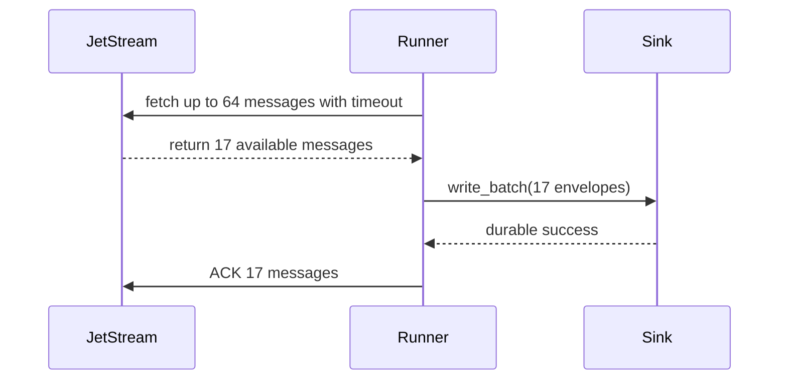
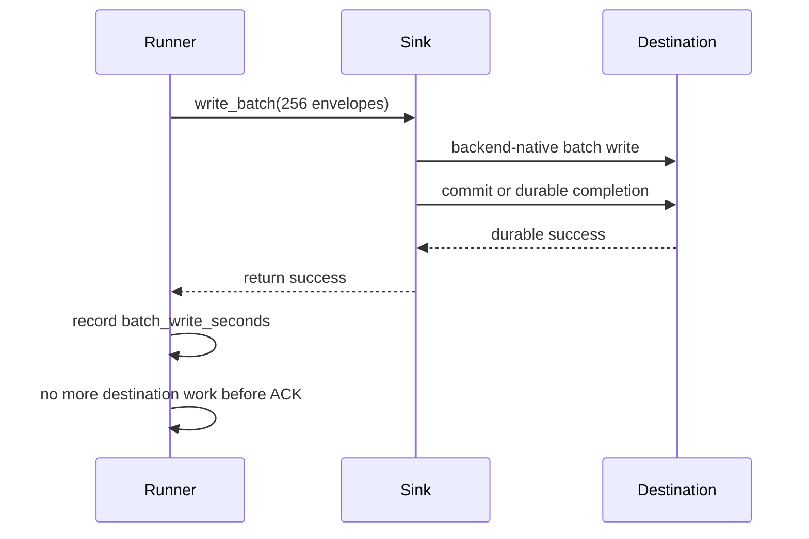

# Performance

`nats-sinks` defaults to correctness over maximum throughput: commit first, ACK
last, and design for redelivery. Throughput tuning should therefore improve
batch efficiency and database efficiency without weakening durable commit or
idempotency behavior.

## Throughput Model


The slowest stage controls end-to-end throughput. For durable sinks this is
often the destination write and commit stage, not message fetch. The runner
records this stage as `batch_write_seconds`, which measures
`sink.write_batch(...)`, including whatever commit or durable-success operation
the selected sink performs.

## First Tuning Levers

Start with these safe controls:

- Increase `delivery.batch_size` gradually. Larger batches reduce commit and
  round-trip overhead, but increase redelivery work when a batch fails.
- Keep `delivery.max_in_flight_batches` conservative until the sink and
  destination are proven under load. The first implementation processes one
  active batch at a time.
- Align JetStream consumer `MaxAckPending` with expected batch size and
  concurrent work. The repeatable e2e test sets this large enough for the test
  batch.
- Use an idempotent destination write mode. Avoid modes that can create
  duplicate effects unless those effects are acceptable or controlled elsewhere.
- Reuse destination connections or clients. Avoid per-message connection
  creation.
- Test the exact destination service class, endpoint type, storage tier, or
  account limits you plan to use in production.

## Partial Batches And Latency

`delivery.batch_size` is the maximum number of messages requested in one pull
fetch. It is not a requirement that the runner must wait until that exact count
is available. The runner calls the NATS pull subscription with both
`batch_size` and `batch_timeout_ms`. If fewer messages are available, the NATS
client may return a smaller list after the fetch expires. The runner processes
that smaller list immediately:



This behavior matters for low-volume or bursty streams. A quiet stream should
not wait forever just because `batch_size` is large. Larger batch sizes improve
database efficiency when traffic is available; `batch_timeout_ms` bounds how
long the pull request waits when traffic is sparse.

For example, with `batch_size=64` and 250 messages available, the e2e test
expects four writes: 64, 64, 64, and 58 messages. The final partial batch is
committed and ACKed like any other batch.

## Destination Backend Behavior

Each sink is responsible for using efficient backend-native writes while still
returning from `write_batch(...)` only after durable success. A SQL sink might
use array DML and commit once per batch. A file or object-storage sink might use
atomic object keys. An HTTP sink might use bounded concurrency and
idempotency-key headers.

The performance shape can differ by backend, but the safety boundary must not:
ACK is still sent only after the sink returns success. Oracle-specific write
behavior, including `executemany`, commit behavior, Autonomous Database
considerations, and tuning notes, is documented in [Oracle Sink](oracle-sink.md).
File-specific throughput notes, including compact JSON, subject partitioning,
gzip compression, and `fsync` tradeoffs, are documented in
[File Sink](file-sink.md).



## Current Oracle Timing Test

The current repeatable live timing test uses the Oracle sink because Oracle is
the heavier external destination. The file sink has deterministic local unit
and end-to-end coverage because it does not need an external service. The
Oracle test sends 256 messages by default:

```bash
set -a
source .local/nats-live/nats-sink.env
source .local/oracle-adb/integration.env
source .local/nats-oracle-e2e/integration.env
set +a
pytest -m integration tests/integration/test_nats_oracle_e2e.py
```

Relevant parameters:

```bash
NATS_SINKS_E2E_MESSAGE_COUNT=256
NATS_SINKS_E2E_BATCH_SIZE=64
NATS_SINKS_E2E_PRINT_TIMINGS=true
```

The timing output is based on `batch_write_seconds`, so it captures the backend
write and commit portion rather than only publish or fetch time.

## Higher-Volume Roadmap

For larger production volumes, each sink should gain backend-specific
optimization paths after benchmarks and integration tests prove the behavior.
For relational sinks, this may mean staging tables and set-based merges. For
HTTP, this may mean controlled concurrent requests. For object stores, this may
mean multipart upload or deterministic object batching.

Other future improvements:

- sink-specific buffer and payload-size tuning,
- configurable destination client and pool sizing guidance,
- metrics export to Prometheus or OpenTelemetry,
- benchmark scripts that report fetch time, mapping time, write time, commit
  time, and ACK time separately,
- controlled concurrent batch processing once ordering and idempotency
  implications are documented.

## What Not To Do

Do not ACK before durable sink success to improve apparent throughput. That
would turn destination failures into silent message loss. Prefer larger safe
batches, backend-native write paths, and explicit backpressure.
