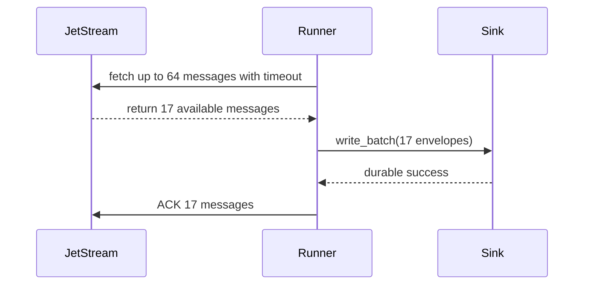
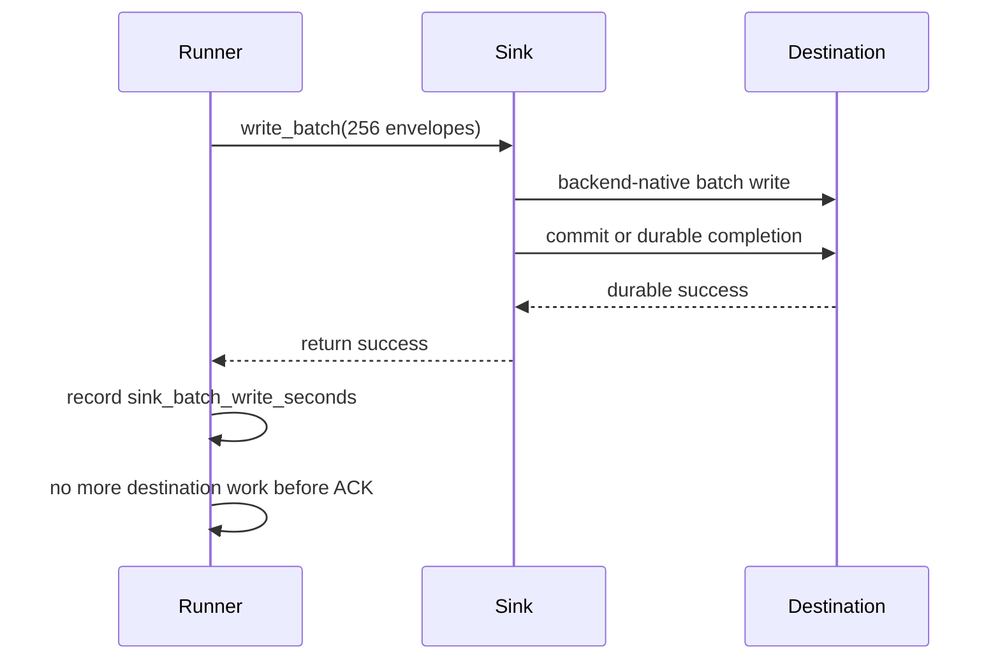
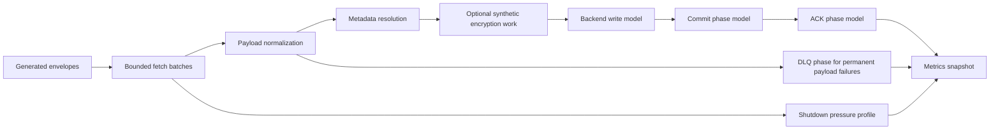

# Performance

`nats-sinks` defaults to correctness over maximum throughput: commit first, ACK
last, and design for redelivery. Throughput tuning should therefore improve
batch efficiency and database efficiency without weakening durable commit or
idempotency behavior.

For mission and defence-oriented systems, throughput is only useful when the
event trail remains trustworthy. A sink that appears fast because it ACKs early
or drops hard-to-write messages is not fast; it is unsafe. Tune batch size,
backend write paths, and connection reuse before considering any change that
would weaken the durable success boundary.

## Throughput Model


The slowest stage controls end-to-end throughput. For durable sinks this is
often the destination write and commit stage, not message fetch. The runner
records this stage as `sink_batch_write_seconds`, which measures
`sink.write_batch(...)`, including whatever commit or durable-success operation
the selected sink performs. The older alias `batch_write_seconds` is still
emitted for compatibility with existing local test reports and dashboards.

## First Tuning Levers

Start with these safe controls:

- Increase `delivery.batch_size` gradually. Larger batches reduce commit and
  round-trip overhead, but increase redelivery work when a batch fails.
- Keep `delivery.max_in_flight_batches` conservative until the sink and
  destination are proven under load. The first implementation processes one
  active batch at a time.
- Align JetStream consumer `MaxAckPending` with expected batch size and
  concurrent work. The repeatable e2e test sets this large enough for the test
  batch.
- Use an idempotent destination write mode. Avoid modes that can create
  duplicate effects unless those effects are acceptable or controlled elsewhere.
- Reuse destination connections or clients. Avoid per-message connection
  creation.
- Test the exact destination service class, endpoint type, storage tier, or
  account limits you plan to use in production.

## Partial Batches And Latency

`delivery.batch_size` is the maximum number of messages requested in one pull
fetch. It is not a requirement that the runner must wait until that exact count
is available. The runner calls the NATS pull subscription with both
`batch_size` and `batch_timeout_ms`. If fewer messages are available, the NATS
client may return a smaller list after the fetch expires. The runner processes
that smaller list immediately:



This behavior matters for low-volume or bursty streams. A quiet stream should
not wait forever just because `batch_size` is large. Larger batch sizes improve
database efficiency when traffic is available; `batch_timeout_ms` bounds how
long the pull request waits when traffic is sparse.

For example, with `batch_size=64` and 250 messages available, the e2e test
expects four writes: 64, 64, 64, and 58 messages. The final partial batch is
committed and ACKed like any other batch.

## Destination Backend Behavior

Each sink is responsible for using efficient backend-native writes while still
returning from `write_batch(...)` only after durable success. A SQL sink might
use array DML and commit once per batch. A file or object-storage sink might use
atomic object keys. An HTTP sink might use bounded concurrency and
idempotency-key headers.

The performance shape can differ by backend, but the safety boundary must not:
ACK is still sent only after the sink returns success. Oracle-specific write
behavior, including `executemany`, commit behavior, Autonomous Database
considerations, and tuning notes, is documented in [Oracle Sink](oracle-sink.md).
File-specific throughput notes, including compact JSON, subject partitioning,
gzip compression, and `fsync` tradeoffs, are documented in
[File Sink](file-sink.md).



## Oracle Phase Benchmark

For Oracle-specific tuning, use the live benchmark wrapper. It is intentionally
not part of normal CI because it requires non-production NATS and Oracle
services. The wrapper sources ignored local environment files, sets an explicit
live-benchmark opt-in flag, and renders a sanitized report that does not include
server addresses, usernames, passwords, table names, wallet paths, certificates,
connection strings, or payload bodies.

```bash
mkdir -p .local/oracle-benchmark

# Put only local, ignored values in these files. Do not commit them.
# Reuse the same variable families as the live e2e test:
# - NATS_SINKS_BENCHMARK_NATS_URL or NATS_SINKS_E2E_NATS_URL
# - NATS_SINKS_BENCHMARK_NATS_USER and NATS_PASSWORD, when NATS auth is used
# - NATS_SINKS_ORACLE_DSN
# - NATS_SINKS_ORACLE_USER
# - ORACLE_PASSWORD or the environment variable named by NATS_SINKS_ORACLE_PASSWORD_ENV

scripts/run-oracle-benchmark.sh \
  --message-count 256 \
  --batch-size 64 \
  --payload-shape mixed \
  --sink-mode merge \
  --format markdown
```

The benchmark reports these phases. Message-processing phases can show
`messages_per_second` because they represent work over the configured benchmark
message count. Lifecycle phases such as retry-delay and shutdown show timing
only; they do not claim message throughput.

| Phase | Meaning | Throughput rate |
| --- | --- | --- |
| `publish` | Time spent publishing synthetic benchmark messages to JetStream. | Yes |
| `fetch` | Time spent waiting for pull consumer fetch calls. | Yes |
| `map` | Time spent converting raw NATS messages into `NatsEnvelope` objects. | Yes |
| `write` | Time spent executing Oracle batch write statements before commit. | Yes |
| `commit` | Time spent in Oracle transaction commit. | Yes |
| `ack` | Time spent ACKing JetStream messages after durable success. | Yes |
| `retry` | Retry-delay observations when retryable failures occur. Happy-path runs normally show no retry observations. | No, timing only |
| `shutdown` | Time spent stopping the runner, sink, and live connections. | No, timing only |

Common options:

```bash
scripts/run-oracle-benchmark.sh --help
scripts/run-oracle-benchmark.sh --message-count 1024 --batch-size 128
scripts/run-oracle-benchmark.sh --stream auto
scripts/run-oracle-benchmark.sh --payload-shape json
scripts/run-oracle-benchmark.sh --payload-shape text
scripts/run-oracle-benchmark.sh --with-encryption --encryption-algorithm aes-256-gcm
scripts/run-oracle-benchmark.sh --sink-mode insert_ignore
scripts/run-oracle-benchmark.sh --drop-table-before
scripts/run-oracle-benchmark.sh --report-file .local/oracle-benchmark/report.md
```

Example sanitized output:

```text
# Oracle Benchmark Report

This report is sanitized. It contains timing observations only and does not include server addresses, usernames, passwords, table names, wallet paths, certificates, connection strings, or payload bodies.

## Options

| Field | Value |
| --- | --- |
| `message_count` | `256` |
| `batch_size` | `64` |
| `payload_shape` | `mixed` |
| `sink_mode` | `merge` |
| `encryption_enabled` | `False` |
| `encryption_algorithm` | `none` |

## Phase Timings

| Phase | Count | Total seconds | Average seconds | Max seconds | Messages/sec |
| --- | ---: | ---: | ---: | ---: | ---: |
| publish | 1 | 0.400000 | 0.400000 | 0.400000 | 640.00 |
| fetch | 4 | 0.200000 | 0.050000 | 0.070000 | 1280.00 |
| map | 4 | 0.050000 | 0.012500 | 0.020000 | 5120.00 |
| write | 4 | 0.700000 | 0.175000 | 0.210000 | 365.71 |
| commit | 4 | 0.100000 | 0.025000 | 0.040000 | 2560.00 |
| ack | 4 | 0.030000 | 0.007500 | 0.010000 | 8533.33 |
| retry | 0 | 0.000000 | 0.000000 | 0.000000 | n/a |
| shutdown | 1 | 0.020000 | 0.020000 | 0.020000 | n/a |
```

These numbers are examples. Real results depend on message size, payload
shape, encryption, Oracle service class, network latency, table indexes, write
mode, batch size, consumer policy, and current database load. Treat them as
environment-specific observations, not product guarantees.

The older live e2e test still supports `NATS_SINKS_E2E_PRINT_TIMINGS=true`.
That output is useful for quick checks, but the benchmark script is preferred
when operators need phase-by-phase evidence.

Use `--stream auto` when the subject is already owned by an existing JetStream
stream and you want the benchmark to discover that stream rather than create a
new one. The script still fails closed if the resolved stream cannot be used
for the configured subject.

## Synthetic Load Profiles

`nats-sinks` also provides deterministic synthetic load profiles for maintainers
who need quick local evidence without connecting to NATS, Oracle, file sinks, or
observability endpoints. These profiles generate fake `NatsEnvelope` objects and
exercise the same public-safe processing concepts that matter in production:
fetch pressure, payload normalization, metadata resolution, optional encryption
work, backend-write serialization, commit boundary timing, ACK timing, retry
delay modeling, DLQ handling, metrics snapshot rendering, and shutdown pressure.

The profiles are intentionally not throughput guarantees. They are local
rehearsals that help compare code changes, test argument handling, and produce
sanitized issue or release evidence. They never include service endpoints,
usernames, passwords, table names, wallet paths, certificate material, private
subjects, or payload bodies.

Phase throughput is calculated from the amount of work completed by that phase,
not blindly from the total number of generated messages. This distinction is
important for failure-oriented profiles. A shutdown profile may generate 250
messages but fetch only 128 before stop-fetch behavior begins. A DLQ profile may
generate 128 messages but write fewer durable records because malformed
payloads are routed through the DLQ path. The report therefore uses
phase-specific counters:

| Phase | Rate counter |
| --- | --- |
| `fetch` | `messages_fetched` |
| `payload_normalization` | `messages_prepared` |
| `metadata_resolution` | `messages_prepared` |
| `encryption` | `messages_encrypted` |
| `backend_write` | `messages_written` |
| `commit` | `messages_written` |
| `ack` | `messages_acked` |
| `retry` | `messages_nacked` |
| `dlq` | `messages_dlq` |
| `shutdown` | `shutdown_unfetched_messages` for shutdown profiles |

This keeps public evidence conservative: the report should show what the
synthetic phase actually handled, especially when rehearsing outage,
redelivery, DLQ, or graceful-shutdown behavior.



Run the default normal profile:

```bash
python scripts/run-load-profile.py \
  --profile normal \
  --message-count 256 \
  --batch-size 64 \
  --format markdown
```

Available profiles:

| Profile | What it models |
| --- | --- |
| `normal` | Happy-path batches where all generated messages are normalized, written, committed, and ACKed. |
| `retry` | Temporary sink pressure where selected batches are NAKed with configured retry-delay observations before eventual success. |
| `dlq` | Permanent payload failures where malformed JSON-like messages are counted as DLQ records and ACKed only after the modeled DLQ phase. |
| `shutdown` | Stop-fetch behavior where already fetched messages complete and unfetched messages remain outside the ACK boundary. |

Useful examples:

```bash
python scripts/run-load-profile.py --profile retry --message-count 512 --batch-size 64
python scripts/run-load-profile.py --profile dlq --message-count 128 --batch-size 32 --format markdown
python scripts/run-load-profile.py --profile shutdown --message-count 250 --batch-size 64
python scripts/run-load-profile.py --profile normal --with-encryption --message-count 256
python scripts/run-load-profile.py \
  --profile normal \
  --metrics-snapshot-file .local/load-profile/metrics.json \
  --preserve-metrics-snapshot
```

The wrapper script is equivalent and easier to use in shell snippets:

```bash
scripts/run-load-profile.sh --profile normal --message-count 256 --batch-size 64
```

Example sanitized Markdown output:

```text
# Load Profile Report

This report is sanitized. It contains generated workload counts and aggregate
phase timings only.

## Options

| Field | Value |
| --- | --- |
| `profile` | `normal` |
| `message_count` | `256` |
| `batch_size` | `64` |
| `encrypt_payloads` | `False` |

## Counters

| Counter | Value |
| --- | ---: |
| `messages_generated` | 256 |
| `messages_written` | 256 |
| `messages_acked` | 256 |

## Phase Timings

| Phase | Count | Total seconds | Average seconds | Max seconds | Messages/sec |
| --- | ---: | ---: | ---: | ---: | ---: |
| fetch | 4 | 0.000010 | 0.000003 | 0.000004 | 25600000.00 |
| backend_write | 4 | 0.003000 | 0.000750 | 0.001000 | 85333.33 |
| commit | 4 | 0.000030 | 0.000008 | 0.000010 | 8533333.33 |
| ack | 4 | 0.000010 | 0.000003 | 0.000004 | 25600000.00 |
```

Treat these numbers as local code-path observations only. If the synthetic
profile shows a large regression, investigate before moving to live benchmark
work. If the synthetic profile looks good, still run sink-specific tests and,
where appropriate, a live non-production benchmark before making operational
throughput claims.

## Higher-Volume Roadmap

For larger production volumes, each sink should gain backend-specific
optimization paths after benchmarks and integration tests prove the behavior.
For relational sinks, this may mean staging tables and set-based merges. For
HTTP, this may mean controlled concurrent requests. For object stores, this may
mean multipart upload or deterministic object batching.

In operational deployments, benchmark with realistic payload sizes, subject
mixes, priority/classification distributions, encryption settings, and
destination service limits. A lab run with synthetic tiny messages is useful,
but it does not prove readiness for a high-volume mission feed.

Other future improvements:

- sink-specific buffer and payload-size tuning,
- configurable destination client and pool sizing guidance,
- metrics export to Prometheus or OpenTelemetry,
- deeper benchmark profiles for staging-table modes and future sinks,
- controlled concurrent batch processing once ordering and idempotency
  implications are documented.

## What Not To Do

Do not ACK before durable sink success to improve apparent throughput. That
would turn destination failures into silent message loss. Prefer larger safe
batches, backend-native write paths, and explicit backpressure.
