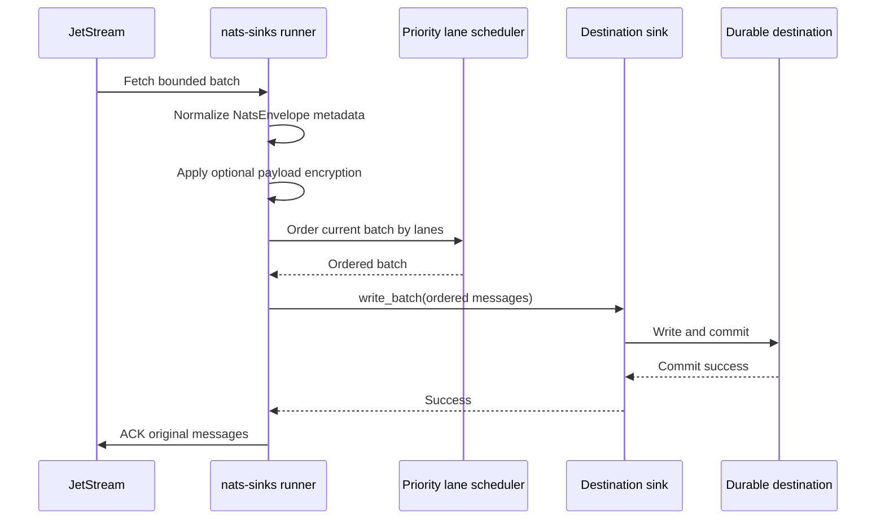

# Priority-Aware Processing Lanes

Priority-aware processing lanes let `nats-sinks` prefer urgent work inside a
bounded batch without weakening commit-then-acknowledge processing. They are
designed for operators who already use message metadata such as `priority`,
`classification`, and `labels` to describe operational handling needs.

The feature is intentionally conservative. JetStream still decides which
messages are delivered to the pull consumer. `nats-sinks` only reorders the
messages that have already been fetched into the current batch. The sink then
receives one ordered batch, writes it durably, and the core runtime ACKs the
original JetStream messages only after sink success.

## When To Use Priority Lanes

Use priority lanes when a sink instance may receive mixed-urgency events and
you want high-priority messages to move earlier through the local sink write
path during backlog drain. Examples include operational telemetry, urgent audit
events, watch-floor messages, maintenance alarms, and mission-support events
where some subjects or producers should receive faster local handling.

Do not use priority lanes as an authorization mechanism. Priority metadata can
come from headers and can therefore be controlled by a publisher unless your
NATS authorization, producer controls, and deployment policy say otherwise.
Priority lanes are a scheduling hint after validation, not a trust boundary.

## Processing Model

The scheduler runs after envelope normalization and optional payload
encryption, but before `sink.write_batch(...)`.



The central reliability rule does not change:

```text
Receive -> validate -> order current batch -> write durably -> commit -> ACK
```

If lane validation fails, the message is treated as a permanent framework
validation failure. If DLQ is enabled, the original message is ACKed only after
DLQ publication succeeds. If DLQ is disabled, the message remains unacked and
eligible for redelivery according to JetStream policy.

## What Priority Lanes Do Not Guarantee

Priority lanes do not provide exactly-once processing. `nats-sinks` remains an
at-least-once delivery framework and sinks must remain idempotent.

Priority lanes do not provide strict total ordering across a stream, across
subjects, across consumers, across processes, or across batches. They only
affect the order of messages already returned by one pull fetch operation.

Priority lanes do not bypass sink durability. A lower-priority message in the
same batch may still be ACKed after the batch succeeds, because the sink writes
the ordered batch as one durable operation. Future implementations may add
separate lane workers, but those workers must still preserve ACK-last behavior.

## Configuration

Priority lanes live under `delivery.priority_lanes`. They are disabled by
default, so existing deployments keep sink delivery order exactly as returned
by JetStream fetch.

```json
{
  "delivery": {
    "batch_size": 100,
    "priority_lanes": {
      "enabled": true,
      "default_lane": "routine",
      "unknown_priority_action": "default_lane",
      "max_priority_value_length": 64,
      "lanes": [
        {
          "name": "urgent",
          "priorities": ["urgent", "immediate"],
          "weight": 3
        },
        {
          "name": "routine",
          "priorities": ["normal", "routine"],
          "weight": 1
        }
      ]
    }
  }
}
```

Priority metadata itself is still configured through `message_metadata`. That
means you can set global defaults and subject-specific defaults without putting
subject names in the lane policy:

```json
{
  "message_metadata": {
    "priority": {
      "header": "Nats-Sinks-Priority",
      "default": "routine"
    },
    "rules": [
      {
        "subject": "alerts.>",
        "priority": "urgent"
      },
      {
        "subject": "training.>",
        "priority": "routine"
      }
    ]
  }
}
```

With this configuration, a message on `alerts.sensor.contact` that does not
carry a priority header receives the `urgent` default before lane scheduling.
A message that explicitly carries `Nats-Sinks-Priority: routine` remains
routine because publisher-supplied headers are authoritative after NATS
authorization has admitted the message.

## Field Reference

| Field | Required | Default | Valid values | Description |
| --- | --- | --- | --- | --- |
| `enabled` | no | `false` | `true` or `false` | Enables in-batch priority scheduling. |
| `default_lane` | no | `default` | Configured lane name | Lane used for missing priorities and, by default, unknown priorities. |
| `unknown_priority_action` | no | `default_lane` | `default_lane` or `reject` | Controls whether unknown but syntactically safe priority values are downgraded to the default lane or rejected as permanent validation failures. |
| `max_priority_value_length` | no | `64` | Integer `1` to `256` | Maximum length for message priority metadata when lanes are enabled. Oversized values are rejected. |
| `lanes[].name` | yes | none | Lowercase letter followed by lowercase letters, digits, `_`, or `-`; max 64 characters | Stable lane name. Lane names should be operationally boring and non-sensitive because they may appear in configuration and documentation. |
| `lanes[].priorities` | no | `[]` | String list | Priority values that map to the lane. Matching is case-insensitive. A value may appear in only one lane. |
| `lanes[].weight` | no | `1` | Integer `1` to `100` | Weighted round-robin share for this lane inside a mixed batch. |

The default policy is equivalent to this:

```json
{
  "delivery": {
    "priority_lanes": {
      "enabled": false,
      "default_lane": "default",
      "unknown_priority_action": "default_lane",
      "max_priority_value_length": 64,
      "lanes": [
        {
          "name": "default",
          "priorities": [],
          "weight": 1
        }
      ]
    }
  }
}
```

## Weighted Round-Robin Behavior

Weights control how many messages the scheduler takes from a lane before
checking the next lane. The scheduler repeats that pass until every lane bucket
is empty.

For example, with `urgent.weight = 2` and `routine.weight = 1`, this fetched
batch:

| Fetched order | Priority | Lane |
| --- | --- | --- |
| 1 | `urgent` | `urgent` |
| 2 | `urgent` | `urgent` |
| 3 | `urgent` | `urgent` |
| 4 | `routine` | `routine` |
| 5 | `routine` | `routine` |

is delivered to the sink as:

| Sink order | Original stream sequence | Priority |
| --- | --- | --- |
| 1 | 1 | `urgent` |
| 2 | 2 | `urgent` |
| 3 | 4 | `routine` |
| 4 | 3 | `urgent` |
| 5 | 5 | `routine` |

This prevents routine work from being completely starved inside the current
batch while still preferring urgent work.

## Security Notes

Treat priority as untrusted input unless your deployment controls every
publisher. The scheduler validates priority values when lanes are enabled:

- missing priority becomes the default lane;
- unknown priority becomes the default lane unless `unknown_priority_action` is
  `reject`;
- control characters are rejected;
- oversized values are rejected;
- duplicate priority mappings across lanes are rejected at startup.

Use subject-specific defaults when priority should be assigned by operator
policy rather than by publishers. Use NATS account permissions to decide who is
allowed to publish to the subject families that receive urgent defaults.

## Metrics

Priority lane metrics are aggregate by default. They do not include subjects,
message IDs, priority strings, classification values, labels, payload fields,
or stream sequence values.

| Metric suffix | Type | Meaning |
| --- | --- | --- |
| `priority_lane_batches_total` | counter | Batches ordered by enabled priority-lane scheduling. |
| `priority_lane_messages_total` | counter | Messages evaluated by priority-lane scheduling. |
| `priority_lane_defaulted_total` | counter | Messages sent to the default lane because priority was missing or unknown. |
| `priority_lane_rejected_total` | counter | Messages rejected because priority metadata violated policy. |
| `current_priority_lanes_active` | gauge | Number of configured lanes represented in the active scheduled batch. |

Example:

```bash
nats-sink-metrics show .local/nats-sinks/metrics.json --metric "priority_lane_*"
```

Example output:

```text
kind     name                           value
counter  priority_lane_batches_total    12
counter  priority_lane_messages_total   768
counter  priority_lane_defaulted_total  41
counter  priority_lane_rejected_total   0
```

The active-lane gauge can be queried separately:

```bash
nats-sink-metrics get .local/nats-sinks/metrics.json current_priority_lanes_active --default 0
```

## Operational Guidance

Start with small weights. A policy such as `urgent = 3`, `routine = 1` is often
easier to reason about than very large ratios. Large weights can create the
appearance of starvation in small batches even though the scheduler eventually
checks every active lane.

Keep `delivery.batch_size` bounded. Priority lanes order the current batch in
memory, so the existing batch-size limit is also the scheduling memory limit.

Keep idempotency enabled at the sink. Priority lanes can change sink delivery
order inside a batch, and redelivery can still happen after a crash between
destination commit and JetStream ACK.

Review DLQ policy before setting `unknown_priority_action` to `reject`. Reject
mode is useful when priority values are part of a strict operational contract,
but malformed messages need a safe DLQ path so they do not block a stream
silently.
