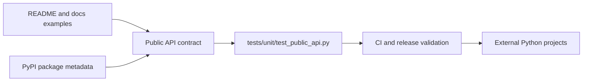

# Public API Compatibility

`nats-sinks` is intended to be imported by external Python projects as well as
run from the command line. That means the documented import paths are part of
the user experience, not an internal implementation detail.

Public API compatibility tests protect those import paths before every release.
They make refactoring safer by allowing maintainers to move internal code while
keeping the external contract stable.

## What The Public API Contract Protects

The compatibility contract covers symbols that users are encouraged to import
from their own projects, extension modules, tests, or operational tooling.

The most important top-level imports are:

```python
from nats_sinks import JetStreamSinkRunner, NatsEnvelope, Sink
from nats_sinks.file import FileSink
from nats_sinks.oracle import OracleSink
```

These imports are intentionally stable. A user should not need to know whether
`JetStreamSinkRunner` lives internally in `nats_sinks.core.runner`, whether the
file sink stores helper code in a mapping module, or whether the Oracle sink
has several internal SQL builders. The package-level imports are the supported
surface.

The tests also cover:

- framework error classes such as `TemporarySinkError`, `PermanentSinkError`,
  `ConfigurationError`, `AckError`, and `DeadLetterError`,
- payload encryption helpers such as `EncryptionConfig`, `PayloadEncryptor`,
  `SubjectPayloadEncryptor`, `PayloadKeyRegistry`, and `decrypt_payload`,
- message metadata configuration classes,
- pre-sink policy configuration and evaluation helpers such as
  `PreSinkPolicyConfig`, `PreSinkPolicyRuleConfig`,
  `PolicyViolationError`, and `evaluate_pre_sink_policy`,
- payload normalization helpers,
- metrics classes and helpers such as `MetricNames`, `InMemoryMetrics`,
  `JsonFileMetrics`, `load_metrics_snapshot`, and
  `metric_rows_from_snapshot`,
- observability policy and connector helpers such as `ObservabilityPolicy`,
  `PrometheusTextfilePolicy`, `PrometheusHttpEndpointPolicy`,
  `NatsServerMonitoringPolicy`, `collect_nats_monitoring_snapshot`, and
  `render_nats_monitoring_prometheus`,
- sink extension points such as `Sink`, `HealthCheckableSink`,
  `SchemaAwareSink`, `FlushableSink`, and `SinkRegistry`,
- production sink package exports for `nats_sinks.file` and
  `nats_sinks.oracle`,
- documented configuration helpers such as `load_config` and
  `redacted_config`,
- command entry points for `nats-sink`, `nats-sink-metrics`, and
  `nats-sink-observe`.

## Why This Matters

Without compatibility tests, an internal cleanup can accidentally break users.
For example, moving a class from one module to another might still pass the
unit tests for that class, but fail a real user application that imports the
documented path.

The compatibility tests catch that kind of problem early.



The tests do not freeze every internal module. They protect the parts that are
documented as stable. Internal helpers can still evolve when needed, as long as
the documented import paths and command names remain available.

## Compatibility Test File

The contract lives in:

```text
tests/unit/test_public_api.py
```

That test file contains a manifest of supported module exports and documented
imports. It checks three things:

1. Each documented symbol can be imported.
2. Stable public packages expose those symbols through `__all__`.
3. The console script names in `pyproject.toml` still resolve to Typer apps.

Run the focused test with:

```bash
pytest tests/unit/test_public_api.py
```

The same test is also included in the normal test suite and the repository
check script:

```bash
scripts/check.sh
```

## Adding A New Public Symbol

When a feature should become part of the supported Python API, update the code,
documentation, and compatibility test together.

For example, if a future Postgres sink is added, the intended public import
would likely be:

```python
from nats_sinks.postgres import PostgresSink
```

The release-ready change should then include:

1. `src/nats_sinks/postgres/__init__.py` exporting `PostgresSink`.
2. Documentation showing the import.
3. A `tests/unit/test_public_api.py` contract entry for `nats_sinks.postgres`.
4. Changelog text explaining the new public API.
5. Sink-specific unit tests and integration tests behind the appropriate
   markers.

This keeps new sinks additive. Existing imports such as
`from nats_sinks.oracle import OracleSink` and
`from nats_sinks.file import FileSink` should continue to work.

## Breaking Changes

A breaking change is any change that removes, renames, or changes the meaning
of a documented public import, documented configuration field, console command,
or delivery safety invariant.

Breaking changes should be avoided while the project is still building trust
with users. If one becomes necessary, it should be handled deliberately:

- document the reason,
- provide a migration path,
- update the changelog,
- update tests,
- consider a compatibility alias or deprecation period,
- use semantic versioning to communicate the impact.

The commit-then-acknowledge invariant is not a compatibility option. It is a
project safety rule. A future version must not turn ACK-before-durable-success
into supported behavior.

## What Is Not Public API

Some modules exist so the package can stay maintainable, but they are not
intended as stable imports unless a documentation page says otherwise.

Examples include low-level SQL builders, row mappers, private CLI helper
functions, and destination-specific implementation details. External users
should prefer the documented package imports, sink classes, configuration
models, and CLI commands.

If a user needs a lower-level helper to become stable, it should be promoted
intentionally: document it, test it in the compatibility contract, and describe
it in the changelog.
