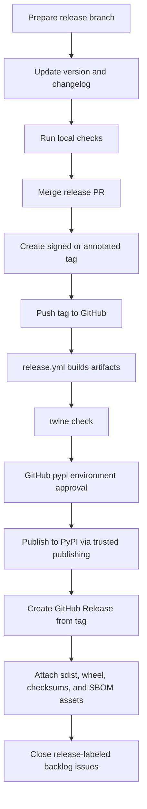

# Publishing Releases

This page is the maintainer runbook for pushing releases and publishing
`nats-sinks` to TestPyPI or PyPI.

PyPI is the Python Package Index, the public package registry used by `pip`.
Publishing to PyPI makes the package available to external users, so the steps
below are intentionally conservative: build locally, verify metadata, smoke
test installation, publish through a trusted workflow, and document the release.

The project repository is
[ProjectCuillin/nats-sinks](https://github.com/ProjectCuillin/nats-sinks/).
The named contributor is Johan Louwers,
[louwersj@gmail.com](mailto:louwersj@gmail.com).

## Recommended Publishing Model

Use PyPI Trusted Publishing with GitHub Actions. PyPI Trusted Publishing lets a
configured GitHub Actions workflow request a short-lived publishing token using
OpenID Connect, avoiding long-lived PyPI API tokens in repository secrets.

The release workflow in this repository is `.github/workflows/release.yml`.
It is designed to publish on tags named `v*` and uses the `pypi` GitHub
environment. After PyPI publication succeeds, the same workflow creates or
updates the GitHub Release for the tag and attaches the built source
distribution, wheel, checksum manifest, and SBOM evidence.

## One-Time PyPI Setup

Before the first automated PyPI release:

1. Create or claim the `nats-sinks` project on PyPI.
2. In the PyPI project settings, add a trusted publisher for GitHub Actions.
3. Configure the publisher with:
   - repository owner: `ProjectCuillin`
   - repository name: `nats-sinks`
   - workflow name: `release.yml`
   - environment name: `pypi`
4. In GitHub, create an environment named `pypi`.
5. Add required reviewers to the `pypi` environment if you want human approval before publication.

## Release Flow



## Step 1: Prepare The Release

Start from a release branch, not from `main`:

```bash
git switch main
git pull --ff-only
git switch -c release-v0.4.1
```

Update:

- `pyproject.toml` version,
- `CHANGELOG.md`,
- documentation for any public behavior changes.

Run:

```bash
ruff format --check .
ruff check .
mypy src
python scripts/check-markdown-links.py
pytest
scripts/check-sinks.sh
bandit -q -r src
python -m build
scripts/sbom.sh
python scripts/generate-checksums.py dist
twine check dist/*.whl dist/*.tar.gz
scripts/check-docs.sh
```

The docs helper builds both canonical documentation targets in isolated
temporary output directories. That avoids collisions between overlapping
MkDocs runs that would otherwise clean the same `site/` directory.

Also confirm that local GitHub CLI authentication is valid before pushing tags:

```bash
scripts/check-gh-auth.sh
```

This is not required by PyPI Trusted Publishing itself. It is a maintainer
quality-of-life check so commands such as `gh run list`, `gh run view`, and
`gh release view` work immediately after the tag push. If authentication is
invalid and a terminal is available, the helper asks whether it should start
browser-based `gh auth login`. It never prints token values.

Push the release branch and open or refresh the release pull request:

```bash
scripts/open-release-pr.sh --repo ProjectCuillin/nats-sinks --base main
```

For issue branches, use the active release branch as the pull request base, for
example `--base release-v0.4.1`. For bug branches created during feature
development, use the feature branch as the base. The helper creates a draft
pull request by default. Ordinary branch pushes do not start GitHub Actions.
When the release branch is ready for merge and release validation, mark the
pull request ready and dispatch the validation workflows:

```bash
scripts/run-release-validation.sh --repo ProjectCuillin/nats-sinks
```

The repository also includes a manual `Branch Pull Request` workflow for
token-gated pull request creation. It requires `NATS_SINKS_PR_BOT_TOKEN` and is
not triggered by branch pushes.

The pull request must pass CI and receive maintainer approval before it is
merged into `main`. The release tag must be created from `main`; the release
workflow rejects tags that point to unmerged branch commits.

## PyPI README Link Hygiene

PyPI renders `README.md` outside GitHub's repository context. Relative links
such as `docs/oracle-sink.md` may work on GitHub but fail from the PyPI project
page. Use fully qualified public URLs for Markdown links that should work on
PyPI. Documentation links should normally point to Read the Docs:

```text
https://nats-sinks.readthedocs.io/en/latest/oracle-sink/
```

Documentation files under `docs/` intentionally use relative links so MkDocs
and Read the Docs keep readers inside the current documentation version.

Run the repository guard before publishing:

```bash
python scripts/check-markdown-links.py
```

## Project Badges

The README and documentation home page include public badges for PyPI, Python
version support, Read the Docs, and GitHub Pages. Badge links in `README.md`
must use fully qualified URLs because the README is rendered on PyPI as the
project description.

The PyPI badge points to:

```text
https://pypi.org/project/nats-sinks/
```

The badge image uses:

```text
https://img.shields.io/pypi/v/nats-sinks?cacheSeconds=300
```

The short cache period helps the badge catch up quickly after a release. PyPI
and Shields.io can still cache responses briefly, so a just-published release
may need a few minutes before every browser or CDN edge shows the new version.
Do not replace the PyPI badge with a static version string because that creates
manual release drift.

When adding more badges, prefer stable public endpoints and avoid badges that
require private tokens or expose internal infrastructure details.

## Documentation Publication

The public documentation site is prepared for Read the Docs. The repository
contains `.readthedocs.yaml` for hosted builds and `.github/workflows/docs.yml`
for pull-request validation. After the one-time Read the Docs project import,
pushes to `main` and release tags should build automatically.

See [Read the Docs](read-the-docs.md) for the setup and operating model.

The repository also contains `.github/workflows/pages.yml` for publishing the
same MkDocs site to GitHub Pages as a repository-hosted mirror. GitHub Pages
requires one maintainer setup step: repository `Settings` -> `Pages` -> set
`Source` to `GitHub Actions`. See [GitHub Pages](github-pages.md) for details.

## Step 2: Smoke Test The Package

From the working tree:

```bash
nats-sink --help
nats-sink validate examples/file-basic/config.json
nats-sink test-sink examples/file-basic/config.json
nats-sink validate examples/oracle-jetstream/config.json
python -c "from nats_sinks import JetStreamSinkRunner; from nats_sinks.file import FileSink; from nats_sinks.oracle import OracleSink; print('ok')"
```

Optionally test the built wheel in a clean virtual environment:

```bash
python -m venv /tmp/nats-sinks-release-test
source /tmp/nats-sinks-release-test/bin/activate
python -m pip install dist/nats_sinks-*.whl
nats-sink --help
deactivate
```

## Step 2a: Generate Release SBOM And Checksum Evidence

Before pushing a release tag, generate CycloneDX SBOM files and the checksum
manifest from the validated build environment:

```bash
python -m build
scripts/sbom.sh
python scripts/generate-checksums.py dist
twine check dist/*.whl dist/*.tar.gz
```

The generated files are:

```text
dist/sbom/nats-sinks-<version>.cyclonedx.json
dist/sbom/nats-sinks-<version>.cyclonedx.xml
dist/SHA256SUMS
```

The GitHub release workflow generates the same files automatically and attaches
them to the GitHub Release. SBOM files and `SHA256SUMS` are not uploaded to
PyPI. See [SBOM And Release Evidence](sbom.md) and
[Hash-Verified Installs](hash-verified-installs.md) for the purpose,
limitations, and security notes.

## Step 3: Push The Release Tag

Use annotated tags:

```bash
git switch main
git pull --ff-only
git tag -a v0.1.0 -m "Release v0.1.0"
git push origin v0.1.0
```

The tag push starts `.github/workflows/release.yml`.
The workflow expects the tag to exist already; it does not create tags itself.
This is intentional because maintainers should choose when a repository state
is ready to become an immutable release point.

After pushing the tag, inspect the workflow:

```bash
gh run list --limit 10
gh run view --log
```

If those commands fail locally with bad credentials, rerun
`scripts/check-gh-auth.sh` in an interactive terminal and authenticate again.

## Step 4: Publish To TestPyPI

For a first release, publish to TestPyPI before PyPI. You can do that by adding
a separate trusted publisher and workflow environment for TestPyPI, or by
manually uploading with a TestPyPI token from a trusted maintainer machine.

Manual TestPyPI fallback:

```bash
python -m build
scripts/sbom.sh
twine check dist/*.whl dist/*.tar.gz
twine upload --repository testpypi dist/*.whl dist/*.tar.gz
```

Then test install:

```bash
python -m venv /tmp/nats-sinks-testpypi
source /tmp/nats-sinks-testpypi/bin/activate
python -m pip install --index-url https://test.pypi.org/simple/ --extra-index-url https://pypi.org/simple/ nats-sinks
nats-sink --help
deactivate
```

## Step 5: Publish To PyPI

Preferred path:

1. Push the release tag.
2. Let GitHub Actions build the distributions.
3. Approve the `pypi` environment if required.
4. Let `pypa/gh-action-pypi-publish` publish with trusted publishing.
5. Let the `github-release` job create or update the GitHub Release and attach
   the built artifacts, checksum manifest, and SBOM evidence.
6. Let the release workflow close managed backlog issues labeled for the
   release tag after the GitHub Release exists. The workflow closes only issues
   whose Acceptance Criteria are checked and whose comments include sanitized
   test-plan evidence and close-out evidence.

Manual PyPI fallback:

```bash
python -m build
scripts/sbom.sh
python scripts/generate-checksums.py dist
twine check dist/*.whl dist/*.tar.gz
twine upload dist/*.whl dist/*.tar.gz
```

Manual publishing requires a PyPI API token. Prefer trusted publishing for
normal releases.

## Step 6: Verify The GitHub Release

After PyPI publication, `.github/workflows/release.yml` automatically creates
or updates the GitHub Release for the pushed tag. It uses GitHub's generated
release notes and attaches the built wheel, source distribution, and SBOM
evidence files plus `SHA256SUMS`.

Verify:

1. The GitHub Release exists for the tag, for example `v0.1.0`.
2. The source distribution, wheel, `SHA256SUMS`, and CycloneDX SBOM files are attached.
3. The generated notes are accurate enough for external readers.
4. The release links clearly to the PyPI package page or project homepage.
5. Open managed backlog issues labeled for the release tag have been closed
   by release automation only when acceptance criteria and evidence comments
   were present.

If the automatic GitHub Release step fails after PyPI publication, create it
manually:

```bash
gh release create v0.1.0 dist/*.whl dist/*.tar.gz dist/SHA256SUMS dist/sbom/* \
  --repo ProjectCuillin/nats-sinks \
  --title v0.1.0 \
  --generate-notes \
  --verify-tag
```

If the release already exists but assets need to be replaced:

```bash
gh release upload v0.1.0 dist/*.whl dist/*.tar.gz dist/SHA256SUMS dist/sbom/* \
  --repo ProjectCuillin/nats-sinks \
  --clobber
```

If release-labeled backlog issues need manual close-out after a fallback
release, first confirm the issue has checked Acceptance Criteria plus
sanitized `Test Plan Evidence` and `Close-Out Evidence` comments. Then run:

```bash
python scripts/close-released-backlog-issues.py \
  --repo ProjectCuillin/nats-sinks \
  --release v0.1.0
```

## Rollback Guidance

PyPI artifacts are immutable. If a release is broken:

- do not delete and replace the same version,
- yank the release on PyPI if appropriate,
- publish a new patch release,
- document the issue in `CHANGELOG.md`.

## References

- [Python Packaging User Guide: Building and Publishing](https://packaging.python.org/guides/section-build-and-publish/)
- [PyPI Docs: Trusted Publishers](https://docs.pypi.org/trusted-publishers/)
- [PyPI Docs: Adding a Trusted Publisher](https://docs.pypi.org/trusted-publishers/adding-a-publisher/)
- [PyPI Docs: Publishing with a Trusted Publisher](https://docs.pypi.org/trusted-publishers/using-a-publisher/)
