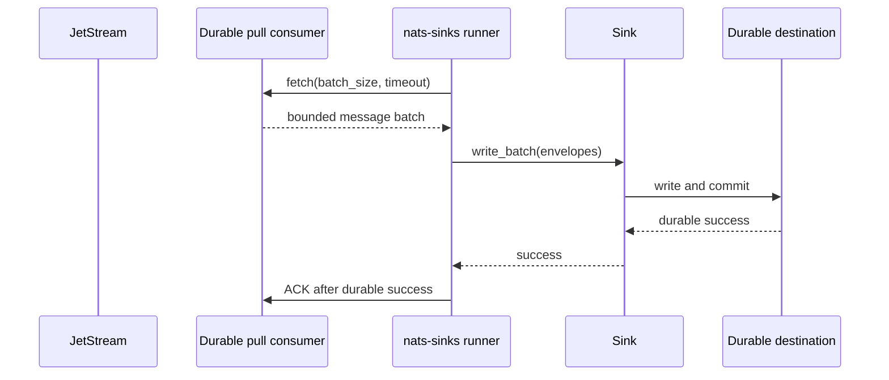
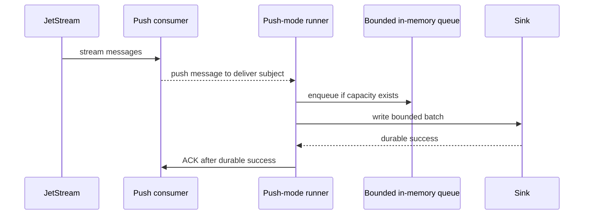

# Push Consumer Evaluation

This page records the evaluation and current implementation posture for
push-consumer support in `nats-sinks`. It is written for operators and
maintainers who already use NATS push-consumer patterns and want to understand
how those patterns fit the `nats-sinks` delivery contract.

The conclusion is deliberately conservative:

- pull consumers remain the production default for sink workers,
- push consumers are available only as an explicit opt-in runner mode,
- push support is gated by strict backpressure and shutdown controls,
- push support must use manual acknowledgement only,
- push support must never acknowledge before durable sink success,
- delivery-contract and flow-control certification exists in the unit suite,
  while live NATS push-consumer testing remains explicitly environment-gated.

## Background

NATS JetStream supports both pull and push consumers. The NATS consumer
documentation explains that pull consumers let clients request messages in
batches, while push consumers deliver messages to a configured delivery
subject. It also recommends pull consumers for new projects when scalability,
detailed flow control, or error handling is a concern. See
[JetStream Consumers](https://docs.nats.io/nats-concepts/jetstream/consumers)
and
[Consumer Details](https://docs.nats.io/using-nats/developer/develop_jetstream/consumers).

That recommendation matters for `nats-sinks` because the project is not a
general-purpose NATS subscriber framework. It is a durable outbound sink
runtime. Its most important rule is:

> Commit first. ACK last. Design for redelivery.

## Current Production Path

The current runner uses a pull subscription and a bounded fetch loop. The
runner decides when to request work, how many messages to fetch, when to stop
fetching, when to call the sink, and when to acknowledge.



This is the safest default because backpressure is easy to reason about: the
runner requests only the work it is prepared to process.

## Push Consumer Model

A push consumer changes the control plane. The server delivers messages to a
delivery subject. A subscribing client receives those messages as they arrive,
usually through a callback or subscription iterator.



For `nats-sinks`, push mode uses its own bounded internal queue, explicit
manual ACK behavior, and a shutdown process that stops accepting new messages
before draining already accepted work.

## Required Safety Properties

Push support is only acceptable if it preserves the same safety properties as
the pull runner.

| Requirement | Why it matters |
| --- | --- |
| Manual ACK only | Auto-ACK after callback return would violate commit-then-acknowledge. |
| Bounded pending messages | The server can push faster than the sink can commit. The runner must avoid unbounded memory growth. |
| `MaxAckPending` guardrails | NATS describes `MaxAckPending` as the flow-control mechanism that applies to push consumers. |
| Client pending limits | The Python client exposes `pending_msgs_limit` and `pending_bytes_limit`; push mode sets them deliberately. |
| Flow control and idle heartbeat | NATS exposes push-specific `FlowControl` and `IdleHeartbeat`; push mode configures them explicitly or fails closed when client support is absent. |
| Graceful shutdown | The runner must stop accepting new messages, finish or release in-flight work, and close cleanly. |
| Retry and DLQ parity | Temporary failures must not ACK; permanent failures must publish DLQ before ACK. |
| Metrics parity | Push mode needs counters for pushed, queued, dropped-or-rejected, in-flight, ACKed, NAKed, and callback errors. |

## Python Client Consideration

The local `nats.py` API exposes `JetStreamContext.subscribe(...)` and
`subscribe_bind(...)` with `manual_ack`, `flow_control`, `idle_heartbeat`,
`pending_msgs_limit`, and `pending_bytes_limit` arguments. That is a useful
starting point, but it is not enough by itself.

The framework has a small compatibility and configuration layer so push mode
can:

- require `manual_ack=True`,
- reject unsafe or ambiguous callback behavior,
- validate pending-message and pending-byte limits,
- validate the deliver subject and optional deliver group,
- prove that flow-control and heartbeat settings are supported by the installed
  client version,
- keep production pull-mode behavior unchanged.

## Implementation Split

The evaluation split the work into three separately testable items:

1. Fail-closed push-consumer capability and configuration guardrails.
2. Opt-in push-consumer runner mode with bounded in-flight work.
3. Push-consumer delivery-contract, shutdown, and flow-control certification
   tests.

All three items are implemented in the current development line. The
certification tests prove ACK-after-commit ordering, no ACK on temporary sink
failure, DLQ publication before original ACK on permanent failure, bounded
queue overflow behavior, callback exception containment, flow-control and
idle-heartbeat option propagation, and cooperative shutdown. A live NATS
push-consumer test is present but skipped unless
`NATS_SINKS_PUSH_CONSUMER_INTEGRATION=1` is set, keeping normal release checks
deterministic and free of external-service assumptions.

## Why Pull Remains Default

Pull remains the default because it matches the current project goal:
controlled, auditable sink delivery with conservative backpressure.

Push mode can be valuable for deployments that already standardize on push
consumers, but it introduces more moving parts:

- server-initiated delivery,
- callback scheduling,
- client pending buffers,
- flow-control messages,
- heartbeat interpretation,
- deliver subjects and optional deliver groups,
- more complex shutdown decisions.

Those are manageable, but they must be made explicit before push support is
treated as production-ready.

## Current Status

Push-consumer runtime behavior is available only when `push_consumer.enabled`
is set to `true` and the required delivery subject is configured. Pull mode
remains the default, and push delivery still uses the same sink write, DLQ, and
ACK-after-durable-success pipeline as pull delivery.

## Certification Evidence

The focused certification suite is:

```bash
python -m pytest tests/unit/test_push_consumer.py tests/integration/test_push_consumer_integration.py -q
```

By default the live integration test is skipped:

```text
16 passed, 1 skipped
```

To run the optional live path, start a disposable NATS server with JetStream
enabled and run:

```bash
NATS_SINKS_PUSH_CONSUMER_INTEGRATION=1 \
NATS_SINKS_PUSH_CONSUMER_NATS_URL=nats://127.0.0.1:4222 \
python -m pytest tests/integration/test_push_consumer_integration.py -q
```

The live test creates a unique stream, subject, durable push consumer, and
deliver subject, writes one synthetic payload through the real NATS client, and
then deletes the stream. It must be used only with local disposable
infrastructure. Do not point it at production streams or operational subjects.
