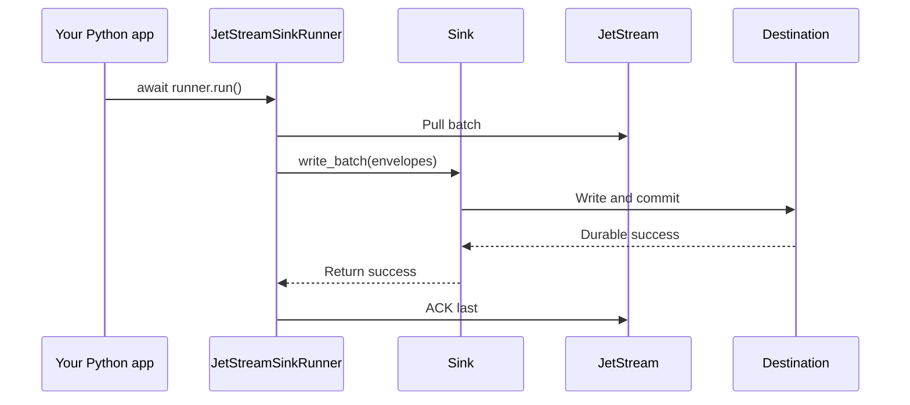

# Python Usage

`nats-sinks` can be used as a normal Python package. The CLI is convenient for
operations, but applications should usually import the public runtime API rather
than executing `nats-sink` as a subprocess.

Use the Python API when you want to embed the sink runner inside an existing
async application, share logging and metrics with your application, or construct
sinks programmatically. The same safety rule applies as with the CLI: the core
runner owns ACK behavior, and destination sinks only write to their destination.

## Recommended Imports

```python
from nats_sinks import JetStreamSinkRunner, NatsEnvelope, Sink
from nats_sinks.oracle import OracleSink
```

The examples below use Oracle because it is the first production sink. Future
destination modules should follow the same import and runner pattern without
changing the core API.

The most common embedded setup is:

```python
from nats_sinks import JetStreamSinkRunner
from nats_sinks.oracle import OracleSink

sink = OracleSink(
    dsn="localhost:1521/FREEPDB1",
    user="app_user",
    password_env="ORACLE_PASSWORD",
    table="NATS_SINK_EVENTS",
    mode="merge",
    payload_mode="json_or_envelope",
)

runner = JetStreamSinkRunner(
    nats_url="nats://localhost:4222",
    stream="ORDERS",
    consumer="orders-oracle-sink",
    subject="orders.*",
    sink=sink,
)

await runner.run()
```

## Embedding In An Async Service

`JetStreamSinkRunner.run()` is an async method. In an existing async service,
schedule it with your normal task supervision and cancellation strategy:

```python
import asyncio


async def main() -> None:
    runner = build_runner()
    task = asyncio.create_task(runner.run())
    try:
        await task
    finally:
        runner.request_stop()


asyncio.run(main())
```

The same commit-then-acknowledge invariant applies when embedded: the runner
ACKs only after the sink returns durable success.

## Mounting The CLI In Another Typer Application

The CLI is implemented as a Typer app, so another Typer project can mount it:

```python
import typer
from nats_sinks.cli.main import app as nats_sink_cli

app = typer.Typer()
app.add_typer(nats_sink_cli, name="nats-sink")
```

This is useful for platform tools that provide a larger operational CLI. For
business applications, prefer importing `JetStreamSinkRunner` and the sink
classes directly so you do not depend on CLI-private helper functions.

## Importing Configuration Helpers

JSON config loading is available from the core package:

```python
from nats_sinks.core.config import load_config, redacted_config

config = load_config("examples/oracle-jetstream/config.json")
print(redacted_config(config))
```

The current stable public API is the runner, envelope, sink protocol,
framework errors, and the production sink modules that ship with the package.
Config helper imports are useful, but future releases may add a higher-level
`create_runner_from_config` helper to make JSON-configured embedding even
cleaner.

## Embedded Flow



## What Not To Do

Do not pass raw NATS messages into sinks. Do not call `ack()` from application
code for messages owned by `JetStreamSinkRunner`. Do not wrap the CLI command in
a subprocess when you can import the runtime API directly.
