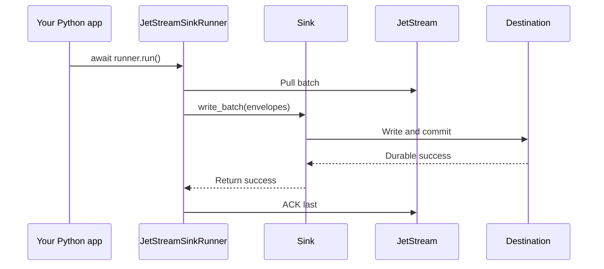

# Python Usage

`nats-sinks` can be used as a normal Python package. The CLI is convenient for
operations, but applications should usually import the public runtime API rather
than executing `nats-sink` as a subprocess.

Use the Python API when you want to embed the sink runner inside an existing
async application, share logging and metrics with your application, or construct
sinks programmatically. The same safety rule applies as with the CLI: the core
runner owns ACK behavior, and destination sinks only write to their destination.

In platform, mission-support, or defence-adjacent Python services, prefer
embedding the runner directly when you need supervised lifecycle management,
shared observability, or policy-controlled construction of sinks and encryption
settings. The embedded form should still preserve the same commit-then-ACK
contract as the CLI.

## Recommended Imports

```python
from nats_sinks import (
    ConsumerManagementConfig,
    CustodyConfig,
    EncryptionConfig,
    JetStreamAdvisoryConfig,
    JetStreamSinkRunner,
    NatsEnvelope,
    Sink,
)
from nats_sinks.file import FileSink
from nats_sinks.oracle import OracleSink
```

The examples below use the file sink because it has no external dependency.
Oracle follows the same runner pattern and is imported from
`nats_sinks.oracle`.

The most common embedded setup is:

```python
from nats_sinks import ConsumerManagementConfig, JetStreamSinkRunner
from nats_sinks.file import FileSink

sink = FileSink(
    directory="/var/lib/nats-sinks/events",
    filename_strategy="stream_sequence",
    duplicate_policy="skip_existing",
    compression="gzip",
)

runner = JetStreamSinkRunner(
    nats_url="nats://localhost:4222",
    stream="ORDERS",
    consumer="orders-file-sink",
    subject="orders.*",
    sink=sink,
    consumer_management=ConsumerManagementConfig(mode="bind_only"),
)

await runner.run()
```

`ConsumerManagementConfig` is optional. Embedded applications use it when they
want the same explicit durable-consumer startup behavior as JSON
configuration. It only controls startup binding, creation, and drift checks;
the runner still owns every ACK decision after messages are fetched.

The same object also carries richer JetStream consumer policy settings:
`filter_subjects`, `backoff_seconds`, `max_deliver`, `max_ack_pending`,
`max_waiting`, `headers_only`, `num_replicas`, `memory_storage`, and bounded
consumer `metadata`. Invalid combinations, such as `backoff_seconds` without
`max_deliver`, fail during configuration validation before the runner can
fetch messages.

## Enabling Payload Encryption

Applications can enable the same core payload encryption that the JSON CLI
configuration supports. The sink construction remains unchanged; encryption is
passed to `JetStreamSinkRunner` because the core owns the transformation before
sink delivery.

```python
from nats_sinks import EncryptionConfig, JetStreamSinkRunner
from nats_sinks.file import FileSink

sink = FileSink(directory="/var/lib/nats-sinks/events")

runner = JetStreamSinkRunner(
    nats_url="nats://localhost:4222",
    stream="ORDERS",
    consumer="orders-file-sink",
    subject="orders.*",
    sink=sink,
    encryption=EncryptionConfig(
        enabled=True,
        algorithm="aes-256-gcm",
        key_id="orders-prod-2026-05",
        key_b64_env="NATS_SINKS_PAYLOAD_KEY_B64",
    ),
)
```

The sink receives encrypted payload bytes in a standard
`_nats_sinks_encryption` JSON envelope. Metadata such as subject, stream
sequence, and headers remains clear. See [Payload Encryption](payload-encryption.md)
for decryption helpers and operational guidance.

Authorized replay or verification tools can register more than one key
generation with `PayloadKeyRegistry`:

```python
from nats_sinks import EncryptionConfig, PayloadKeyRegistry

registry = PayloadKeyRegistry(
    [
        EncryptionConfig(
            enabled=True,
            key_id="orders-prod-2026-05",
            key_b64_env="NATS_SINKS_PAYLOAD_KEY_2026_05_B64",
        ),
        EncryptionConfig(
            enabled=True,
            key_id="orders-prod-2026-06",
            key_b64_env="NATS_SINKS_PAYLOAD_KEY_2026_06_B64",
        ),
    ]
)

plaintext = registry.decrypt_payload(stored_payload)
```

## Enabling Custody Metadata

Applications can also enable tamper-evident custody metadata through the
runner. The core computes deterministic hashes before calling the sink, and the
sink persists the custody object with the durable record.

```python
from nats_sinks import CustodyConfig, JetStreamSinkRunner
from nats_sinks.file import FileSink

sink = FileSink(directory="/var/lib/nats-sinks/events")

runner = JetStreamSinkRunner(
    nats_url="nats://localhost:4222",
    stream="ORDERS",
    consumer="orders-file-sink",
    subject="orders.*",
    sink=sink,
    custody=CustodyConfig(
        enabled=True,
        algorithm="sha256",
        key_id="custody-policy-v1",
    ),
)
```

Custody hashes are not encryption and not digital signatures. They are evidence
values that can be recomputed later to detect unexpected changes to stored
payloads or metadata. See
[Tamper-Evident Custody Metadata](tamper-evident-custody.md).

## Capturing Metrics In Embedded Code

The CLI keeps metrics no-op by default unless `metrics.snapshot_file` is set in
JSON configuration. Embedded applications can pass any object implementing the
small metrics protocol. `InMemoryMetrics` is useful for tests, local
diagnostics, and examples. `JsonFileMetrics` writes the same dependency-free
snapshot that the `nats-sink-metrics` command reads. Production services
normally adapt the same metric suffixes to Prometheus, OpenTelemetry, StatsD,
or another approved telemetry system.

```python
from nats_sinks import InMemoryMetrics, JetStreamSinkRunner, MetricNames
from nats_sinks.file import FileSink

metrics = InMemoryMetrics()
sink = FileSink(directory="/var/lib/nats-sinks/events")

runner = JetStreamSinkRunner(
    nats_url="nats://localhost:4222",
    stream="ORDERS",
    consumer="orders-file-sink",
    subject="orders.*",
    sink=sink,
    metrics=metrics,
)

# After the runner has processed traffic, your application can inspect or
# export the counters through its own telemetry stack.
written = metrics.counters[MetricNames.MESSAGES_WRITTEN_TOTAL]
```

Write a local snapshot for the standalone metrics CLI:

```python
from nats_sinks import JsonFileMetrics, JetStreamSinkRunner, MetricsConfig
from nats_sinks.file import FileSink

metrics = JsonFileMetrics(".local/nats-sinks/metrics.json", namespace="nats_sinks")
metrics_config = MetricsConfig(
    event_freshness_enabled=True,
    event_stale_after_seconds=300,
    event_future_skew_tolerance_seconds=5,
)
sink = FileSink(directory="/var/lib/nats-sinks/events")

runner = JetStreamSinkRunner(
    nats_url="nats://localhost:4222",
    stream="ORDERS",
    consumer="orders-file-sink",
    subject="orders.*",
    sink=sink,
    metrics=metrics,
    metrics_config=metrics_config,
)
```

Oracle-specific counters use the same recorder. When embedding `OracleSink`,
pass the recorder to both the sink and the runner so duplicate/conflict
observations appear beside core delivery counters:

```python
from nats_sinks import JsonFileMetrics, JetStreamSinkRunner, MetricNames
from nats_sinks.oracle import OracleSink

metrics = JsonFileMetrics(".local/nats-sinks/metrics.json", namespace="nats_sinks")
sink = OracleSink(
    dsn="localhost:1521/FREEPDB1",
    user="app_user",
    password_env="ORACLE_PASSWORD",
    table="NATS_SINK_EVENTS",
    mode="insert_ignore",
    metrics=metrics,
)

runner = JetStreamSinkRunner(
    nats_url="nats://localhost:4222",
    stream="ORDERS",
    consumer="orders-oracle-sink",
    subject="orders.*",
    sink=sink,
    metrics=metrics,
)

# After traffic is processed, this counter shows duplicate rows that Oracle
# safely absorbed through idempotent handling.
duplicates = metrics.counters[MetricNames.ORACLE_DUPLICATES_TOTAL]
```

Read the same snapshot from Python:

```python
from nats_sinks import load_metrics_snapshot, metric_rows_from_snapshot

snapshot = load_metrics_snapshot(".local/nats-sinks/metrics.json")
rows = metric_rows_from_snapshot(snapshot)

for row in rows:
    print(row.kind, row.name, row.value)
```

Metrics are observational only. A metrics recorder must not ACK, NAK, mutate
messages, inspect plaintext payloads, or block durable sink completion. See
[Metrics](metrics.md) for the snapshot CLI, Python helpers, supported names,
output formats, and compatibility aliases.

## Observing JetStream Advisories

Embedded services can enable the optional advisory observer in the same way the
JSON config does. The observer subscribes to selected
`$JS.EVENT.ADVISORY...` subjects and records aggregate counters through the
configured metrics recorder. It does not write advisories to a sink and does
not influence ACK decisions.

```python
from nats_sinks import InMemoryMetrics, JetStreamAdvisoryConfig, JetStreamSinkRunner

metrics = InMemoryMetrics()

runner = JetStreamSinkRunner(
    nats_url="nats://localhost:4222",
    stream="ORDERS",
    consumer="orders-file-sink",
    subject="orders.*",
    sink=sink,
    metrics=metrics,
    advisories=JetStreamAdvisoryConfig(
        enabled=True,
        subjects=("$JS.EVENT.ADVISORY.CONSUMER.MAX_DELIVERIES.*.*",),
    ),
)
```

Use [Configuration](configuration.md#advisories) for the full option reference
and [Metrics](metrics.md#jetstream-advisory-metrics) for the counter names.

## Embedding In An Async Service

`JetStreamSinkRunner.run()` is an async method. In an existing async service,
schedule it with your normal task supervision and cancellation strategy:

```python
import asyncio


async def main() -> None:
    runner = build_runner()
    task = asyncio.create_task(runner.run())
    try:
        await task
    finally:
        runner.request_stop()


asyncio.run(main())
```

The same commit-then-acknowledge invariant applies when embedded: the runner
ACKs only after the sink returns durable success.

## Mounting The CLI In Another Typer Application

The CLI is implemented as a Typer app, so another Typer project can mount it:

```python
import typer
from nats_sinks.cli.main import app as nats_sink_cli

app = typer.Typer()
app.add_typer(nats_sink_cli, name="nats-sink")
```

This is useful for platform tools that provide a larger operational CLI. For
business applications, prefer importing `JetStreamSinkRunner` and the sink
classes directly so you do not depend on CLI-private helper functions.

## Importing Configuration Helpers

JSON config loading is available from the core package:

```python
from nats_sinks.core.config import load_config, redacted_config

config = load_config("examples/oracle-jetstream/config.json")
print(redacted_config(config))
```

The current stable public API is the runner, envelope, sink protocol,
framework errors, and the production sink modules that ship with the package.
Config helper imports are useful, but future releases may add a higher-level
`create_runner_from_config` helper to make JSON-configured embedding even
cleaner.

## Public API Compatibility

The import paths shown on this page are protected by compatibility tests in
`tests/unit/test_public_api.py`. Those tests make sure README examples,
package-level imports, production sink imports, sink extension points, metrics
helpers, configuration helpers, and console-script entry points keep working
across refactors.

See [Public API Compatibility](public-api.md) for the full contract and the
maintenance process for adding new public symbols.

## Embedded Flow



## What Not To Do

Do not pass raw NATS messages into sinks. Do not call `ack()` from application
code for messages owned by `JetStreamSinkRunner`. Do not wrap the CLI command in
a subprocess when you can import the runtime API directly.
