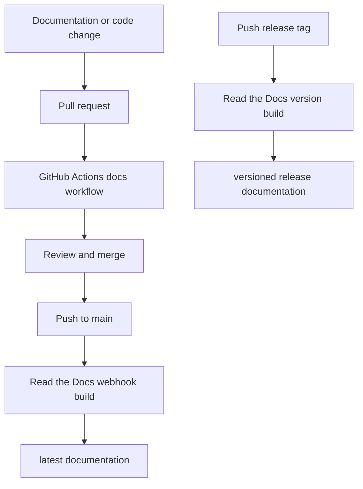

# Read the Docs

This page explains how the public documentation site is built and published.
The goal is to keep documentation publication mostly automated while still
using the standard Read the Docs project import and GitHub authorization model.

Read the Docs is a hosted documentation service. It connects to the GitHub
repository, installs the documentation dependencies, builds the MkDocs site,
and serves versioned documentation such as `latest` and tagged releases.

## Documentation Flow



The repository contains two pieces of automation:

- `.readthedocs.yaml` tells Read the Docs how to build the site.
- `.github/workflows/docs.yml` builds the same MkDocs site in GitHub Actions
  for pull requests and pushes to `main`.

GitHub Actions catches documentation problems before they reach Read the Docs.
Read the Docs then publishes the external documentation site after the change
is merged or a release tag is pushed.

## One-Time Project Setup

One manual step is still required because Read the Docs must be authorized to
access the GitHub repository and create its webhook. A maintainer should:

1. Sign in to Read the Docs.
2. Connect the GitHub account or organization that owns
   `ProjectCuillin/nats-sinks`.
3. Import the `ProjectCuillin/nats-sinks` repository as a Read the Docs
   project.
4. Confirm the project slug. The recommended slug is `nats-sinks`.
5. Confirm that Read the Docs detects `.readthedocs.yaml`.
6. Trigger the first build.
7. Enable the versions that should be public, normally `latest` and release
   tags such as `v0.2.0`.

After that setup, normal pushes and tag pushes should build automatically.

## Build Configuration

The Read the Docs configuration installs the project with the `docs` optional
extra:

```yaml
python:
  install:
    - method: pip
      path: .
      extra_requirements:
        - docs
```

That means the hosted build uses the same documentation dependencies as local
development:

```bash
python -m pip install -e ".[docs]"
mkdocs build --strict
```

The `.readthedocs.yaml` file is build-service configuration. It does not change
the runtime configuration format for `nats-sinks`; application configuration
remains JSON.

## Link Strategy

The project uses two link styles intentionally:

- `README.md` uses fully qualified Read the Docs URLs for documentation links
  so the PyPI project page can link to public documentation correctly.
- Files under `docs/` use relative Markdown links for documentation pages so
  MkDocs and Read the Docs keep users inside the current documentation version.

This avoids a common versioning problem: a user reading release documentation
for `v0.2.0` should not be sent to documentation from the current `main`
branch unless the link is explicitly about source code.

The link guard in `scripts/check-markdown-links.py` enforces fully qualified
links for PyPI-facing Markdown files while allowing version-local links in the
MkDocs documentation tree.

## GitHub Actions

The `Docs` workflow runs on documentation-related pull requests and pushes to
`main`. It performs three checks:

```bash
python scripts/check-markdown-links.py
mkdocs build --strict
```

The workflow does not publish documentation itself. Read the Docs owns hosted
publication after the one-time project import. This keeps credentials and
publication state out of GitHub Actions while still giving maintainers fast
feedback on documentation quality.

## Release Documentation

Release tags should be enabled as Read the Docs versions. When a tag such as
`v0.2.0` is pushed:

1. The package release workflow builds and publishes the package.
2. Read the Docs builds documentation for that tag.
3. Users can read documentation that matches the installed package version.

Before publishing a release, confirm that the README, MkDocs pages,
`CHANGELOG.md`, and package metadata all describe the same version and public
behavior.
