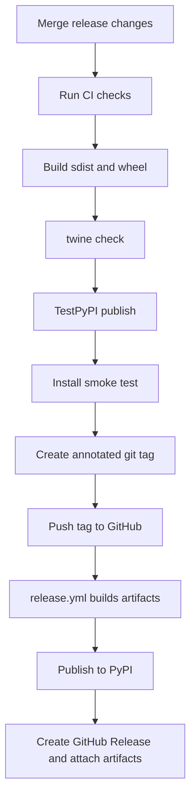

# Release

This page describes the release process for maintainers. A release is the point
where the project promises an installable artifact to external users, so the
process checks more than "tests passed": it also verifies documentation,
package metadata, security scanning, and command-line smoke tests.

For the full push-tag and PyPI publication runbook, see
[Publishing Releases](publishing.md).

## Versioning

`nats-sinks` uses semantic versioning. The `0.x` line may still adjust APIs,
but public behavior changes should be documented and called out in
`CHANGELOG.md` so users can make informed upgrade decisions.

Maintain release readiness during normal development. Every user-visible change
should update the relevant Markdown documentation and add an entry under the
`Unreleased` section in `CHANGELOG.md` before the work is considered complete.
When a release is prepared, move those entries into the versioned section for
the new tag and confirm that the README, docs site, examples, package metadata,
and CLI behavior describe the same release.

## Build

```bash
python -m build
twine check dist/*
```

## Release Flow



The release workflow does not create the git tag. Maintainers create and push
an annotated tag such as `v0.1.0`. The tag push starts
`.github/workflows/release.yml`; after the package is published to PyPI, the
workflow creates the GitHub Release page from that tag and uploads the built
source distribution and wheel as release assets.

Documentation publication is handled separately by Read the Docs. After the
one-time Read the Docs project import, pushes to `main` and release tags build
the documentation using `.readthedocs.yaml`. The GitHub Actions `Docs` workflow
builds the MkDocs site before changes are merged so Read the Docs publication
should normally be a confirmation step, not the first time documentation is
tested. See [Read the Docs](read-the-docs.md).

The repository can also publish a GitHub Pages mirror of the current `main`
documentation at
[projectcuillin.github.io/nats-sinks](https://projectcuillin.github.io/nats-sinks/)
through `.github/workflows/pages.yml`. GitHub Pages requires one repository
setting before the first deployment: `Settings` -> `Pages` -> `Source: GitHub
Actions`. See [GitHub Pages](github-pages.md).

The release workflow should also be reviewed when GitHub announces changes to
the JavaScript runtime used by GitHub Actions. First-party actions such as
artifact upload and artifact download should stay on versions that support the
current GitHub-hosted runner runtime. This avoids release annotations caused by
deprecated Node.js versions and keeps the publication path predictable for
external users.

## Checklist

- Confirm all user-visible changes are represented in Markdown documentation.
- Confirm `CHANGELOG.md` has a complete version section for this release and a
  clean `Unreleased` section for future work.
- Update `CHANGELOG.md`.
- Confirm `ruff format --check .`.
- Confirm `ruff check .`.
- Confirm `mypy src`.
- Confirm `python scripts/check-markdown-links.py`.
- Confirm `mkdocs build --strict`.
- Confirm `NATS_SINKS_DOCS_SITE_URL="https://projectcuillin.github.io/nats-sinks/" mkdocs build --strict`.
- Confirm `scripts/check-sinks.sh`.
- Confirm `pytest`.
- Confirm `bandit -q -r src`.
- Confirm `python -m build`.
- Confirm `twine check dist/*`.
- Smoke test `nats-sink --help`.
- Smoke test `nats-sink validate examples/file-basic/config.json`.
- Smoke test `nats-sink test-sink examples/file-basic/config.json`.
- Smoke test `nats-sink validate examples/oracle-jetstream/config.json`.
- Run deterministic file sink e2e: `pytest tests/integration/test_file_sink_e2e.py`.
- Run Oracle live integration and NATS-to-Oracle e2e when the required ignored
  `.local` environment files are available; otherwise document that they were
  not run in `docs/test-report.md`.
- Create and push an annotated `v*` tag.
- Confirm the GitHub Release exists and includes the built `dist/*` assets.
- Confirm Read the Docs built `latest` or the release tag successfully.
- Confirm the GitHub Pages mirror deployed successfully when documentation was
  changed on `main`.

Do not hardcode PyPI tokens. Prefer trusted publishing or OIDC.
