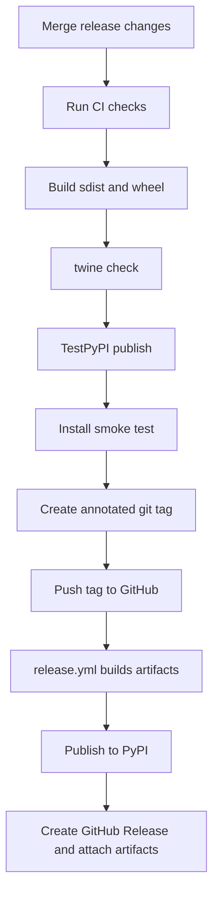

# Release

This page describes the release process for maintainers. A release is the point
where the project promises an installable artifact to external users, so the
process checks more than "tests passed": it also verifies documentation,
package metadata, security scanning, and command-line smoke tests.

For the full push-tag and PyPI publication runbook, see
[Publishing Releases](https://github.com/ProjectCuillin/nats-sinks/blob/main/docs/publishing.md).

## Versioning

`nats-sinks` uses semantic versioning. The `0.x` line may still adjust APIs,
but public behavior changes should be documented and called out in
`CHANGELOG.md` so users can make informed upgrade decisions.

## Build

```bash
python -m build
twine check dist/*
```

## Release Flow



The release workflow does not create the git tag. Maintainers create and push
an annotated tag such as `v0.1.0`. The tag push starts
`.github/workflows/release.yml`; after the package is published to PyPI, the
workflow creates the GitHub Release page from that tag and uploads the built
source distribution and wheel as release assets.

## Checklist

- Update `CHANGELOG.md`.
- Confirm `ruff format --check .`.
- Confirm `ruff check .`.
- Confirm `mypy src`.
- Confirm `python scripts/check-markdown-links.py`.
- Confirm `pytest`.
- Confirm `bandit -q -r src`.
- Confirm `python -m build`.
- Confirm `twine check dist/*`.
- Smoke test `nats-sink --help`.
- Smoke test `nats-sink validate examples/oracle-jetstream/config.json`.
- Create and push an annotated `v*` tag.
- Confirm the GitHub Release exists and includes the built `dist/*` assets.

Do not hardcode PyPI tokens. Prefer trusted publishing or OIDC.
