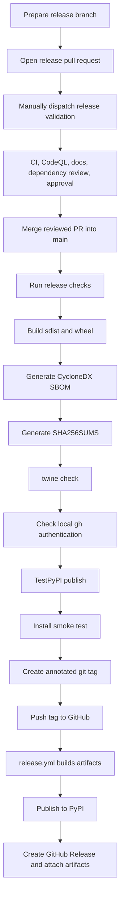

# Release

This page describes the release process for maintainers. A release is the point
where the project promises an installable artifact to external users, so the
process checks more than "tests passed": it also verifies documentation,
package metadata, security scanning, and command-line smoke tests.

For the full push-tag and PyPI publication runbook, see
[Publishing Releases](publishing.md).

All release preparation must happen on a release development branch. Do not
prepare releases by committing directly to `main`. Use a branch such as
`release-v0.4.1`, merge completed issue branches into it, keep GitHub Actions
quiet during ordinary branch work, create or update a draft pull request with
`scripts/open-release-pr.sh --base main`, and merge to `main` only after
manually dispatched release validation checks and maintainer review are
complete. See [Hierarchical Branch Development And Release Workflow](branch-workflow.md).

## Versioning

`nats-sinks` uses semantic versioning. The `0.x` line may still adjust APIs,
but public behavior changes should be documented and called out in
`CHANGELOG.md` so users can make informed upgrade decisions.

Maintain release readiness during normal development. Every user-visible change
should update the relevant Markdown documentation and add an entry under the
`Unreleased` section in `CHANGELOG.md` before the work is considered complete.
When a release is prepared, move those entries into the versioned section for
the new tag and confirm that the README, docs site, examples, package metadata,
and CLI behavior describe the same release.

GitHub Issues are the live backlog. The changelog is not a planning backlog; it
is the record of shipped or staged user-visible behavior. Before preparing a
release, review the issues labeled for the release and confirm each feature
request is assigned, has a sanitized implementation note, has checked
Acceptance Criteria, and has public sanitized `Test Plan Evidence` plus
`Close-Out Evidence` comments. See [Backlog Management](backlog-management.md).

## Build

```bash
python -m build
python scripts/update-dependency-manifests.py --check
scripts/sbom.sh
python scripts/generate-checksums.py dist
twine check dist/*.whl dist/*.tar.gz
```

## Post-Release PyPI Artifact Verification

Pre-release checks prove that the source tree and local build are healthy.
After a release, maintainers should also verify the artifact that external
users actually install from PyPI. This is a separate QA failsafe: it catches
packaging, dependency, metadata, and publication issues that can only be seen
after the package is available from the public registry.

Run the maintained local container check after publication:

```bash
python scripts/run-pypi-release-container-validation.py --version 0.4.1
```

To validate the newest public package without naming a version:

```bash
python scripts/run-pypi-release-container-validation.py --version latest
```

To include optional extras that can be checked without private infrastructure:

```bash
python scripts/run-pypi-release-container-validation.py \
  --version 0.4.1 \
  --extras crypto,mysql,oci
```

The script builds a temporary validation image from
`container-registry.oracle.com/os/oraclelinux:9-slim`, installs `nats-sinks`
from PyPI inside that container, verifies that `nats_sinks` imports from the
container virtual environment, and runs artifact-level smoke checks for CLI
startup, version reporting, public Python imports, configuration validation,
FileSink behavior, metrics snapshot inspection, and the observability CLI.
Generated reports are written under the ignored
`.local/pypi-release-validation/reports/` directory.

Expected sanitized output:

```text
PyPI artifact validation status: passed
Requested version: 0.4.1
Installed version: 0.4.1
Report: .local/pypi-release-validation/reports/nats-sinks-pypi-artifact-0_4_1-20260525T120000Z-abc123.json
```

This post-release check is intentionally local-only. Do not add it to GitHub
Actions by default, because it validates public registry state after
publication and should run under maintainer control. If the check finds a
defect, create a sanitized GitHub bug issue first, attach the minimal
reproduction and local evidence, and then fix the issue through the normal
test-driven bug workflow.

## Release Flow



The release workflow does not create the git tag. Maintainers create and push
an annotated tag such as `v0.1.0` from a commit already merged into `main`.
The tag push starts
`.github/workflows/release.yml`; after the package is published to PyPI, the
workflow creates the GitHub Release page from that tag and uploads the built
source distribution, wheel, `SHA256SUMS`, and CycloneDX SBOM files as release
assets. SBOM files and checksums are release evidence and are not uploaded to
PyPI.

The release workflow validates that the tag commit is contained in `main`.
This prevents accidental publication from an unmerged release branch.

After the GitHub Release exists, release automation closes open managed backlog
issues labeled for the release tag. For example, an open issue labeled
`backlog` and `release-v0.4.0` closes only after the `v0.4.0` GitHub Release
has been created or updated. This keeps feature requests open while work is
merely pending push, merged, or waiting for publication. The close-out helper
also checks that all Acceptance Criteria are ticked and that the issue has
sanitized test-plan and close-out evidence comments before it closes anything.

Documentation publication is handled separately by Read the Docs. After the
one-time Read the Docs project import, pushes to `main` and release tags build
the documentation using `.readthedocs.yaml`. The GitHub Actions `Docs` workflow
builds the MkDocs site before changes are merged so Read the Docs publication
should normally be a confirmation step, not the first time documentation is
tested. See [Read the Docs](read-the-docs.md).

The repository can also publish a GitHub Pages mirror of the current `main`
documentation at
[projectcuillin.github.io/nats-sinks](https://projectcuillin.github.io/nats-sinks/)
through `.github/workflows/pages.yml`. GitHub Pages requires one repository
setting before the first deployment: `Settings` -> `Pages` -> `Source: GitHub
Actions`. See [GitHub Pages](github-pages.md).

The release workflow should also be reviewed when GitHub announces changes to
the JavaScript runtime used by GitHub Actions. First-party actions such as
artifact upload and artifact download should stay on versions that support the
current GitHub-hosted runner runtime. This avoids release annotations caused by
deprecated Node.js versions and keeps the publication path predictable for
external users.

## Local GitHub CLI Authentication

Maintainers commonly use the GitHub CLI to inspect release workflows after a
tag is pushed:

```bash
gh run list --limit 10
gh run view --log
gh release view v0.3.0
```

Those commands depend on local `gh` authentication. They are separate from PyPI
Trusted Publishing: the release workflow itself uses GitHub Actions
permissions and PyPI OIDC, not the maintainer's local token. A stale local
`GH_TOKEN`, `GITHUB_TOKEN`, or stored `gh` credential can still make local
workflow inspection fail after a successful push.

Before pushing a release tag, run:

```bash
scripts/check-gh-auth.sh
```

The helper performs a small authenticated GitHub API probe for `github.com`
without printing response bodies or token values. If authentication is not valid
and an interactive terminal is available, it asks whether it should start
browser-based login with:

```bash
gh auth login --hostname github.com --web
```

For CI or non-interactive checks, use:

```bash
scripts/check-gh-auth.sh --check-only
```

The helper never prints token values. If it reports that `GH_TOKEN` or
`GITHUB_TOKEN` is set, verify that the token is still valid or unset it before
relying on the stored GitHub CLI login.

## Checklist

- Confirm the release branch has an open pull request into `main`.
- Confirm `main` branch protection requires pull request review and CI.
- Confirm `scripts/run-release-validation.sh` has dispatched release validation
  for the release branch.
- Confirm the release pull request has maintainer approval before merge.
- Confirm all user-visible changes are represented in Markdown documentation.
- Confirm every user-visible feature has a linked GitHub issue or a documented
  reason why no issue was needed.
- Confirm release-labeled feature requests are assigned, have an implementation
  note, have all Acceptance Criteria checked, and include sanitized test-plan
  and close-out evidence comments.
- Confirm `CHANGELOG.md` has a complete version section for this release and a
  clean `Unreleased` section for future work.
- Update `CHANGELOG.md`.
- Confirm `scripts/check-gh-auth.sh` before pushing release tags so local
  workflow-status inspection works after the push.
- Confirm `ruff format --check .`.
- Confirm `ruff check .`.
- Confirm `mypy src`.
- Confirm `python scripts/check-markdown-links.py`.
- Confirm `scripts/check-docs.sh`.
- Confirm `scripts/check-sinks.sh`.
- Confirm `NATS_SINKS_RUN_CONTAINER_E2E=1 scripts/check-sinks.sh` when Docker
  and the optional Oracle NoSQL Database and Oracle Coherence clients are
  available locally; otherwise document the skip in `docs/test-report.md`.
- Confirm `pytest`.
- Confirm `bandit -q -r src`.
- Confirm `python scripts/update-dependency-manifests.py --check`.
- Confirm `python -m build`.
- Confirm `scripts/sbom.sh`.
- Confirm `python scripts/generate-checksums.py dist`.
- Confirm `twine check dist/*.whl dist/*.tar.gz`.
- Smoke test `nats-sink --help`.
- Smoke test `nats-sink validate examples/file-basic/config.json`.
- Smoke test `nats-sink test-sink examples/file-basic/config.json`.
- Smoke test `nats-sink validate examples/oracle-jetstream/config.json`.
- Run deterministic file sink e2e: `pytest tests/integration/test_file_sink_e2e.py`.
- Run Oracle live integration and NATS-to-Oracle e2e when the required ignored
  `.local` environment files are available; otherwise document that they were
  not run in `docs/test-report.md`.
- Merge the reviewed release pull request into `main`.
- Create and push an annotated `v*` tag from `main`.
- Confirm the GitHub Release exists and includes the built wheel, source
  distribution, `SHA256SUMS`, and `dist/sbom/*.cyclonedx.*` assets.
- Run the local PyPI artifact validation container against the published
  version:
  `python scripts/run-pypi-release-container-validation.py --version X.Y.Z`.
- Confirm release-labeled backlog issues were closed only after the GitHub
  Release exists and only after acceptance criteria plus evidence comments were
  present.
- Confirm Read the Docs built `latest` or the release tag successfully.
- Confirm the GitHub Pages mirror deployed successfully when documentation was
  changed on `main`.
- After PyPI publication, run the local post-release PyPI artifact verification
  container check when available. Until the harness is implemented, run the
  manual clean-container smoke check above and document the result in the local
  release notes.
- If the post-release PyPI artifact verification finds an issue, create a
  sanitized GitHub bug report and start the agreed test-driven bug workflow
  before changing code.

Do not hardcode PyPI tokens. Prefer trusted publishing or OIDC.
