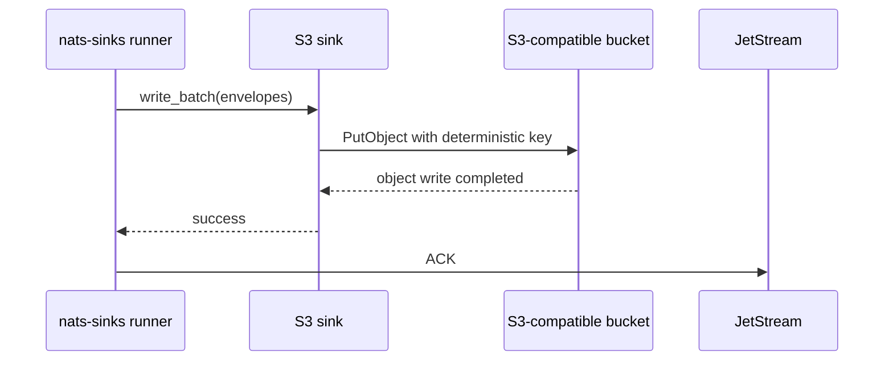

# S3-Compatible Object Sink

The S3-compatible object sink is a first-party production sink for writing
normalized JetStream events to one operator-configured object-storage bucket.
It is intended for S3-compatible APIs where an object key can act as the
idempotency boundary and where the operator controls bucket policy,
encryption, retention, lifecycle, and recovery.

The sink follows the same core rule as the other production sinks:

```text
Commit first. ACK last. Design for redelivery.
```

The sink itself never ACKs NATS messages. A batch succeeds only after every
selected object write has completed according to the configured duplicate
policy. The core runner ACKs after `S3Sink.write_batch(...)` returns success.

## Install

The base package does not install the AWS SDK dependency used for
S3-compatible APIs. Install the optional extra when this sink will be used:

```bash
python -m pip install "nats-sinks[s3]"
```

Expected package metadata includes:

```text
boto3>=1.34,<2
```

Unit tests for the sink use fake clients and make no network calls. Live
integration tests against an object-storage service should remain explicitly
environment-gated because endpoint, identity, bucket, and retention policy are
operator-owned production concerns.

## Minimal Configuration

```json
{
  "nats": {
    "url": "nats://localhost:4222",
    "stream": "EVENTS",
    "consumer": "s3-events-sink",
    "subject": "events.>"
  },
  "sink": {
    "type": "s3",
    "bucket": "nats-sinks-events"
  }
}
```

Validate the tracked example without connecting to object storage:

```bash
nats-sink validate examples/s3-basic/config.json
```

Expected output:

```text
Configuration is valid.
Active sink: s3
ACK policy: commit-then-acknowledge
```

`nats-sink test-sink` initializes the real SDK client and may contact the
configured service. Keep that command for reviewed local or live environments
where the S3-compatible endpoint and credentials are intentionally available.

## Delivery Boundary



The durable success boundary is the configured object-storage service
accepting the object write. A timeout or network failure is ambiguous: the
service may have stored the object even if the client did not receive a
response. The default duplicate policy is therefore `skip_existing`, and the
default key strategy is deterministic.

## Complete Configuration Example

```json
{
  "sink": {
    "type": "s3",
    "bucket": "nats-sinks-events",
    "prefix": "mission/events",
    "endpoint_url": "https://object-store.example.invalid",
    "region_name": "eu-amsterdam-1",
    "credential_mode": "environment",
    "aws_access_key_id_env": "NATS_SINKS_S3_ACCESS_KEY_ID",
    "aws_secret_access_key_env": "NATS_SINKS_S3_SECRET_ACCESS_KEY",
    "aws_session_token_env": "NATS_SINKS_S3_SESSION_TOKEN",
    "key_strategy": "stream_sequence",
    "key_prefix": "archive",
    "object_suffix": ".json",
    "duplicate_policy": "skip_existing",
    "object_format": "envelope",
    "metadata_mode": "sidecar",
    "sidecar_suffix": ".metadata.json",
    "payload_mode": "json_or_envelope",
    "compression": "none",
    "content_type": "application/json",
    "object_metadata": {
      "purpose": "archive"
    },
    "server_side_encryption": "AES256",
    "max_key_bytes": 1024,
    "max_object_bytes": 16777216,
    "max_metadata_bytes": 4096,
    "request_timeout_seconds": 10,
    "max_retries": 2,
    "retry_backoff_ms": 250,
    "retry_max_backoff_ms": 5000,
    "retry_backoff_mode": "exponential",
    "retry_backoff_multiplier": 2.0,
    "retry_jitter": "full"
  }
}
```

## Configuration Reference

| Field | Required | Default | Valid values | Description |
| --- | --- | --- | --- | --- |
| `type` | yes | none | `s3` | Selects the S3-compatible object sink. |
| `bucket` | yes | none | DNS-style bucket name, 3 to 63 characters. | Destination bucket. It must be lowercase and must not look like an IP address. |
| `prefix` | no | none | Safe object-key path segments. | Optional bucket prefix. Leading slash, trailing slash, empty segments, `.` and `..` are rejected. |
| `endpoint_url` | no | SDK default | HTTPS URL without path, query, fragment, or credentials. | Optional S3-compatible endpoint. HTTP is accepted only for explicit loopback local testing. |
| `allow_http_for_local_testing` | no | `false` | `true` or `false`. | Allows `http://localhost`, `http://127.0.0.1`, or `http://[::1]` endpoints only for local tests. |
| `region_name` | no | SDK default | Bounded non-secret region text. | Region passed to the SDK session. |
| `credential_mode` | no | `default_chain` | `default_chain`, `environment`, or `profile`. | Selects the SDK credential source. |
| `profile_name` | no | none | Bounded SDK profile name. | Required only with `credential_mode="profile"`. |
| `aws_access_key_id_env` | no | none | Environment variable name. | Required with `credential_mode="environment"`. The value is resolved at runtime and never printed by config review. |
| `aws_secret_access_key_env` | no | none | Environment variable name. | Required with `credential_mode="environment"`. |
| `aws_session_token_env` | no | none | Environment variable name. | Optional session-token variable for temporary credentials. |
| `key_strategy` | no | `idempotency_key` | `idempotency_key`, `stream_sequence`, `message_id`, or `payload_sha256`. | Determines the deterministic object key. |
| `key_prefix` | no | none | Safe bounded text. | Prepended to the generated key namespace. |
| `object_suffix` | no | `.json` | Simple extension such as `.json` or `.json.gz`. | Suffix appended to primary object keys. |
| `duplicate_policy` | no | `skip_existing` | `skip_existing`, `replace`, or `fail_existing`. | Behavior when a conditional write finds an existing object. |
| `object_format` | no | `envelope` | `envelope` or `payload`. | Writes the full normalized event or only the normalized payload value. |
| `metadata_mode` | no | `object_metadata` | `none`, `object_metadata`, or `sidecar`. | Controls low-sensitivity object metadata and optional metadata sidecar objects. |
| `sidecar_suffix` | no | `.metadata.json` | Simple extension. | Suffix for metadata sidecar objects. |
| `payload_mode` | no | `json_or_envelope` | Shared payload mode. | Controls JSON, text, and bytes normalization before object generation. |
| `compression` | no | `none` | `none` or `gzip`. | Gzip compression uses Python's standard library. Use a compressed suffix such as `.json.gz`. |
| `content_type` | no | `application/json` | `application/json`. | Current object content type. |
| `object_metadata` | no | `{}` | Up to 32 bounded string pairs. | Static low-cardinality metadata. Secret-bearing names such as `Authorization` are rejected. |
| `server_side_encryption` | no | `none` | `none` or `AES256`. | Requests provider-managed server-side encryption where the compatible service supports it. |
| `max_key_bytes` | no | `1024` | `64` to `1024`. | UTF-8 object-key size limit. |
| `max_object_bytes` | no | `16777216` | `1` to `1073741824`. | Maximum primary or sidecar object body size after compression. |
| `max_metadata_bytes` | no | `4096` | `128` to `65536`. | Maximum aggregate object metadata size. |
| `request_timeout_seconds` | no | `10` | `>0` to `300`. | Per-object timeout around the client write call. |
| `max_retries` | no | `0` | `0` to `10`. | In-sink retries for destination-unavailable failures. |
| `retry_backoff_ms` | no | `250` | `0` to `60000`. | Initial retry backoff. |
| `retry_max_backoff_ms` | no | `5000` | `0` to `300000`. | Retry backoff cap. |
| `retry_backoff_mode` | no | `exponential` | `fixed`, `linear`, or `exponential`. | Shared retry scheduler mode. |
| `retry_backoff_multiplier` | no | `2.0` | `1.0` to `10.0`. | Exponential multiplier. |
| `retry_jitter` | no | `full` | `none`, `full`, or `equal`. | Jitter mode for retries. |

## Object Key Strategies

| Strategy | Key shape | Required message data | Guidance |
| --- | --- | --- | --- |
| `idempotency_key` | `idempotency-key/<safe-envelope-key>.json` | Stable framework idempotency key. | Recommended default. Prefers stream sequence, then message ID, then payload hash when safe. |
| `stream_sequence` | `stream-sequence/<stream>/<sequence>.json` | JetStream stream and sequence. | Recommended for normal durable JetStream consumers. |
| `message_id` | `message-id/<Nats-Msg-Id>.json` | Publisher message ID. | Use only when publishers reliably set unique IDs. |
| `payload_sha256` | `payload-sha256/<subject>/<digest>.json` | Payload bytes and subject. | Useful for controlled archives where identical payloads should collapse. Avoid as the only identity when payload encryption is enabled. |

The sink normalizes unsafe key characters into deterministic safe components,
then enforces the configured key-size limit. Message content never selects a
bucket, endpoint, credential source, or arbitrary object prefix.

## Duplicate Policies

| Policy | Client behavior | Redelivery effect |
| --- | --- | --- |
| `skip_existing` | Put with `If-None-Match: *`; an existing key is treated as prior success. | Recommended default for at-least-once delivery. |
| `replace` | Put without the conditional header. | Overwrites existing objects. Use only when replacement is intentional and reviewed. |
| `fail_existing` | Put with `If-None-Match: *`; an existing key raises a permanent sink error. | Useful when duplicates should go to DLQ or operator review. Not allowed with sidecar metadata mode. |

`skip_existing` is the safest default because redelivery after a crash can
arrive after the object was already stored but before the original ACK reached
JetStream.

## Stored Object Shape

With `object_format="envelope"`, the primary object contains the normalized
event:

```json
{
  "schema": "nats_sinks.s3.object.v1",
  "schema_version": 1,
  "subject": "events.created",
  "stream": "EVENTS",
  "stream_sequence": 42,
  "consumer": "s3-events-sink",
  "consumer_sequence": 7,
  "message_id": "event-42",
  "priority": "normal",
  "classification": "unclassified",
  "labels": "archive;audit",
  "labels_list": ["archive", "audit"],
  "payload": {
    "event_id": "event-42",
    "status": "accepted"
  },
  "payload_info": {
    "original_format": "json",
    "wrapped": false,
    "sha256": "example-redacted",
    "size_bytes": 42
  },
  "mission_metadata": null,
  "security_labels": null,
  "custody": null,
  "metadata": {
    "schema": "nats_sinks.metadata.v1"
  }
}
```

With `object_format="payload"`, the object body is only the normalized payload
JSON value. Use that mode only when the downstream process does not need the
standard event metadata inside the object body.

## Metadata Modes

| Mode | Behavior |
| --- | --- |
| `none` | Sends no object metadata beyond the object body. |
| `object_metadata` | Adds low-sensitivity static metadata and nats-sinks schema hints to object metadata. Raw subjects, classifications, labels, payloads, table names, and message IDs are not added by default. Message ID is represented only as a SHA-256 hash when present. |
| `sidecar` | Writes the primary object plus a deterministic sidecar object containing event metadata and payload hashes, without duplicating the payload body. |

Sidecar writes are useful when downstream object readers need a smaller
metadata document next to large payload-focused objects. Sidecar mode is not
allowed with `duplicate_policy="fail_existing"` because a duplicate primary
object plus missing sidecar is a recovery shape, not a permanent data error.

## Least Privilege

Give the sink identity only the minimum bucket permissions needed for the
chosen policy:

| Sink setting | Minimum operation shape |
| --- | --- |
| `skip_existing` | Put object with conditional create semantics for the configured prefix. |
| `replace` | Put object for the configured prefix. Review overwrite permission carefully. |
| `metadata_mode="sidecar"` | Put object for both the primary prefix and sidecar suffix. |

Avoid granting bucket administration, lifecycle management, policy editing,
delete, list-all-buckets, or unrelated prefix access to the sink process. When
the storage service supports scoped credentials, bind the identity to the
specific bucket and prefix used by the configuration.

## Privacy And Security Notes

- Treat bucket names, prefixes, object keys, timestamps, stream names, and
  object counts as operational metadata.
- Do not put secrets, private endpoint details, classification values, labels,
  subjects, payload fields, or message IDs into `object_metadata`.
- Use environment-backed credentials or a reviewed SDK profile. Do not store
  access keys in JSON configuration.
- Prefer HTTPS endpoints. Cleartext HTTP is accepted only for loopback local
  testing after `allow_http_for_local_testing=true`.
- Provider-managed server-side encryption can protect stored objects at rest,
  but it does not encrypt subjects, object keys, bucket names, metrics, logs,
  or issue comments.
- Framework payload encryption still protects only payload bytes before the
  sink sees them. Metadata remains visible unless separately protected by the
  destination and operational process.

## Fan-Out Example

This example requires Oracle Database before ACK and gives the S3 archive copy
a bounded optional window. The optional S3 copy may complete before ACK, but it
is not part of the required custody path:

```json
{
  "sink": {
    "type": "fanout"
  },
  "sinks": {
    "oracle_primary": {
      "type": "oracle",
      "dsn": "tcps://database.example.invalid/service",
      "user": "app_user",
      "password_env": "NATS_SINKS_ORACLE_PASSWORD",
      "table": "NATS_SINK_EVENTS"
    },
    "s3_archive": {
      "type": "s3",
      "bucket": "nats-sinks-events",
      "prefix": "archives/events",
      "key_strategy": "stream_sequence"
    }
  },
  "routing": {
    "enabled": true,
    "target_sink_types": {
      "oracle_primary": "oracle",
      "s3_archive": "s3"
    },
    "routes": [
      {
        "name": "archive_events",
        "match": {
          "subject": "events.>"
        },
        "targets": [
          "oracle_primary",
          {
            "sink": "s3_archive",
            "required": false,
            "minimum_wait_ms": 1000,
            "timeout_ms": 5000
          }
        ]
      }
    ]
  }
}
```

If `minimum_wait_ms` or `timeout_ms` is omitted for an optional S3 target, the
configuration loader applies the S3 defaults: `1000` ms minimum wait and
`5000` ms timeout.

## Testing

Local unit and CLI checks:

```bash
python -m pytest tests/unit/test_s3_sink.py -q
python -m pytest tests/unit/test_cli.py::test_cli_validates_s3_sink_config -q
nats-sink validate examples/s3-basic/config.json
```

Expected example validation output:

```text
Configuration is valid.
Active sink: s3
ACK policy: commit-then-acknowledge
```

Live tests should be added only behind explicit environment gates such as
`NATS_SINKS_RUN_S3_E2E=1`, with fake payloads, temporary prefixes, scoped
credentials, bounded object sizes, cleanup guidance, and sanitized reports.
Do not run live object-storage tests from the default unit suite.

## Recovery

For normal outages, leave the JetStream message unacknowledged or NAKed through
the core delivery policy and let redelivery retry the same deterministic key.
For object stores with delayed visibility or partial failures, prefer
`skip_existing` and review sidecar recovery separately. If a sidecar is missing
after a duplicate primary object, the sink attempts to write the deterministic
sidecar during redelivery.

When operators need to repair an archive manually, use the object key strategy,
stream sequence, message ID, payload hash, and stored object schema to
reconcile objects. Never paste object contents, credentials, bucket policies,
private endpoint names, or sensitive metadata into issue comments or release
evidence.
