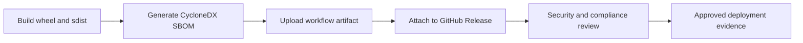
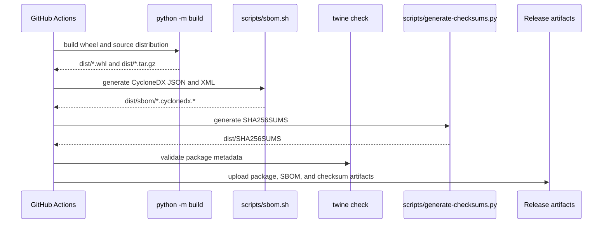

# SBOM And Release Evidence

An SBOM, or Software Bill of Materials, is a machine-readable inventory of the
software components present in a build environment or release artifact. For a
Python package, it normally records the package itself, installed dependencies,
dependency versions, package URLs, licenses when available, and metadata that
security tools can use for vulnerability matching.

`nats-sinks` generates CycloneDX SBOM files as release evidence. The SBOM does
not change runtime behavior, does not make network calls at runtime, and does
not contain NATS messages, payloads, credentials, Oracle wallet material,
certificates, private keys, or live service addresses.

## Why SBOMs Matter

SBOMs help operators and security teams answer practical questions:

- Which Python packages were present when this release was built?
- Which versions should be checked when a dependency vulnerability is announced?
- Which licenses and package identities should be reviewed by a consuming
  organization?
- What evidence can be attached to a GitHub Release for audit and compliance
  workflows?

In mission-oriented, defence, public-sector, and regulated environments, this
kind of dependency transparency is often part of the approval path before a
package can be deployed into controlled infrastructure.



## Generated Files

The local script writes SBOM files under `dist/sbom/`:

```text
dist/sbom/nats-sinks-<version>.cyclonedx.json
dist/sbom/nats-sinks-<version>.cyclonedx.xml
```

The release build also writes a checksum manifest:

```text
dist/SHA256SUMS
```

That manifest contains SHA-256 hashes for the wheel, source distribution, and
SBOM files. It is attached to GitHub Releases alongside the package artifacts
and SBOM evidence.

Both formats describe the same inventory:

- JSON is convenient for automated processing and CI tools.
- XML is useful for security platforms that expect CycloneDX XML.

The files are build artifacts and are ignored by git because the `dist/`
directory is ignored. Release workflows upload them as artifacts and attach
them to GitHub Releases.

## Local Generation

Install development dependencies:

```bash
python -m pip install -e ".[dev]"
```

Build the package and generate SBOM files:

```bash
python -m build
scripts/sbom.sh
python scripts/generate-checksums.py dist
```

The script accepts an optional output directory:

```bash
scripts/sbom.sh /tmp/nats-sinks-sbom
```

The script uses `cyclonedx-bom` through:

```bash
python -m cyclonedx_py environment
```

It passes `--pyproject pyproject.toml`, marks the main component as a
`library`, and uses reproducible CycloneDX output. The resulting SBOM reflects
the Python environment used to build and validate the package. In CI and
release workflows, that environment is the controlled GitHub Actions build
environment after the project development, Oracle, and documentation
dependencies have been installed.

## Automated Build Integration

SBOM generation is part of the local release build:

```bash
scripts/release-build.sh
```

It is also part of the full local repository check:

```bash
scripts/check.sh
```

CI and release automation run `scripts/sbom.sh` after `python -m build` and
before release artifacts are uploaded.



The release workflow keeps PyPI package artifacts separate from SBOM artifacts.
Only wheels and source distributions are sent to PyPI. SBOM files and
`SHA256SUMS` are uploaded as GitHub Actions artifacts and attached to the
GitHub Release page.

## Container Image Evidence

The Python package SBOM is release evidence for the package distribution. A
container image also contains operating-system packages, image metadata, and
runtime configuration expectations. Operators who build or publish the
`nats-sinks` container should generate container-specific evidence in the same
approval workflow:

- record the source Git revision and final image digest;
- generate a container SBOM with an approved tool such as Syft, Trivy, Docker
  Scout, or an internal platform scanner;
- scan the final image with the vulnerability tool accepted by the consuming
  environment;
- sign the image or attach signed provenance where the registry supports it;
- keep the scanner output sanitized before it is copied into public issues or
  external reports; and
- retain any risk-acceptance decisions with the deployment evidence package.

The tracked Dockerfile includes OCI labels for source, documentation, version,
revision, creation time, license, vendor, and base image. Those labels help
link a running image back to the release evidence without embedding secrets or
environment-specific data. See [Production Container Hardening](container-hardening.md)
for the complete container hardening checklist.

## Security Notes

SBOM files are safe to publish as release evidence, but they still disclose
useful operational information about package versions and dependency choices.
Treat them as public release metadata, not as secrets.

SBOM files must not include:

- NATS server addresses,
- usernames or passwords,
- tokens,
- private keys,
- Oracle wallet files,
- TLS certificate contents,
- message payloads,
- local `.local/` test configuration.

The generated CycloneDX files are derived from Python package metadata and the
build environment, not from runtime configuration files or live systems.

## Relationship To Vulnerability Scanning

An SBOM is an inventory. It does not, by itself, decide whether a dependency is
safe. A consuming organization can feed the SBOM into tools such as Dependency
Track, Grype, Trivy, OSV-Scanner, commercial vulnerability platforms, or
internal governance systems.

`nats-sinks` also keeps other supply-chain controls active:

- Dependabot for dependency update visibility,
- GitHub dependency review for pull requests,
- CodeQL for static analysis,
- `scripts/security.sh` for secret scanning and Bandit checks,
- release-version consistency checks,
- public API compatibility checks.

## Current Limitations

The generated SBOM represents the Python build environment used by the
automation. It is strong release evidence, but it is not a lock file and does
not replace controlled dependency pinning for high-trust deployments.

Organizations that require hash-verified installs or fully locked production
environments should combine the SBOM with their own dependency lock process,
artifact mirror, vulnerability scanning, and deployment approval workflow. See
[Hash-Verified Installs](hash-verified-installs.md) for concrete `pip
--require-hashes` guidance.
