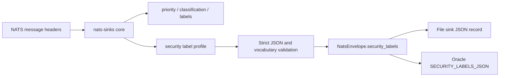
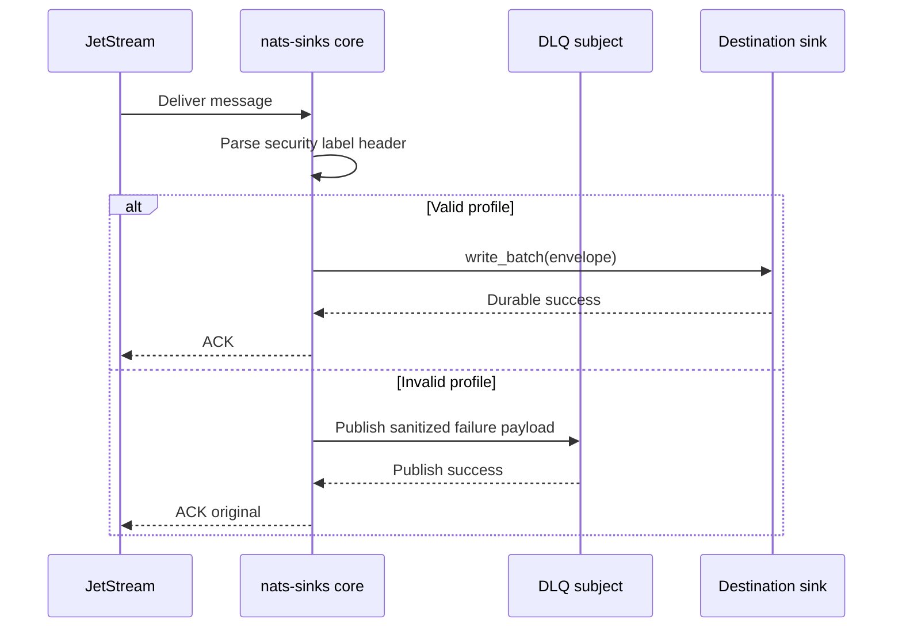

# Data-Centric Security Label Profile

`nats-sinks` can carry an optional data-centric security label profile next to
each message. The profile is a structured JSON metadata object that extends the
core `priority`, `classification`, and `labels` fields with policy-oriented
attributes such as releasability, handling caveats, owner, originator, policy
identifier, and retention category.

The profile is generic. It is useful in defence, public-sector, regulated, and
mission-support environments, but it is not limited to those domains. A
logistics platform might use the same shape for retention and audit policy. A
secure telemetry fabric might use it to preserve data-owner and release-policy
context before events are written to Oracle Database, Oracle Autonomous
Database, the file sink, or a future destination.

The profile is metadata only. It can inform downstream authorization, routing,
retention, and audit controls, but it does not enforce access control by
itself. Destination systems and the surrounding platform must still enforce
authorization, compartment rules, and data-release decisions.

## Processing Model

Security labels are normalized by the core before a sink sees the message. This
keeps Oracle, file, and future sinks consistent.



If validation fails, the message is treated as a permanent pre-sink failure. If
DLQ is configured, the original message is acknowledged only after the DLQ
publish succeeds.



## Configuration

The feature is disabled by default.

```json
{
  "security_labels": {
    "enabled": true,
    "header": "Nats-Sinks-Security-Labels",
    "max_bytes": 8192,
    "allowed_priorities": ["routine", "priority", "immediate", "flash"],
    "allowed_classifications": [
      "NATO UNCLASSIFIED",
      "NATO RESTRICTED",
      "NATO CONFIDENTIAL",
      "NATO SECRET"
    ],
    "allowed_releasability": ["NATO", "FVEY", "EU"],
    "allowed_handling_caveats": ["MISSION", "TRAINING", "EXERCISE"],
    "allowed_retention_categories": ["mission-log-30d", "mission-log-1y"],
    "default": {
      "profile": "nats-sinks.security-label.v1",
      "classification": "NATO RESTRICTED",
      "releasability": ["NATO"],
      "handling_caveats": ["MISSION"],
      "owner": "example-owner",
      "originator": "example-originator",
      "policy_id": "example-policy",
      "retention_category": "mission-log-30d"
    },
    "rules": [
      {
        "subject": "mission.sensor.>",
        "profile": {
          "profile": "nats-sinks.security-label.v1",
          "classification": "NATO SECRET",
          "releasability": ["NATO", "FVEY"],
          "handling_caveats": ["MISSION"],
          "owner": "example-sensor-domain",
          "originator": "example-originator",
          "policy_id": "example-mission-policy",
          "retention_category": "mission-log-1y"
        }
      }
    ]
  }
}
```

### Configuration Options

| Option | Required | Default | Valid values | Effect |
| --- | --- | --- | --- | --- |
| `enabled` | no | `false` | `true` or `false` | Enables parsing, validation, and sink delivery of the security label profile. |
| `header` | no | `Nats-Sinks-Security-Labels` | Non-empty header name without control characters | Header read from each NATS message when producers provide the profile. |
| `default` | no | `null` | JSON object or `null` | Global profile used when the header is absent and no subject rule matches. |
| `rules` | no | `[]` | Array of subject/profile rules | Subject-specific defaults evaluated before the global default. |
| `max_bytes` | no | `8192` | Integer from `1` to `262144` | Maximum canonical JSON size for one profile. |
| `allowed_priorities` | no | `[]` | Array of strings | Optional fail-closed vocabulary for `priority`. Empty means unrestricted. |
| `allowed_classifications` | no | `[]` | Array of strings | Optional fail-closed vocabulary for `classification`. Empty means unrestricted. |
| `allowed_releasability` | no | `[]` | Array of strings | Optional fail-closed vocabulary for every releasability value. |
| `allowed_handling_caveats` | no | `[]` | Array of strings | Optional fail-closed vocabulary for every handling caveat. |
| `allowed_retention_categories` | no | `[]` | Array of strings | Optional fail-closed vocabulary for `retention_category`. |

Subject rules have this shape:

| Option | Required | Default | Valid values | Effect |
| --- | --- | --- | --- | --- |
| `subject` | yes | none | NATS subject pattern | Applies the rule to matching subjects. |
| `profile` | yes | none | JSON object or `null` | Default profile for matching subjects. `null` clears the global default. |

## Profile Fields

The root object is intentionally small and allow-listed:

| Field | Type | Required | Description |
| --- | --- | --- | --- |
| `profile` | string | no | Must be `nats-sinks.security-label.v1`. Missing values are normalized to that profile name. |
| `priority` | string or `null` | no | Optional structured copy of the normalized message priority. If omitted, the core fills it from `message_metadata.priority`. |
| `classification` | string or `null` | no | Optional structured copy of the normalized message classification. If omitted, the core fills it from `message_metadata.classification`. |
| `labels` | array of strings | no | Optional structured copy of normalized labels. If omitted, the core fills it from `message_metadata.labels`. |
| `releasability` | array of strings | no | Release audience markers such as `NATO`, `FVEY`, or another deployment-approved vocabulary. |
| `handling_caveats` | array of strings | no | Handling caveats such as `MISSION`, `TRAINING`, or deployment-specific values. |
| `owner` | string or `null` | no | Data owner, system owner, or policy owner. Use synthetic values in public examples. |
| `originator` | string or `null` | no | Event originator or producing domain. |
| `policy_id` | string or `null` | no | Reference to an internal policy, marking guide, or retention rule. |
| `retention_category` | string or `null` | no | Retention category such as `mission-log-30d`. |
| `extensions` | JSON object | no | Bounded deployment-specific extension object. Secret-looking key names are rejected. |

Unknown root fields are rejected. This keeps the profile easy to review and
prevents misspelled policy fields from silently entering storage.

## Publisher Header Example

The header value is JSON:

```text
Nats-Sinks-Security-Labels: {"profile":"nats-sinks.security-label.v1","classification":"NATO SECRET","releasability":["NATO","FVEY"],"handling_caveats":["MISSION"],"policy_id":"example-policy","retention_category":"mission-log-1y"}
```

The core never logs the full profile by default. Error messages identify the
failed field or reason without echoing sensitive values.

## Storage Effects

File sink records include the profile as top-level `security_labels` and inside
the standard `metadata.security_labels` object:

```json
{
  "schema": "nats_sinks.file.message.v1",
  "subject": "mission.sensor.track",
  "classification": "NATO SECRET",
  "labels_list": ["sensor", "track"],
  "security_labels": {
    "profile": "nats-sinks.security-label.v1",
    "priority": "immediate",
    "classification": "NATO SECRET",
    "labels": ["sensor", "track"],
    "releasability": ["NATO", "FVEY"],
    "handling_caveats": ["MISSION"],
    "owner": "example-owner",
    "originator": "example-originator",
    "policy_id": "example-policy",
    "retention_category": "mission-log-1y"
  }
}
```

Oracle rows store the same object in `SECURITY_LABELS_JSON` and in
`METADATA_JSON.security_labels`. See
[Oracle Sink](https://nats-sinks.readthedocs.io/en/latest/oracle-sink/) for the
full table layout.

## Security Notes

- Treat profile values as sensitive operational metadata.
- Keep public examples synthetic.
- Use allow lists when a deployment has an approved vocabulary.
- Do not rely on labels alone for authorization.
- Do not export profile values as high-cardinality Prometheus labels.
- Keep DLQ handling, audit storage, backups, and retention aligned with the
  highest classification represented by the stored events.
