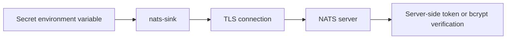
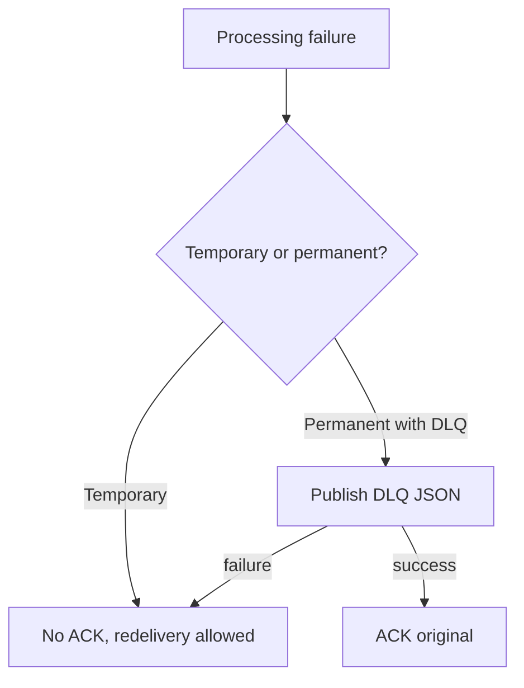

# Security

Security defaults are part of the project design. `nats-sinks` sits between a
message broker and durable destinations, so a mistake can expose data or lose
processing guarantees. The core runtime and sinks must avoid silent data loss,
secret leakage, unsafe configuration parsing, unsafe SQL construction, and
non-deterministic tests.

This page is written for both application developers and operators. Developers
should use it when adding sinks or changing runtime behavior. Operators should
use it when preparing production configuration and deployment environments.

## Secrets

Do not commit credentials. Use environment variables, secret stores, and `password_env` for Oracle passwords.

The CLI redacts fields with names containing:

- `password`
- `token`
- `secret`
- `private_key`
- `credentials`
- `creds`

Resolved passwords are not printed.

## JSON Configuration

Runtime config uses JSON. JSON avoids parser features that are not needed for this package and gives operators a direct mapping to the validated Pydantic model tree.

## Payload Privacy

Payload logging is disabled by default. Treat message payloads as sensitive unless a deployment explicitly proves otherwise.

## NATS Security

Production deployments should use:

- TLS,
- authenticated connections,
- TLS verification enabled.

Do not disable TLS verification outside controlled local development.

Supported NATS client authentication modes in this release are documented in
[NATS Connections And Authentication](nats-connections.md). In short:

- use `nats.token_env` for token authentication,
- use `nats.user` and `nats.password_env` for username/password authentication,
- use the same client-side username/password configuration when the NATS server
  stores a bcrypted password hash,
- use `nats.tls_ca_file` to trust a local CA certificate for private or
  self-signed NATS server certificates.

Bcrypt is a server-side storage control. The client still needs the clear-text
password to authenticate, so username/password and token authentication should
use TLS in production.

TLS certificate authentication, NKEY with challenge, and decentralized JWT
authentication/authorization are roadmap items for future certified support.

## Oracle Security

Use a least-privilege Oracle user. The user should need only the permissions required to write to the configured table.

For Oracle Autonomous Database wallet/mTLS connections, treat the wallet files
as secret runtime material. Do not commit `Wallet_*.zip`, `ewallet.pem`,
`cwallet.sso`, `ewallet.p12`, `tnsnames.ora` from private environments, or
wallet passwords. Store wallet files in an ignored local directory, a protected
host path, or a secret volume. Use `sink.wallet_password_env` instead of
embedding wallet passwords in JSON.

SQL security controls:

- identifiers are allow-list validated,
- values use bind variables,
- bind values are not logged by default,
- schema creation is disabled unless explicitly enabled.

## Secure Failure Flow

## Dependency Hygiene

Dependencies are intentionally limited. CI includes formatting, linting, type checking, unit tests, package build checks, dependency review, CodeQL, and Bandit.
