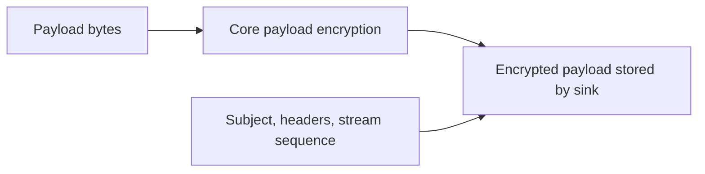
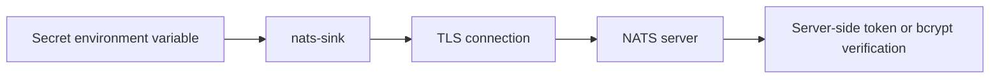
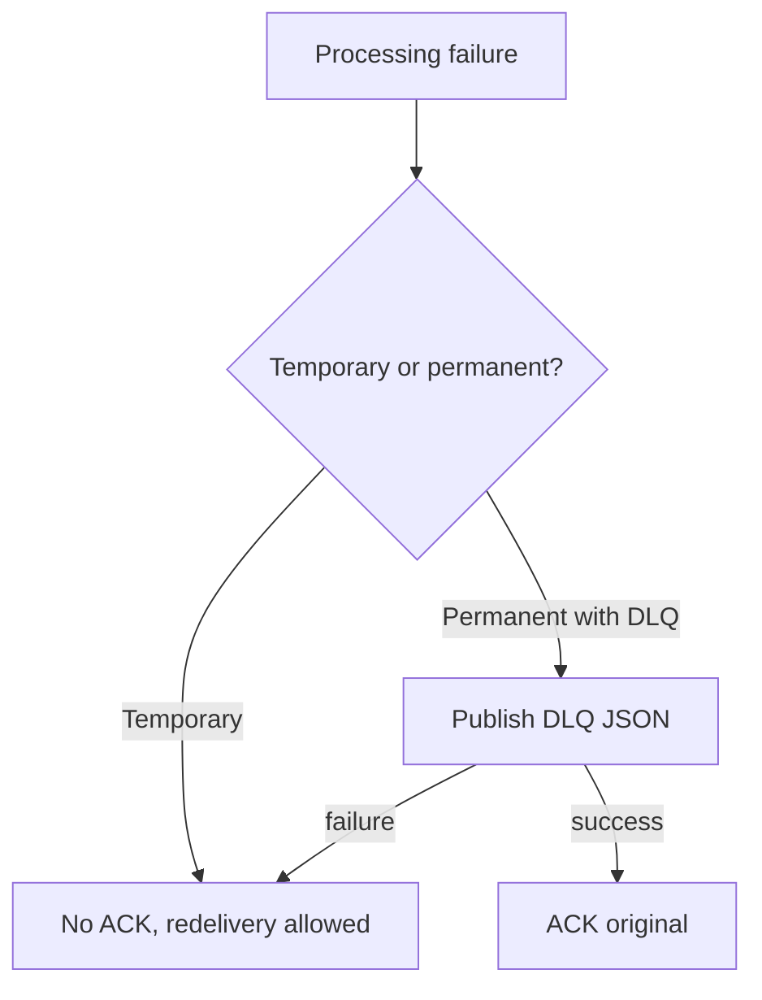

# Security

Security defaults are part of the project design. `nats-sinks` sits between a
message broker and durable destinations, so a mistake can expose data or lose
processing guarantees. The core runtime and sinks must avoid silent data loss,
secret leakage, unsafe configuration parsing, unsafe SQL construction, and
non-deterministic tests.

This page is written for both application developers and operators. Developers
should use it when adding sinks or changing runtime behavior. Operators should
use it when preparing production configuration and deployment environments.

The guidance is also intended for sensitive operational and defence-adjacent
deployments where payloads, headers, subjects, logs, and database rows may
carry mission, logistics, personnel, platform, or other protected information.
The project does not replace an organization's accreditation or security
engineering process, but it aims to make the secure default the easy default.

## Secrets

Do not commit credentials. Use environment variables, secret stores, and `password_env` for Oracle passwords.

The CLI redacts fields with names containing:

- `password`
- `token`
- `secret`
- `private_key`
- `credentials`
- `creds`
- `key_b64`
- `key_material`

Resolved passwords are not printed.

## JSON Configuration

Runtime config uses JSON. JSON avoids parser features that are not needed for this package and gives operators a direct mapping to the validated Pydantic model tree.

## Payload Privacy

Payload logging is disabled by default. Treat message payloads as sensitive unless a deployment explicitly proves otherwise.

In mission environments, treat subjects and headers as potentially sensitive as
well. Even when the payload is encrypted, metadata can reveal operational
tempo, routing, classification, source systems, or unit and platform naming
conventions. Use subject design, header minimization, access controls, and
retention policies accordingly.

Optional core payload encryption can protect message bodies before they are
stored by a sink. When enabled, the runner encrypts only the body bytes and
leaves metadata clear for routing, idempotency, and troubleshooting. Supported
algorithms are AES-256-GCM and AES-256-CCM through the optional
`nats-sinks[crypto]` extra. Encryption can be enabled globally for every
subject consumed by a runner or selectively through ordered `encryption.rules`
that match NATS subjects.

Use `encryption.key_b64_env` for key material and keep the referenced
environment variable in a secret manager, protected service environment file,
or platform secret injection mechanism. Do not commit direct `key_b64` values.
Rule order is security-sensitive because the first matching rule wins and a
disabled rule intentionally leaves matching payloads unchanged. See
[Payload Encryption](payload-encryption.md) for the full design and
configuration reference.

## NATS Security

Production deployments should use:

- TLS,
- authenticated connections,
- TLS verification enabled.

Do not disable TLS verification outside controlled local development.

Private defence or mission networks often use internal certificate authorities.
Use `nats.tls_ca_file` to trust the local CA rather than disabling
verification. Disabling verification can turn a protected transport into an
unauthenticated channel and should not be used for deployed services.

Supported NATS client authentication modes in this release are documented in
[NATS Connections And Authentication](nats-connections.md). In short:

- use `nats.token_env` for token authentication,
- use `nats.user` and `nats.password_env` for username/password authentication,
- use the same client-side username/password configuration when the NATS server
  stores a bcrypted password hash,
- use `nats.tls_ca_file` to trust a local CA certificate for private or
  self-signed NATS server certificates.

Bcrypt is a server-side storage control. The client still needs the clear-text
password to authenticate, so username/password and token authentication should
use TLS in production.

TLS certificate authentication, NKEY with challenge, and decentralized JWT
authentication/authorization are roadmap items for future certified support.

## Oracle Security

Use a least-privilege Oracle user. The user should need only the permissions required to write to the configured table.

For classified, restricted, or compartmented event stores, keep schema
ownership separate from runtime ingestion. The sink runtime account should be
able to insert or merge into the approved table shape, not administer the
database or remove evidence of prior ingestion.

For Oracle Autonomous Database wallet/mTLS connections, treat the wallet files
as secret runtime material. Do not commit `Wallet_*.zip`, `ewallet.pem`,
`cwallet.sso`, `ewallet.p12`, `tnsnames.ora` from private environments, or
wallet passwords. Store wallet files in an ignored local directory, a protected
host path, or a secret volume. Use `sink.wallet_password_env` instead of
embedding wallet passwords in JSON.

SQL security controls:

- identifiers are allow-list validated,
- values use bind variables,
- bind values are not logged by default,
- schema creation is disabled unless explicitly enabled.

## File Sink Security

The file sink writes local JSON files and therefore depends on operating-system
filesystem controls. Run it as a dedicated service user and make the output
directory writable only by that user and trusted operators.

For operational audit, disconnected transfer, or air-gapped handoff patterns,
consider the file output directory part of the mission data boundary. Apply the
same classification handling, retention, backup, and media control rules you
would apply to any other repository of event records.

The sink sanitizes subject names, stream names, and message IDs before they
become path components, and it verifies that resolved output paths remain under
the configured root directory. Operators should still treat the configured
directory as sensitive because generated files may contain payloads, headers,
and metadata.

If gzip compression is enabled, the compressed files may still contain
sensitive payloads and metadata. Compression is not encryption. Protect
`.json.gz` files with the same filesystem permissions, retention policy, and
backup controls as uncompressed `.json` files.

Do not point the file sink at a source-code directory, shared temporary
directory, or path served directly by a web server. Keep generated output under
an application data path such as `/var/lib/nats-sinks/events`, and apply your
normal backup, retention, and access-control policies.

## Secure Failure Flow

## Dependency Hygiene

Dependencies are intentionally limited. CI includes formatting, linting, type checking, unit tests, package build checks, dependency review, CodeQL, and Bandit.
