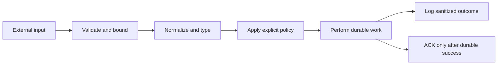
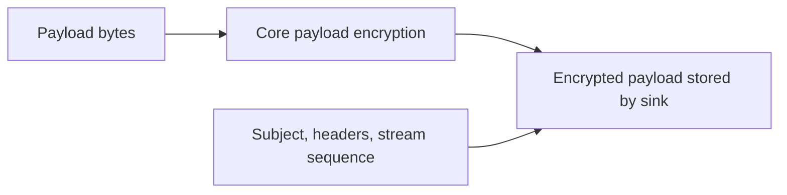
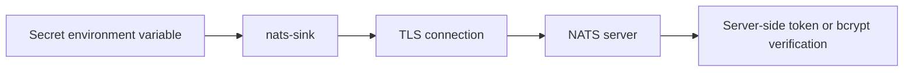
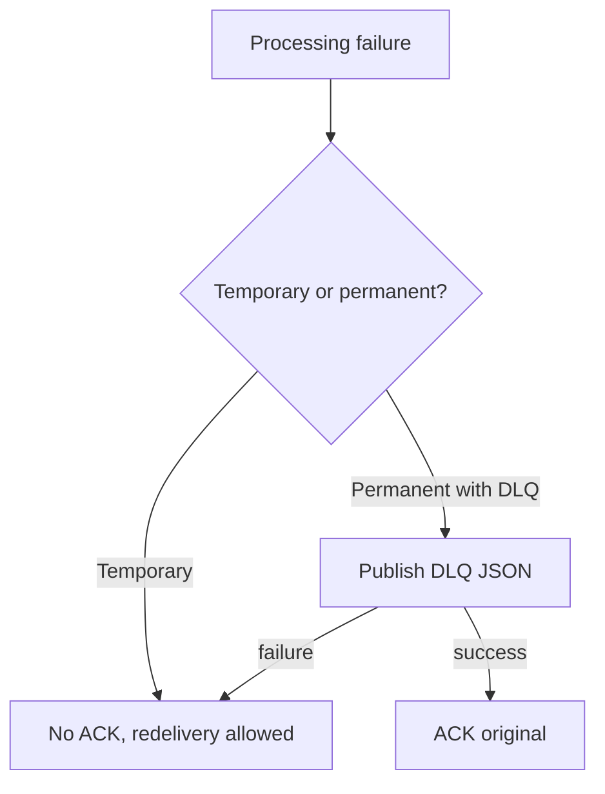

# Security

Security defaults are part of the project design. `nats-sinks` sits between a
message broker and durable destinations, so a mistake can expose data or lose
processing guarantees. The core runtime and sinks must avoid silent data loss,
secret leakage, unsafe configuration parsing, unsafe SQL construction, and
non-deterministic tests.

This page is written for both application developers and operators. Developers
should use it when adding sinks or changing runtime behavior. Operators should
use it when preparing production configuration and deployment environments.

The guidance is also intended for sensitive operational and defence-adjacent
deployments where payloads, headers, subjects, logs, and database rows may
carry mission, logistics, personnel, platform, or other protected information.
The project does not replace an organization's accreditation or security
engineering process, but it aims to make the secure default the easy default.

## Secrets

Do not commit credentials. Use environment variables, secret stores, and `password_env` for Oracle passwords.

The CLI redacts fields with names containing:

- `password`
- `token`
- `secret`
- `private_key`
- `credentials`
- `creds`
- `key_b64`
- `key_material`

Resolved passwords are not printed.

## JSON Configuration

Runtime config uses JSON. JSON avoids parser features that are not needed for
this package and gives operators a direct mapping to the validated Pydantic
model tree.

The loader treats configuration as hostile input until it has passed several
checks:

- the file must be UTF-8,
- the file must stay within the documented size limit,
- the root value must be a JSON object,
- duplicate object keys are rejected instead of accepting the last value,
- non-standard constants such as `NaN`, `Infinity`, and `-Infinity` are
  rejected instead of being accepted as Python-specific extensions,
- allowed environment overrides are applied through an explicit allow list,
- the final structure is validated with Pydantic models, and
- unknown fields are rejected in core configuration sections.

This fail-closed behavior helps operators catch mistakes before a sink connects
to NATS or acknowledges any JetStream message.

## Production Secure Development Baseline

Every feature should be reviewed as a small threat model before implementation.
For `nats-sinks`, the most important assets are message payloads, message
metadata, destination rows or files, secrets, encryption keys, idempotency keys,
DLQ records, logs, and acknowledgement state.

Use this baseline for code review and future releases:

- Treat NATS subjects, headers, payloads, config files, environment variables,
  database rows, files, DLQ messages, and third-party responses as untrusted.
- Fail closed when validation, authorization, dependency loading, encryption
  setup, sink selection, or policy evaluation is ambiguous.
- Keep security-sensitive logic centralized and documented: configuration
  loading, TLS setup, credential resolution, SQL identifier validation, payload
  encryption, log sanitization, redaction, DLQ shaping, and ACK decisions.
- Use allow-list validation for enum values, formats, lengths, ranges, SQL
  identifiers, file extensions, URL schemes, sink names, route names, and NATS
  subject patterns.
- Use real parsers for structured formats and reject malformed, oversized,
  duplicate-key, non-standard-constant, or ambiguous input early.
- Keep data separate from code. Use SQL bind variables for values, never shell
  out with untrusted strings, and never use `eval`, `exec`, pickle, unsafe YAML
  loaders, or user-controlled dynamic imports.
- Bound batches, payloads, config files, retries, queue depths, parser depth,
  file output, and any count that could trigger CPU, memory, database, or
  native-library exhaustion.
- Treat logs as an injection surface. Sanitize control characters and redact
  secrets while retaining enough subject, stream, sequence, sink, and error
  category context for operators.
- Treat observability output as an information-sharing boundary. Metrics,
  timestamps, failure counters, duplicate counters, and write timings can
  reveal operational tempo even without payloads. Use disabled-by-default
  observability policies and allow lists before publishing to Prometheus or
  any future monitoring platform. NATS server monitoring endpoint values must
  also be selected with explicit endpoint and field allow lists before they are
  stored locally or rendered for Prometheus.
- Prefer least privilege for NATS accounts, Oracle users, service accounts,
  CI jobs, containers, cloud identities, filesystems, and documentation
  examples.
- Keep cryptography on mature libraries and authenticated modes. Keys must stay
  separate from encrypted data and should be loaded through secure runtime
  configuration or a managed secret store.
- Treat native libraries, database drivers, compression libraries, and FFI
  boundaries as memory-safety boundaries. Validate sizes and file metadata
  before handing untrusted data to them.
- Use bounded retries, backoff, jitter, timeouts, connection pooling,
  backpressure, graceful shutdown, and idempotency for external operations.
- Add tests for normal paths, negative paths, malformed input, duplicate
  messages, boundary values, dependency failures, and abuse cases. Treat
  crashes, hangs, flaky tests, memory growth, and data corruption as security
  and reliability signals.
- Keep local and CI guardrails active. The repository includes
  `scripts/secret-scan.sh` as a lightweight high-confidence secret scanner,
  `scripts/security.sh` for secret scanning plus Bandit, CodeQL for static
  security analysis, dependency review for pull requests, Dependabot for
  updates, CycloneDX SBOM generation for release evidence, and pre-commit
  hooks for local checks.

Release SBOM guidance is documented in [SBOM And Release Evidence](sbom.md).
Dependency Graph and manifest-maintenance guidance is documented in
[Dependency Management](dependency-management.md). High-trust deployment
guidance for pinned, hash-verified installs is documented in
[Hash-Verified Installs](hash-verified-installs.md).
Policy-controlled metric and selected NATS monitoring export is documented in
[Observability](observability.md), with Prometheus-specific connector guidance
kept in the [Prometheus Integration](prometheus.md) sub-page.
The NATS server monitoring connector and delivery-boundary decision, including
`/jsz` and `/healthz` handling, are documented in
[NATS Server Monitoring Integration](nats-server-monitoring.md).
NATS runtime account authorization templates are documented in
[NATS Least-Privilege Permissions](nats-permissions.md).
Kubernetes-specific deployment examples, including service accounts,
security contexts, Secret references, NetworkPolicy guidance, and resource
limits, are documented in [Kubernetes Deployment](kubernetes.md).

The detailed maintainer-requested control review is tracked in
[Security Rule Review](security-rule-review.md). That page records the current
status of all 316 secure-development guidance points as applied, already
covered, partially covered, roadmap, or not applicable for the current package
surface.

## Payload Privacy

Payload logging is disabled by default. Treat message payloads as sensitive unless a deployment explicitly proves otherwise.

In mission environments, treat subjects and headers as potentially sensitive as
well. Even when the payload is encrypted, metadata can reveal operational
tempo, routing, classification, source systems, or unit and platform naming
conventions. Use subject design, header minimization, access controls, and
retention policies accordingly.

Domain-specific metadata can be sensitive too. A field such as
`mission_metadata.f2t2ea.phase` may reveal workflow stage or operational tempo
even when the value is only used for custody and audit. Public examples must
stay synthetic, and live deployments should protect mission metadata with the
same access-control, retention, and release rules used for the surrounding
event. The core mission metadata feature validates object structure, size,
duplicate keys, non-standard JSON constants, and secret-looking field names
before sinks see the message.
See [Mission Metadata](mission-metadata.md) and
[F2T2EA Event Phase Tagging](use-cases/defence/f2t2ea-event-phase-tagging.md)
for safe example wording and non-goals. The broader
[Defence And Mission Support](use-cases/defence/index.md) blueprint set shows
how to document mission-oriented deployments without placing live operational
details, credentials, network locators, or sensitive payloads into public docs
or GitHub Issues.

Optional core payload encryption can protect message bodies before they are
stored by a sink. When enabled, the runner encrypts only the body bytes and
leaves metadata clear for routing, idempotency, and troubleshooting. Supported
algorithms are AES-256-GCM and AES-256-CCM through the optional
`nats-sinks[crypto]` extra. Encryption can be enabled globally for every
subject consumed by a runner or selectively through ordered `encryption.rules`
that match NATS subjects.

Use `encryption.key_b64_env` for key material and keep the referenced
environment variable in a secret manager, protected service environment file,
or platform secret injection mechanism. Do not commit direct `key_b64` values.
Rule order is security-sensitive because the first matching rule wins and a
disabled rule intentionally leaves matching payloads unchanged. See
[Payload Encryption](payload-encryption.md) for the full design and
configuration reference.

## NATS Security

Production deployments should use:

- TLS,
- authenticated connections,
- TLS verification enabled.

Do not disable TLS verification outside controlled local development.

Private defence or mission networks often use internal certificate authorities.
Use `nats.tls_ca_file` to trust the local CA rather than disabling
verification. Disabling verification can turn a protected transport into an
unauthenticated channel and should not be used for deployed services.

Supported NATS client authentication modes in this release are documented in
[NATS Connections And Authentication](nats-connections.md). In short:

- use `nats.token_env` for token authentication,
- use `nats.user` and `nats.password_env` for username/password authentication,
- use the same client-side username/password configuration when the NATS server
  stores a bcrypted password hash,
- use `nats.tls_ca_file` to trust a local CA certificate for private or
  self-signed NATS server certificates.

Bcrypt is a server-side storage control. The client still needs the clear-text
password to authenticate, so username/password and token authentication should
use TLS in production.

Use least-privilege NATS subject permissions for the runtime account. A
standard worker should be able to request from its configured pull consumer,
receive inbox responses, ACK messages it has received, and publish to the
configured DLQ subject only when DLQ is enabled. It should not need broad
publish, broad subscribe, stream administration, or source-subject publish
rights. See [NATS Least-Privilege Permissions](nats-permissions.md) for
templates and validation checklists.

TLS certificate authentication, NKEY with challenge, and decentralized JWT
authentication/authorization are roadmap items for future certified support.

## Oracle Security

Use a least-privilege Oracle user. The user should need only the permissions required to write to the configured table.

For classified, restricted, or compartmented event stores, keep schema
ownership separate from runtime ingestion. The sink runtime account should be
able to insert or merge into the approved table shape, not administer the
database or remove evidence of prior ingestion.

When Oracle staging-table mode is enabled, apply the same least-privilege rule
to both database objects. The runtime account needs only the permissions
required to insert rows into the staging table, read the active batch from the
staging table for the set-based merge, delete only its staged batch when
`cleanup="delete_on_success"` is used, and insert or merge into the approved
target table. It should not receive broad schema administration, drop-table, or
unrelated data access permissions merely because staging is enabled.

For Oracle Autonomous Database wallet/mTLS connections, treat the wallet files
as secret runtime material. Do not commit `Wallet_*.zip`, `ewallet.pem`,
`cwallet.sso`, `ewallet.p12`, `tnsnames.ora` from private environments, or
wallet passwords. Store wallet files in an ignored local directory, a protected
host path, or a secret volume. Use `sink.wallet_password_env` instead of
embedding wallet passwords in JSON.

SQL security controls:

- identifiers are allow-list validated,
- values use bind variables,
- bind values are not logged by default,
- schema creation is disabled unless explicitly enabled.

## File Sink Security

The file sink writes local JSON files and therefore depends on operating-system
filesystem controls. Run it as a dedicated service user and make the output
directory writable only by that user and trusted operators.

For operational audit, disconnected transfer, or air-gapped handoff patterns,
consider the file output directory part of the mission data boundary. Apply the
same classification handling, retention, backup, and media control rules you
would apply to any other repository of event records.

The sink sanitizes subject names, stream names, and message IDs before they
become path components, and it verifies that resolved output paths remain under
the configured root directory. Operators should still treat the configured
directory as sensitive because generated files may contain payloads, headers,
and metadata.

If gzip compression is enabled, the compressed files may still contain
sensitive payloads and metadata. Compression is not encryption. Protect
`.json.gz` files with the same filesystem permissions, retention policy, and
backup controls as uncompressed `.json` files.

Do not point the file sink at a source-code directory, shared temporary
directory, or path served directly by a web server. Keep generated output under
an application data path such as `/var/lib/nats-sinks/events`, and apply your
normal backup, retention, and access-control policies.

## Secure Failure Flow

## Dependency Hygiene

Dependencies are intentionally limited. CI includes formatting, linting, type checking, unit tests, package build checks, dependency review, CodeQL, and Bandit.

Release builds also generate `SHA256SUMS` so operators can verify GitHub
Release assets before promoting them into controlled mirrors or wheelhouses.
Hash verification is a deployment control rather than a runtime feature: it
does not change ACK behavior, sink writes, payload encryption, or idempotency.
