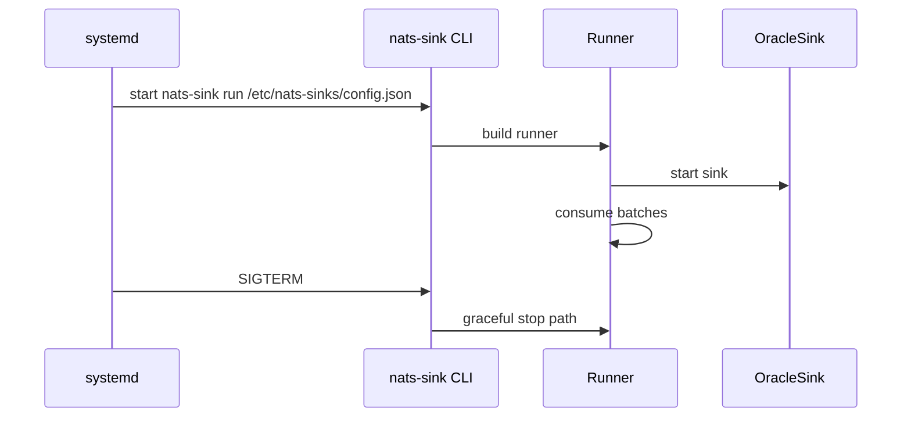

# Running nats-sink As A Service

This page provides systemd guidance for Oracle Linux and Debian. Both examples
run `nats-sink` from a Python virtual environment, load JSON configuration from
`/etc/nats-sinks/config.json`, and load secrets from
`/etc/nats-sinks/nats-sink.env`.

## Layout

```text
/opt/nats-sinks/venv              Python virtual environment
/etc/nats-sinks/config.json       Runtime JSON config
/etc/nats-sinks/nats-sink.env     Secret environment file
/var/lib/nats-sink                Service working directory
/etc/systemd/system/nats-sink.service
```

## Service Flow



## Debian

Install from a checkout:

```bash
sudo scripts/install-systemd-debian.sh
```

Manual steps:

```bash
sudo apt-get update
sudo apt-get install -y python3 python3-venv python3-pip
sudo useradd --system --home-dir /var/lib/nats-sink --create-home --shell /usr/sbin/nologin nats-sink
sudo install -d -o nats-sink -g nats-sink /var/lib/nats-sink
sudo install -d /etc/nats-sinks /opt/nats-sinks
sudo python3 -m venv /opt/nats-sinks/venv
sudo /opt/nats-sinks/venv/bin/python -m pip install --upgrade pip
sudo /opt/nats-sinks/venv/bin/python -m pip install "nats-sinks[oracle]"
sudo install -m 0640 -o root -g nats-sink examples/oracle-jetstream/config.json /etc/nats-sinks/config.json
sudo install -m 0640 -o root -g nats-sink examples/systemd/nats-sink.env /etc/nats-sinks/nats-sink.env
sudo install -m 0644 examples/systemd/nats-sink.service /etc/systemd/system/nats-sink.service
sudo systemctl daemon-reload
sudo systemctl enable nats-sink
sudo systemctl start nats-sink
```

## Oracle Linux

Install from a checkout:

```bash
sudo scripts/install-systemd-oracle-linux.sh
```

Manual steps:

```bash
sudo dnf install -y python3 python3-pip
sudo useradd --system --home-dir /var/lib/nats-sink --create-home --shell /sbin/nologin nats-sink
sudo install -d -o nats-sink -g nats-sink /var/lib/nats-sink
sudo install -d /etc/nats-sinks /opt/nats-sinks
sudo python3 -m venv /opt/nats-sinks/venv
sudo /opt/nats-sinks/venv/bin/python -m pip install --upgrade pip
sudo /opt/nats-sinks/venv/bin/python -m pip install "nats-sinks[oracle]"
sudo install -m 0640 -o root -g nats-sink examples/oracle-jetstream/config.json /etc/nats-sinks/config.json
sudo install -m 0640 -o root -g nats-sink examples/systemd/nats-sink.env /etc/nats-sinks/nats-sink.env
sudo install -m 0644 examples/systemd/nats-sink.service /etc/systemd/system/nats-sink.service
sudo systemctl daemon-reload
sudo systemctl enable nats-sink
sudo systemctl start nats-sink
```

## Operations

Check status:

```bash
systemctl status nats-sink
journalctl -u nats-sink -f
```

Restart after config changes:

```bash
sudo systemctl restart nats-sink
```

Use `systemctl stop nats-sink` for graceful shutdown. Messages in a completed
Oracle transaction but not yet ACKed may redeliver; idempotency must handle
duplicates.
