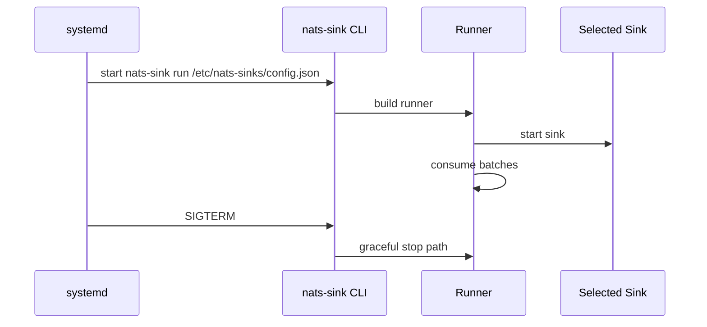
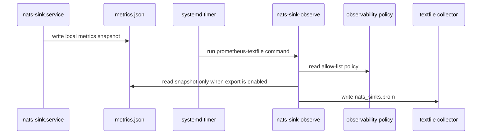
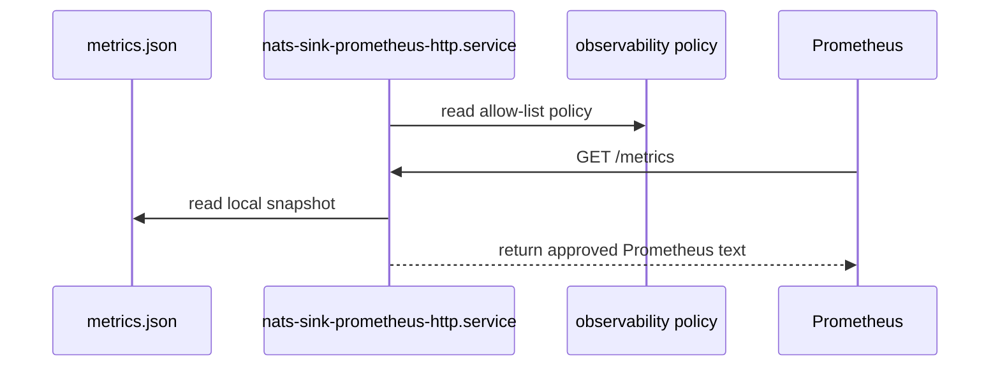
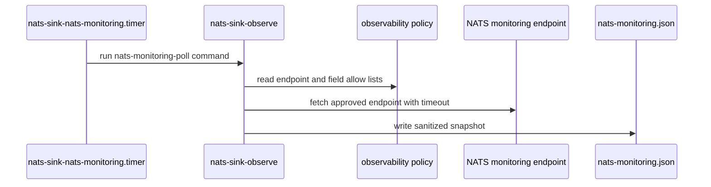

# Running nats-sink As A Service

This page provides systemd guidance for Oracle Linux and Debian. The service
model works for every sink type. The examples run `nats-sink` from a Python
virtual environment, load JSON configuration from `/etc/nats-sinks/config.json`,
and optionally load secrets from `/etc/nats-sinks/nats-sink.env`.

These examples are intentionally conservative because many mission-support and
defence environments run long-lived services under operating-system control,
with explicit service users, reviewed configuration paths, and protected
environment files for secrets. The same pattern works for simple file sink
deployments and Oracle-backed operational event stores.

## Layout

```text
/opt/nats-sinks/venv              Python virtual environment
/etc/nats-sinks/config.json       Runtime JSON config
/etc/nats-sinks/nats-sink.env     Secret environment file
/etc/nats-sinks/observability.prometheus.json
/var/lib/nats-sink                Service working directory
/var/lib/node_exporter/textfile_collector
/etc/systemd/system/nats-sink.service
/etc/systemd/system/nats-sink-prometheus-textfile.service
/etc/systemd/system/nats-sink-prometheus-textfile.timer
/etc/systemd/system/nats-sink-prometheus-http.service
/etc/systemd/system/nats-sink-nats-monitoring.service
/etc/systemd/system/nats-sink-nats-monitoring.timer
```

## Service Flow



Optional Prometheus textfile export runs as a separate service:



Optional native Prometheus HTTP export also runs separately:



Optional NATS server monitoring collection also runs separately. It reads only
policy-approved endpoint fields and never participates in ACK decisions:



## Unified Installer

Install from a checkout with the unified script:

```bash
sudo scripts/install-systemd.sh
```

The script reads `/etc/os-release`, detects Debian-family systems or Oracle
Linux, installs the right Python package prerequisites, creates the `nats-sink`
service user, installs the main `nats-sink.service`, installs the disabled
Prometheus textfile service/timer assets, installs the disabled native
Prometheus HTTP service asset, installs the disabled NATS monitoring
service/timer assets, and enables only the main sink service. Prometheus and
NATS monitoring sharing remain disabled until the observability policy and the
selected observability service are explicitly enabled.

The installer works in two modes. When it is run from a local git checkout, it
copies tracked example configuration files and systemd unit files from that
checkout. When it is downloaded and run as a standalone script, it fetches those
same service/configuration assets from GitHub using `NATS_SINKS_INSTALL_REF`.
That makes the documented install command a true one-line GitHub install rather
than a command that silently depends on being inside a cloned repository.

The Python package installed into `/opt/nats-sinks/venv` is controlled by
`NATS_SINKS_PACKAGE_SPEC`. If that variable is not set, `main` installs the
latest `nats-sinks` package from PyPI, while release tags such as `v0.3.0`
install the matching package version such as `nats-sinks==0.3.0`. Operators can
override the package spec when they need optional extras, for example
`nats-sinks[oracle]==0.3.0` for Oracle support.

The older `scripts/install-systemd-debian.sh` and
`scripts/install-systemd-oracle-linux.sh` paths remain compatibility wrappers
that delegate to `scripts/install-systemd.sh`.

### Debian Single-Command Install From GitHub

On Debian or Ubuntu-like systems, an administrator with `sudo` access can
download the installer from GitHub and run it as root with one command:

```bash
curl -fsSL https://raw.githubusercontent.com/ProjectCuillin/nats-sinks/main/scripts/install-systemd.sh | sudo env NATS_SINKS_INSTALL_REF=main sh
```

The command runs the installer as root, installs the Python package into
`/opt/nats-sinks/venv`, creates the dedicated `nats-sink` system account, and
configures `nats-sink.service` to run as that low-privilege service user.

For a release-pinned install after this script is included in a tagged release,
use the same tag in both the download URL and `NATS_SINKS_INSTALL_REF`:

```bash
curl -fsSL https://raw.githubusercontent.com/ProjectCuillin/nats-sinks/vX.Y.Z/scripts/install-systemd.sh | sudo env NATS_SINKS_INSTALL_REF=vX.Y.Z sh
```

For Oracle-backed deployments, include the Oracle optional dependency in the
package spec:

```bash
curl -fsSL https://raw.githubusercontent.com/ProjectCuillin/nats-sinks/vX.Y.Z/scripts/install-systemd.sh | sudo env NATS_SINKS_INSTALL_REF=vX.Y.Z NATS_SINKS_PACKAGE_SPEC='nats-sinks[oracle]==X.Y.Z' sh
```

### Oracle Linux Single-Command Install From GitHub

On Oracle Linux, use the same unified installer. The script detects Oracle
Linux from `/etc/os-release` and uses `dnf` for the required operating-system
packages:

```bash
curl -fsSL https://raw.githubusercontent.com/ProjectCuillin/nats-sinks/main/scripts/install-systemd.sh | sudo env NATS_SINKS_INSTALL_REF=main sh
```

For a release-pinned install after this script is included in a tagged release:

```bash
curl -fsSL https://raw.githubusercontent.com/ProjectCuillin/nats-sinks/vX.Y.Z/scripts/install-systemd.sh | sudo env NATS_SINKS_INSTALL_REF=vX.Y.Z sh
```

The same Oracle optional dependency override can be used on Oracle Linux:

```bash
curl -fsSL https://raw.githubusercontent.com/ProjectCuillin/nats-sinks/vX.Y.Z/scripts/install-systemd.sh | sudo env NATS_SINKS_INSTALL_REF=vX.Y.Z NATS_SINKS_PACKAGE_SPEC='nats-sinks[oracle]==X.Y.Z' sh
```

The one-command form is convenient for labs, test hosts, and controlled
automation. In sensitive production environments, prefer downloading the
installer first, reviewing it, and then running it:

```bash
curl -fsSLO https://raw.githubusercontent.com/ProjectCuillin/nats-sinks/main/scripts/install-systemd.sh
less install-systemd.sh
sudo env NATS_SINKS_INSTALL_REF=main sh install-systemd.sh
```

## Debian Manual Steps

```bash
sudo apt-get update
sudo apt-get install -y python3 python3-venv python3-pip
sudo useradd --system --home-dir /var/lib/nats-sink --create-home --shell /usr/sbin/nologin nats-sink
sudo install -d -o nats-sink -g nats-sink /var/lib/nats-sink
sudo install -d -o nats-sink -g nats-sink /var/lib/node_exporter/textfile_collector
sudo install -d /etc/nats-sinks /opt/nats-sinks
sudo python3 -m venv /opt/nats-sinks/venv
sudo /opt/nats-sinks/venv/bin/python -m pip install --upgrade pip
sudo /opt/nats-sinks/venv/bin/python -m pip install nats-sinks
sudo install -m 0640 -o root -g nats-sink examples/file-basic/config.json /etc/nats-sinks/config.json
sudo install -m 0640 -o root -g nats-sink examples/systemd/nats-sink.env /etc/nats-sinks/nats-sink.env
sudo install -m 0640 -o root -g nats-sink examples/systemd/observability.prometheus.json /etc/nats-sinks/observability.prometheus.json
sudo install -m 0644 examples/systemd/nats-sink.service /etc/systemd/system/nats-sink.service
sudo install -m 0644 examples/systemd/nats-sink-prometheus-textfile.service /etc/systemd/system/nats-sink-prometheus-textfile.service
sudo install -m 0644 examples/systemd/nats-sink-prometheus-textfile.timer /etc/systemd/system/nats-sink-prometheus-textfile.timer
sudo install -m 0644 examples/systemd/nats-sink-prometheus-http.service /etc/systemd/system/nats-sink-prometheus-http.service
sudo install -m 0644 examples/systemd/nats-sink-nats-monitoring.service /etc/systemd/system/nats-sink-nats-monitoring.service
sudo install -m 0644 examples/systemd/nats-sink-nats-monitoring.timer /etc/systemd/system/nats-sink-nats-monitoring.timer
sudo systemctl daemon-reload
sudo systemctl enable nats-sink
```

## Oracle Linux Manual Steps

```bash
sudo dnf install -y python3 python3-pip
sudo useradd --system --home-dir /var/lib/nats-sink --create-home --shell /sbin/nologin nats-sink
sudo install -d -o nats-sink -g nats-sink /var/lib/nats-sink
sudo install -d -o nats-sink -g nats-sink /var/lib/node_exporter/textfile_collector
sudo install -d /etc/nats-sinks /opt/nats-sinks
sudo python3 -m venv /opt/nats-sinks/venv
sudo /opt/nats-sinks/venv/bin/python -m pip install --upgrade pip
sudo /opt/nats-sinks/venv/bin/python -m pip install nats-sinks
sudo install -m 0640 -o root -g nats-sink examples/file-basic/config.json /etc/nats-sinks/config.json
sudo install -m 0640 -o root -g nats-sink examples/systemd/nats-sink.env /etc/nats-sinks/nats-sink.env
sudo install -m 0640 -o root -g nats-sink examples/systemd/observability.prometheus.json /etc/nats-sinks/observability.prometheus.json
sudo install -m 0644 examples/systemd/nats-sink.service /etc/systemd/system/nats-sink.service
sudo install -m 0644 examples/systemd/nats-sink-prometheus-textfile.service /etc/systemd/system/nats-sink-prometheus-textfile.service
sudo install -m 0644 examples/systemd/nats-sink-prometheus-textfile.timer /etc/systemd/system/nats-sink-prometheus-textfile.timer
sudo install -m 0644 examples/systemd/nats-sink-prometheus-http.service /etc/systemd/system/nats-sink-prometheus-http.service
sudo install -m 0644 examples/systemd/nats-sink-nats-monitoring.service /etc/systemd/system/nats-sink-nats-monitoring.service
sudo install -m 0644 examples/systemd/nats-sink-nats-monitoring.timer /etc/systemd/system/nats-sink-nats-monitoring.timer
sudo systemctl daemon-reload
sudo systemctl enable nats-sink
sudo systemctl start nats-sink
```

## Operations

Check status:

```bash
systemctl status nats-sink
journalctl -u nats-sink -f
```

Restart after config changes:

```bash
sudo systemctl restart nats-sink
```

Enable the Prometheus textfile timer only after the observability policy has
been reviewed and explicitly enabled:

```bash
sudo systemctl enable --now nats-sink-prometheus-textfile.timer
systemctl status nats-sink-prometheus-textfile.timer
journalctl -u nats-sink-prometheus-textfile.service -n 50
```

The Prometheus service uses `nats-sink-observe`, not `nats-sink`. It reads the
metrics snapshot and writes only policy-approved metrics. If the policy remains
disabled, it writes a harmless comment and does not require the snapshot to
exist. See [Prometheus Integration](prometheus.md) for policy examples and
node_exporter guidance; in the documentation navigation, that page lives under
the Observability section.

Enable the native Prometheus HTTP service only when the policy explicitly
enables `prometheus.http_endpoint.enabled` and the chosen listener address is
approved for the host:

```bash
sudo systemctl enable --now nats-sink-prometheus-http.service
systemctl status nats-sink-prometheus-http.service
journalctl -u nats-sink-prometheus-http.service -n 50
```

The native endpoint reads the same local snapshot and policy as the textfile
connector. It should remain separate from `nats-sink.service` so a scrape
endpoint failure cannot change JetStream ACK behavior.

Enable the NATS server monitoring timer only when the observability policy
explicitly enables `nats_server_monitoring.enabled`, endpoint and field allow
lists have been reviewed, and the monitoring endpoint is reachable only through
approved management networking:

```bash
sudo systemctl enable --now nats-sink-nats-monitoring.timer
systemctl status nats-sink-nats-monitoring.timer
journalctl -u nats-sink-nats-monitoring.service -n 50
```

The service writes `/var/lib/nats-sink/nats-monitoring.json` and, when
`nats_server_monitoring.prometheus_enabled` is true, writes
`/var/lib/node_exporter/textfile_collector/nats_sinks_nats_monitoring.prom`.
Both files contain only policy-approved endpoint paths and field values.

Use `systemctl stop nats-sink` for graceful shutdown. Messages in a completed
destination commit but not yet ACKed may redeliver; idempotency must handle
duplicates. Oracle deployments should install `nats-sinks[oracle]` and use an
Oracle configuration file. File sink deployments can use the base package and
should ensure the configured output directory is owned by the service user.

If payload encryption is enabled, install `nats-sinks[crypto]` and place the
base64 key environment variable named by `encryption.key_b64_env` in the
protected service environment file. Keep that file readable only by root and
the `nats-sink` service group. Do not put direct `encryption.key_b64` values in
tracked config files.

For sensitive operational deployments, also document who owns the service,
where logs are collected, how DLQ alerts are handled, how output directories or
Oracle tables are backed up, and which team is allowed to rotate NATS, Oracle,
and encryption credentials.
