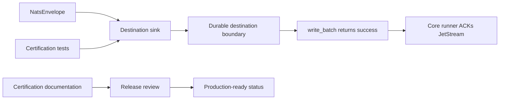
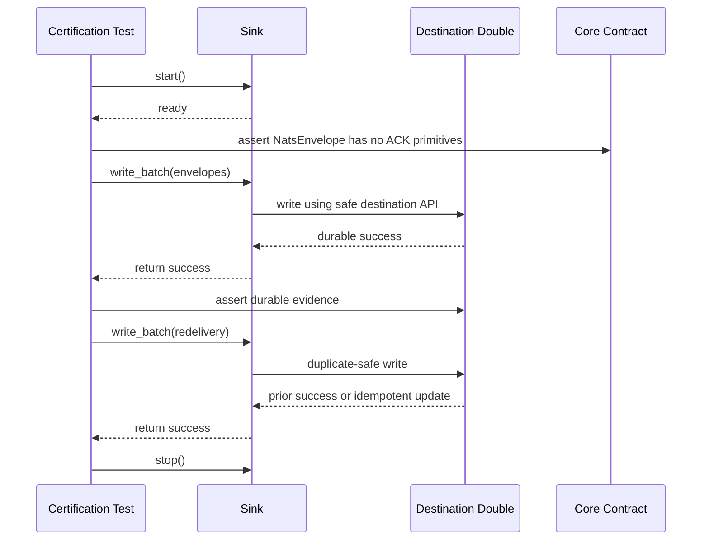

# Sink Certification

Sink certification is the release gate used by `nats-sinks` before a destination
backend may be described as production-ready. It is more than a Python typing
check. A sink can implement the `Sink` protocol and still be unsafe if it
returns success before durable commit, logs sensitive payloads, ignores
redelivery behavior, or hides destination failures behind generic exceptions.

This page defines the shared contract for first-party sinks and future
connectors. It is written for maintainers, external contributors, reviewers,
and operators who need to understand what evidence exists before trusting a
sink in an at-least-once JetStream delivery path.

The two first-party production sinks are:

- [Oracle Sink](oracle-sink.md), where success means the Oracle transaction has
  committed.
- [File Sink](file-sink.md), where success means every configured file has been
  flushed, optionally fsynced, and atomically placed at its final path.

Future sinks must pass the same certification standard before documentation,
metadata, or connector descriptors can mark them as production-ready.

## Certification Model



The key invariant remains:

> Core owns delivery semantics. Sinks own destination writes.

That means certification must prove two things at the same time:

1. The sink crosses its own durable success boundary before returning success.
2. The sink never acknowledges, terminates, or negatively acknowledges a NATS
   JetStream message directly.

## Required Evidence

Every production sink must have evidence for the following areas.

| Area | Required evidence |
| --- | --- |
| Lifecycle | `start()`, `write_batch(...)`, and `stop()` are async and safe to call through the core runner. |
| Boundary | `write_batch(...)` returns only after durable destination success. |
| Failure classification | Temporary failures raise `TemporarySinkError` subclasses and permanent failures raise `PermanentSinkError` subclasses where possible. |
| Idempotency | Duplicate redelivery is safe, controlled, and documented for the recommended production mode. |
| Payload handling | JSON, non-JSON text, empty payloads, bytes payloads, and encrypted payload envelopes are handled according to the framework payload contract. |
| Metadata | Standard NATS metadata, priority, classification, labels, mission metadata, and custody metadata are preserved where the sink supports them. |
| Security | Secrets, credentials, payloads, connection strings, private keys, and sensitive metadata are not logged by default. |
| Input validation | Destination identifiers, paths, URLs, object names, table names, and column names are validated with allow lists or destination-native safe APIs. |
| Unit tests | Unit tests are deterministic and never make network calls. |
| Integration tests | Live service tests are isolated behind markers, scripts, or explicit environment flags. |
| Documentation | The sink page explains durable success, failure behavior, idempotency, security, and known limitations. |

## Certification Sequence



The sequence uses destination doubles in unit tests. Live systems are tested
separately through integration or end-to-end scripts so unit tests stay fast,
deterministic, and safe for contributors.

## Reusable Test Helpers

The package exposes helper functions in `nats_sinks.testing` for sink authors:

```python
from nats_sinks.testing import (
    SinkCertificationCase,
    certification_envelope,
    certify_sink_duplicate_redelivery,
    certify_sink_lifecycle,
    certify_sink_write_success,
)
```

A minimal certification case looks like this:

```python
from pathlib import Path
from collections.abc import Sequence

from nats_sinks import NatsEnvelope, Sink
from nats_sinks.file import FileSink
from nats_sinks.testing import (
    SinkCertificationCase,
    certification_envelope,
    certify_sink_write_success,
)


def file_case(root: Path) -> SinkCertificationCase:
    message = certification_envelope(stream_sequence=1)

    def make_sink() -> Sink:
        return FileSink(directory=root, fsync=False)

    def assert_written(_sink: Sink, messages: Sequence[NatsEnvelope]) -> None:
        assert len(list(root.rglob("*.json"))) == len(messages)

    return SinkCertificationCase(
        name="file",
        sink_factory=make_sink,
        messages=(message,),
        after_write=assert_written,
    )


async def test_file_sink_certification(tmp_path: Path) -> None:
    await certify_sink_write_success(file_case(tmp_path))
```

The helpers intentionally do not decide what durable success means for a sink.
The destination-specific assertion must prove that evidence. For Oracle
Database and Oracle MySQL this can be a fake connection that records
`commit()`. For the file sink this can be the presence and content of the
atomically placed output file.

## Built-In Sink Certification Status

| Sink | Certification coverage |
| --- | --- |
| Oracle Database | Unit contract tests cover commit-before-success, rollback on failure, duplicate-safe modes, payload normalization, metadata columns, encryption envelopes, error translation, and SQL identifier validation. Live Oracle tests are opt-in through ignored local environment files. |
| Oracle MySQL | Unit contract tests cover commit-before-success, rollback on failure, duplicate-safe modes, payload normalization, metadata columns, TLS option validation, Oracle MySQL metrics, error translation, and SQL identifier validation. Container-backed e2e tests run against a short-lived Oracle MySQL test database. |
| File | Unit and file e2e tests cover atomic file placement, duplicate handling, gzip compression, payload modes, encrypted payload envelopes, metadata preservation, path sanitization, health checks, and no ACK ownership. |

The reusable helpers are now applied to built-in sinks where practical:

- file sink lifecycle, write, duplicate-redelivery, and log-redaction helper
  coverage,
- Oracle sink durable-success helper coverage using a fake connection pool that
  proves `commit()` occurs before `write_batch(...)` returns,
- Oracle MySQL sink durable-success helper coverage using a fake connection
  pool and the same certification helper pattern.

## Production-Ready Connector Requirements

A future connector may be present in the backlog, documented as experimental,
or exposed as a reviewed plugin without being production-ready. To claim
production status, it must have:

1. A `SinkConnector` descriptor with `production_ready=True`.
2. Documentation that points to the sink page and the certification evidence.
3. Unit tests using the shared certification helpers.
4. Destination-specific tests for idempotency and durable success.
5. Integration or end-to-end tests behind explicit markers or scripts.
6. Security documentation covering secrets, least privilege, logging, and
   input validation.
7. Changelog and release evidence naming the certified surface.

If any of those are missing, the connector should remain experimental,
roadmap-only, or not planned until scope changes.

## What Certification Does Not Claim

Certification does not mean exactly-once delivery. `nats-sinks` provides
at-least-once delivery from JetStream to external destinations with
commit-then-acknowledge processing and idempotent sink support.

Certification also does not replace:

- database migration review,
- cloud IAM review,
- operational acceptance testing,
- performance testing under realistic volume,
- compliance accreditation,
- deployment-specific threat modeling.

It is the baseline evidence that a sink respects the framework contract and is
safe enough to enter release review.

## Contributor Checklist

Before proposing a production sink:

- Add or update the sink module and configuration model.
- Validate all external identifiers and destination-specific inputs.
- Use safe destination APIs, bind variables, SDK calls, or object APIs rather
  than string-concatenated commands.
- Add unit tests with `SinkCertificationCase`.
- Add destination-specific tests for idempotency, duplicate redelivery, and
  failure classification.
- Add integration tests behind explicit markers.
- Add documentation under `docs/`.
- Add examples that use JSON configuration and no committed secrets.
- Add release notes and update the public API contract when new public imports
  are introduced.
- Run:

```bash
scripts/check-sinks.sh
scripts/check.sh
```

Live tests that require Oracle, NATS, or cloud services must remain opt-in and
must never require committed credentials.
