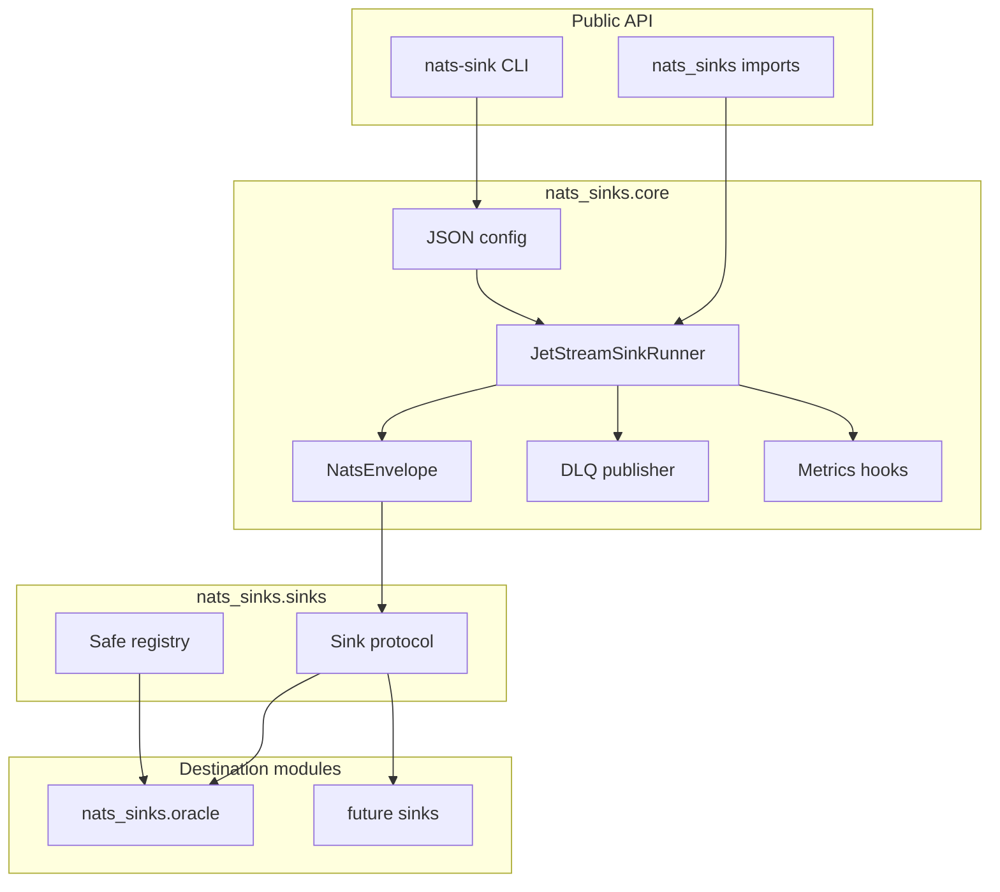
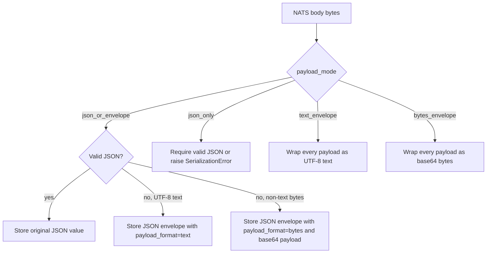
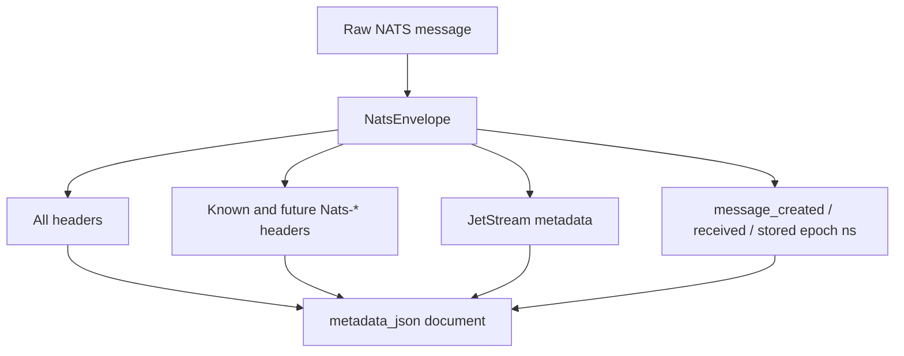
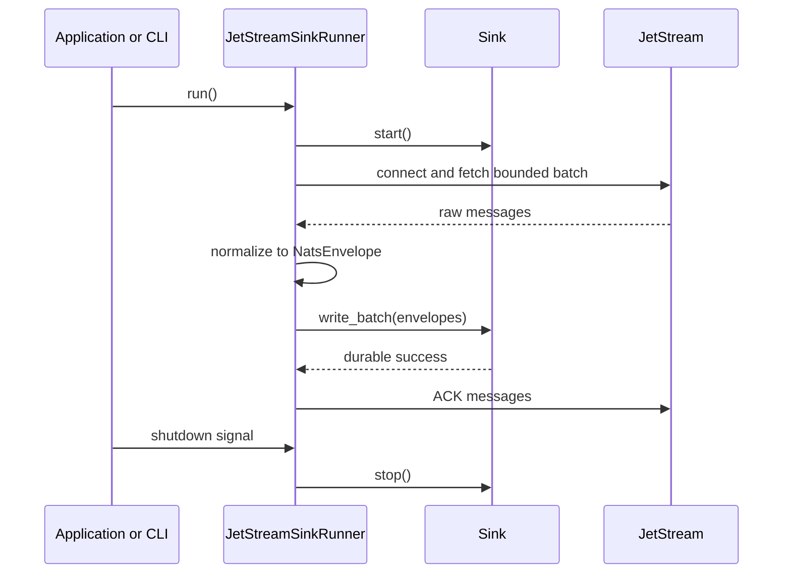

# Sink Framework

This page documents the generic sink framework. Destination-specific behavior,
including Oracle table DDL, Oracle SQL modes, and Oracle connection-pool
settings, lives in destination pages such as [Oracle Sink](oracle-sink.md).

The purpose of the framework is to keep delivery semantics in one place. Every
destination should plug into the same small contract and should inherit the same
commit-then-acknowledge behavior from the core runner.

## Package Layers



The core layer owns NATS connectivity, JetStream consumer behavior, batching,
dead-letter publication, acknowledgement decisions, graceful shutdown, and
metrics hooks. Destination modules own destination writes and destination commit
behavior only.

## Generic Contract

The production sink contract is intentionally small:

```python
from collections.abc import Sequence
from typing import Protocol

from nats_sinks import NatsEnvelope


class Sink(Protocol):
    async def start(self) -> None: ...
    async def write_batch(self, messages: Sequence[NatsEnvelope]) -> None: ...
    async def stop(self) -> None: ...
```

A sink returns from `write_batch` only after its destination work is durable. If
it cannot complete the durable write, it raises a framework error. Sinks must
not ACK, NAK, terminate, or in-progress JetStream messages because sinks receive
`NatsEnvelope` objects rather than raw `nats-py` messages.

## Standard Payload Normalization

NATS message bodies are bytes. The core framework does not assume that a
message body is JSON, text, encrypted text, compressed data, or binary. Sinks
that store payloads in JSON-capable destinations should use the shared payload
normalization contract exposed by `NatsEnvelope.payload_for_json_storage()` and
`normalize_payload_for_json_storage(...)`.

The default mode is `json_or_envelope`:

- valid JSON is parsed and stored unchanged,
- non-JSON UTF-8 text is wrapped in a nats-sinks JSON payload envelope,
- non-text bytes are wrapped as base64 in the same JSON payload envelope.



The JSON payload envelope has this shape:

```json
{
  "_nats_sinks": {
    "payload_envelope_version": 1,
    "payload_format": "text",
    "payload_encoding": "utf-8",
    "sha256": "hex-encoded-sha256",
    "size_bytes": 24
  },
  "payload": "encrypted-text:v1:sample-ciphertext"
}
```

For binary payloads, `payload_format` is `bytes`, `payload_encoding` is
`base64`, and `payload` contains the base64 text. The SHA-256 digest is a
diagnostic and reconciliation aid; it is not a security boundary and should not
be treated as a secret. Sinks must still avoid logging payload contents by
default.

This contract is destination-neutral. Oracle uses it today, and future JSON
document, relational, object-storage, file, HTTP, and Kafka sinks should either
reuse it or explicitly document why their destination requires a different
payload storage model.

## Standard Metadata Snapshot

Every sink can use `NatsEnvelope.metadata_for_json_storage()` to persist the
same metadata document. This is intentionally generic and not Oracle-specific.
The snapshot captures:

- all NATS message headers exactly as normalized by the core,
- known NATS-reserved headers when present,
- any future or unknown header using the reserved `Nats-` prefix,
- JetStream stream, consumer, domain, stream sequence, consumer sequence,
  redelivery flag, pending count, and client timestamp,
- optional reply subject,
- message creation, receipt, and storage times as Unix epoch nanoseconds.



Missing optional fields are normal. For example, a producer may omit
`Nats-Msg-Id`, optimistic concurrency headers such as `Nats-Expected-Stream`,
trace headers, schedule headers, or republish headers. The metadata snapshot
stores what is present and uses `null` or absence for what is not present. This
keeps sinks stable across NATS server versions and producer styles.

## Lifecycle



The acknowledgement is always the final step after durable success. If the
process exits after a destination commit and before ACK, JetStream may redeliver
the message. That is acceptable and is why every production sink must support
idempotent duplicate handling.

## Error Semantics

Sinks should translate destination-specific failures into framework errors.
This lets the core decide whether to leave a message eligible for redelivery,
publish it to a DLQ, or fail configuration before startup.

| Error | Meaning | Core behavior |
| --- | --- | --- |
| `ConfigurationError` | Startup or configuration is invalid. | Fail fast before processing. |
| `TemporarySinkError` | Destination may recover, such as a connection outage. | Do not ACK; NAK or leave unacked according to policy. |
| `PermanentSinkError` | Message cannot be processed successfully as-is. | Publish to DLQ when configured; ACK only after DLQ publish succeeds. |
| `SerializationError` | Payload cannot be encoded or decoded for the destination. | Treat as permanent unless the sink documents otherwise. |
| `DestinationUnavailableError` | Destination is not currently reachable or commit failed. | Treat as temporary; do not ACK. |

## Extension Checklist

Future destination modules should follow this checklist before being described
as production-ready:

- implement `start`, `write_batch`, and `stop`,
- return from `write_batch` only after durable destination success,
- use framework errors for failure classification,
- prove duplicate redelivery is safe in unit tests,
- avoid logging payloads or credentials by default,
- validate all destination identifiers and external input,
- use bind variables or equivalent safe APIs for values,
- document idempotency strategy and failure behavior,
- add CLI configuration examples using JSON,
- add integration tests behind the `integration` marker.

## Adding Future Sinks Without Breaking Users

The project is intentionally prepared for additional sinks as additive changes.
A future sink should be introduced as a new destination module and optional
dependency extra rather than by changing the existing Oracle module or the core
delivery contract.

The stable extension points are:

- `NatsEnvelope`, which is the destination-neutral message representation,
- `Sink`, which defines the `start`, `write_batch`, and `stop` contract,
- framework error classes such as `TemporarySinkError` and
  `PermanentSinkError`,
- `SinkRegistry`, which resolves explicit sink names instead of importing
  arbitrary modules from config,
- the JSON `sink` object, which requires `type` and allows sink-specific fields
  to be validated by the selected destination implementation.

In practice, adding a future `postgres`, `http`, `file`, or `s3` sink should
look like this:

1. Add a new module, for example `src/nats_sinks/postgres/`.
2. Add a public class, for example `PostgresSink`, that implements the sink
   contract.
3. Add an optional dependency extra such as `nats-sinks[postgres]`.
4. Register the sink factory in the CLI registry under a lowercase name.
5. Add destination-specific docs, for example `docs/postgres-sink.md`.
6. Add deterministic unit tests and integration tests behind the
   `integration` marker.
7. Add roadmap, changelog, and example updates without changing existing
   Oracle configuration semantics.

Those steps are additive. Existing imports such as `from nats_sinks.oracle
import OracleSink`, existing `sink.type: "oracle"` configurations, and the
core `JetStreamSinkRunner` behavior should keep working. A breaking release
should only be needed if the project intentionally changes a documented public
API, configuration field, or safety invariant.

The commit-then-acknowledge invariant is not an extension point. Future sinks
may optimize their destination writes, but they must not acknowledge JetStream
messages and must not return success before durable destination success.

## What Belongs Outside A Sink

A sink should not create JetStream consumers, fetch messages, ACK messages,
publish DLQ records, parse CLI arguments, or own process signal handling. Those
jobs belong to the core runner and CLI.

Keeping those responsibilities outside destination modules makes it possible to
add future sinks such as Postgres, HTTP, file, S3, or Kafka without copying ACK
logic into every backend.

## Future Destinations

Future sinks should live in destination modules such as:

- `nats_sinks.postgres`
- `nats_sinks.http`
- `nats_sinks.file`
- `nats_sinks.s3`

No future sink should be considered production-ready until it has tests proving
that durable success happens before ACK and that duplicate redelivery is safe.
