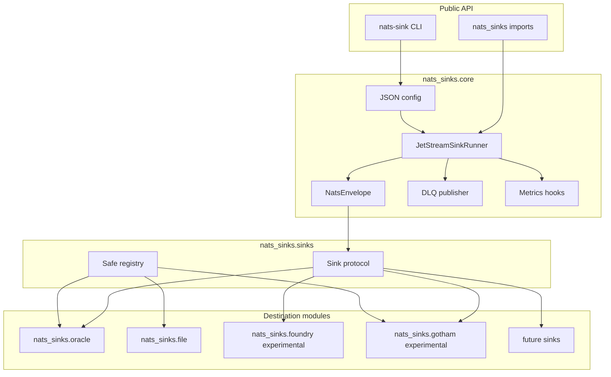
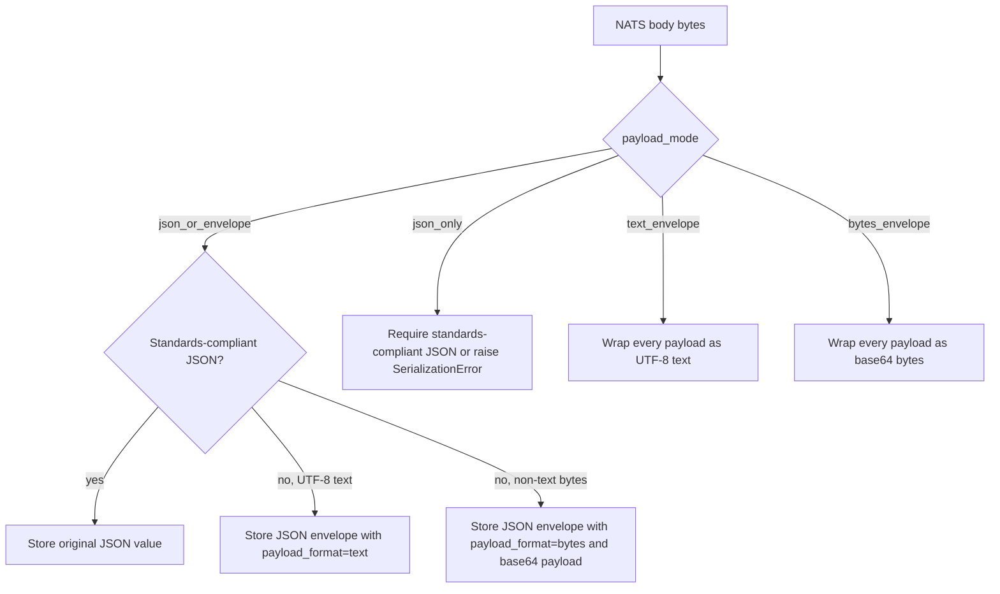
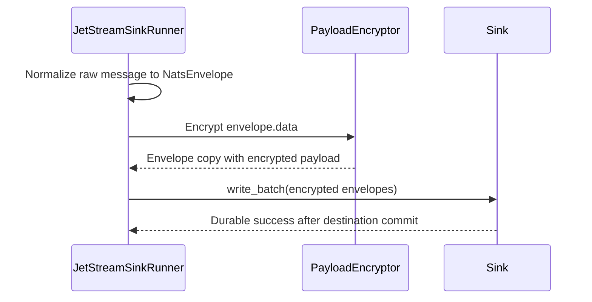
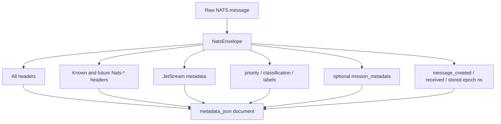
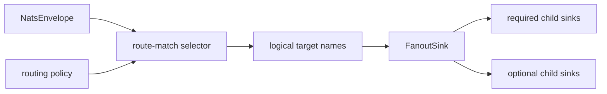
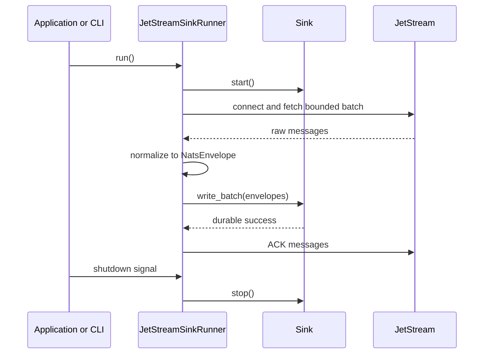
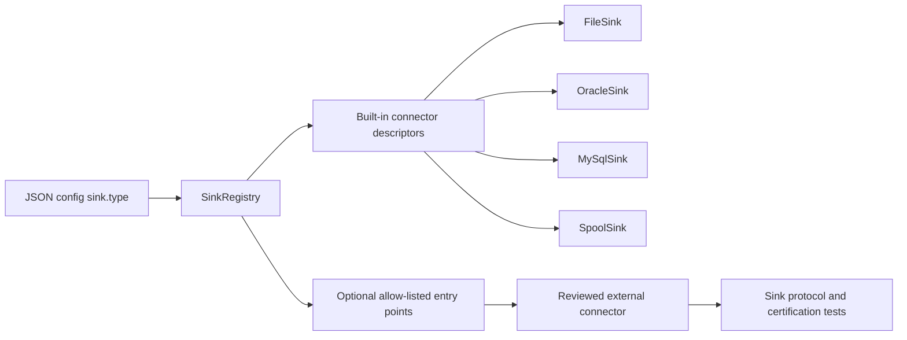

# Sink Framework

This page documents the generic sink framework. Destination-specific behavior,
including Oracle table DDL, Oracle SQL modes, local file durability settings,
and filesystem duplicate policies, lives in destination pages such as
[Oracle Sink](oracle-sink.md) and [File Sink](file-sink.md).

The purpose of the framework is to keep delivery semantics in one place. Every
destination should plug into the same small contract and should inherit the same
commit-then-acknowledge behavior from the core runner.

That shared contract is useful for domains with mission accountability
requirements. Whether an event is written to Oracle, a local handoff file, or a
future backend, maintainers should be able to answer the same questions: when
is the event durable, what metadata was preserved, what happens on duplicate
redelivery, and when is the JetStream ACK sent?

## Package Layers



The core layer owns NATS connectivity, JetStream consumer behavior, batching,
dead-letter publication, acknowledgement decisions, graceful shutdown, and
metrics hooks. It also owns destination-neutral per-message transformations,
including priority/classification/labels metadata resolution and optional payload
encryption. Destination modules own destination writes and destination commit
behavior only.

The current built-in registry includes production-ready Oracle Database,
Oracle MySQL, file, and edge spool sinks plus an experimental Palantir Foundry
Streams sink and an experimental Palantir Gotham RevDB object sink.
Experimental sinks are still bound by the same commit-then-ACK contract, but
their documentation must separate local mock certification from live
destination certification.

## Named Sink Registry

The top-level `sinks` object is the shared configuration registry for multiple
destination instances. It does not write messages by itself and it does not
change ACK behavior. Its purpose is to give routing policy, CLI validation,
redacted config output, health checks, and active fan-out execution one stable
set of names for destination instances.

```json
{
  "sinks": {
    "oracle_secret": {
      "type": "oracle",
      "dsn": "tcps://adb.example.invalid/secret",
      "user": "app_secret",
      "password_env": "ORACLE_SECRET_PASSWORD",
      "table": "NATS_SECRET_EVENTS"
    },
    "file_audit": {
      "type": "file",
      "directory": "/var/lib/nats-sinks/audit",
      "fsync": true
    }
  }
}
```

Route policy references these names, not destination details. This keeps
generic matching independent from Oracle tables, Oracle connection sources,
file-system paths, and future sink-specific options. See
[Named Sinks And Routing](named-sinks.md) for the full operator guide.

## Generic Contract

The production sink contract is intentionally small:

```python
from collections.abc import Sequence
from typing import Protocol

from nats_sinks import NatsEnvelope


class Sink(Protocol):
    async def start(self) -> None: ...
    async def write_batch(self, messages: Sequence[NatsEnvelope]) -> None: ...
    async def stop(self) -> None: ...
```

A sink returns from `write_batch` only after its destination work is durable. If
it cannot complete the durable write, it raises a framework error. Sinks must
not ACK, NAK, terminate, or in-progress JetStream messages because sinks receive
`NatsEnvelope` objects rather than raw `nats-py` messages.

The same contract applies to replay workflows. A future durable replay runner
should still call `write_batch` and should still ACK only after the selected
sink or required fan-out targets return durable success. Replay tooling must
not add a separate sink API, bypass idempotency, or use ordered inspection
consumers for production writes. See
[Durable Replay To Sinks](durable-replay-to-sinks.md) for the replay design
boundary and required test evidence.

## Standard Payload Normalization

NATS message bodies are bytes. The core framework does not assume that a
message body is JSON, text, encrypted text, compressed data, or binary. Sinks
that store payloads in JSON-capable destinations should use the shared payload
normalization contract exposed by `NatsEnvelope.payload_for_json_storage()` and
`normalize_payload_for_json_storage(...)`.

The default mode is `json_or_envelope`:

- standards-compliant JSON is parsed and stored unchanged,
- non-JSON UTF-8 text is wrapped in a nats-sinks JSON payload envelope,
- non-text bytes are wrapped as base64 in the same JSON payload envelope.

`nats-sinks` deliberately rejects Python-only JSON constants such as `NaN`,
`Infinity`, and `-Infinity`. They are not standards-compliant JSON. In the
default `json_or_envelope` mode they are preserved as original text in the
payload envelope; in `json_only` mode they raise `SerializationError`.



The JSON payload envelope has this shape:

```json
{
  "_nats_sinks": {
    "payload_envelope_version": 1,
    "payload_format": "text",
    "payload_encoding": "utf-8",
    "sha256": "hex-encoded-sha256",
    "size_bytes": 24
  },
  "payload": "encrypted-text:v1:sample-ciphertext"
}
```

For binary payloads, `payload_format` is `bytes`, `payload_encoding` is
`base64`, and `payload` contains the base64 text. The SHA-256 digest is a
diagnostic and reconciliation aid; it is not a security boundary and should not
be treated as a secret. Sinks must still avoid logging payload contents by
default.

This contract is destination-neutral. Oracle and FileSink use it today, and
future JSON document, relational, object-storage, HTTP, and Kafka sinks should
either reuse it or explicitly document why their destination requires a
different payload storage model.

Headers-only JetStream delivery needs an additional payload-presence contract.
The current framework safely handles `b""`, but a future headers-only mode must
record whether the producer sent an empty body or whether the NATS server
omitted the body for metadata-only delivery. The design is tracked in
[Headers-Only Delivery Evaluation](headers-only-delivery.md).

For operational and defence-oriented streams, this neutrality is important
because payloads may be JSON, plain text, opaque encrypted text, compressed
bytes, or binary records from platform systems. The framework should preserve
the body safely without assuming that every producer uses the same payload
contract.

## Core Payload Encryption

Payload encryption is also destination-neutral. When the top-level
`encryption.enabled` setting is true, the core runner encrypts
`NatsEnvelope.data` before calling any sink. The sink receives an envelope copy
where the payload bytes are a JSON object containing
`_nats_sinks_encryption`. Metadata is not encrypted.



This means new sinks do not need their own first-layer payload encryption
logic. They should store the encrypted payload envelope exactly like any other
JSON payload unless the sink is explicitly designed and documented as a trusted
decryption destination. See [Payload Encryption](payload-encryption.md) for the
configuration, envelope shape, tests, and operational security guidance.

## Standard Metadata Snapshot

Every sink can use `NatsEnvelope.metadata_for_json_storage()` to persist the
same metadata document. This is intentionally generic and not Oracle-specific.
The snapshot captures:

- all NATS message headers exactly as normalized by the core,
- known NATS-reserved headers when present,
- any future or unknown header using the reserved `Nats-` prefix,
- JetStream stream, consumer, domain, stream sequence, consumer sequence,
  redelivery flag, pending count, and client timestamp,
- optional reply subject,
- normalized application metadata fields `priority`, `classification`, and `labels`,
- optional validated `mission_metadata` JSON context,
- message creation, receipt, and storage times as Unix epoch nanoseconds.

The metadata snapshot is intentionally useful for audit and after-action
analysis. It preserves the operational context needed to answer when a message
was created, when it was received by the sink runner, when it was stored, which
subject and stream carried it, and which priority, classification, labels, and
optional mission metadata were visible at ingestion time.



Missing optional fields are normal. For example, a producer may omit
`Nats-Msg-Id`, optimistic concurrency headers such as `Nats-Expected-Stream`,
trace headers, schedule headers, or republish headers. The metadata snapshot
stores what is present and uses `null` or absence for what is not present. This
keeps sinks stable across NATS server versions and producer styles.

## Generic Route-Match Policy

The core now includes a validated route-match policy, selector, and active
fan-out sink. The selector evaluates one normalized `NatsEnvelope` and returns
logical sink target names based on subject, priority, classification, labels,
and approved non-secret headers. The `fanout` sink binds those target names to
named child sink instances, partitions the batch per selected child sink, and
returns success only after required child sinks complete. Route targets can
also carry ACK-gating policy. A plain target name is required by default; an
object target can opt into bounded optional side-copy behavior.



This separation matters for the sink framework. All destination modules still
implement the same durable `write_batch` contract, and ACK behavior remains in
the runner. `FanoutSink` uses the selector output while deciding which targets
are commit-required, which targets are optional side effects, and when the
JetStream ACK is allowed to happen. The reusable ACK-gate helper waits for
required targets and records optional timeout or failure categories without
exposing payloads or destination secrets.

Fan-out observability is kept separate from the ACK gate itself. `FanoutSink`
calls the aggregate helpers in `nats_sinks.core.fanout_observability` to record
route matches, selected child sink counts, required success or failure,
optional success, optional failure, optional timeout, ACK-gate wait time, and
fan-out batch duration. Those helpers record only counts and timings. They do
not export route names, child sink names, subjects, classification values,
labels, payload data, file paths, or database connection details unless a
future explicit observability policy adds such sharing with bounded
cardinality.

`tests/unit/test_fanout_certification.py` is the reusable certification surface
for this boundary. It proves the documented NATO SECRET and NATO UNCLASS
route examples, one-to-one selection, one-to-many selection, required failure
before ACK, optional timeout before ACK release, no-route policies, CLI
validation, and redaction behavior. New fan-out-capable sink work should add
cases there or reuse the same helpers from `nats_sinks.testing`.

The route policy uses exact bounded values and the existing NATS wildcard
subject matcher. It does not load plugins, execute code, evaluate expressions,
or use regular expressions supplied by configuration.

## Lifecycle



The acknowledgement is always the final step after durable success. If the
process exits after a destination commit and before ACK, JetStream may redeliver
the message. That is acceptable and is why every production sink must support
idempotent duplicate handling.

## Error Semantics

Sinks should translate destination-specific failures into framework errors.
This lets the core decide whether to leave a message eligible for redelivery,
publish it to a DLQ, or fail configuration before startup.

| Error | Meaning | Core behavior |
| --- | --- | --- |
| `ConfigurationError` | Startup or configuration is invalid. | Fail fast before processing. |
| `TemporarySinkError` | Destination may recover, such as a connection outage. | Do not ACK; NAK or leave unacked according to policy. |
| `PermanentSinkError` | Message cannot be processed successfully as-is. | Publish to DLQ when configured; ACK only after DLQ publish succeeds. |
| `SerializationError` | Payload cannot be encoded or decoded for the destination. | Treat as permanent unless the sink documents otherwise. |
| `DestinationUnavailableError` | Destination is not currently reachable or commit failed. | Treat as temporary; do not ACK. |

## Connector Framework

The implementation term for a destination is **sink connector**. A connector is
the combination of:

- a public sink class such as `OracleSink` or `FileSink`,
- a factory that builds that sink from the selected JSON `sink` object,
- metadata describing production readiness, documentation, optional dependency
  extras, and certification evidence,
- tests proving the sink follows the shared delivery contract.

The connector framework exists so nats-sinks can grow without weakening the
core safety model. It is not a marketplace that blindly loads arbitrary Python
modules. Configuration never names a module path, class path, or arbitrary
import string. It names a sink type, and that type is resolved through an
explicit registry.



Today, the first-party production connectors are built in:

| Connector | Config value | Import path | Status |
| --- | --- | --- | --- |
| Oracle Database | `oracle` | `nats_sinks.oracle.OracleSink` | Production connector in this repository. |
| Oracle MySQL | `mysql` | `nats_sinks.mysql.MySqlSink` | Production connector in this repository. |
| File | `file` | `nats_sinks.file.FileSink` | Production connector in this repository. |
| Edge spool | `spool` | `nats_sinks.spool.SpoolSink` | Production connector in this repository. |

Future Oracle-family sinks such as OCI Object Storage, Oracle Berkeley DB,
Oracle NoSQL Database, Oracle Coherence Community Edition, and OCI Streaming are intended to
be first-party connectors in this repository unless project governance decides
otherwise later. They should use the same connector descriptor and certification
tests as Oracle Database, Oracle MySQL, FileSink, and SpoolSink, but they do
not need external plugin discovery.

The repository includes a local
[Oracle MySQL test database container](oracle-mysql-test-container.md) used by
the [Oracle MySQL Sink](mysql-sink.md) e2e certification path. The container is
test infrastructure, not a production database image.

The repository also includes a local
[Oracle Coherence Community Edition test backend](oracle-coherence-test-container.md)
for future Oracle Coherence sink and multi-sink routing certification. It is
test infrastructure, not a production Coherence deployment and not a sink
implementation.

Optional third-party connector discovery is intentionally disabled by default.
When enabled, it uses Python packaging entry points under the group
`nats_sinks.sinks`, but it only loads names listed in `plugins.allowed_sinks`.
Every loaded object must be a `SinkConnector` descriptor and, by default, must
declare itself production-ready.

```json
{
  "plugins": {
    "enabled": true,
    "allowed_sinks": ["acme_archive"],
    "require_production_ready": true
  },
  "sink": {
    "type": "acme_archive",
    "directory": "/var/lib/nats-sinks/acme-archive"
  }
}
```

That configuration says: “load exactly the `acme_archive` connector if the
package is installed, the descriptor name matches, and the connector is marked
production-ready.” It does not load every package that advertises the entry
point group.

### Connector Descriptor

External connector packages should expose a descriptor rather than a raw
factory function:

```python
from nats_sinks.sinks import SINK_CONNECTOR_API_VERSION, SinkConnector

from acme_nats_sink.archive import AcmeArchiveSink


connector = SinkConnector(
    name="acme_archive",
    factory=AcmeArchiveSink.from_mapping,
    summary="Acme Archive sink for controlled object handoff.",
    status="production",
    api_version=SINK_CONNECTOR_API_VERSION,
    built_in=False,
    production_ready=True,
    documentation="docs/acme-archive-sink.md",
    certification=("commit-then-ack", "unit", "integration"),
)
```

The package can then publish the descriptor through a Python entry point:

```toml
[project.entry-points."nats_sinks.sinks"]
acme_archive = "acme_nats_sink.archive:connector"
```

This descriptor shape gives operators a way to inspect connector metadata and
gives maintainers a stable compatibility surface to test. It also keeps unsafe
dynamic imports out of runtime JSON configuration.

### Certification Expectations

A connector should not be described as production-ready until it passes the
same baseline evidence as built-in sinks:

- unit tests for config validation and row, file, object, or request mapping,
- commit-then-ack tests proving ACK happens only after sink success,
- failure tests proving no ACK on sink failure,
- duplicate redelivery tests for the documented idempotency strategy,
- secret-redaction and no-payload-logging tests,
- destination-specific integration tests behind explicit markers or scripts,
- documentation explaining durable success, duplicate behavior, security, and
  operational limitations.

Connector certification is deliberately stricter than simply “implements the
protocol.” A sink can satisfy Python typing while still returning success too
early, logging sensitive payloads, or lacking duplicate controls. Certification
is the human and automated evidence that those risks have been addressed.

The full release gate is documented in [Sink Certification](sink-certification.md).
Future connectors should link to that page from their own sink documentation and
must not set `production_ready=True` in their `SinkConnector` descriptor until
the required evidence exists.

## Extension Checklist

Future destination modules should follow this checklist before being described
as production-ready:

- implement `start`, `write_batch`, and `stop`,
- return from `write_batch` only after durable destination success,
- use framework errors for failure classification,
- prove duplicate redelivery is safe in unit tests,
- avoid logging payloads or credentials by default,
- validate all destination identifiers and external input,
- use bind variables or equivalent safe APIs for values,
- document idempotency strategy and failure behavior,
- add CLI configuration examples using JSON,
- add integration tests behind the `integration` marker,
- add a local or external end-to-end test proving the core runner does not ACK
  until the sink has crossed its durable success boundary.

Current production sinks and their durable success boundaries:

| Sink | Module | Durable success boundary |
| --- | --- | --- |
| Oracle | `nats_sinks.oracle` | Oracle transaction committed. |
| Oracle MySQL | `nats_sinks.mysql` | Oracle MySQL transaction committed. |
| File | `nats_sinks.file` | Output file atomically placed after temporary write, flush, and configured fsync behavior. |
| Edge spool | `nats_sinks.spool` | Encrypted spool record atomically placed after temporary write, flush, and configured fsync behavior. |

## Adding Future Sinks Without Breaking Users

The project is intentionally prepared for additional sinks as additive changes.
A future sink should be introduced as a new destination module and optional
dependency extra rather than by changing the existing Oracle module or the core
delivery contract.

The stable extension points are:

- `NatsEnvelope`, which is the destination-neutral message representation,
- `Sink`, which defines the `start`, `write_batch`, and `stop` contract,
- framework error classes such as `TemporarySinkError` and
  `PermanentSinkError`,
- `SinkRegistry`, which resolves explicit sink names instead of importing
  arbitrary modules from config,
- `SinkConnector`, which describes a connector factory, production-readiness
  state, documentation pointer, and certification evidence,
- the JSON `sink` object, which requires `type` and allows sink-specific fields
  to be validated by the selected destination implementation.

In practice, adding a future `postgres`, `http`, or `s3` sink should
look like this:

1. Add a new module, for example `src/nats_sinks/postgres/`.
2. Add a public class, for example `PostgresSink`, that implements the sink
   contract.
3. Add an optional dependency extra such as `nats-sinks[postgres]`.
4. Register a `SinkConnector` descriptor in the CLI registry under a lowercase
   name.
5. Add destination-specific docs, for example `docs/postgres-sink.md`.
6. Add deterministic unit tests and integration tests behind the
   `integration` marker.
7. Add roadmap, changelog, and example updates without changing existing
   Oracle or file configuration semantics.

Those steps are additive. Existing imports such as `from nats_sinks.oracle
import OracleSink`, existing `sink.type: "oracle"` configurations, and the
core `JetStreamSinkRunner` behavior should keep working. A breaking release
should only be needed if the project intentionally changes a documented public
API, configuration field, or safety invariant.

Public sink imports should be added to the compatibility contract in
`tests/unit/test_public_api.py` and documented in
[Public API Compatibility](public-api.md). This keeps future sink additions
safe for users who already depend on Oracle, file, or core runtime imports.

The commit-then-acknowledge invariant is not an extension point. Future sinks
may optimize their destination writes, but they must not acknowledge JetStream
messages and must not return success before durable destination success.

## What Belongs Outside A Sink

A sink should not create JetStream consumers, fetch messages, ACK messages,
publish DLQ records, parse CLI arguments, or own process signal handling. Those
jobs belong to the core runner and CLI.

Keeping those responsibilities outside destination modules makes it possible to
add future sinks such as Oracle MySQL, HTTP, S3, or Kafka without copying ACK
logic into every backend.

## Future Destinations

Future first-party sinks should live in destination modules such as:

- `nats_sinks.oci_object_storage`
- `nats_sinks.mysql`
- `nats_sinks.oci_streaming`
- `nats_sinks.oracle_nosql`
- `nats_sinks.berkeley_db`

Future non-Oracle sinks may be first-party modules, carefully reviewed optional
connectors, or research backlog items depending on demand, maintainership, and
security posture. Examples include HTTP, S3-compatible object storage,
Elasticsearch or OpenSearch, Snowflake, BigQuery, Azure object storage, Kafka,
MongoDB, Redis, Cassandra-compatible stores, Palantir Foundry, and Palantir
Gotham.

No future sink should be considered production-ready until it has tests proving
that durable success happens before ACK and that duplicate redelivery is safe.
