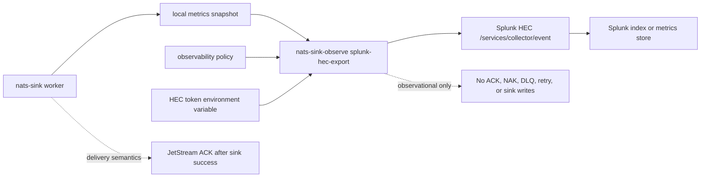

# Splunk HEC Integration

The Splunk HTTP Event Collector (HEC) integration exports approved
`nats-sinks` metrics to Splunk as a HEC metric event. It is intended for
security operations, incident-response teams, and platform operations groups
that already use Splunk Enterprise or Splunk Cloud for operational visibility.

The connector is observational only. It reads a local metrics snapshot and a
reviewed observability policy. It does not read NATS messages, payload bodies,
Oracle rows, file-sink output, message IDs, subjects, classification values,
labels, mission metadata, credentials, or destination configuration. It never
changes JetStream ACK, NAK, DLQ, retry, idempotency, or sink-write behavior.

Splunk documents HEC as an HTTP API for sending JSON event data into Splunk,
including token-based authorization and structured event metadata. The
`nats-sinks` connector uses the JSON event endpoint and renders a metric event
with approved aggregate metric fields.

Relevant Splunk documentation:

- [Use the HTTP Event Collector](https://docs.splunk.com/Documentation/Splunk/latest/Data/UsetheHTTPEventCollector)
- [Format events for HTTP Event Collector](https://docs.splunk.com/Documentation/Splunk/latest/Data/FormateventsforHTTPEventCollector)

## Architecture



The delivery worker and Splunk export command should normally run as separate
operational concerns:

- the worker processes JetStream messages and writes to durable sinks;
- the metrics recorder writes a local snapshot;
- `nats-sink-observe splunk-hec-export` reads that snapshot;
- the observability policy decides which metric names may be sent;
- Splunk HEC receives the approved aggregate metric event.

If Splunk is unavailable, a token is wrong, a TLS handshake fails, or a HEC
request is rejected, message delivery is not affected.

## What Is Exported

The connector sends one HEC event with `event` set to `metric`. Approved metric
values are placed in `fields` using Splunk metric-field names:

```json
{
  "event": "metric",
  "fields": {
    "metric_name:nats_sinks_messages_fetched_total": 256,
    "metric_name:nats_sinks_messages_acked_total": 256,
    "nats_sinks_namespace": "nats_sinks",
    "nats_sinks_observability_profile": "splunk_hec"
  },
  "host": "nats-sinks",
  "source": "nats-sinks",
  "sourcetype": "nats_sinks:metrics",
  "time": 1790000000.0
}
```

The connector does not export:

- message payloads;
- NATS subjects;
- message IDs;
- stream names or consumer names;
- NATS server URLs;
- Oracle connection strings;
- table names;
- file paths;
- classification values;
- labels;
- mission metadata;
- Splunk endpoint URLs in result summaries;
- HEC token values or token environment variable names in dry-run output.

## Policy Example

Splunk HEC export is disabled by default. Enable it only after reviewing the
metric allow list and confirming that the target Splunk index is approved for
the operational signal you are sharing.

```json
{
  "schema": "nats_sinks.observability.policy.v1",
  "enabled": true,
  "namespace": "nats_sinks",
  "allowed_metrics": [
    "messages_fetched_total",
    "messages_acked_total",
    "sink_batches_written_total"
  ],
  "allowed_metric_patterns": [],
  "denied_metrics": [],
  "denied_metric_patterns": [],
  "include_observations": false,
  "include_legacy": false,
  "subjects": [],
  "splunk_hec": {
    "enabled": true,
    "endpoint": "https://splunk-hec.example.invalid/services/collector/event",
    "token_env": "SPLUNK_HEC_TOKEN",
    "timeout_seconds": 5,
    "max_retries": 2,
    "retry_backoff_seconds": 0.25,
    "stale_after_seconds": 60,
    "max_request_bytes": 1048576,
    "verify_tls": true,
    "headers_env": {},
    "source": "nats-sinks",
    "sourcetype": "nats_sinks:metrics",
    "host": "nats-sinks",
    "index": "nats_sinks_metrics"
  }
}
```

The HEC token is not stored in the JSON policy. Provide it through the named
environment variable in the service environment:

```bash
export SPLUNK_HEC_TOKEN="example-token-value"
```

The example token value is a placeholder. Do not place real HEC tokens in
shell history, documentation, issue comments, screenshots, or repository files.

## Configuration Fields

| Field | Default | Meaning |
| --- | --- | --- |
| `splunk_hec.enabled` | `false` | Enables HEC export when the top-level observability policy is also enabled. |
| `splunk_hec.endpoint` | `null` | Splunk HEC JSON event endpoint. Enabled policies require `/services/collector/event`. Plain `http` is allowed only for loopback hosts. |
| `splunk_hec.token_env` | `null` | Environment variable name that contains the HEC token. Required when HEC export is enabled. |
| `splunk_hec.timeout_seconds` | `5` | Per-request timeout. |
| `splunk_hec.max_retries` | `0` | Bounded retries after the initial attempt. |
| `splunk_hec.retry_backoff_seconds` | `0.25` | Delay between retry attempts. |
| `splunk_hec.stale_after_seconds` | `null` | Optional maximum metrics snapshot age before export fails closed unless `--allow-stale` is used. |
| `splunk_hec.max_request_bytes` | `1048576` | Maximum rendered HEC JSON request size. |
| `splunk_hec.verify_tls` | `true` | TLS verification is required. The policy rejects `false`; use a properly trusted CA for production. |
| `splunk_hec.headers_env` | `{}` | Optional additional HEC headers sourced from environment variables. `Authorization` and `Content-Type` cannot be overridden here. |
| `splunk_hec.source` | `nats-sinks` | Low-cardinality HEC source value. |
| `splunk_hec.sourcetype` | `nats_sinks:metrics` | Low-cardinality HEC sourcetype value. |
| `splunk_hec.host` | `nats-sinks` | Low-cardinality HEC host value. Do not put sensitive hostnames here unless approved for sharing. |
| `splunk_hec.index` | `null` | Optional explicit Splunk index name. Leave unset when the HEC token controls index routing. |

## Dry Run

Dry-run mode prints the HEC JSON body without opening a network connection or
requiring the HEC token to be present:

```bash
nats-sink-observe splunk-hec-export \
  /var/lib/nats-sink/metrics.json \
  /etc/nats-sinks/observability.prometheus.json \
  --dry-run
```

Example output:

```json
{"event":"metric","fields":{"metric_name:nats_sinks_messages_acked_total":256,"metric_name:nats_sinks_messages_fetched_total":256,"nats_sinks_namespace":"nats_sinks","nats_sinks_observability_profile":"splunk_hec"},"host":"nats-sinks","source":"nats-sinks","sourcetype":"nats_sinks:metrics","time":1790000000.0}
```

Use dry-run output during change review to confirm that only approved aggregate
metric names are present.

## Export

Live export requires the top-level policy, `splunk_hec.enabled`, a HEC endpoint,
and a token environment variable:

```bash
export SPLUNK_HEC_TOKEN="example-token-value"

nats-sink-observe splunk-hec-export \
  /var/lib/nats-sink/metrics.json \
  /etc/nats-sinks/observability.prometheus.json
```

Example success output:

```text
Splunk HEC export: attempted=true delivered=true attempts=1 status=200 message=Splunk HEC export delivered
```

Example safe failure output:

```text
Splunk HEC export: attempted=true delivered=false attempts=3 status=none message=Splunk HEC export failed with URLError
```

The output does not include the endpoint URL, token value, subject names, or
payload data.

## systemd Pattern

Run Splunk HEC export separately from the sink worker. This gives the HEC
service a narrower permission set: read the local snapshot, read the policy,
read the token from its protected service environment, and connect only to the
approved HEC endpoint.

```ini
[Unit]
Description=nats-sinks Splunk HEC export
After=network-online.target

[Service]
Type=oneshot
User=nats-sink
Group=nats-sink
EnvironmentFile=/etc/nats-sinks/splunk-hec.env
ExecStart=/usr/local/bin/nats-sink-observe splunk-hec-export /var/lib/nats-sink/metrics.json /etc/nats-sinks/observability.prometheus.json
NoNewPrivileges=true
PrivateTmp=true
ProtectSystem=strict
ProtectHome=true
ReadOnlyPaths=/etc/nats-sinks /var/lib/nats-sink
```

Pair the service with a timer:

```ini
[Unit]
Description=Run nats-sinks Splunk HEC export periodically

[Timer]
OnBootSec=1min
OnUnitActiveSec=30s
AccuracySec=5s

[Install]
WantedBy=timers.target
```

## Security Guidance

- Keep HEC export disabled until the metric allow list is reviewed.
- Prefer HTTPS to a trusted Splunk HEC endpoint.
- Do not disable TLS verification. The policy deliberately rejects
  `verify_tls=false`.
- Store HEC tokens in protected service environment files or secret-management
  systems, not in JSON policy files.
- Use a HEC token scoped to the minimum required index and source type.
- Keep HEC export out of the delivery worker.
- Do not export subject labels unless a future subject-aware observability
  feature has been explicitly enabled and reviewed.
- Treat Splunk as a redistribution boundary: metric names and timing can still
  reveal operational tempo.

## Testing Guidance

The deterministic unit tests cover policy validation, HEC event rendering,
token loading, bounded retries, request-size limits, stale snapshot rejection,
CLI dry-run behavior, and public API compatibility without contacting a live
Splunk endpoint.

Optional live validation should be done only in a non-production Splunk
environment with a scoped HEC token and sanitized metrics:

```bash
export NATS_SINKS_SPLUNK_HEC_INTEGRATION=1
export SPLUNK_HEC_TOKEN="example-token-value"
python -m pytest tests/integration -k splunk_hec
```

No live Splunk integration test is enabled by default.

## Non-Goals

The Splunk HEC connector does not:

- write message payloads or sink records to Splunk;
- provide a Splunk event archive sink;
- manage HEC tokens;
- create Splunk indexes or sourcetypes;
- perform Splunk saved-search, alert, dashboard, or correlation-search setup;
- guarantee delivery of observability records to Splunk;
- affect message delivery or ACK behavior.
