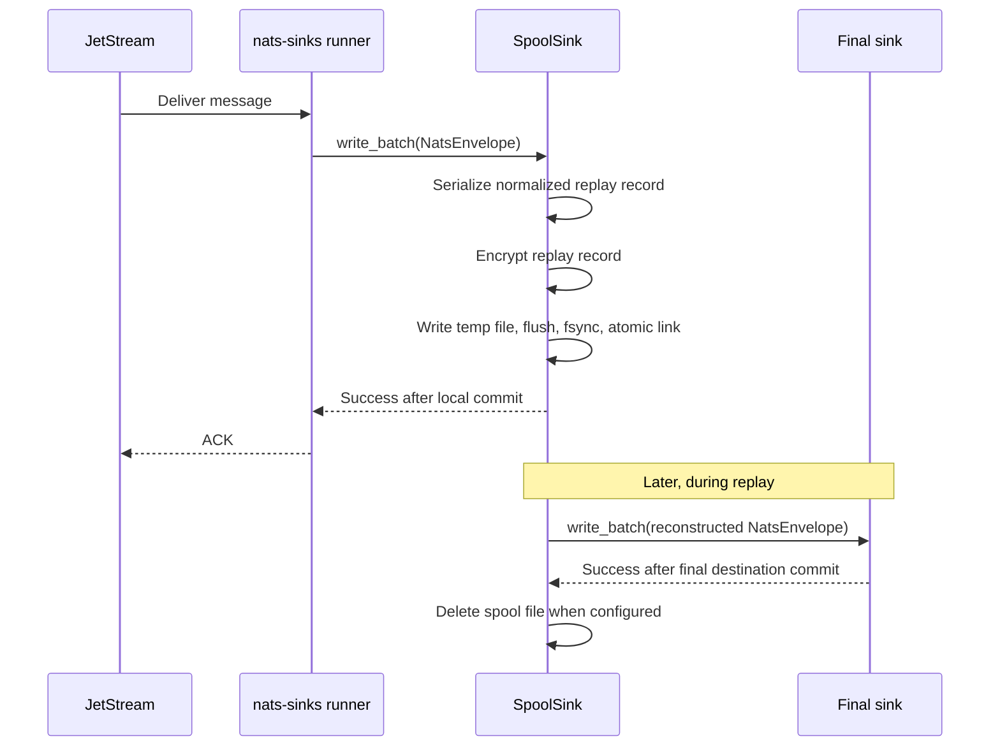

# Edge Spool Sink

The edge spool sink is a first-party sink for disconnected or degraded
operation. It stores normalized JetStream messages as bounded local records so
an edge node can ACK JetStream after local durable custody, then forward those
records to a final sink later when connectivity returns.

The sink type is:

```json
{
  "sink": {
    "type": "spool"
  }
}
```

Use this mode only when local disk custody is an intentional part of the
architecture. It changes the durable boundary from "remote destination
committed" to "encrypted local spool committed".

## Delivery Model



This is still at-least-once processing. If the process crashes after local
spool commit but before ACK, JetStream may redeliver the message. The same
idempotency key maps to the same spool filename, and the default duplicate
policy treats that as safe prior processing.

## When To Use It

The spool sink is useful for:

- tactical or edge deployments with intermittent upstream or downstream
  connectivity,
- field gateways that must retain events locally during WAN loss,
- mission-support environments where local custody is preferable to dropping
  operational facts,
- controlled replay workflows where operators decide when a final Oracle,
  file, object-storage, or future sink receives the data.

It is not a replacement for a durable final destination. Treat it as local
custody for disconnected operation and plan retention, monitoring, and replay
procedures accordingly.

## Configuration Reference

| Field | Default | Values | Description |
| --- | --- | --- | --- |
| `type` | required | `spool` | Selects the encrypted local spool sink. |
| `directory` | required | local path | Directory where committed spool files are stored. The sink resolves the directory and refuses paths that escape it. |
| `max_records` | `100000` | `1` to `10000000` | Maximum committed `.spool.json` files allowed before new writes fail closed. |
| `max_bytes` | `10737418240` | `1048576` to `1099511627776` | Maximum total spool bytes allowed before new writes fail closed. |
| `duplicate_policy` | `skip_existing` | `skip_existing`, `fail` | Handling for redelivered messages whose deterministic spool file already exists. |
| `payload_mode` | `json_or_envelope` | See [Configuration](configuration.md#payload-storage-modes) | Controls how the plaintext replay record represents payload preview data before the whole record is encrypted. Replay always preserves the original `NatsEnvelope.data`. |
| `include_metadata` | `true` | `true`, `false` | Include the standard NATS metadata snapshot inside the encrypted replay record. |
| `create_directory` | `true` | `true`, `false` | Create the spool directory at startup when missing. |
| `fsync` | `true` | `true`, `false` | Flush files and parent directory entries before reporting success. Keep enabled for production custody. |
| `pretty` | `false` | `true`, `false` | Write readable JSON wrappers. This does not decrypt the encrypted replay record. |
| `drain_ordering` | `priority` | `priority`, `fifo` | Replay ordering. `priority` drains higher priority ranks first, then older records. `fifo` drains by spool time. |
| `delete_after_replay` | `true` | `true`, `false` | Delete a spool file only after the target sink returns success during replay. |
| `encryption` | required by policy | AES config | Record-level encryption config using the same fields as core payload encryption. |
| `allow_unencrypted` | `false` | `true`, `false` | Explicit development/test escape hatch. Production should leave this false. |

## Encryption

Spool encryption protects the full replay record, including payload, headers,
classification, labels, mission metadata, custody metadata, and timing
metadata. A small plaintext wrapper remains so the replay command can list and
sort files without decrypting every record.

The wrapper contains:

```json
{
  "schema": "nats_sinks.spool.wrapper.v1",
  "schema_version": 1,
  "encrypted": true,
  "idempotency_key_sha256": "93d0...",
  "priority_rank": 2,
  "spooled_at_epoch_ns": 1779451200000000000,
  "encrypted_record": {
    "_nats_sinks_encryption": {
      "schema": "nats_sinks.encrypted_payload.v1",
      "version": 1,
      "algorithm": "aes-256-gcm",
      "key_id": "edge-spool-2026-05",
      "nonce": "base64...",
      "ciphertext": "base64..."
    }
  }
}
```

The plaintext wrapper intentionally does not contain subjects, message IDs,
classification strings, labels, headers, payloads, NATS server addresses, or
credentials.

Generate a development key:

```bash
python - <<'PY'
import base64
import secrets
print(base64.b64encode(secrets.token_bytes(32)).decode("ascii"))
PY
```

Store the value in an environment variable or a secret manager:

```bash
export NATS_SINKS_SPOOL_KEY_B64="replace-with-base64-32-byte-key"
```

Example sink configuration:

```json
{
  "sink": {
    "type": "spool",
    "directory": "/var/lib/nats-sink/spool",
    "max_records": 250000,
    "max_bytes": 53687091200,
    "duplicate_policy": "skip_existing",
    "drain_ordering": "priority",
    "delete_after_replay": true,
    "fsync": true,
    "encryption": {
      "enabled": true,
      "algorithm": "aes-256-gcm",
      "key_id": "edge-spool-2026-05",
      "key_b64_env": "NATS_SINKS_SPOOL_KEY_B64"
    }
  }
}
```

## Replay

Replay uses two normal nats-sinks JSON configuration files:

- the spool configuration, with `sink.type` set to `spool`,
- the target configuration, with `sink.type` set to `file`, `oracle`, or a
  future certified sink.

Dry-run without opening the target sink:

```bash
nats-sink replay-spool /etc/nats-sinks/spool.json /etc/nats-sinks/oracle.json --dry-run
```

Example output:

```text
Dry run complete; 128 committed spool record(s) eligible.
```

Replay up to 100 records:

```bash
nats-sink replay-spool /etc/nats-sinks/spool.json /etc/nats-sinks/oracle.json --max-records 100
```

Example output:

```text
Replay complete: scanned=100 replayed=100 deleted=100 failed=0
```

If the target sink fails, replay stops and the current spool file remains on
disk. This preserves at-least-once replay behavior and lets operators retry
after fixing the target.

## Failure Behavior

| Scenario | Result |
| --- | --- |
| Spool directory cannot be created | Startup or write fails; no ACK for affected messages. |
| Spool count or byte limit is reached | Write fails with a temporary destination error; no ACK for affected messages. |
| Duplicate redelivery with `skip_existing` | Existing spool file is treated as successful prior local custody. |
| Duplicate redelivery with `fail` | Write fails as a permanent duplicate destination error. |
| Process crashes after spool commit but before ACK | JetStream may redeliver; deterministic filename prevents duplicate spool records. |
| Replay target fails | Spool file remains committed and replay can be retried. |
| Replay succeeds and cleanup is enabled | Spool file is deleted after target sink success. |

## Operational Guidance

Keep the spool directory outside the source checkout and outside executable
paths. Recommended Linux locations are:

```text
/var/lib/nats-sink/spool
/srv/nats-sink/spool
```

Recommended permissions:

```bash
sudo install -d -o nats-sink -g nats-sink -m 0700 /var/lib/nats-sink/spool
```

Monitor:

- record count and byte usage,
- replay backlog age,
- failed replay attempts,
- disk saturation,
- key-rotation windows,
- whether `allow_unencrypted` is accidentally enabled.

For high-trust or mission-support environments, treat local spool storage as a
custody boundary. Backups, disk encryption, access controls, incident response,
and physical protection should match the sensitivity of the stored events.
