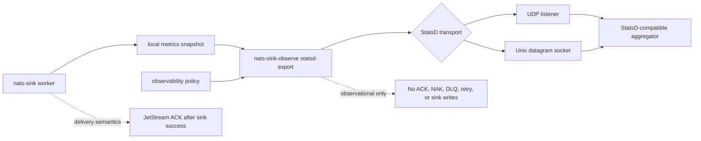

# StatsD Integration

The StatsD integration exports approved `nats-sinks` metrics as StatsD
datagrams. It is intended for environments that already operate StatsD,
Graphite-compatible pipelines, Telegraf, Datadog Agent DogStatsD-compatible
listeners, or other lightweight metric aggregators.

StatsD is best-effort observability. UDP and Unix datagram transports can drop
packets, and many StatsD receivers aggregate values before forwarding them.
Use StatsD for operational trend visibility, not for durable audit records,
delivery proof, or message custody evidence.

The connector is observational only. It reads a local metrics snapshot and a
reviewed observability policy. It does not read NATS messages, payload bodies,
Oracle rows, file-sink output, message IDs, subjects, classification values,
labels, mission metadata, credentials, or destination configuration. It never
changes JetStream ACK, NAK, DLQ, retry, idempotency, or sink-write behavior.

## Architecture



The delivery worker and StatsD export command should normally run as separate
operational concerns:

- the worker processes JetStream messages and writes to durable sinks;
- the metrics recorder writes a local snapshot;
- `nats-sink-observe statsd-export` reads that snapshot;
- the observability policy decides which metric names may be sent;
- a StatsD-compatible listener receives the approved metric datagrams.

If the StatsD listener is unavailable, a Unix socket is missing, or UDP packets
are dropped, message delivery is not affected.

## What Is Exported

The connector renders one StatsD line per approved aggregate metric:

```text
nats_sinks.messages_fetched_total:256|g
nats_sinks.messages_acked_total:256|g
nats_sinks.sink_batch_write_seconds.count:4|g
nats_sinks.sink_batch_write_seconds.last:0.031|g
```

Metric types are mapped as follows:

| nats-sinks row kind | StatsD type | Notes |
| --- | --- | --- |
| Counter | `g` | Metrics snapshots contain absolute aggregate values, so counters are exported as gauges to avoid double-counting repeated exports. |
| Gauge | `g` | Current values are sent as StatsD gauges. |
| Observation `count` | `g` | Observation counts are snapshot values and are exported as gauges for the same reason as counters. |
| Observation `sum`, `min`, `max`, `last` | `g` | Observation summary values are sent as gauges. |

This is a deliberate interoperability choice. StatsD counters are normally
interpreted as deltas by aggregators. The `nats-sinks` metrics snapshot stores
the current total, not "the change since the previous export", so exporting
snapshot totals as StatsD counters would inflate values whenever the exporter
runs repeatedly over the same process metrics.

The connector does not export:

- message payloads;
- NATS subjects;
- message IDs;
- stream names or consumer names;
- NATS server URLs;
- Oracle connection strings;
- table names;
- file paths;
- classification values;
- labels;
- mission metadata;
- StatsD hostnames or socket paths in result summaries.

## Policy Example

StatsD export is disabled by default. Enable it only after reviewing the metric
allow list and confirming that the target aggregator is approved for the
operational signal you are sharing.

```json
{
  "schema": "nats_sinks.observability.policy.v1",
  "enabled": true,
  "namespace": "nats_sinks",
  "allowed_metrics": [
    "messages_fetched_total",
    "messages_acked_total",
    "sink_batches_written_total"
  ],
  "allowed_metric_patterns": [],
  "denied_metrics": [],
  "denied_metric_patterns": [],
  "include_observations": false,
  "include_legacy": false,
  "subjects": [],
  "statsd": {
    "enabled": true,
    "transport": "udp",
    "host": "127.0.0.1",
    "port": 8125,
    "socket_path": null,
    "metric_prefix": null,
    "timeout_seconds": 1,
    "max_retries": 0,
    "retry_backoff_seconds": 0.25,
    "stale_after_seconds": 60,
    "max_datagram_bytes": 1432
  }
}
```

When `metric_prefix` is `null`, the connector uses the policy `namespace` as
the StatsD prefix. Set a prefix only when your StatsD naming scheme requires a
specific root.

## Configuration Fields

| Field | Default | Meaning |
| --- | --- | --- |
| `statsd.enabled` | `false` | Enables StatsD export when the top-level observability policy is also enabled. |
| `statsd.transport` | `udp` | Transport mode. Supported values are `udp` and `unixgram`. |
| `statsd.host` | `127.0.0.1` | UDP target host. Keep loopback unless an approved network path exists. |
| `statsd.port` | `8125` | UDP target port, validated from `1` through `65535`. |
| `statsd.socket_path` | `null` | Unix datagram socket path. Required when `transport` is `unixgram`. |
| `statsd.metric_prefix` | `null` | Optional StatsD metric prefix. When unset, the policy namespace is used. |
| `statsd.timeout_seconds` | `1` | Socket timeout, validated from greater than `0` through `60` seconds. |
| `statsd.max_retries` | `0` | Bounded retries after the initial send attempt. |
| `statsd.retry_backoff_seconds` | `0.25` | Delay between retry attempts when a local send operation fails. |
| `statsd.stale_after_seconds` | `null` | Optional maximum metrics snapshot age before export fails closed unless `--allow-stale` is used. |
| `statsd.max_datagram_bytes` | `1432` | Maximum size for each rendered datagram. The default is intentionally conservative for common UDP paths. |

## Dry Run

Dry-run mode prints the StatsD lines without opening a socket:

```bash
nats-sink-observe statsd-export \
  /var/lib/nats-sink/metrics.json \
  /etc/nats-sinks/observability.prometheus.json \
  --dry-run
```

Example output:

```text
nats_sinks.messages_fetched_total:256|g
nats_sinks.messages_acked_total:256|g
```

Use dry-run output during change review to confirm that only approved aggregate
metric names are present.

## UDP Export

UDP export requires the top-level policy, `statsd.enabled`, and a UDP target:

```bash
nats-sink-observe statsd-export \
  /var/lib/nats-sink/metrics.json \
  /etc/nats-sinks/observability.prometheus.json
```

Example success output:

```text
StatsD export: attempted=true delivered=true attempts=1 datagrams=2 message=StatsD export delivered
```

Example safe failure output:

```text
StatsD export: attempted=true delivered=false attempts=3 datagrams=2 message=StatsD export failed with OSError
```

The output does not include the target host, target port, socket path, subject
names, or payload data.

## Unix Datagram Export

Some local agents expose a Unix datagram socket. This keeps traffic on the host
and can simplify host firewall policy:

```json
{
  "statsd": {
    "enabled": true,
    "transport": "unixgram",
    "socket_path": "/run/statsd/nats-sinks.sock"
  }
}
```

The socket path is validated as configuration, but the connector does not
create or manage the receiving socket. The StatsD-compatible agent must create
the socket before the export command runs.

## systemd Pattern

Run StatsD export separately from the sink worker. This gives the StatsD
service a narrower permission set: read the local snapshot, read the policy,
and send datagrams only to the approved local listener.

```ini
[Unit]
Description=nats-sinks StatsD export
After=network-online.target

[Service]
Type=oneshot
User=nats-sink
Group=nats-sink
ExecStart=/usr/local/bin/nats-sink-observe statsd-export /var/lib/nats-sink/metrics.json /etc/nats-sinks/observability.prometheus.json
NoNewPrivileges=true
PrivateTmp=true
ProtectSystem=strict
ProtectHome=true
ReadWritePaths=/var/lib/nats-sink
```

A timer can run the export periodically:

```ini
[Unit]
Description=Run nats-sinks StatsD export every 30 seconds

[Timer]
OnBootSec=30s
OnUnitActiveSec=30s
AccuracySec=5s
Unit=nats-sink-statsd.service

[Install]
WantedBy=timers.target
```

## Security Guidance

- Keep StatsD disabled unless there is an approved receiver and a reviewed
  metric allow list.
- Prefer loopback UDP or Unix datagram sockets for local agents.
- Treat even aggregate counts as operationally sensitive in mission-oriented
  environments because activity tempo can reveal posture.
- Do not enable broad patterns such as `*` unless the metric set has been
  reviewed.
- Keep `include_observations=false` unless timing summaries are approved for
  sharing.
- Keep `max_datagram_bytes` bounded so a configuration mistake cannot generate
  oversized UDP payloads.
- Do not interpret StatsD export success as proof that a remote monitoring
  platform received or retained the metric. StatsD transport is best-effort.

## Testing

The unit test suite covers disabled policy behavior, allow and deny filtering,
metric-name normalization, observation summary rendering, datagram-size bounds,
UDP sending, Unix datagram sending, bounded retries, stale snapshot behavior,
CLI dry-run output, and public API compatibility.

Run the focused tests:

```bash
python -m pytest \
  tests/unit/test_statsd_observability.py \
  tests/unit/test_observability_policy.py \
  tests/unit/test_observability_cli.py \
  tests/unit/test_public_api.py -q
```

Optional live testing can be performed with a local StatsD-compatible receiver,
but it is not part of the default suite because StatsD implementations differ
and UDP receipt is not a durable contract.
