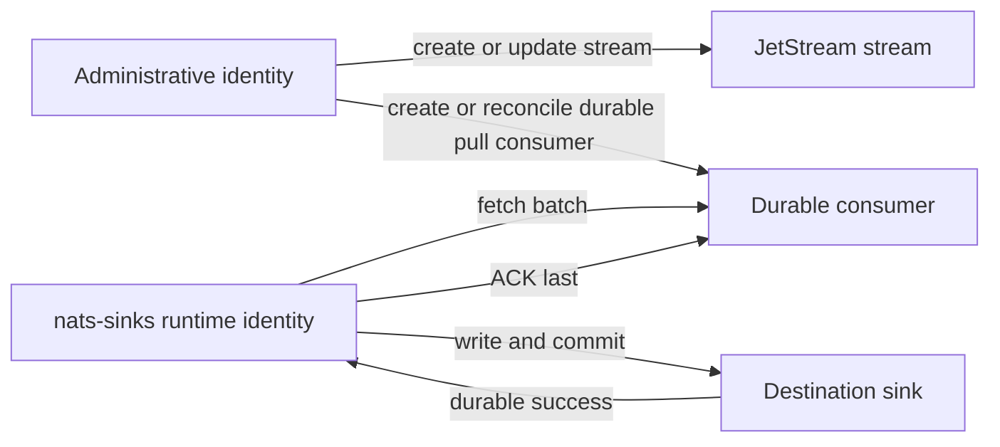
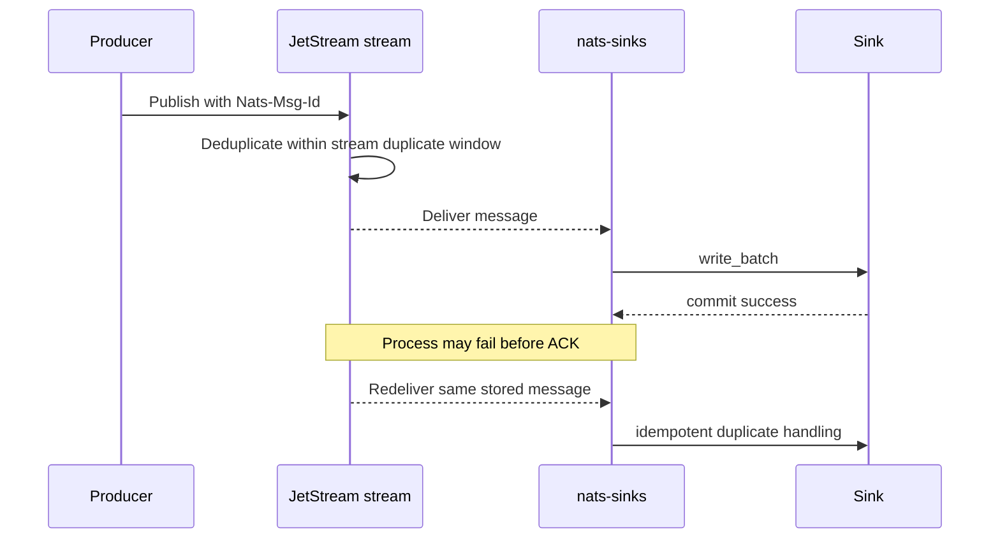

# JetStream Stream Management Planning

`nats-sinks` is a sink runner, not a general NATS administration tool. Its
normal runtime identity should fetch messages from one durable pull consumer,
write them to a destination, and ACK only after durable success. It should not
need permission to create, delete, purge, or broadly modify streams.

Operators still need good stream settings. Retention policy, discard policy,
storage type, replica count, duplicate-window settings, and subject coverage
all influence how safely a sink workload can be replayed, recovered, and
audited. This page explains the optional planning helper that turns a
`nats-sinks` JSON config into a safe, reviewable stream-preparation plan.

The helper is intentionally offline:

- it does not connect to NATS,
- it does not create or update streams,
- it does not create or update consumers,
- it does not resolve credentials,
- it does not require NATS administrator permissions,
- it does not alter commit-then-ACK behavior.

## Separation Of Duties

The recommended production model keeps runtime and administration separate.



The runtime worker should normally use the least-privilege template in
[NATS Least-Privilege Permissions](nats-permissions.md). The administrative
identity can be a human-operated NATS CLI, Terraform, Ansible, an approved
release pipeline, or a controlled platform service.

## Generating A Plan

Run:

```bash
nats-sink stream-plan /etc/nats-sinks/config.json
```

Example output:

```text
JetStream stream management plan
Stream: ORDERS
Durable consumer: oracle-orders-sink
Subjects:
  - orders.*
Recommended stream settings:
  retention: limits
  discard: old
  storage: file
  replicas: 1
  duplicate_window_seconds: 120
Runtime permissions to keep narrow:
  - $JS.API.CONSUMER.MSG.NEXT.ORDERS.oracle-orders-sink
  - $JS.API.CONSUMER.INFO.ORDERS.oracle-orders-sink
  - $JS.ACK.ORDERS.oracle-orders-sink.>
  - _INBOX.>
Administrative permissions for a separate setup identity:
  - $JS.API.STREAM.CREATE.ORDERS
  - $JS.API.STREAM.UPDATE.ORDERS
  - $JS.API.STREAM.INFO.ORDERS
  - $JS.API.STREAM.NAMES
  - $JS.API.CONSUMER.DURABLE.CREATE.ORDERS.oracle-orders-sink
NATS CLI example:
  nats stream add ORDERS --subjects 'orders.*' --retention limits --discard old --storage file --replicas 1 --dupe-window 120s
Notes:
  - This plan is offline guidance only; nats-sinks does not connect to NATS or modify stream state when generating it.
  - Use a separate administrative identity to apply stream or consumer changes.
  - The sink runtime should normally keep only pull, ACK, INFO, inbox, and optional DLQ publish permissions.
  - ACK behavior remains commit-then-acknowledge; stream management does not allow early ACK.
Warnings:
  - replicas=1 is suitable for local or edge deployments but does not provide cluster-level stream redundancy
```

For automation or review artifacts, use JSON output:

```bash
nats-sink stream-plan /etc/nats-sinks/config.json --format json
```

Example JSON:

```json
{
  "stream": "ORDERS",
  "subjects": ["orders.*"],
  "durable_consumer": "oracle-orders-sink",
  "recommended_stream_settings": {
    "retention": "limits",
    "discard": "old",
    "storage": "file",
    "replicas": 1,
    "duplicate_window_seconds": 120
  },
  "runtime_permissions": [
    "$JS.API.CONSUMER.MSG.NEXT.ORDERS.oracle-orders-sink",
    "$JS.API.CONSUMER.INFO.ORDERS.oracle-orders-sink",
    "$JS.ACK.ORDERS.oracle-orders-sink.>",
    "_INBOX.>"
  ],
  "administration_permissions": [
    "$JS.API.STREAM.CREATE.ORDERS",
    "$JS.API.STREAM.UPDATE.ORDERS",
    "$JS.API.STREAM.INFO.ORDERS",
    "$JS.API.STREAM.NAMES",
    "$JS.API.CONSUMER.DURABLE.CREATE.ORDERS.oracle-orders-sink"
  ],
  "nats_cli_example": "nats stream add ORDERS --subjects 'orders.*' --retention limits --discard old --storage file --replicas 1 --dupe-window 120s",
  "notes": [
    "This plan is offline guidance only; nats-sinks does not connect to NATS or modify stream state when generating it.",
    "Use a separate administrative identity to apply stream or consumer changes.",
    "The sink runtime should normally keep only pull, ACK, INFO, inbox, and optional DLQ publish permissions.",
    "ACK behavior remains commit-then-acknowledge; stream management does not allow early ACK."
  ],
  "warnings": [
    "replicas=1 is suitable for local or edge deployments but does not provide cluster-level stream redundancy"
  ]
}
```

The JSON output is suitable for internal review, CI artifacts, or controlled
platform runbooks. Do not paste plans containing private stream names or
classified subject names into public GitHub issues.

## Planning Options

The helper accepts an allow-listed set of stream settings:

| Option | Values | Default | Meaning |
| --- | --- | --- | --- |
| `--retention` | `limits`, `interest`, `workqueue` | `limits` | How JetStream decides when messages can leave the stream. |
| `--discard` | `old`, `new` | `old` | Whether the stream drops older messages or rejects new messages when limits are reached. |
| `--storage` | `file`, `memory` | `file` | Where stream data is stored on the NATS server. |
| `--replicas` | `1` to `5` | `1` | Stream replica count. Use more than one replica when the NATS cluster and mission need require redundancy. |
| `--duplicate-window-seconds` | `1` to `604800` | `120` | Server-side publisher duplicate-detection window for `Nats-Msg-Id`. |
| `--format` | `text`, `json` | `text` | Human-readable or machine-readable output. |

Example for a clustered production stream:

```bash
nats-sink stream-plan /etc/nats-sinks/config.json \
  --retention limits \
  --discard old \
  --storage file \
  --replicas 3 \
  --duplicate-window-seconds 600
```

Example for a constrained edge node:

```bash
nats-sink stream-plan /etc/nats-sinks/config.json \
  --retention limits \
  --discard old \
  --storage file \
  --replicas 1 \
  --duplicate-window-seconds 120
```

The edge example may be valid for disconnected or forward-deployed systems,
but the plan will warn that `replicas=1` does not provide cluster-level stream
redundancy.

## Retention Policy Guidance

Use `limits` for most sink workloads. It keeps messages until stream limits
such as maximum age, maximum bytes, or maximum messages remove them. This is
the easiest policy to reason about for replay, downstream recovery, audit
drills, and sink reprocessing.

Use `interest` only when the NATS platform team has reviewed every matching
consumer. Interest retention removes messages after all interested consumers
have acknowledged them. That can be appropriate in some topologies, but it can
surprise teams that expect a replay window independent of current consumers.

Use `workqueue` only for queue-style processing where exactly one consumer
family should handle each subject. It is usually not the right choice when
multiple independent sink consumers, archive paths, or evidence stores need
the same event.

## Discard Policy Guidance

`discard=old` is usually easier for publishers because the stream keeps
accepting new messages when limits are reached, while older messages are
removed. Operators must size retention so this does not remove events before
sinks and replay procedures have enough time to process them.

`discard=new` rejects new messages when limits are reached. That can be useful
when losing old audit history is worse than applying backpressure to producers,
but producers and operators must be able to observe and handle publish
failures.

## Storage And Replicas

`storage=file` is the recommended default for durable sink workloads. It gives
the stream a persistent storage boundary that is easier to align with replay
and recovery expectations.

`storage=memory` can be fast, but it is a deliberate tradeoff. Use it only
when the NATS deployment and recovery model accept the durability difference.

Replica count is a NATS cluster design choice. `replicas=1` can be acceptable
for local development, test systems, or certain edge deployments. Clustered
production streams should normally use a higher replica count when the NATS
cluster supports it and operational availability requirements justify it.

## Duplicate Window And Idempotency

JetStream stream duplicate windows are producer-side protection. When producers
set `Nats-Msg-Id`, the stream can reject duplicate publishes with the same
message ID during the configured duplicate window.

That is useful, but it is not a replacement for sink idempotency. A message can
still redeliver after the sink commits and before the ACK reaches JetStream.
The sink must still use idempotent keys such as stream sequence, message ID, or
a validated payload field.



The duplicate window should be long enough to cover normal producer retry
behavior. The sink idempotency policy should be long-lived enough to cover
JetStream redelivery, operational replay, and downstream recovery.

## Applying The Plan

The helper prints a NATS CLI example, but it does not execute it. Review the
example with your platform team, translate it into your preferred NATS
administration workflow, and then apply it with an administrative identity.

For example:

```bash
nats stream add ORDERS \
  --subjects "orders.*" \
  --retention limits \
  --discard old \
  --storage file \
  --replicas 3 \
  --dupe-window 600s
```

If the stream already exists, use your normal NATS CLI, Terraform, or platform
automation update path. Do not give the long-running `nats-sinks` worker broad
stream update permissions simply to make setup easier.

## What This Helper Does Not Do

The helper does not currently plan every NATS stream field. It intentionally
focuses on the settings most directly connected to sink reliability:

- retention policy,
- discard policy,
- storage type,
- replica count,
- duplicate window,
- subject coverage,
- runtime versus administration permission separation.

More advanced topology such as mirrors, sources, subject transforms, republish,
placement, compression, and stream metadata is documented separately in
[Advanced JetStream Topology](jetstream-topology.md). Those features remain
NATS platform architecture choices.
