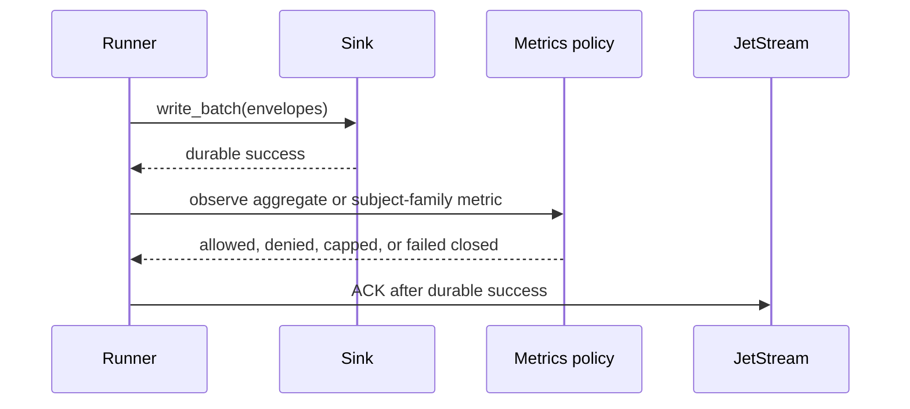

# Subject-Aware Observability Evaluation

This page records the evaluation for bounded subject-aware observability
policies in `nats-sinks`. It is written for operators who want insight into
subject-family behavior without accidentally publishing sensitive operational
metadata or creating unbounded metric cardinality.

The conclusion is intentionally conservative:

- subject-aware metric export must remain disabled by default,
- current low-cardinality aggregate metrics should remain the normal
  production posture,
- subject-aware export should be controlled by a reviewed, opt-in policy model,
- raw subjects should not become labels by default,
- any future subject-aware feature must be bounded, fail closed, and unable to
  influence ACK behavior, sink writes, retries, or DLQ handling.

The current release adds the policy model. It does not yet add subject-labeled
metric export.

## Background

Prometheus metrics are stored as time series identified by a metric name and
labels. The Prometheus data model states that changing a label value creates a
new time series. The Prometheus instrumentation guidance also warns that every
label set has RAM, CPU, disk, and network cost, recommends that most metrics
have no labels, and advises moving analysis away from monitoring when
cardinality can grow too large. See
[Prometheus Data Model](https://prometheus.io/docs/concepts/data_model/),
[Prometheus Metric And Label Naming](https://prometheus.io/docs/practices/naming/),
and
[Prometheus Instrumentation](https://prometheus.io/docs/practices/instrumentation/).

OpenTelemetry also treats attribute cardinality as an explicit design concern.
The metrics SDK specification describes cardinality limits, overflow handling,
and the need to apply filtering before cardinality-limit enforcement. See
[OpenTelemetry Metrics SDK](https://opentelemetry.io/docs/specs/otel/metrics/sdk/).

Those principles matter for `nats-sinks` because NATS subjects can encode
mission, customer, environment, platform, tenant, routing, or operational
tempo information. In defence and mission-support environments, a subject name
can be sensitive even when the payload is encrypted and no credentials are
present.

## Current Safe Baseline

The current observability design is intentionally low-cardinality:

- the core metrics snapshot contains aggregate counters, gauges, and timing
  summaries;
- the Prometheus connector exports no subjects, table names, file paths,
  message IDs, classification values, labels, or payload fields;
- generated observability policies are disabled by default;
- generated policy files may include known subject patterns as disabled review
  hints, but those hints are not exported as metric labels.


This remains the recommended production default.

## Threat Model

Subject-aware observability has two risk families.

First, subjects can disclose operational context:

- business domain or mission thread,
- platform or system family,
- location, unit, tenant, or environment naming conventions,
- incident tempo through per-subject rates,
- classification workflow hints,
- routing design and system boundaries.

Second, subjects can create metric cardinality pressure:

- unbounded subjects can create many time series,
- wildcard subject families can hide high variation,
- dynamic subject tokens can resemble user IDs or message IDs,
- per-subject observations can multiply timing series,
- exporters can become slower or more expensive even when delivery remains
  safe.

The safe default is therefore no subject sharing.

## Policy Shape

The subject-aware policy is separate from the current aggregate metric allow
list. It makes operators state exactly what they intend to share and how it
should be represented. Current exporters do not use this block for label
rendering yet; it is the reviewed model future connectors must use.

Example policy shape:

```json
{
  "subject_metrics": {
    "enabled": true,
    "default_action": "deny",
    "max_subject_families": 20,
    "overflow_action": "aggregate_other",
    "overflow_label": "other",
    "allow_raw_subjects": false,
    "rules": [
      {
        "subject": "orders.*",
        "label": "orders",
        "display_mode": "label",
        "allowed_metrics": [
          "messages_fetched_total",
          "messages_written_total",
          "messages_failed_total"
        ]
      }
    ]
  }
}
```

The important properties are:

- disabled by default,
- default deny,
- explicit subject-family allow list,
- stable low-cardinality labels rather than raw subjects where possible,
- maximum subject-family count,
- deterministic overflow behavior,
- no payload, header, message ID, table, file path, classification, or free-form
  label values in metric labels.

## Hashing And Redaction

Hashing raw subjects may help compare repeat occurrences without exposing the
literal subject. It is not a confidentiality boundary by itself. Subject
spaces are often small enough that an attacker with context can guess values
and compare hashes.

If hashing is added later, it should be treated as one display mode, not as a
replacement for allow lists and cardinality caps. A safer default is to map
approved subject patterns to operator-chosen labels such as `orders`,
`telemetry`, or `dlq`.

## Delivery Boundary

Subject-aware observability must never affect delivery semantics.



If metrics export is disabled, denied, capped, stale, malformed, or unable to
write, message delivery behavior must remain unchanged. Metrics failure is an
observability event, not a delivery decision.

## Recommended Implementation Split

The evaluation recommends three separate implementation boundaries:

1. Add a subject-aware observability policy model with threat-model defaults.
2. Add bounded subject-family metric aggregation.
3. Add subject-aware observability certification tests and runbook guidance.

This split keeps policy design, runtime aggregation, and certification evidence
reviewable as separate changes.

## Current Status

This release adds the disabled-by-default subject-aware policy model. It
validates subject-family rules, operator labels, display modes, cardinality
caps, and overflow behavior. Subject-aware metric export is not enabled yet.
