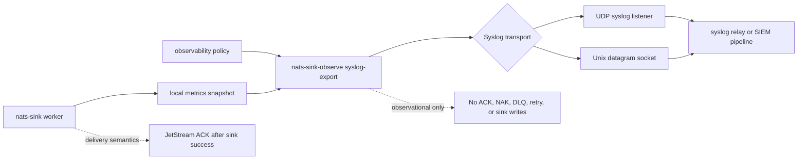

# Syslog Bridge

The syslog bridge exports approved `nats-sinks` metrics as bounded
RFC 5424-style syslog messages. It is intended for restricted networks, legacy
operations centers, security monitoring environments, and host-level logging
pipelines where pull-based Prometheus scraping, cloud-native APIs, or
OpenTelemetry collectors are not available.

Syslog export is best-effort observability. UDP and Unix datagram transports
can drop messages, and many syslog relays forward data broadly. Use this bridge
for operational visibility, not for durable audit records, delivery proof,
message custody evidence, or sink success decisions.

The connector is observational only. It reads a local metrics snapshot and a
reviewed observability policy. It does not read NATS messages, payload bodies,
Oracle rows, file-sink output, spool records, message IDs, subjects,
classification values, labels, mission metadata, credentials, or destination
configuration. It never changes JetStream ACK, NAK, DLQ, retry, idempotency, or
sink-write behavior.

## Architecture



The delivery worker and syslog export command should normally run as separate
operational concerns:

- the worker processes JetStream messages and writes to durable sinks;
- the metrics recorder writes a local snapshot;
- `nats-sink-observe syslog-export` reads that snapshot;
- the observability policy decides which metric names may be shared;
- a local or approved network syslog listener receives the bounded messages.

If the syslog listener is unavailable, a Unix socket is missing, or UDP packets
are dropped, message delivery is not affected.

## What Is Exported

The connector renders one RFC 5424-style message per approved aggregate
metric. Approved values are encoded as structured-data parameters and the
message body is the nil marker (`-`):

```text
<134>1 2026-09-21T14:13:20.000Z - nats-sinks - metrics [nats_sinks metric="messages_fetched_total" kind="counter" value="256" namespace="nats_sinks" profile="syslog"] -
<134>1 2026-09-21T14:13:20.000Z - nats-sinks - metrics [nats_sinks metric="messages_acked_total" kind="counter" value="256" namespace="nats_sinks" profile="syslog"] -
```

The default priority value in the examples above comes from facility
`local0` and severity `info`.

Metric rows are selected by the same observability policy used by Prometheus,
OTLP, Elastic, Grafana Alloy, Splunk HEC, StatsD, and future connectors:

- `allowed_metrics`;
- `allowed_metric_patterns`;
- `denied_metrics`;
- `denied_metric_patterns`;
- `include_observations`;
- `include_legacy`.

The connector does not export:

- message payloads;
- NATS subjects;
- message IDs;
- stream names or consumer names;
- NATS server URLs;
- Oracle connection strings;
- table names;
- file paths;
- classification values;
- labels;
- mission metadata;
- syslog hostnames, ports, or socket paths in result summaries.

## RFC 5424 Mapping

The bridge uses a compact RFC 5424-style shape:

```text
<PRI>1 TIMESTAMP HOSTNAME APP-NAME PROCID MSGID [STRUCTURED-DATA] -
```

| Field | Source | Notes |
| --- | --- | --- |
| `PRI` | `syslog.facility` and `syslog.severity` | Calculated as `facility * 8 + severity`. |
| `VERSION` | fixed `1` | RFC 5424 version marker. |
| `TIMESTAMP` | metrics snapshot `generated_at_epoch_seconds` | Rendered as UTC with millisecond precision. |
| `HOSTNAME` | `syslog.hostname` | Defaults to `-` to avoid leaking host identity. |
| `APP-NAME` | `syslog.app_name` | Defaults to `nats-sinks`. |
| `PROCID` | `syslog.procid` | Defaults to `-`. |
| `MSGID` | `syslog.msgid` | Defaults to `metrics`. |
| `STRUCTURED-DATA` | approved metric row | Contains metric name, row kind, value, namespace, and profile. |
| `MSG` | fixed `-` | No free-form message body is emitted. |

Structured-data values escape `"`, `\`, and `]`. Control characters are
replaced with `?` before rendering. Header fields are bounded and must be
printable ASCII without spaces, which keeps messages predictable for simple
syslog relays.

## Policy Example

Syslog export is disabled by default. Enable it only after reviewing the
metric allow list and confirming that the receiving syslog path is approved
for the operational signal you are sharing.

```json
{
  "schema": "nats_sinks.observability.policy.v1",
  "enabled": true,
  "namespace": "nats_sinks",
  "allowed_metrics": [
    "messages_fetched_total",
    "messages_acked_total",
    "sink_batches_written_total"
  ],
  "allowed_metric_patterns": [],
  "denied_metrics": [],
  "denied_metric_patterns": [],
  "include_observations": false,
  "include_legacy": false,
  "subjects": [],
  "syslog": {
    "enabled": true,
    "transport": "udp",
    "host": "127.0.0.1",
    "port": 514,
    "socket_path": null,
    "facility": "local0",
    "severity": "info",
    "hostname": "-",
    "app_name": "nats-sinks",
    "procid": "-",
    "msgid": "metrics",
    "structured_data_id": "nats_sinks",
    "timeout_seconds": 1,
    "max_retries": 0,
    "retry_backoff_seconds": 0.25,
    "stale_after_seconds": 60,
    "max_message_bytes": 1024
  }
}
```

## Configuration Fields

| Field | Default | Meaning |
| --- | --- | --- |
| `syslog.enabled` | `false` | Enables syslog export when the top-level observability policy is also enabled. |
| `syslog.transport` | `udp` | Transport mode. Supported values are `udp` and `unixgram`. |
| `syslog.host` | `127.0.0.1` | UDP target host. Keep loopback unless an approved network path exists. |
| `syslog.port` | `514` | UDP target port, validated from `1` through `65535`. |
| `syslog.socket_path` | `null` | Unix datagram socket path. Required when `transport` is `unixgram`. |
| `syslog.facility` | `local0` | Syslog facility used to calculate the RFC 5424 priority value. |
| `syslog.severity` | `info` | Syslog severity used to calculate the RFC 5424 priority value. |
| `syslog.hostname` | `-` | RFC 5424 hostname field. The safe default avoids exposing host identity. |
| `syslog.app_name` | `nats-sinks` | RFC 5424 application name field. |
| `syslog.procid` | `-` | RFC 5424 process identifier field. |
| `syslog.msgid` | `metrics` | RFC 5424 message identifier field. |
| `syslog.structured_data_id` | `nats_sinks` | Structured-data identifier used for metric parameters. |
| `syslog.timeout_seconds` | `1` | Socket timeout, validated from greater than `0` through `60` seconds. |
| `syslog.max_retries` | `0` | Bounded retries after the initial send attempt. |
| `syslog.retry_backoff_seconds` | `0.25` | Delay between retry attempts when a local send operation fails. |
| `syslog.stale_after_seconds` | `null` | Optional maximum metrics snapshot age before export fails closed unless `--allow-stale` is used. |
| `syslog.max_message_bytes` | `1024` | Maximum size for each rendered syslog message. |

Valid facilities are `kern`, `user`, `mail`, `daemon`, `auth`, `syslog`,
`lpr`, `news`, `uucp`, `cron`, `authpriv`, `ftp`, `ntp`, `audit`, `alert`,
`clock`, and `local0` through `local7`.

Valid severities are `emergency`, `alert`, `critical`, `error`, `warning`,
`notice`, `info`, and `debug`.

## Dry Run

Dry-run mode prints the syslog messages without opening a socket:

```bash
nats-sink-observe syslog-export \
  /var/lib/nats-sink/metrics.json \
  /etc/nats-sinks/observability.prometheus.json \
  --dry-run
```

Example output:

```text
<134>1 2026-09-21T14:13:20.000Z - nats-sinks - metrics [nats_sinks metric="messages_fetched_total" kind="counter" value="256" namespace="nats_sinks" profile="syslog"] -
<134>1 2026-09-21T14:13:20.000Z - nats-sinks - metrics [nats_sinks metric="messages_acked_total" kind="counter" value="256" namespace="nats_sinks" profile="syslog"] -
```

Use dry-run output during change review to confirm that only approved
aggregate metric names are present.

## UDP Export

UDP export requires the top-level policy, `syslog.enabled`, and a UDP target:

```bash
nats-sink-observe syslog-export \
  /var/lib/nats-sink/metrics.json \
  /etc/nats-sinks/observability.prometheus.json
```

Example success output:

```text
Syslog export: attempted=true delivered=true attempts=1 messages=2 message=Syslog export delivered
```

Example safe failure output:

```text
Syslog export: attempted=true delivered=false attempts=3 messages=2 message=Syslog export failed with OSError
```

The output does not include the target host, target port, socket path, subject
names, payload data, or credentials.

## Unix Datagram Export

Some local syslog agents expose a Unix datagram socket. This keeps traffic on
the host and can simplify network policy:

```json
{
  "syslog": {
    "enabled": true,
    "transport": "unixgram",
    "socket_path": "/run/syslog/nats-sinks.sock"
  }
}
```

The socket path is validated as configuration, but the connector does not
create or manage the receiving socket. The syslog-compatible agent must create
the socket before the export command runs.

## systemd Pattern

Run syslog export separately from the sink worker. This gives the syslog
service a narrower permission set: read the local snapshot, read the policy,
and send datagrams only to the approved listener.

```ini
[Unit]
Description=nats-sinks syslog export
After=network-online.target

[Service]
Type=oneshot
User=nats-sink
Group=nats-sink
ExecStart=/usr/local/bin/nats-sink-observe syslog-export /var/lib/nats-sink/metrics.json /etc/nats-sinks/observability.prometheus.json
NoNewPrivileges=true
PrivateTmp=true
ProtectSystem=strict
ProtectHome=true
ReadWritePaths=/var/lib/nats-sink
```

A timer can run the export periodically:

```ini
[Unit]
Description=Run nats-sinks syslog export every 30 seconds

[Timer]
OnBootSec=30s
OnUnitActiveSec=30s
AccuracySec=5s
Unit=nats-sink-syslog.service

[Install]
WantedBy=timers.target
```

## Security Guidance

- Keep syslog disabled unless there is an approved receiver and a reviewed
  metric allow list.
- Prefer loopback UDP or Unix datagram sockets for local agents.
- Treat even aggregate counts as operationally sensitive in mission-oriented
  environments because activity tempo can reveal posture.
- Do not enable broad patterns such as `*` unless the metric set has been
  reviewed.
- Keep `include_observations=false` unless timing summaries are approved for
  sharing.
- Keep `hostname` as `-` unless host identity has been approved for the syslog
  pipeline.
- Keep `max_message_bytes` bounded so a configuration mistake cannot generate
  oversized syslog messages.
- Do not interpret syslog export success as proof that a remote monitoring
  platform received, indexed, retained, or alerted on the metric.
- Do not route syslog export through an untrusted network path. TLS-secured
  syslog transport is not included in this first bridge and should be tracked
  as a separate reviewed enhancement before use in sensitive networks.

## Testing

The unit test suite covers disabled policy behavior, allow and deny filtering,
observation summary rendering, RFC 5424-style field mapping, structured-data
escaping, message-size bounds, UDP sending, Unix datagram sending, bounded
retries, stale snapshot behavior, CLI dry-run output, and public API
compatibility.

Run the focused tests:

```bash
python -m pytest \
  tests/unit/test_syslog_observability.py \
  tests/unit/test_observability_policy.py \
  tests/unit/test_observability_cli.py \
  tests/unit/test_public_api.py -q
```

Optional live testing can be performed with a local syslog-compatible receiver,
but it is not part of the default suite because syslog deployments differ and
datagram receipt is not a durable contract.
