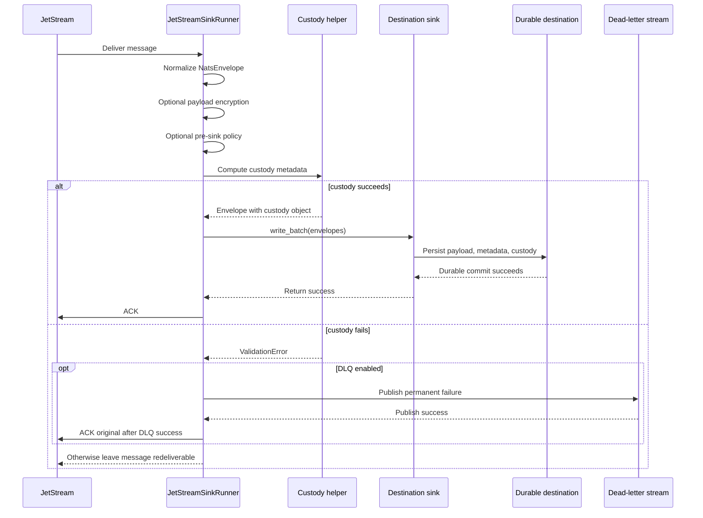
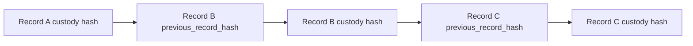

# Tamper-Evident Custody Metadata

Tamper-evident custody metadata gives `nats-sinks` users a consistent way to
record hashes for the message payload and normalized metadata that were handed
to a sink. It is useful in audit-heavy environments where operators need to
detect unexpected changes after a message has crossed a durable boundary.

The feature is optional and disabled by default. When enabled, the core runtime
computes a custody object before sink delivery and attaches it to the immutable
`NatsEnvelope`. Destination sinks then persist that object next to the record
they commit.

The feature does not change delivery semantics:

> Commit first. ACK last. Design for redelivery.

The core still acknowledges JetStream only after the destination sink returns
durable success. If custody metadata cannot be computed, the message does not
reach the sink and the original JetStream message is not ACKed unless DLQ
publication succeeds first.

## What This Feature Provides

Custody metadata records:

- the custody schema and version,
- the hash algorithm used,
- whether the payload and metadata were hashed,
- a hash of the framework-normalized payload,
- a hash of stable framework metadata,
- a hash of the custody record material itself,
- an optional previous-record hash supplied through a configured header,
- an optional non-secret key or policy identifier, and
- an explicit privacy note that hashes are not encryption.

The first implementation supports `sha256` and `sha512`. Those algorithms are
allow-listed in configuration and in the Python API. The implementation uses
canonical JSON serialization so equivalent JSON object ordering produces the
same hash input.

## What This Feature Does Not Provide

Tamper-evident custody metadata is deliberately narrow:

- It is not encryption.
- It is not a digital signature.
- It is not a substitute for database access control, object-store retention,
  filesystem permissions, backup integrity, or audit-log protection.
- It does not prove who wrote a record.
- It does not prevent someone with write access from changing both the record
  and the stored hash.

For stronger authenticity guarantees, future releases may add HMAC or digital
signature support. This first version focuses on deterministic evidence that is
simple to review and safe to persist across Oracle, file, and future sinks.

## Processing Sequence



## Configuration

Custody metadata is configured in the top-level `custody` section:

```json
{
  "custody": {
    "enabled": true,
    "algorithm": "sha256",
    "hash_payload": true,
    "hash_metadata": true,
    "include_previous_hash": false,
    "previous_hash_header": "Nats-Sinks-Previous-Custody-Hash",
    "key_id": "custody-policy-v1",
    "max_hash_input_bytes": 16777216
  }
}
```

| Field | Required | Default | Valid values | Description |
| --- | --- | --- | --- | --- |
| `enabled` | no | `false` | `true` or `false` | Enables core custody metadata computation before sink delivery. |
| `algorithm` | no | `sha256` | `sha256`, `sha512` | Hash algorithm used for payload, metadata, and record hashes. |
| `hash_payload` | no | `true` | `true` or `false` | Hashes the framework-normalized payload value. |
| `hash_metadata` | no | `true` | `true` or `false` | Hashes stable framework metadata. Storage-local timestamps are excluded because they are produced by the destination sink. |
| `include_previous_hash` | no | `false` | `true` or `false` | Reads an optional previous-record hash from the configured header. This supports append-only or externally chained workflows. |
| `previous_hash_header` | no | `Nats-Sinks-Previous-Custody-Hash` | Header name without control characters. | Header used when `include_previous_hash` is enabled. Missing headers are allowed. Malformed values fail closed. |
| `key_id` | no | `null` | Non-secret text up to 128 characters. | Optional policy or key-version identifier. This is metadata only in the current release. Do not place secret key material here. |
| `max_hash_input_bytes` | no | `16777216` | Integer from `1024` to `1073741824`. | Maximum canonical JSON byte length accepted for each hash input. Oversized input fails closed before sink write. |

When `enabled` is `true`, at least one of `hash_payload` or `hash_metadata`
must also be true. This prevents a misleading "custody enabled" configuration
that stores no meaningful hash evidence.

Supported environment overrides:

- `NATS_SINKS_CUSTODY_ENABLED`
- `NATS_SINKS_CUSTODY_ALGORITHM`
- `NATS_SINKS_CUSTODY_KEY_ID`

## Custody Object Shape

A persisted custody object looks like this:

```json
{
  "schema": "nats_sinks.custody.v1",
  "schema_version": 1,
  "algorithm": "sha256",
  "hash_input_format": "canonical-json",
  "key_id": "custody-policy-v1",
  "payload_hash": "0d85980f6c9d4b4d9e8a2f733f4f7d2c07f9c8a9a6e4145c2f8b9a1e7f2c9d13",
  "metadata_hash": "54e5d14f499fb6e0dd82d2f2cb7d930c4e02c3f1db5e5a9c996edcdf8c9ce2ac",
  "record_hash": "28cc982b0dd540d8c7bdf42e5cd1c09b9f1fcf7dbe05d877ed210ce2f765e1cb",
  "previous_record_hash": null,
  "hash_payload": true,
  "hash_metadata": true,
  "privacy": "hashes_are_not_encryption"
}
```

The example hash values are illustrative. Real values depend on the exact
payload and metadata.

## Hash Inputs

The payload hash is computed over the standard nats-sinks JSON payload storage
contract:

- valid JSON is hashed as canonical JSON,
- non-JSON UTF-8 text is wrapped in the nats-sinks text payload envelope before
  hashing,
- non-text bytes are wrapped as base64 before hashing.

The metadata hash is computed over stable core metadata:

- subject,
- reply subject,
- message ID,
- priority,
- classification,
- labels,
- mission metadata,
- headers,
- known and future `Nats-` headers,
- JetStream stream and sequence metadata,
- message-created, JetStream, and received timestamps.

Destination-local `stored_at` timestamps are not part of the core metadata hash
because those are produced by each sink while it writes the durable record.

## Optional Hash Chaining

Hash chaining is optional. When `include_previous_hash` is enabled, the runner
looks for `previous_hash_header` and stores a validated previous-record hash
when present. The header may contain either a SHA-256 or SHA-512 hexadecimal
digest. Missing values are allowed; malformed values fail closed.



This feature records the link; it does not coordinate a global chain across
parallel workers or destinations. Deployments that need strict append-only
global ordering should design the chain boundary carefully and document which
component owns previous-hash selection.

## Python API

Application code can use the same helpers directly:

```python
from nats_sinks import CustodyConfig, NatsEnvelope, compute_custody_metadata

metadata = compute_custody_metadata(
    envelope,
    config=CustodyConfig(enabled=True, algorithm="sha256"),
)
```

The public helpers are:

- `CustodyConfig`
- `canonical_json_bytes(...)`
- `compute_custody_metadata(...)`
- `attach_custody_metadata(...)`

## Sink Storage

The file sink stores custody metadata as a top-level `custody` object in each
JSON record.

Oracle stores custody metadata inside `METADATA_JSON.custody` in the
recommended table shape. This avoids a breaking table layout change while
keeping the evidence queryable through Oracle JSON features.

Future sinks should persist the same object unless their destination has a
stronger native evidence model. If they do, they should still document how the
standard custody object maps to the destination-specific representation.

## Privacy And Security

Hashes can reveal repeated payloads or repeated metadata even when the payload
body is encrypted. In sensitive or mission-oriented deployments, this can still
reveal operational tempo, repeated report patterns, or repeated sensor event
shapes.

Recommended controls:

- keep custody disabled until the deployment has reviewed the privacy tradeoff,
- use payload encryption when stored body confidentiality is required,
- restrict database, filesystem, object-store, backup, and metrics access,
- do not log custody objects at debug level in production unless approved,
- do not put secrets in `key_id`, headers, labels, mission metadata, or issue
  comments, and
- document whether hash chaining is advisory, append-only, or externally
  verified in your deployment.

## Failure Behavior

Custody computation is a pre-sink operation. If it fails:

- the sink is not called,
- the message is treated as a permanent validation failure,
- DLQ publication is attempted when configured,
- the original message is ACKed only after successful DLQ publication, and
- if DLQ is disabled or DLQ publication fails, the original message remains
  eligible for redelivery.

This behavior keeps the project invariant intact: custody evidence cannot be
skipped silently in a deployment that has enabled it.
