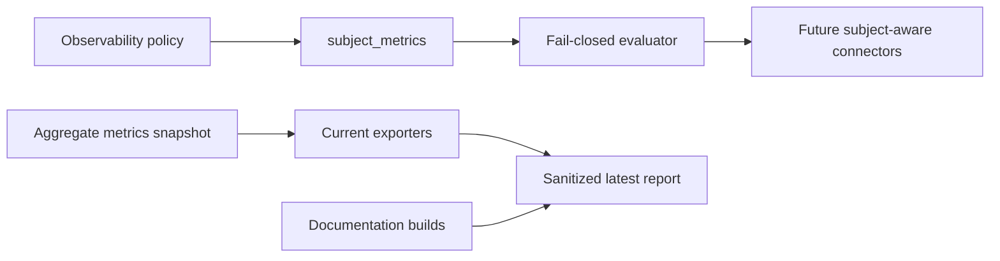

# Latest Test Report

This file is the canonical test report for the repository. It is intentionally
stored at a stable path and should be overwritten when a newer validation run is
performed. Do not create or commit timestamped copies of this report.

The report is sanitized. It must never contain server addresses, usernames,
passwords, tokens, certificate contents, private keys, Oracle wallet material,
full connection strings, sensitive subjects, sensitive payloads, container IDs,
generated database passwords, or full raw logs from live systems.

## Report Summary

| Field | Value |
| --- | --- |
| Overall result | Pass |
| Report generated | 2026-05-26 issue `#128` validation for upcoming `v0.4.2` development |
| Project version | `0.4.1` package metadata with `v0.4.2` development changes |
| Python version | 3.12.4 |
| Git revision checked | Branch `issue-128-subject-aware-observability` based on `release-v0.4.2` |
| Live NATS details | Environment-gated live tests skipped unless explicitly enabled |
| Live Oracle Database details | Environment-gated live tests skipped unless explicitly enabled |
| Live Oracle MySQL details | Environment-gated live tests skipped unless explicitly enabled |

This refresh covered the disabled-by-default subject-aware observability policy
model for issue `#128` and a full local regression cycle for the current
development branch. The new tests prove that `subject_metrics` defaults to no
export, uses default-deny subject-family rules, validates operator labels and
display modes, enforces cardinality caps, rejects raw subject sharing unless
explicitly reviewed, and leaves current aggregate Prometheus output unchanged.

## Core And Repository Validation

| Check | Result |
| --- | --- |
| Ruff format | Pass, `226 files already formatted` |
| Ruff lint | Pass |
| Mypy | Pass, no issues in `90` source files |
| Version metadata consistency | Pass for `0.4.1` |
| Dependency manifests | Pass, manifest files up to date |
| Backlog item validation | Pass, `142` backlog items validated |
| Bug report validation | Pass, `87` bug report items validated |
| PyPI-facing Markdown links | Pass |
| Secret scan | Pass, no high-confidence secret material found |
| Bandit | Pass with reviewed `nosec` annotations for validated SQL identifier builders |
| Package build | Pass, sdist and wheel built |
| SBOM generation | Pass, CycloneDX JSON and XML generated |
| Checksum generation | Pass, `dist/SHA256SUMS` generated |
| Twine metadata check | Pass for retained distributions |

## Test Results

| Test Area | Command | Result |
| --- | --- | --- |
| Subject-aware observability focused tests | `python -m pytest tests/unit/test_observability_policy.py tests/unit/test_observability_cli.py tests/unit/test_prometheus_observability.py tests/unit/test_public_api.py -q` | Pass, `72 passed` |
| Observability connector regression tests | `python -m pytest tests/unit/test_observability_policy.py tests/unit/test_observability_cli.py tests/unit/test_prometheus_observability.py tests/unit/test_otlp_observability.py tests/unit/test_elastic_observability.py tests/unit/test_grafana_alloy_observability.py tests/unit/test_splunk_hec_observability.py tests/unit/test_statsd_observability.py tests/unit/test_syslog_observability.py tests/unit/test_public_api.py -q` | Pass, `136 passed` |
| Main repository test suite | `scripts/check.sh` | Pass, `1004 passed, 10 skipped` |
| Encryption and sink contract subset | `scripts/check.sh` | Pass, `123 passed` |
| Sink capability subset | `scripts/check.sh` | Pass, `117 passed` |
| Documentation builds | `scripts/check.sh` | Pass for Read the Docs and GitHub Pages MkDocs builds |
| Example validation | `nats-sink validate examples/named-multi-sink/config.json` through unit/CLI coverage | Pass |

The skipped tests are the existing environment-gated live NATS, Oracle
Database, and Oracle MySQL integration tests. Issue `#128` adds policy
validation and a fail-closed evaluator only. It does not change message
delivery, ACK behavior, retries, DLQ behavior, sink writes, or current aggregate
metric export.

## Subject-Aware Observability Evidence

The new unit coverage verifies:

- subject-aware export remains disabled by default;
- subject-family policy uses default-deny evaluation;
- allow rules require stable operator labels;
- deny rules override allow rules;
- invalid subject patterns and runtime subjects fail closed;
- invalid, high-risk, or credential-like labels are rejected;
- `max_subject_families` caps allowed subject families;
- overflow actions are limited to `drop`, `aggregate_other`, and `fail_closed`;
- display modes are limited to `label`, `redacted`, `hash`, and `raw`;
- `raw` display mode requires `allow_raw_subjects=true`;
- current Prometheus output remains aggregate-only and does not add subject
  labels from `subject_metrics`.

## Issues Found During Validation

No new product bugs were found during issue `#128` validation.

## Documentation Evidence

The following public documentation was updated and built successfully:

- [README](https://github.com/ProjectCuillin/nats-sinks/blob/main/README.md)
- [Configuration](configuration.md)
- [Sink Framework](sink-framework.md)
- [Sink Certification](sink-certification.md)
- [Testing](testing.md)
- [Development](development.md)
- [Architecture](architecture.md)
- [Operations](operations.md)
- [Metrics](metrics.md)
- [Observability](observability.md)
- [Subject-Aware Observability Evaluation](subject-aware-observability-evaluation.md)
- [Prometheus Integration](prometheus.md)
- [Named Sinks And Routing](named-sinks.md)
- [Idempotency](idempotency.md)
- [Security](security.md)
- [File Sink](file-sink.md)
- [Oracle Sink](oracle-sink.md)
- [Named Multi-Sink Example](https://github.com/ProjectCuillin/nats-sinks/blob/main/examples/named-multi-sink/config.json)
- [Documentation Home](index.md)

The changelog, backlog metadata, public API contract tests, observability policy
tests, connector regression tests, and subject-aware observability documentation
were also updated for issue `#128`.
