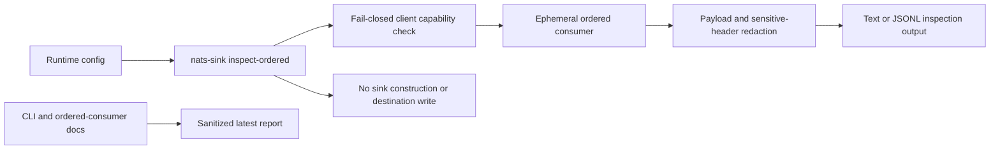

# Latest Test Report

This file is the canonical test report for the repository. It is intentionally
stored at a stable path and should be overwritten when a newer validation run is
performed. Do not create or commit timestamped copies of this report.

The report is sanitized. It must never contain server addresses, usernames,
passwords, tokens, certificate contents, private keys, Oracle wallet material,
full connection strings, sensitive subjects, sensitive payloads, container IDs,
generated database passwords, or full raw logs from live systems.

## Report Summary

| Field | Value |
| --- | --- |
| Overall result | Pass |
| Report generated | 2026-05-26 issue `#121` validation for upcoming `v0.4.2` development |
| Project version | `0.4.1` package metadata with `v0.4.2` development changes |
| Python version | 3.12.4 |
| Git revision checked | Branch `issue-121-ordered-consumer-compatibility` based on `release-v0.4.2` |
| Live NATS details | Environment-gated live tests skipped unless explicitly enabled |
| Live Oracle Database details | Environment-gated live tests skipped unless explicitly enabled |
| Live Oracle MySQL details | Environment-gated live tests skipped unless explicitly enabled |

This refresh covered ordered-consumer client compatibility for issue `#121`,
plus a full local regression cycle for the current development branch. The new
tests prove supported, unsupported, non-callable, partial, missing, and
ambiguous NATS client capability states, including sanitized fail-closed
messages that do not echo subjects, stream names, or private exception text.
The existing ordered-inspection tests continue to prove redacted default
output, explicit payload opt-in, message and payload-byte bounds, JSONL
output-path validation, subscription cleanup, and the CLI contract that
inspection does not build or write a sink.

## Core And Repository Validation

| Check | Result |
| --- | --- |
| Ruff format | Pass, `234 files already formatted` |
| Ruff lint | Pass |
| Mypy | Pass, no issues in `93` source files |
| Version metadata consistency | Pass for `0.4.1` |
| Dependency manifests | Pass, manifest files up to date |
| Backlog item validation | Pass |
| Bug report validation | Pass, `89` bug report item(s) |
| PyPI-facing Markdown links | Pass |
| Secret scan | Pass, no high-confidence secret material found |
| Bandit | Pass with reviewed `nosec` annotations for validated SQL identifier builders |
| Package build | Pass, sdist and wheel built |
| SBOM generation | Pass, CycloneDX JSON and XML generated |
| Checksum generation | Pass, `dist/SHA256SUMS` generated |
| Twine metadata check | Pass for retained distributions |

## Test Results

| Test Area | Command | Result |
| --- | --- | --- |
| Ordered-inspection focused subset | `python -m pytest tests/unit/test_ordered_inspection.py tests/unit/test_cli.py -q` | Pass, `28 passed` |
| Main repository test suite | `scripts/check.sh` | Pass, `1053 passed, 11 skipped` |
| Encryption and sink contract subset | `scripts/check.sh` | Pass, `123 passed` |
| Sink capability subset | `scripts/check.sh` | Pass, `117 passed` |
| Documentation builds | `scripts/check.sh` | Pass for Read the Docs and GitHub Pages MkDocs builds |
| Example validation | `nats-sink validate examples/named-multi-sink/config.json` through unit/CLI coverage | Pass |

The skipped tests are the existing environment-gated live NATS, Oracle
Database, Oracle MySQL, and push-consumer integration tests. Issue `#121` adds
the explicit ordered-consumer compatibility layer. Pull mode remains the
production default, and ordered inspection remains read-only troubleshooting
rather than sink delivery or replay.

## Ordered-Inspection Evidence

The new focused coverage verifies:

- the command is explicitly named `inspect-ordered` and must be invoked
  separately from `run`;
- supported `nats-py` ordered-consumer capability is detected through the
  public `JetStreamContext.subscribe` signature;
- unsupported, partial, non-callable, missing, and ambiguous
  ordered-consumer capability states fail closed;
- fail-closed messages are sanitized and do not include subjects, stream
  names, or private client exception details;
- payloads and sensitive headers are redacted by default;
- payload output requires `--include-payload`;
- message count, payload-byte, pending-message, pending-byte, timeout, and
  JSONL output-path limits are validated;
- JSONL output stays under the configured local output root;
- subscriptions are unsubscribed after inspection;
- the CLI path does not build or write any sink.

## Issues Found During Validation

No new release-blocking issues were found during the `#121` validation cycle.

## Documentation Evidence

The following public documentation was updated and built successfully:

- [README](https://github.com/ProjectCuillin/nats-sinks/blob/main/README.md)
- [Configuration](configuration.md)
- [Sink Framework](sink-framework.md)
- [Sink Certification](sink-certification.md)
- [Testing](testing.md)
- [Development](development.md)
- [Architecture](architecture.md)
- [Operations](operations.md)
- [Ordered Consumer Evaluation](ordered-consumer-evaluation.md)
- [Metrics](metrics.md)
- [Observability](observability.md)
- [Subject-Aware Observability Evaluation](subject-aware-observability-evaluation.md)
- [Subject-Aware Observability Runbook](subject-aware-observability-runbook.md)
- [Prometheus Integration](prometheus.md)
- [Named Sinks And Routing](named-sinks.md)
- [Idempotency](idempotency.md)
- [Security](security.md)
- [File Sink](file-sink.md)
- [Oracle Sink](oracle-sink.md)
- [Named Multi-Sink Example](https://github.com/ProjectCuillin/nats-sinks/blob/main/examples/named-multi-sink/config.json)
- [Documentation Home](index.md)

The changelog, backlog metadata, CLI guide, dependency-management page, and
ordered-consumer evaluation documentation were also updated for issue `#121`.
