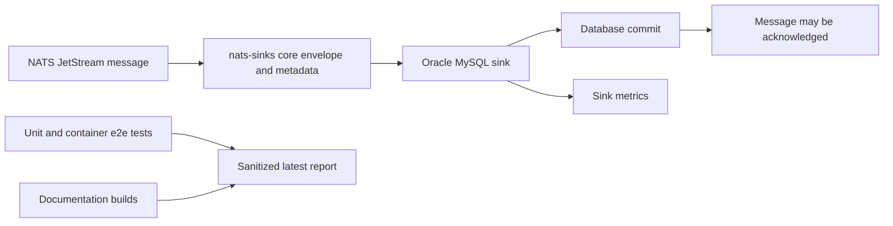

# Latest Test Report

This file is the canonical test report for the repository. It is intentionally
stored at a stable path and should be overwritten when a newer validation run is
performed. Do not create or commit timestamped copies of this report.

The report is sanitized. It must never contain server addresses, usernames,
passwords, tokens, certificate contents, private keys, Oracle wallet material,
full connection strings, sensitive subjects, sensitive payloads, container IDs,
generated database passwords, or full raw logs from live systems.

## Report Summary

| Field | Value |
| --- | --- |
| Overall result | Pass |
| Report generated | 2026-05-25 issue `#101` Oracle MySQL sink validation |
| Project version | `0.4.0` post-release development for `v0.4.1` |
| Python version | 3.12.4 |
| Git revision checked | Branch `issue-101-oracle-mysql-sink`, base revision `f064e34` with local issue changes |
| Live NATS details | Not used by the Oracle MySQL sink container test |
| Live Oracle Database details | Not used by the Oracle MySQL sink container test |
| Live Oracle MySQL details | Local short-lived Docker container only; generated credentials, ports, container names, and container identifiers redacted |

This refresh covered issue `#101`, adding a first-party Oracle MySQL sink to
the same extensible sink framework used by the Oracle Database and file sinks.
The implementation adds safe configuration validation, commit-before-success
delivery semantics, optional table creation, idempotent write modes,
subject-to-table routing, envelope-compatible payload handling, mission
metadata support, metrics, documentation, Python import support, CLI registry
support, and a repeatable local Oracle MySQL container end-to-end test.



## Core And Repository Validation

| Check | Result |
| --- | --- |
| Ruff format | Pass, `211 files already formatted` |
| Ruff lint | Pass |
| Mypy | Pass, no issues in `85` source files |
| Version metadata consistency | Pass for `0.4.0` |
| Dependency manifests | Pass, manifest files up to date |
| Backlog item validation | Pass, `141` backlog items validated |
| Bug report validation | Pass, `67` bug report items validated |
| PyPI-facing Markdown links | Pass |
| Secret scan | Pass, no high-confidence secret material found |
| Bandit | Pass with reviewed `nosec` annotations for validated SQL identifier builders |
| Package build | Pass, sdist and wheel built |
| SBOM generation | Pass, CycloneDX JSON and XML generated |
| Checksum generation | Pass, `dist/SHA256SUMS` generated |
| Twine metadata check | Pass for retained distributions |

## Test Results

| Test Area | Command | Result |
| --- | --- | --- |
| Oracle MySQL sink focused unit tests | `python -m pytest tests/unit/test_mysql_sql.py tests/unit/test_mysql_mapping.py tests/unit/test_mysql_sink_contract.py tests/unit/test_bug_249_oracle_mysql_timeout.py tests/unit/test_oracle_mysql_test_container.py tests/unit/test_cli.py tests/unit/test_public_api.py tests/unit/test_sink_certification.py -q` | Pass, `64 passed` |
| Oracle MySQL timeout regression | `python -m pytest tests/unit/test_bug_249_oracle_mysql_timeout.py tests/unit/test_mysql_sink_contract.py -q` | Pass, `12 passed` |
| Oracle MySQL SQL annotation regression | `python -m pytest tests/unit/test_bug_250_mysql_sql_bandit_annotations.py tests/unit/test_mysql_sql.py -q` | Pass, `11 passed` |
| Oracle MySQL container end-to-end test | `python scripts/run-mysql-sink-e2e.py` | Pass |
| Main repository test suite | `scripts/check.sh` | Pass, `877 passed, 10 skipped` |
| Encryption and sink contract subset | `scripts/check.sh` | Pass, `123 passed` |
| Sink capability subset | `scripts/check.sh` | Pass, `105 passed` |
| Documentation builds | `scripts/check.sh` | Pass for Read the Docs and GitHub Pages MkDocs builds |

The skipped tests are the existing environment-gated live NATS and Oracle
Database integration tests. They require explicit local services or environment
flags and were not required for issue `#101`. The Oracle MySQL sink was tested
through a short-lived local Oracle MySQL container created by the repository
test runner.

## Oracle MySQL Sink Evidence

The optional local Oracle MySQL sink end-to-end test was executed with the local
Docker daemon:

```bash
python scripts/run-mysql-sink-e2e.py
```

Sanitized result:

```text
Oracle MySQL sink container e2e test passed.
```

The test verified:

- a fresh Oracle MySQL test container with generated credentials;
- loopback-only random host-port exposure;
- automatic test table creation through the Oracle MySQL sink;
- commit-before-success processing;
- JSON payload persistence;
- non-JSON payload envelope persistence;
- empty-message handling;
- priority, classification, labels, mission metadata, and security labels;
- subject-to-table routing;
- duplicate handling through idempotency configuration;
- cleanup of the container, Docker volume, and generated secret files by
  default.

Docker cleanup was checked after the run. No `nats-sinks` Oracle MySQL test
container or volume remained active.

## Issues Found During Validation

Two issues were found during implementation testing and handled through the
repository bug workflow:

- issue `#249`: the Oracle MySQL sink passed a fractional connection timeout to
  the database driver; the sink now normalizes configured positive seconds to an
  integer driver timeout while preserving user-facing configuration precision;
- issue `#250`: one SQL builder suppression comment was not on the exact line
  reported by Bandit; the annotation now sits on the validated SQL construction
  line and a regression test protects the placement.

Both bugs have dedicated regression tests and are marked for inclusion in
`v0.4.1`.

## Documentation Evidence

The following documentation was updated and built successfully:

- [Oracle MySQL Sink](mysql-sink.md)
- [Oracle MySQL Test Container](oracle-mysql-test-container.md)
- [Configuration](configuration.md)
- [Docker](docker.md)
- [Metrics](metrics.md)
- [Public API](public-api.md)
- [Python Usage](python-usage.md)
- [Sink Certification](sink-certification.md)
- [Sink Framework](sink-framework.md)
- [Testing](testing.md)
- [Roadmap](roadmap.md)

The README, changelog, MkDocs navigation, example configuration, dependency
manifest, public API checks, sink certification checks, and CLI registry tests
were also updated for issue `#101`.
