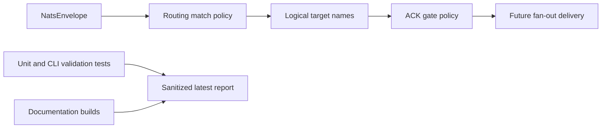

# Latest Test Report

This file is the canonical test report for the repository. It is intentionally
stored at a stable path and should be overwritten when a newer validation run is
performed. Do not create or commit timestamped copies of this report.

The report is sanitized. It must never contain server addresses, usernames,
passwords, tokens, certificate contents, private keys, Oracle wallet material,
full connection strings, sensitive subjects, sensitive payloads, container IDs,
generated database passwords, or full raw logs from live systems.

## Report Summary

| Field | Value |
| --- | --- |
| Overall result | Pass |
| Report generated | 2026-05-26 issue `#137` validation for upcoming `v0.4.2` development |
| Project version | `0.4.1` package metadata with `v0.4.2` development changes |
| Python version | 3.12.4 |
| Git revision checked | Branch `issue-137-optional-ack-gate` based on `release-v0.4.2` |
| Live NATS details | Environment-gated live tests skipped unless explicitly enabled |
| Live Oracle Database details | Environment-gated live tests skipped unless explicitly enabled |
| Live Oracle MySQL details | Environment-gated live tests skipped unless explicitly enabled |

This refresh covered the optional ACK-gating policy primitives for issue `#137`
and a full local regression cycle for the current development branch. The new
policy keeps route targets required by default, validates optional target wait
and timeout controls, applies per-sink-type defaults, and tests the reusable
ACK gate without changing current single-sink delivery behavior.

## Core And Repository Validation

| Check | Result |
| --- | --- |
| Ruff format | Pass, `217 files already formatted` |
| Ruff lint | Pass |
| Mypy | Pass, no issues in `87` source files |
| Version metadata consistency | Pass for `0.4.1` |
| Dependency manifests | Pass, manifest files up to date |
| Backlog item validation | Pass, `142` backlog items validated |
| Bug report validation | Pass, `87` bug report items validated |
| PyPI-facing Markdown links | Pass |
| Secret scan | Pass, no high-confidence secret material found |
| Bandit | Pass with reviewed `nosec` annotations for validated SQL identifier builders |
| Package build | Pass, sdist and wheel built |
| SBOM generation | Pass, CycloneDX JSON and XML generated |
| Checksum generation | Pass, `dist/SHA256SUMS` generated |
| Twine metadata check | Pass for retained distributions |

## Test Results

| Test Area | Command | Result |
| --- | --- | --- |
| ACK-gate and route policy focused tests | `python -m pytest tests/unit/test_public_api.py tests/unit/test_routing_policy.py tests/unit/test_fanout_ack_gate.py tests/unit/test_cli.py::test_cli_validates_routing_match_policy_example -q` | Pass, `47 passed` |
| Main repository test suite | `scripts/check.sh` | Pass, `951 passed, 10 skipped` |
| Encryption and sink contract subset | `scripts/check.sh` | Pass, `123 passed` |
| Sink capability subset | `scripts/check.sh` | Pass, `105 passed` |
| Documentation builds | `scripts/check.sh` | Pass for Read the Docs and GitHub Pages MkDocs builds |
| Example validation | `nats-sink validate examples/routing-match-policy/config.json` through unit/CLI coverage | Pass |

The skipped tests are the existing environment-gated live NATS, Oracle
Database, and Oracle MySQL integration tests. Issue `#137` changes validated
core policy and a reusable fan-out ACK-gate helper, but it does not alter live
single-sink delivery code, so no new credentialed live test was required for
this specific feature.

## ACK-Gate Policy Evidence

The new unit coverage verifies:

- route targets are required by default;
- optional route target objects can set explicit bounded wait and timeout
  values;
- omitted optional values are filled from per-sink-type defaults for `file`,
  `spool`, `oracle`, and `mysql`;
- redacted effective config shows the resolved optional wait and timeout
  values;
- validation rejects negative waits, excessive waits, unknown target
  references, unsupported sink types, and required targets with wait policy;
- the ACK gate waits for required targets, does not wait indefinitely for
  optional targets, and records optional failure or timeout without logging
  payload content.

## Issues Found During Validation

No new bugs were found during issue `#137` validation. The only early failure
was formatting-only and was corrected before rerunning `scripts/check.sh`.

## Documentation Evidence

The following public documentation was updated and built successfully:

- [README](https://github.com/ProjectCuillin/nats-sinks/blob/main/README.md)
- [Configuration](configuration.md)
- [Sink Framework](sink-framework.md)
- [Architecture](architecture.md)
- [Operations](operations.md)
- [Commit Then ACK](commit-then-ack.md)
- [Idempotency](idempotency.md)
- [Security](security.md)
- [File Sink](file-sink.md)
- [Oracle Sink](oracle-sink.md)
- [Documentation Home](index.md)

The changelog, backlog metadata, public API compatibility tests, CLI validation
test, and tracked route policy example were also updated for issue `#137`.
