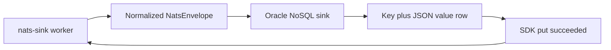

# Latest Test Report

This file is the canonical test report for the repository. It is intentionally
stored at a stable path and should be overwritten when a newer validation run is
performed. Do not create or commit timestamped copies of this report.

The report is sanitized. It must never contain server addresses, usernames,
passwords, tokens, certificate contents, private keys, Oracle wallet material,
full connection strings, sensitive subjects, sensitive payloads, container IDs,
generated database passwords, or full raw logs from live systems.

## Report Summary

| Field | Value |
| --- | --- |
| Overall result | Pass |
| Report generated | 2026-05-28 issue `#149` Oracle NoSQL Database sink validation for upcoming `v0.4.2` development |
| Project version | `0.4.1` package metadata with `v0.4.2` development changes |
| Python version | 3.12.4 |
| Git revision checked | Branch `issue-149-oracle-nosql-database-sink` based on `release-v0.4.2` |
| Live NATS details | Environment-gated live tests skipped unless explicitly enabled |
| Live Oracle Database details | Environment-gated live tests skipped unless explicitly enabled |
| Live Oracle MySQL details | Environment-gated live tests skipped unless explicitly enabled |
| Live Oracle NoSQL details | Environment-gated live tests skipped unless explicitly enabled |
| Live Oracle Coherence details | Environment-gated live tests skipped unless explicitly enabled |
| Oracle NoSQL test container details | Not available yet; the sink is covered by fake SDK clients and an explicitly gated live KVLite/Cloud Simulator test path |

This refresh covered the experimental first-party Oracle NoSQL Database sink
for issue `#149`. The sink writes one complete normalized event JSON value into
a configured Oracle NoSQL table row, derives deterministic keys from approved
idempotency metadata, validates SDK endpoints and table identifiers before
startup, and keeps ACK ownership in the core runner.

## Core And Repository Validation

| Check | Result |
| --- | --- |
| Ruff format | Pass, `275 files already formatted` |
| Ruff lint | Pass |
| Mypy | Pass, no issues in `116` source files |
| Version metadata consistency | Pass for `0.4.1` |
| Dependency manifests | Pass, manifest files up to date |
| Backlog metadata | Pass, `146` backlog items validated |
| Bug report metadata | Pass, `90` bug reports validated |
| PyPI-facing Markdown links | Pass |
| Documentation builds | Pass for Read the Docs and GitHub Pages MkDocs builds |
| Security checks | Pass; existing reviewed `nosec` warnings remained non-blocking |
| Package build | Pass, source distribution and wheel built |
| SBOM and checksums | Pass, CycloneDX JSON/XML and checksum manifest generated |

## Test Results

| Test Area | Command | Result |
| --- | --- | --- |
| Oracle NoSQL focused subset | `python -m pytest tests/unit/test_oracle_nosql_sink.py tests/unit/test_public_api.py tests/unit/test_routing_policy.py tests/integration/test_oracle_nosql_sink_e2e.py -q` | Pass, `57 passed, 1 skipped` |
| Full unit suite | `python -m pytest tests/unit -q` | Pass, `1228 passed` |
| Main repository test suite | run by `scripts/check.sh` | Pass, `1233 passed, 13 skipped` |
| Commit, encryption, file, and Oracle sink subset | run by `scripts/check.sh` | Pass, `130 passed` |
| Sink certification and example validation | `scripts/check-sinks.sh` via `scripts/check.sh` | Pass, `177 passed` plus file, Oracle, Oracle NoSQL, Oracle Coherence, multi-sink routing, Foundry, and Gotham config validation |
| Full local validation | `scripts/check.sh` | Pass |

The skipped tests are the existing environment-gated live NATS, Oracle
Database, Oracle MySQL, Oracle NoSQL Database, Oracle Coherence, and
push-consumer integration tests.

## Oracle NoSQL Database Sink Evidence

The new focused coverage verifies:

- `sink.type: "oracle_nosql"` is accepted through the normal CLI/config path;
- endpoints, deployment modes, auth modes, table names, field names, key
  prefixes, size limits, generated table DDL inputs, and duplicate policies are
  validated before SDK use;
- full normalized event metadata is stored in a configured JSON value field;
- deterministic key strategies cover `idempotency_key`, `stream_sequence`,
  `message_id`, and `payload_sha256`;
- duplicate policies cover conditional `skip_existing`, unconditional
  `replace`, and `fail_existing`;
- fake SDK writes, optional table creation, timeout handling, client failures,
  missing optional dependency behavior, and ambiguous SDK results fail closed;
- sink certification helpers prove write success and duplicate redelivery
  behavior without live infrastructure;
- live Oracle NoSQL Database e2e coverage is present but explicitly skipped
  unless local integration environment variables are set.

## Issues Found During Validation

No new repository defects were found during the issue `#149` validation cycle.
The security scan reported existing reviewed `nosec` annotations as warnings,
and the check remained passing. The Oracle NoSQL Database Docker test backend
has not been implemented yet, so no live container-backed Oracle NoSQL test was
claimed in this report.

## Documentation Evidence

The following public documentation was updated and built successfully:

- [README](https://github.com/ProjectCuillin/nats-sinks/blob/main/README.md)
- [Oracle NoSQL Database Sink](oracle-nosql-sink.md)
- [Configuration](configuration.md)
- [Idempotency](idempotency.md)
- [Sink Framework](sink-framework.md)
- [Operations](operations.md)
- [Security](security.md)
- [Security Rule Review](security-rule-review.md)
- [Testing](testing.md)
- [Documentation Home](index.md)

The changelog, backlog metadata, latest test report, and public documentation
were updated for issue `#149`.
